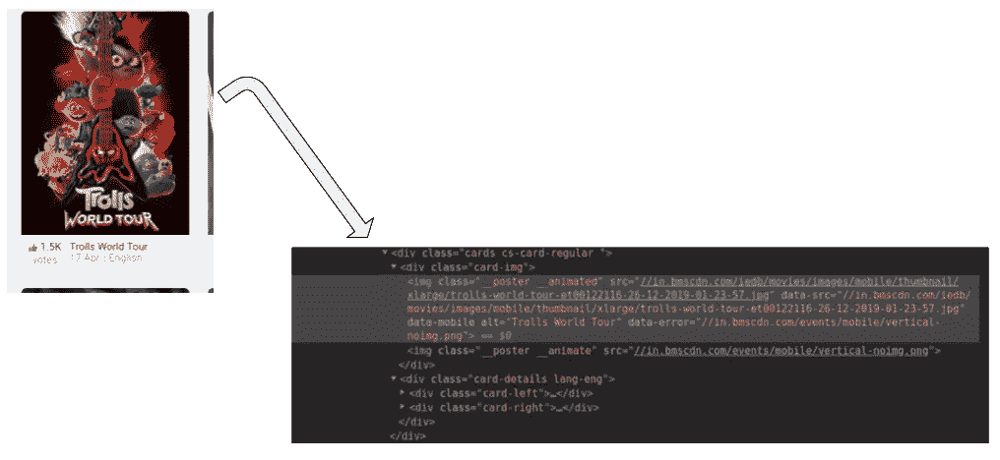

# 网页抓取简介

> 原文：<https://medium.com/analytics-vidhya/introduction-to-web-scraping-258d5f117357?source=collection_archive---------24----------------------->

> “让我们深入数据世界”

在本文中，我们将废弃 BookMyShow 网站，以提取最新的即将上映的电影。


## 什么是网络抓取

> Web 抓取是指从许多网站中提取数据。它基本上涉及到以网页形式下载数据，这也被称为获取数据。获取数据后，可以借助 Python 中的工具和库来提取数据。
> beautiful soup 就是这样一个工具，我们将用它来进行网页抓取。
> [美汤](https://www.crummy.com/software/BeautifulSoup/bs4/doc/)是一个从 HTML 和 XML 文件中提取数据的 Python 库。

## 网页抓取组件

> **抓取:**是指通过发出 HTTP 请求，导航目标网站来下载网页。
> **解析和转换:**一旦网页下载完毕，就使用 BeautifulSoup 之类的 HTML 解析器提取所需数据。
> **存储:**数据提取后，需要以 JSON 或 CSV 文件的形式存储。

# 1.爬行

> 导航到目标网站，下载网页并检查源代码。这将在 [**请求**](https://requests.readthedocs.io/en/master/) 库的帮助下完成。

```
import requests
from bs4 import BeautifulSoup
import pandas as pdurl = "[https://in.bookmyshow.com/national-capital-region-ncr/movies/comingsoon](https://in.bookmyshow.com/national-capital-region-ncr/movies/comingsoon)"headers = {
    'User-Agent': "Mozilla/5.0 (X11; Linux x86_64) AppleWebKit/537.36 (KHTML, like Gecko) Chrome/77.0.3865.90 Safari/537.36"
    }response = requests.request("GET", url, headers=headers)
data = BeautifulSoup(response.text, 'html.parser')
print(data)
```

# 2.解析和转换

> 下一步是将这些数据解析到 HTML 解析器中，为此，我们将使用 *BeautifulSoup* 库。现在，如果你已经注意到我们的目标网页，一部特定电影的细节和大多数网页一样在不同的*部门*。现在到那个特殊的*部门检查元件。*



> 所有部门的类名都是相同的，我们可以通过传递标签名和属性(如带有名称的<class>标签)来获得这些卡片的列表，如下所示:</class>

```
movie_data = data.find_all('div', attrs={'class', 'cards cs-card-  regular'})
print(movie_data)
print(len(movie_data))
```

> 现在，对于每个部门，我们必须找到上面的电影名称，它只能从
> 
> #### 标签中提取。这是因为有一个
> 
> #### 标签，它包含每个部分的电影名称，电影日期由标签连同<class>标签和类名，电影语言*   标签连同<class>标签和类名:</class></class>

```
for movie in movie_data:
    movie_name = movie.find('h4')
    movie_date = movie.find('span', attrs ={'class', 'day'})
    movie_language = movie.find('li', attrs ={'class',  '__language'})
    print(movie_name.text, movie_date.text, movie_language.text)
```

# 3.存储提取的数据

> 最后一步是将提取的数据存储在 CSV 文件中。在这里，对于每个部门，我们将提取电影名称、日期和语言，并将其存储在 Python 字典中。然后我们将最终把它添加到一个列表中。

```
file = []for movie in movie_data:
    movie_details = {}
    movie_name = movie.find('h4')
    movie_date = movie.find('span', attrs ={'class', 'day'})
    movie_language = movie.find('li', attrs ={'class', '__language'})
    movie_details['movie_name']=movie_name.text
    movie_details['movie_date']=movie_date.text
    movie_details['movie_language']=movie_language.text
    file.append(movie_details)
dataframe = pd.DataFrame.from_dict(file)
dataframe.to_csv('movie_data.csv', index=False)
```

# 结论

> 在本文中，我们已经成功创建了一个基本的 web scraper，将提取的数据存储在 CSV 文件中。更多更新敬请关注。如果你有疑问，那么评论区就是你的了。我会尽我所能回答你的问题。如果你喜欢这篇文章，并从中学到了一些东西，那么请鼓掌。
> 
> 谢谢你。

# 参考

你可以在我的 Github 上找到上面的代码:

[](https://github.com/kpiyush04/web-scrapping) [## KPI yush 04/web-报废

### 网络报废。在 GitHub 上创建一个帐户，为 kpiyush 04/web-screwing 开发做出贡献。

github.com](https://github.com/kpiyush04/web-scrapping)