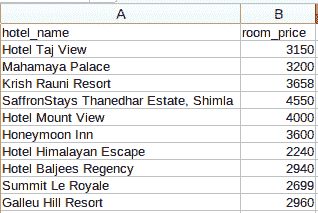

# Python 中的 Web 抓取简介

> 原文：<https://medium.com/analytics-vidhya/introduction-to-web-scraping-in-python-41408f9c9762?source=collection_archive---------7----------------------->

> *“我们拥有的数据太少，无法建立机器学习模型。我们需要更多的数据！”*

如果这听起来很熟悉，你并不孤单！想要更多的数据来训练我们的[机器学习](https://courses.analyticsvidhya.com/courses/applied-machine-learning-beginner-to-professional/?utm_source=blog&utm_medium=web-scraping-hands-on-introduction-python)模型，这是一个永恒的问题。我们没有干净的现成的 Excel 或。数据科学项目中的 csv 文件，对吗？

那么，我们如何应对数据匮乏的障碍呢？

最有效和简单的方法之一就是通过网络抓取。我个人发现网络抓取是一种从多个网站收集数据的非常有用的技术。如今，一些网站还为你可能想要使用的许多不同类型的数据提供 API，比如 Tweets 或 LinkedIn 帖子。


但是，有时您可能需要从不提供特定 API 的网站收集数据。这就是执行 web 抓取功能派上用场的地方。作为一名数据科学家，您可以编写一个简单的 Python 脚本并提取您正在寻找的数据。

因此，在本文中，我们将学习 web 抓取的不同组件，然后直接进入 [Python](https://courses.analyticsvidhya.com/courses/introduction-to-data-science-2/?utm_source=blog&utm_medium=web-scraping-hands-on-introduction-python) ，看看如何使用流行且高效的 *BeautifulSoup* 库来执行 web 抓取。

*这里需要注意的是——网络抓取要遵守许多指导原则和规则。并非每个网站都允许用户抓取内容，因此存在一定的法律限制。在尝试抓取之前，请务必阅读网站的条款和条件。*

# 网页抓取的组件


让我们详细了解一下这些组件。我们将从 *goibibo* 网站收集酒店的详细信息，如酒店名称和每间客房的价格:


***注意:*** *始终遵循目标网站的*[***robots . txt***](https://www.goibibo.com/robots.txt)*文件，也就是所谓的机器人排除协议。这告诉网络机器人不要抓取哪些页面。*


所以，看起来我们被允许从我们的目标 URL 中抓取数据。我们可以开始写我们网络机器人的脚本了。我们开始吧！

# 第一步:爬行

第一步是导航到目标网站并下载网页的源代码。我们将使用 [**请求**](https://pypi.org/project/requests/) 库来做到这一点。*其他几个可以发出请求并下载源代码的库是*[*http . client*](https://docs.python.org/3/library/http.client.html#module-http.client)*和*[*urlib 2*](https://docs.python.org/2/library/urllib2.html)*。*

一旦我们下载了网页的源代码，我们需要过滤我们需要的内容:

```
# importing required libraries
import requests
from bs4 import BeautifulSoup
import pandas as pd# target URL to scrap
url = "[https://www.goibibo.com/hotels/hotels-in-shimla-ct/](https://www.goibibo.com/hotels/hotels-in-shimla-ct/)"# headers
headers = {
    'User-Agent': "Mozilla/5.0 (X11; Linux x86_64) AppleWebKit/537.36 (KHTML, like Gecko) Chrome/77.0.3865.90 Safari/537.36"
    }# send request to download the data
response = requests.request("GET", url, headers=headers)# parse the downloaded data
data = BeautifulSoup(response.text, 'html.parser')
print(data)
```

# 步骤 2:解析和转换

下一步是将这些数据解析到 HTML 解析器中，为此，我们将使用 *BeautifulSoup* 库。现在，如果你已经注意到了我们的目标网页，某个特定酒店的详细信息就像大多数网页一样在不同的卡片上。

所以下一步将是从完整的源代码中过滤出这些卡数据。接下来，我们将选择该卡，并单击“Inspect Element”选项以获取该特定卡的源代码。你会得到这样的东西:


所有卡片的类名都是相同的，我们可以通过传递标签名和属性来获得这些卡片的列表，比如下面的 *< class >* 标签，它的名称如下所示:

```
# find all the sections with specified class nam
e
cards_data = data.find_all('div', attrs={'class', 'width100 fl htlListSeo hotel-tile-srp-container hotel-tile-srp-container-template new-htl-design-tile-main-block'})# total number of cards
print('Total Number of Cards Found : ', len(cards_data))# source code of hotel cards
for card in cards_data:
    print(card)
```


我们已经从网页的完整源代码中过滤了卡片数据，这里的每张卡片都包含了关于一个单独酒店的信息。仅选择酒店名称，执行检查元素步骤，并对房间价格执行同样的操作:


现在，对于每张卡片，我们必须找到上面的酒店名称，该名称只能从 *< p >* 标签中提取。**这是因为每张卡只有一个 *< p >* 标签，房价由<李>标签连同<类>标签和类名称:**

```
# extract the hotel name and price per room
for card in cards_data:# get the hotel name
    hotel_name = card.find('p')# get the room price
    room_price = card.find('li', attrs={'class': 'htl-tile-discount-prc'})
    print(hotel_name.text, room_price.text)
```


# 步骤 3:存储数据

最后一步是将提取的数据存储在 CSV 文件中。在这里，对于每张卡，我们将提取酒店名称和价格，并将其存储在一个 Python 字典中。然后我们将最终把它添加到一个列表中。

接下来，让我们将这个列表转换为 Pandas 数据帧，因为它允许我们将数据帧转换为 CSV 或 JSON 文件:

```
# create a list to store the data
scraped_data = []for card in cards_data:# initialize the dictionary
    card_details = {}# get the hotel name
    hotel_name = card.find('p')# get the room price
    room_price = card.find('li', attrs={'class': 'htl-tile-discount-prc'})# add data to the dictionary
    card_details['hotel_name'] = hotel_name.text
    card_details['room_price'] = room_price.text# append the scraped data to the list
    scraped_data.append(card_details)# create a data frame from the list of dictionaries
dataFrame = pd.DataFrame.from_dict(scraped_data)# save the scraped data as CSV file
dataFrame.to_csv('hotels_data.csv', index=False)
```



恭喜你。我们已经成功地创建了一个基本的网络刮刀。我希望你尝试这些步骤，并尝试获得更多数据，如酒店的评级和地址。现在让我们看看如何执行一些常见的任务，如抓取 URL、电子邮件 id、图像和抓取页面加载数据。

# 从网页上抓取 URL 和电子邮件 id

我们试图抓取的两个最常见的特征是网站 URL 和电子邮件 id。我敢肯定，您曾经参与过需要批量提取电子邮件 id 的项目或挑战(参见营销团队！).所以我们来看看如何在 Python 中刮这些方面。

# 使用 Chrome 扩展电子邮件提取器

*   电子邮件提取器是一个 Chrome 插件，可以捕获我们当前正在浏览的页面上的电子邮件 id
*   它甚至允许我们下载 CSV 或文本文件形式的电子邮件 id 列表:


# 使用 BeautifulSoup 和 Regex

只有当我们想从一个页面中抓取数据时，上述解决方案才是有效的。但是如果我们想在多个网页上做同样的步骤呢？

有许多网站可以以一定的价格为我们做到这一点。但是这里有一个好消息——我们也可以使用 Python 编写我们自己的 web scraper！在我的[原帖中查看现场编码窗口。](https://www.analyticsvidhya.com/blog/2019/10/web-scraping-hands-on-introduction-python/)

> 这是使用强大的 *BeautifulSoup* 库对 Python 中的 web 抓取进行的简单且初学者友好的介绍。老实说，当我在寻找一个新项目或需要现有项目的信息时，我发现网络抓取非常有用。

*原载于 2019 年 10 月 10 日*[*https://www.analyticsvidhya.com*](https://www.analyticsvidhya.com/blog/2019/10/web-scraping-hands-on-introduction-python/)*。*