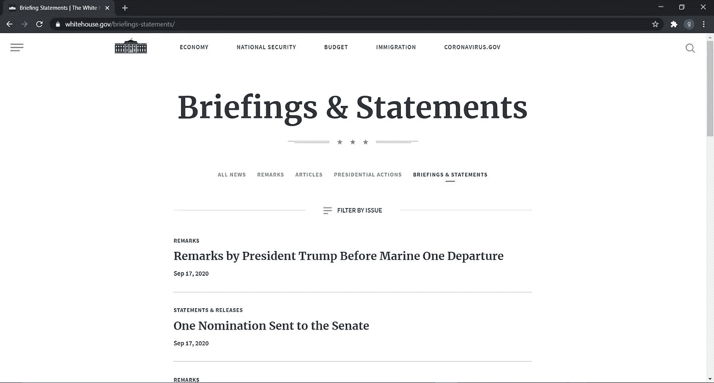
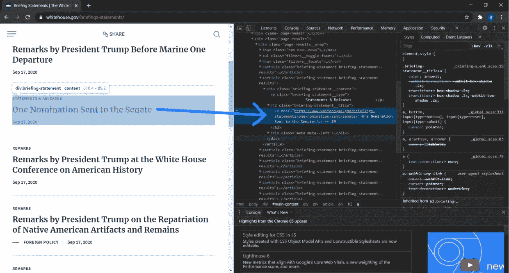
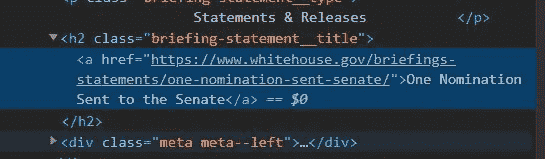
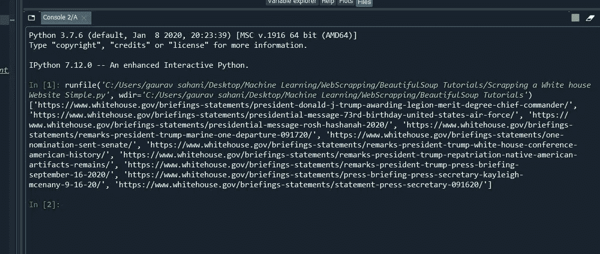

# 介绍网络报废与美丽的汤和要求

> 原文：<https://medium.com/analytics-vidhya/introduction-to-web-scrapping-with-beautiful-soup-and-requests-9bb1ff389f55?source=collection_archive---------10----------------------->


W **eb 抓取**是从互联网上收集信息的过程，我们知道数据已经成为**新的石油**，web 抓取在各种应用中已经变得更加重要和实用。Web 抓取处理从网站中提取或抓取信息。

Web 抓取处理从网站提取中提取或抓取信息。从网站复制文本并粘贴到您的本地系统也是网络抓取！

说一下 **Beautiful-Soup** ，Beautiful Soup 是一个纯 Python 库，用于从网站中提取结构化数据。它允许您解析来自 **HTML** 和 **XML** 文件的数据。它充当一个助手模块，与 HTML 交互的方式与使用其他可用开发工具与网页交互的方式类似，但更好。

而且，它通常会节省程序员几个小时或几天的工作，因为它与您最喜欢的解析器如`lxml`和`html5lib`一起工作，提供了导航、搜索和修改解析树的有机 Python 方式。而且，请求模块允许您使用 Python 发送 HTTP 请求。

我们可以通过以下命令安装 Beautiful-Soup 和 Request:

```
pip install beautifulsoup4
pip install requests
```

这里需要澄清最重要的一点，**“这个博客只是为了教育目的，也不鼓励在没有任何事先书面许可的情况下，或者无视他们的服务条款(ToS)在网上搜集数据”。**

现在，让我们开始吧！

我们将取消以下网站的链接:[**https://www.whitehouse.gov/briefings-statements/**](https://www.whitehouse.gov/briefings-statements/)

这个网站的内容之一是总统简报和声明的记录。而我们的“**目标**将提取页面上分别指向简报和声明的所有链接！

我们将在 Anaconda 环境中实现我们的代码，并开始导入重要的库，

```
import requests
from bs4 import BeautifulSoup
```

使用 requests 模块，我们使用提供的“ **get** ”函数来访问作为该函数的参数提供的网页。

```
result = requests.get("https://www.whitehouse.gov/briefings-statements/")
```

为了确保网站是可访问的，我们可以确保获得一个“200”响应来表明该页面确实存在，我们可以通过传递一个代码来实现这一点:

```
print(result.status_code)
```

我们还可以检查网站的 **HTTP 头**，以验证我们确实访问了正确的页面:

```
print(result.headers)
```

现在，让我们将从请求中访问的网站的页面内容分别存储到一个**变量**“var”中:

```
var = result.content
```

到目前为止，我们只是从特定的网站或页面获取内容，并将其存储在一个变量“var”中。您可以查看我刚才传递的命令内容: **print(var)**

现在我们已经存储了页面源代码，我们将使用 Beautiful-Soup 模块来解析和处理源代码。为此，我们基于上面创建的源变量创建一个“Beautiful-Soup”对象:

```
soup = BeautifulSoup(src, 'lxml')
```

“ **lxml** ”是用 Python 语言处理 xml 和 HTML 的功能最丰富、最易于使用的库。

现在，页面源已经通过 Beautifulsoup 进行了处理，我们可以直接从中访问特定的信息。例如，假设我们希望看到页面上所有链接的列表！

嗯，我们的工作是提取页面上指向简报和声明的所有链接，**那么我们怎么才能做到呢？**

我们可以通过访问我们想要的废信息页面，并按照简单的步骤，作为参考刮任何允许的网站。

# **第一步:访问我们想要废弃的网站**

让我们访问我们想要废弃的网站，它是[https://www.whitehouse.gov/briefings-statements/](https://www.whitehouse.gov/briefings-statements/)



图:1

# 第二步:点击“检查”按钮

点击鼠标右键，在底部会碰到一个“ **inspect** 按钮，会弹出一个指定页面的 Html 脚本，我们要报废！

看起来像这样，



图:2

现在，我们选择我们想要删除的文本/链接作为参考，对于这些链接，HTML 标签( **h1，h2，h3，h4** )、类、超链接元素“ **< a >** ”对于我们想要删除的所有链接都是相同的！

放大看看！让我们看看在什么标签里，我们的链接被附上了！



图:3

在这里我们可以看到，我们想要删除的链接包含在“H2”HTML 标签中，超链接元素。

# 步骤 3:从 html 中提取元素(可选)

Beautiful soup 为我们提供了提取我们想要废弃的网站的特定内容的强大功能，其中一个命令是，

```
data = soup.find_all("a")
```

在这里，我们找到并存储**超链接元素<a>下的每一个内容，并将数据存储在变量“data”中。同样，我们可以看到数据，py 传递命令，**【打印数据】**。**

# 步骤 4:将特定内容存储在列表中

正如我们所看到的，在步骤 3 中，我们使用 Beautiful-Soup 提供的 find_all 命令单独提取了超链接元素。

在步骤 4 中，我们将在一个“ **for 循环**中得到这个单独的步骤，该循环将为网站中的所有链接迭代每个<一个>元素，该元素包含在“ **h2 标签**”中(请看图 3)。

我们将通过传递以下代码来实现这一点，

```
links = [ ] #Creating a list, in which we will store all our linksfor h2_tag in soup.find_all('h2'):
    a_tag = h2_tag.find('a')
    links.append(a_tag.attrs['href'])print(links)
```

这些是我们从各自的网站上删除的链接，在分别运行上述命令后，您可以得到输出。



图 4(输出数据)

好了，这都是从我这边来的，如果你真的喜欢这个解释和内容，请在 Medium 上做“**拍手**”。

请参考本教程的代码，来自我下面附上的 **GitHub 链接**，

# GitHub 链接:

[](https://github.com/GauravSahani1417/Tutorial-for-Beautiful-Soup-and-Requests) [## gauravsahani 1417/美丽的汤和要求教程

### 这个存储库是作为我的博客“用漂亮的汤清理网络简介”的参考内容保存的

github.com](https://github.com/GauravSahani1417/Tutorial-for-Beautiful-Soup-and-Requests) 

还有，在 **Linkedin** 上联系我，分别给**教程的正版评论**，

# Linkedin 链接:

[](https://www.linkedin.com/in/gaurav-sahani-6177a7179/) [## Gaurav Sahani -数据分析师实习生-neu brain Solutions Pvt Ltd | LinkedIn

### 查看高拉夫·萨哈尼在全球最大的职业社区 LinkedIn 上的个人资料。高拉夫有 3 个工作列在他们的…

www.linkedin.com](https://www.linkedin.com/in/gaurav-sahani-6177a7179/)