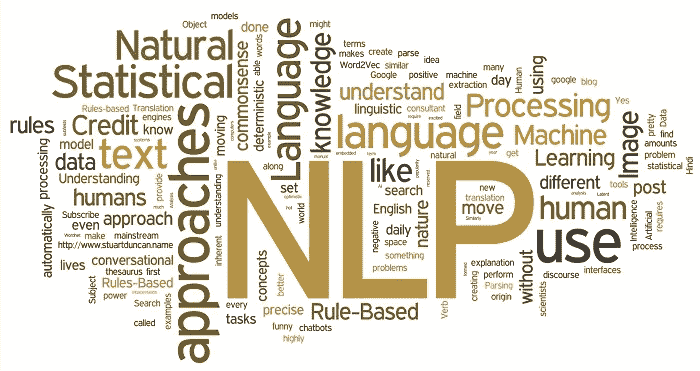
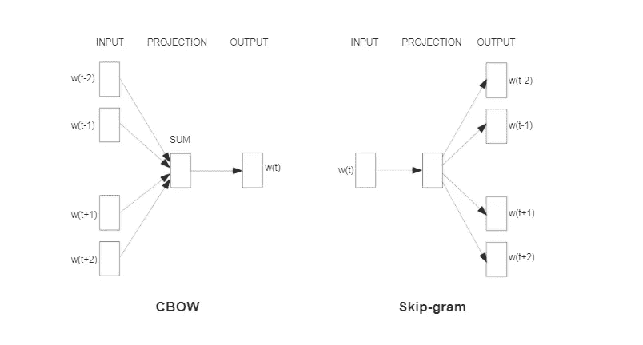

# 单词嵌入简介

> 原文：<https://medium.com/analytics-vidhya/introduction-to-word-embeddings-c2ba135dce2f?source=collection_archive---------5----------------------->



单词嵌入是深度学习应用于自然语言处理的最强大的概念之一。它能够捕捉文档中单词的上下文、语义和句法相似性、与其他单词的关系等。对于那些不熟悉单词嵌入概念的人来说，这篇文章是理想的，并且可以对单词嵌入的需要和用法有一个基本的了解。

# 什么是单词嵌入？

> **单词嵌入**是一组语言建模和语言建模中的特征学习技术的统称，其中来自词汇表的单词或短语被映射到实数的向量。

单词嵌入的核心概念是，语言中使用的每个单词都可以用一组实数(一个向量)来表示。他们已经学会了在 n 维空间中文本的表示，在 n 维空间中，具有相同意思的单词具有相似的表示。这意味着两个相似的单词在向量空间中非常接近，几乎具有相似的向量表示。因此，当构建单词嵌入空间时，目标是捕捉该空间中的某种关系，无论是意义、形态、上下文还是其他某种关系。

下面列出了单词嵌入的几个主要特征:

*   每一个单词都有一个唯一的单词嵌入(或者“向量”)，它只是每个单词的数字列表。
*   单词嵌入是多维的；典型地，对于一个好的模型，嵌入长度在 50 到 500 之间。
*   对于每个单词，嵌入都捕捉到了单词的“含义”。
*   相似的单词以相似的嵌入值结束。

# 为什么我们使用单词嵌入？

人类总是擅长理解语言。人类很容易理解单词之间的关系，但对于计算机来说，这项任务可能并不简单。例如，我们人类理解像国王和王后、男人和女人、老虎和母老虎这样的词，它们之间有某种类型的关系，但是计算机怎么能弄清楚呢？这就是单词嵌入在自然语言处理中发挥作用的地方。

事实证明，许多机器学习算法和几乎所有的深度学习架构都无法处理原始形式的字符串或纯文本。它们需要数字作为输入来执行任何种类的工作，无论是分类、回归等等。

除非我们已经知道这两个术语的含义，否则很难对它们进行有用的比较。因此，单词嵌入算法的目标是基于单词与其他单词的相似性或关系来嵌入有意义的单词。

**One-Hot -Encoding** 可以被认为是用数字表示单词的最简单的方法之一。在这里创建一个向量，它的维度和你的语料库中唯一的单词一样多。每个唯一的单词都有一个唯一的维度，在该维度上用 1 表示，在其他维度上用 0 表示。为了更好的理解，假设我的系词有两个句子:

> 这对男女幸福地生活在一起。
> 
> **国王和王后幸福地生活着。*

你会注意到这两个句子具有相同的上下文含义，词汇中有 8 个独特的词，如“the”、“man”、“king”、“and”、“women”、“queen”、“live”、“happily。当我们对句子进行一次性编码时，

```
The    - [1,0,0,0,0,0,0,0]
man    - [0,1,0,0,0,0,0,0]
king   - [0,0,1,0,0,0,0,0]
and    - [0,0,0,1,0,0,0,0]
women  - [0,0,0,0,1,0,0,0]
queen  - [0,0,0,0,0,1,0,0]
live   - [0,0,0,0,0,0,1,0]
happily- [0,0,0,0,0,0,0,1]
```

尽管这是一种简单的实现方法，但是有一些主要的缺点。您可能已经注意到了，我们只使用整个向量的单词 index 设置了一个元素。随着词汇量的增加，我们最终会使用一个长度很长的稀疏向量来编码一个单词，这将导致性能和存储方面的损失，因为[维数灾难](https://en.wikipedia.org/wiki/Curse_of_dimensionality)。除此之外，这种表示不能学习单词之间的语义关系，而这在处理文本数据时是至关重要的。

单词嵌入消除了所有上述缺点，并为我们提供了丰富而强大的表示，能够捕捉单词之间的上下文和语义相似性。

## 在这篇文章中，我们将重点介绍两种本质上更先进的单词嵌入方法。

> - Word2vec
> 
> 手套

## **Word2vec**

Word2Vec 是最流行的基于预测的算法之一，用于生成单词嵌入，最初由 Mikolov 等人在 Google 提出。这些模型是经过训练的浅层两层神经网络，用于重建单词的语言上下文。这将文本语料库作为输入，并为语料库中表示的每个单词生成一个向量。

介绍了两种不同的学习模型，它们可以用作学习单词嵌入的 word2vec 方法的一部分:

*   连续词袋，或 CBOW 模型。
*   连续跳格模型。



来源:[https://arxiv.org/pdf/1301.3781.pdf](https://arxiv.org/pdf/1301.3781.pdf)

**连续词袋，或 CBOW 模型:**该技术使用浅层 2 层神经网络来预测给定上下文中单词的概率。上下文可以是一个单词或一组单词。

**连续跳格模型:**跳格模型类似于 CBOW 模型，但是它不是在给定上下文的情况下预测当前单词，而是试图从当前单词预测上下文单词。

这两个模型都专注于在给定单词的本地使用上下文的情况下学习单词，其中上下文由相邻单词的窗口来定义。该窗口是模型的可配置参数。word2vec 方法的主要优点是能够以低空间和时间复杂度学习高质量的单词嵌入。这也允许从更大的文本语料库中学习大的嵌入。

## **手套**

单词表示的全局向量，或 GloVe，该算法是对有效学习单词向量的 word2vec 方法的扩展，由 Pennington 等人于 2014 年在斯坦福大学开发。这是一个单词表示的无监督学习算法。它根据向量或单词一起出现的频率来学习它们。GloVe 的贡献是在语言建模任务中添加了全局统计来生成嵌入。本地上下文没有窗口功能。相反，有一个词-上下文/词共现矩阵，它学习整个语料库的统计数据。

它首先构造矩阵 X，其中行是单词，列是上下文，元素值 X_ij 等于单词 I 在单词 j 的上下文中出现的次数。通过最小化重构损失，该矩阵被因式分解为更低维的表示，其中每行表示给定单词的向量。GloVe 没有使用窗口来定义局部上下文，而是使用整个文本语料库的统计数据来构建显式的单词上下文或单词共现矩阵。结果是一个学习模型，该学习模型可以产生通常更好的单词嵌入。

## **总结**

在本文中，我只是简单描述了单词嵌入的一些基本知识，并描述了两种最常见的单词嵌入方法。单词嵌入在整个自然语言处理应用中发挥了巨大的作用。因此，在深入研究更深层次的实现之前，这为您提供了一个基本的理解。

我希望这篇文章对你有用。

## 参考

[1][https://www . analyticsvidhya . com/blog/2017/06/word-embeddings-count-word 2 veec/](https://www.analyticsvidhya.com/blog/2017/06/word-embeddings-count-word2veec/)

[2].[https://arxiv.org/pdf/1411.2738.pdf](https://arxiv.org/pdf/1411.2738.pdf)

[3]“忙于单词嵌入——简介”，*谢恩·林恩*