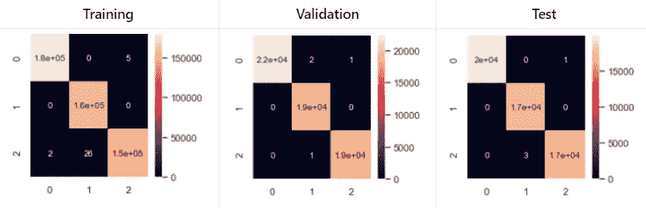

# 基于人工神经网络的入侵检测系统

> 原文：<https://medium.com/analytics-vidhya/intrusion-detection-system-using-artificial-neural-networks-14afc2112be?source=collection_archive---------13----------------------->

在不断变化的计算机技术世界和快速发展的网络威胁中，攻击者和防御者一直处于猫捉老鼠的循环中。在防御方方面，必须在他们的安全层中添加纵深防御策略，以有效检测高级持续网络威胁，其中入侵检测系统(IDS)是一个关键要素。在这篇文章中，我将试着把人工智能这个日益发展的领域应用到它上面。这个项目开发使用的所有代码都在 Github 上。见下面我附上的链接。[ [Github 存储库](https://github.com/sepi1996/IDS-using-Neural-Networks)

纵深防御战略

# 介绍

## 入侵检测系统

广义地说，我们可以将入侵检测系统定义为监控网络或系统的恶意活动或违反策略的设备或软件应用程序。任何入侵或破坏活动通常会报告给管理员，或者使用事件管理和安全信息系统集中收集。

正如我们在下图中看到的，根据功能的不同，有不同类型的 id。我们将关注 NIDS。

id 的类型

根据使用的检测方法不同，有两种类型的 NIDS。第一个，也是最早使用的，基于签名的 NIDS，如 [Snort](https://www.snort.org/) 和 [Suricata](https://suricata-ids.org/) ，是目前使用最多的。基于签名的 NIDS 寻找网络流量中的模式，并将其与预先安装的已知攻击模式(称为规则)进行比较，这使得 SNIDS 成为检测已知攻击的真正伟大的解决方案，但它们无法检测新的或以前未识别的攻击。这个问题也适用于反病毒软件，因为它们依赖于持续的病毒签名更新来保持有效。第二种 NIDS 是基于异常的 NIDS，它依靠各种统计机器学习模型来自动学习模式，并创建规则来区分正常流量和恶意攻击。总之，基于特征的 NIDS 寻找模式，而基于异常的 NIDS 分析行为。

说到这里，有人可能会问，如果基于异常的入侵检测系统能够识别已知和未知的攻击，那么为什么像 Snort 和 Suricata 这样基于特征的 NIDS 是最常用的呢？作为回答，基于异常的 IDS 也有一个重要的缺点，因为它的准确性依赖于训练模型时使用的数据，因此受到这些数据的限制。

最后，关于 NIDS，我将使用人工神经网络进行学习，特别是密集神经网络，其主要特征是两个相邻层之间的神经元完全成对连接，但单个层内的神经元不共享连接。

## 资料组

为了使神经网络能够区分正常流量和恶意流量，它需要一组分类输入值。因此，已经有一些数据集，如 [DARPA1998](https://www.ll.mit.edu/r-d/datasets/1998-darpa-intrusion-detection-evaluation-dataset) 或 [KDD99](http://kdd.ics.uci.edu/databases/kddcup99/kddcup99.html) ，但在这种情况下，我将使用由[通信安全机构(CSE) &加拿大网络安全研究所(CIC)](https://www.unb.ca/cic/datasets/ids-2018.html) 提供的数据集，主要是因为它是最新的。2018 年的数据集包含不同类型的网络攻击，如 DoS、web 攻击等，但为了简单起见，我将重点关注 SSH 和 FTP 协议上的暴力攻击。

## 工作环境

作为工作环境，将使用 Anaconda 和 Jupyter 作为开发环境。为了实现神经网络代码，我将使用 Python 编程语言及其用于神经网络的高级 API [Keras](https://keras.io/) 。最后，其他库将用于数据可视化和管理，如 Pandas、Numpy 或 Matplotlib。

# 构建人工神经网络

## 数据分析和清理

下载相应的数据集后，我们分析数据以了解它们的特征，并在需要时进行清理。

*   行清理:数据集包含非数字值，这些值不能被类似“Nan”和“Infinity”的神经网络处理，因此这些行将被删除。下表显示了将要处理的最终行数。

最终数据集内容

*   提取不必要的列:[CIC 流量计](http://netflowmeter.ca/)(CSE&CIC 用来分析网络流量的工具)提取了 79 个不同列中的所有信息。由于其中一些对我们没有用，或者神经网络无法理解，所以它们也会被丢弃。
*   混合数据:csv 文件中的数据按照产生的顺序排列，也就是说，首先是一小块良性流量，然后是 FTP 上的暴力攻击块，然后是良性流量，然后是 SSH 上的暴力攻击块，最后是另一个良性流量块。这是神经网络的一个学习问题，因为最初，当接收到 FTP 上的 193，354 行暴力攻击时，网络将专门检测这种类型的输入。这导致在接收所有良性流量时时间流逝更长，并且在预测 FTP 上的攻击时总是出错
    为了避免这个问题，我将随机打乱所有行:
*   归一化:根据特性的类型，其值相对于另一个特性的值有所不同，例如，流量 IAT 最大特性的值将始终大于流量 IAT 最小值，因此这两个特性处于不同的范围内。为了避免这个问题，将使用最小-最大归一化。
*   编码:在这个数据集中，我们有三种类型的流量:“FTP 暴力”、“SSH 暴力”和“良性”。也就是说，它们是分类数据，因为它们包含标签而不是数值，这是我们的神经网络无法解释的。为了解决这个问题，我们将使用 One-Hot 编码，通过它将这些分类变量转换成数值。在下图中，我们可以看到这种编码的示例:

一个热编码

> 对应于数据预处理的代码在文件 import.py 中

## 获得最佳模型

当实现神经网络时，最困难的一点是它必须具有的体系结构，在隐藏层和这些层的每一层的神经元的级别，以及在激活函数、成本函数、过拟合等的级别，因为没有规则或协议指示我们应该使用的超参数来实现最佳结果。由于这是一个众所周知的问题，目前有各种各样的工具来简化这一过程。在这种情况下，我将使用 [Talos](https://github.com/autonomio/talos) 工具。

使用 Talos，我们用神经网络的可能参数定义一个字典，以便稍后我们可以分析获得的结果，并查看哪个神经网络获得了更高的命中率。执行后，在 384 个不同模型上获得的最佳结果如下:

Tales 结果

由此我们可以得出以下结论:

1.  该模型最适用于单个隐藏层。
2.  无需申请退学。
3.  隐层神经元的最佳数目是 256 个神经元。
4.  两个优化器获得相似的结果。
5.  输入层的神经元数量似乎无关紧要。

然后，从这些结果中，我们总结出最佳的神经网络架构是这样的:

最佳神经网络架构

> 对应于 Talos 实现的代码在文件 KerasTuner.py 中

# 结果

最后，为了评估该算法，我们将数据集分为三个部分:

训练集:我们用来训练模型的实际数据集。模型看到这些数据并从中学习。对于这个集合，我们将使用 81%的总数据。
验证集:这是用于在调整模型的超参数时对训练数据集中的拟合模型提供公正评估的数据集。对于这个集合，我们将使用总数据的 10%。
测试集(Test set ):它是一个数据集，用于对训练数据集中拟合的最终模型提供公正的评估。对于这个集合，我们将使用总数据的 9%。

在接下来的图片中，我们可以检查结果:

结果取决于激活功能

结果取决于优化器

使用不同数量的时期的成功率

混淆矩阵结果

> 对应于最佳 IDS 和图形的代码在文件 bestIDS.py 中

# 结论

正如我们在结果部分看到的，我们开发的 IDS 的准确性非常好。

这个模型最好的激活函数是 ReLu 函数，最好的优化器是 Adam 优化器。获得最大成功率所需的时期数大约为 10，因为如 50 个时期图像所示，10 个时期后命中率不再提高。

混淆矩阵表明，该模型在 FTP 上有 100%的准确性。也就是说，每当模型收到一个 FTP 攻击的样本时，它就预测它确实对应于 FTP 上的攻击。因此，FTP 上的真实阳性率是 1，而无论何时收到 FTP 攻击，它都不会预测到是另一种类型的流量。此外，即使有几次出错，它也能区分良性流量和对 SSH 的攻击

最后，在这个入侵检测系统中，我们尝试将两种类型的攻击分开，看看它们是否也可以被区分。这是以非常高的命中率实现的，但是 IDS 的目标是检测威胁。也就是说，区分不同类型的攻击并不重要，重要的是能够识别攻击，我们的最佳模型已经以一种几乎完美的方式做到了这一点，因为在超过 602，462 的流量中，它有两次没有识别出攻击。