# 梯度增强的直觉和实现第 2 部分

> 原文：<https://medium.com/analytics-vidhya/intuition-and-implementation-of-gradient-boost-part-2-f519af48ee2c?source=collection_archive---------11----------------------->

理解分类问题的数学直觉和梯度推进的实现…！

助推

> 📢注意:在阅读本文之前，请阅读我的文章《梯度增强的直觉和实现第 1 部分》,以便更好地理解梯度增强算法，其中我们将 GBM 用于回归问题链接:[https://medium . com/analytics-vid hya/Intuition-and-Implementation-of-Gradient-Boost-Part-1-1728 EB 463 cf 0](/analytics-vidhya/intuition-and-implementation-of-gradient-boost-part-1-1728eb463cf0)

# 💥用于分类的梯度增强背后的直觉:

> 在这里，我们将理解梯度推进算法如何对分类问题起作用。
> 
> 我们将使用下面的数据集来理解 GBM 背后的直觉，其中我们收集了六个人对爆米花的偏好以及他们最喜欢的颜色，以预测他们是否喜欢电影《巨魔 2》。
> 
> 注意:当梯度增强用于预测离散值时，我们说我们正在使用梯度增强进行分类。

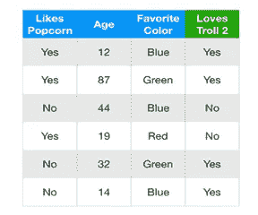

数据集

# 💛步骤 1-计算目标变量的对数(赔率):

> 就像在回归的梯度推进中一样，我们从代表每个个体的初始预测的叶子开始。
> 
> 当我们使用梯度推进进行分类时，每个个体的初始预测是对数(几率)。
> 
> 所以，我们来计算一下有人爱巨魔 2 的 log(赔率)。既然，训练数据集中有 4 个人爱巨魔 2，2 个人不爱。那么有人爱巨魔 2 的 log(odds)是 log (4/2) =0.7，我们会把它放入我们的初始叶子。这是我们最初的预测。

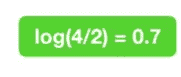

叶节点

> 我们得到了最初的预测，但是我们如何使用它进行分类。就像逻辑回归一样，使用对数(比值)进行分类的最简单方法是将其转换为概率，我们使用逻辑函数或 Sigmoid 函数来实现这一点。

逻辑函数

> 因此，我们在上面的逻辑函数中插入 Log(odds)

> 对于训练数据的所有样本，我们得到 0.7 作为喜爱 Troll 2 的概率

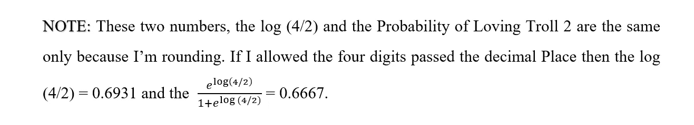

> 既然喜欢巨魔 2 的概率大于 0.5，我们就可以把训练数据集中的每个人都归为喜欢巨魔 2 的人。
> 
> 📢注意:虽然 0.5 是基于概率进行分类决策的一个非常常见的阈值，但是我们也可以轻松地使用不同的值。

# **💙第二步:根据前一个树的错误建立树。**

> 现在，将训练数据集中的每个人归类为喜欢巨魔 2 的人是非常蹩脚的，因为其中两个人不喜欢这部电影，如下面的数据集所示。记录 3 和 4 表明他们不喜欢巨魔 2。

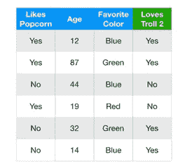

数据集

> 我们可以通过计算伪残差，即观察值和预测值之间的差异，来衡量初始预测有多差。
> 
> 残差=(观察值-预测值)

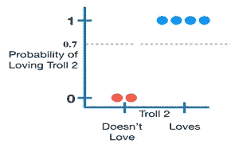

图表

> 虽然数学很简单，但我认为如果我们在图上画出残差，会更容易理解发生了什么。
> 
> y 轴是喜欢巨魔 2 的概率。喜欢巨魔 2 的预测概率是 0.7，如上图虚线所示。喜欢 Troll 2 的概率=0 的红点表示不喜欢 Troll 2 的两个人(训练数据集的样本 3 和 4)，而喜欢 Troll 2 的概率=1 的蓝点表示喜欢 Troll 2 的四个人(训练数据集的样本 3 和 4 除外)。换句话说，红点和蓝点是观察值，虚线是预测值。
> 
> 📢注意:第一个蓝点代表训练数据集的第一个样本，第二个蓝点代表记录的第二个样本，依此类推，第一个红点代表训练数据集的第三个样本，第二个红点代表训练数据集的第四个样本。
> 
> 因此，现在我们将计算训练数据的所有样本的残差。

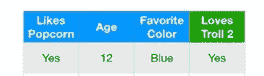

样本 1

剩余示例

> 因此，对于上面的示例，我们为观察值(参考上图)插入 1，为预测值插入 0.7。
> 
> 残差=(观察值-预测值)
> 
> = (1–0.7) =0.3
> 
> 类似地，我们计算训练数据的所有样本的残差，并且我们得到如下所示的残差。

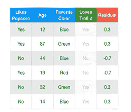

新数据集

> 📢注意:将训练数据集的样本 3 和样本 4 的观察值作为 0，以获得残差。
> 
> 现在，我们将使用爆米花、年龄和喜欢的颜色作为自变量，残差作为因变量来构建一棵树。下面给出了形成的树。

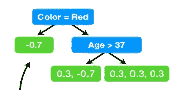

第一棵树

> 注意:就像我们使用梯度推进回归一样，我们限制了树中允许的叶子数量。在上面的树中，我们将叶子的数量限制为 3。实际上，人们通常将最大叶片数设置在 8 到 32 之间。
> 
> 现在让我们来计算树叶的输出值。样本 1、5 和 6 放在第三片叶子上。样本 2 和 3 到第二个叶子，样本 4 到第一个叶子，如上树所示。
> 
> 当我们使用梯度增强进行回归时，具有单个残差的叶子具有等于该残差的输出值。相比之下，当我们使用梯度推进进行分类时，情况就不那么复杂了。这是因为预测是根据对数(赔率)进行的，而上述树中的第一片叶子是从一个概率中派生出来的。所以，我们不能只是把它们加在一起，不经过某种转换就得到一个新的对数(几率)预测。
> 
> 因此，当我们使用梯度增强进行分类时，我们使用的最常见的变换如下所示。

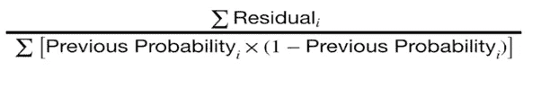

转换公式

> 分子是叶子中所有残差的和，分母是每个残差的先前预测概率的和乘以 1 减去相同的预测概率。
> 
> 现在我们将使用公式来计算树的第一片叶子的输出值。因为我们在第一个叶子中只有一个残数，即-0.7，所以我们用残数值替换分子，并且因为我们正在构建第一棵树，所以先前的概率指的是来自初始叶子的概率 0.7。

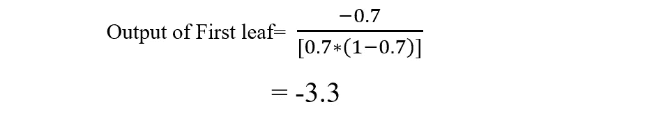

> 现在我们需要计算树的第二片叶子的输出值。因为我们在第二个叶中有两个残差，即 0.3 和-0.7，所以我们用两个残差的和替换分子，并且因为我们正在构建第一棵树，所以先前的概率指的是来自初始叶的概率 0.7。

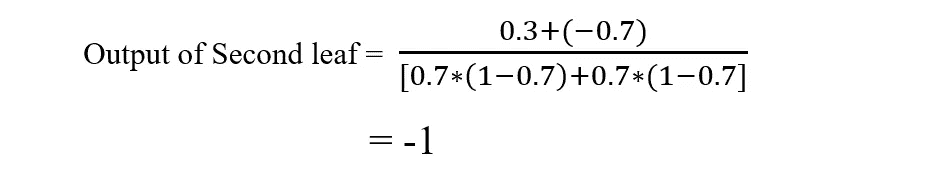

> 📢注意:现在，前面的概率对于所有的残差都是相同的，但是当我们构建下一棵树时，这将会改变。

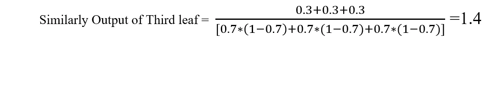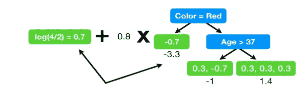

模型 1 =第一片叶子+第一棵树

> 以上是添加带有初始叶节点的树后生成的模型。

# 🧡STEP 3:对完整的训练数据进行预测。

> 让我们通过将样本传递给上面的模型来尝试计算下面给出的人的对数(赔率)预测。

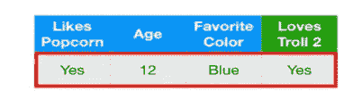

> 最初，当样本通过初始叶时，对数(优势)预测为 0.7，当我们通过树时，对数(优势)预测为
> 
> = 0.7+(0.8*1.4)
> 
> = 1.8
> 
> 📢注意:上面的 0.7 表示宝贵叶的对数(赔率)预测，0.8 是与我们在回归问题的梯度推进中讨论的学习率相同的学习率，1.4 是第三叶的输出，因为上面取得的样本落入第三叶。
> 
> 对于上面的样本，我们得到的 log(odds)预测值为 1.8。现在，我们使用下面的公式将对数(赔率)预测转换成概率。

> 上面的样本的新预测概率是 0.9，上面的样本的初始概率是 0.7，现在我们得到了 0.9，所以我们在正确的方向上迈出了一小步，因为这个人喜欢巨魔 2。
> 
> 类似地，我们计算训练数据的所有样本的对数(比值)预测，并且我们得到如下所示的预测概率列中的概率。

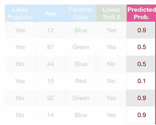

> 现在重复第 2 步和第 3 步，直到残差变为 0 或达到您要求的树的数量。
> 
> 下面是执行步骤 2 后我们得到的残差和树

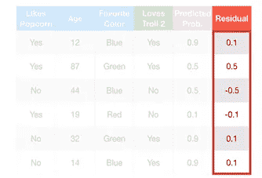

> 下图是使用爆米花、年龄和喜爱的颜色作为自变量，残差作为因变量获得的树，如上图所示

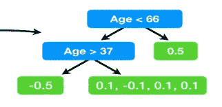

第二棵树

> 现在我们需要计算每片叶子的输出值，就像我们在上面的步骤 2 中所做的那样。因为我们在上面的树上有三片叶子。第一片叶子的输出值是-2，第二片叶子的输出值是 0.6，第三片叶子的输出值是 2。
> 
> 现在我们需要通过下面的模型测试所有的训练元组，这是第三步

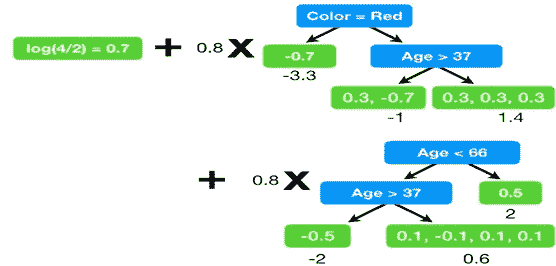

模型 2

> 以上是将新构建的树添加到之前的模型后生成的模型 2。现在我们将使用上述模型来获得训练数据的新概率。
> 
> 再次获得预测概率后，重复第 2 步和第 3 步，直到残差变为零或达到您要求的树的数量。只要您要求的树的数量尚未达到，新构建的树将被添加到以前的模型中。
> 
> 假设我们只要求了两棵树，那么我们的训练到此结束。
> 
> 现在，如果我们使用上面的模型 2 测试一个看不见的元组。设一个看不见的元组如下，现在我们需要分类他是否喜欢巨魔 2。

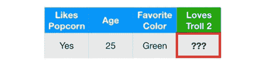

> 预测从叶开始，即 0.7，然后我们沿着第一棵树运行数据，并添加缩放的输出值 0.7+(0.8 *1.4)，然后我们沿着第二棵树运行数据，并添加缩放的输出值 0.7+(0.8*1.4)+(0.8*0.6)。请仔细看模型 2 以便理解。
> 
> 有人爱巨魔 2 的 log(odds)预测= 0.7+(0.8*1.4) + (0.8*0.6)
> 
> = 2.3
> 
> 现在我们需要使用下面给出的公式将对数(赔率)预测转换成概率。

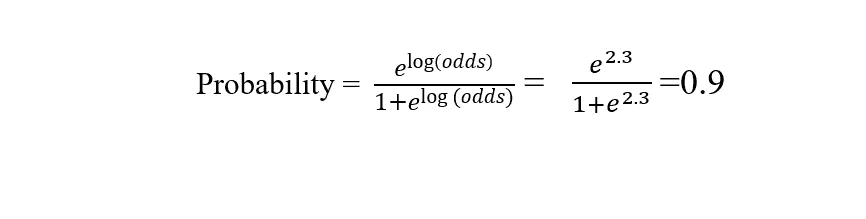

> 现在预测这个人喜欢巨魔 2 的概率是 0.9。既然，我们是用 0.5 作为阈值来决定如何对人进行分类，0.9 >0.5 我们就把这个人归类为喜欢巨魔 2 的人，如下图。

# 💥使用 Python 实现分类。

这里我们使用虹膜数据集来解决分类问题

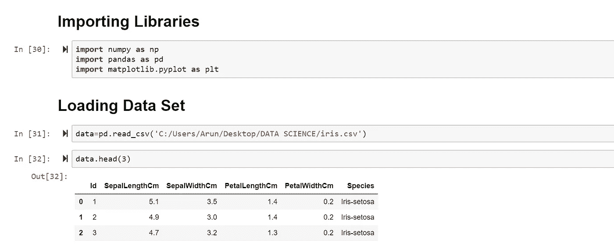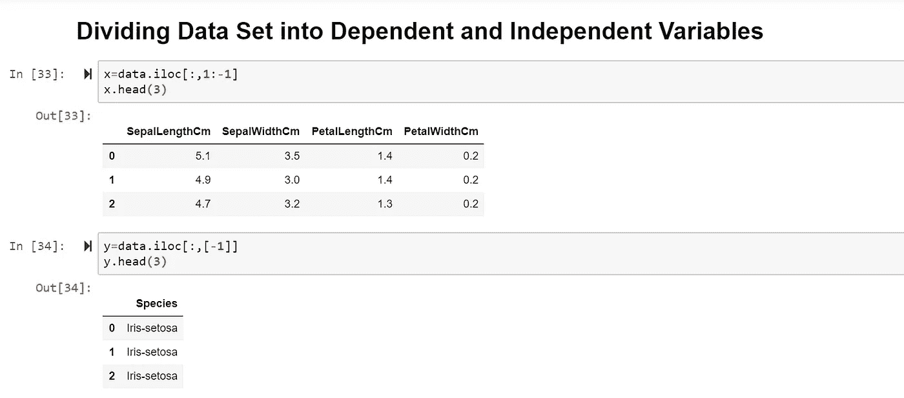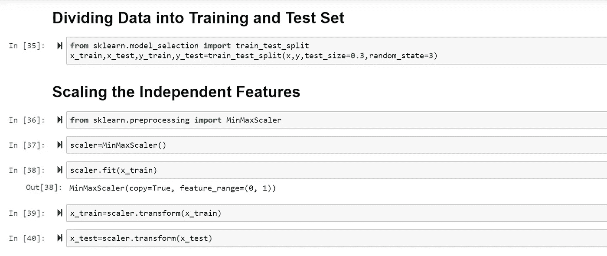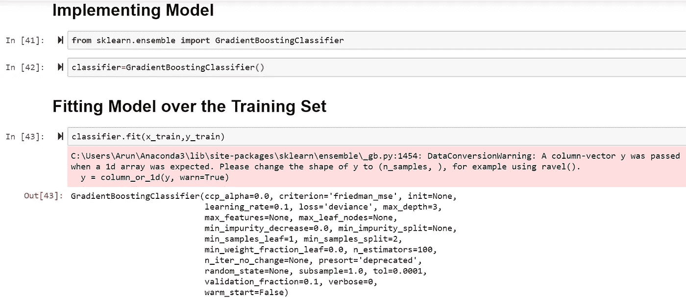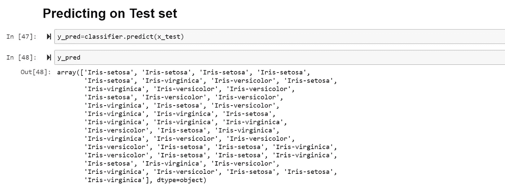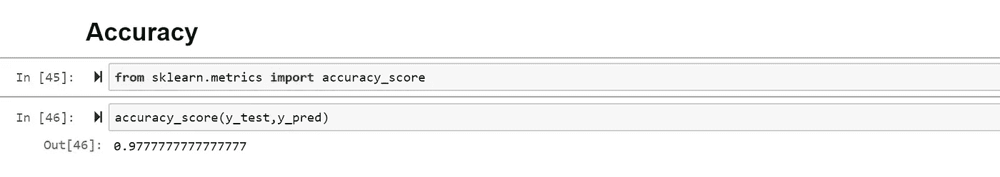

如果您发现帖子中有任何错误或有任何补充，请在评论中讨论:P
谢谢。

**信用和来源:**

1.  [StatQuest](https://statquest.org/video-index/)
2.  [www.Analyticsvidhya.com](https://www.analyticsvidhya.com/blog/2016/03/pca-practical-guide-principal-component-analysis-python/)