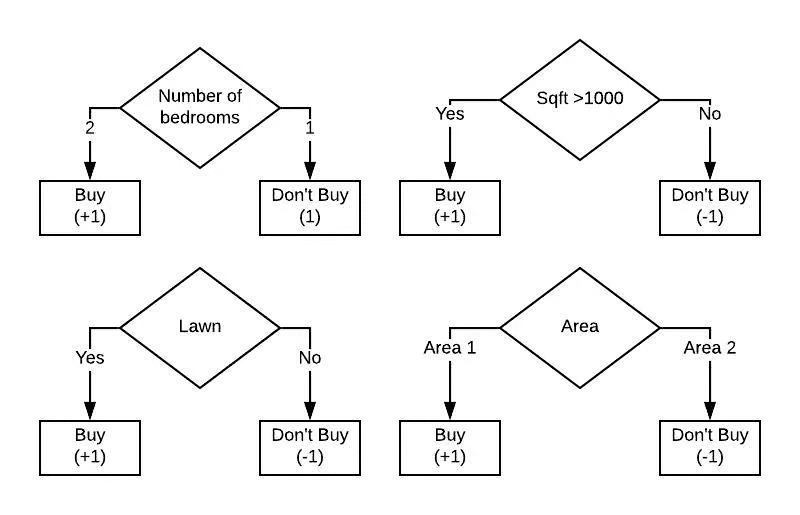
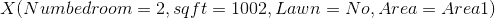
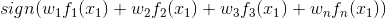
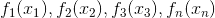
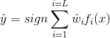
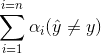
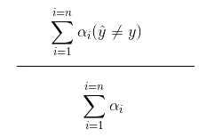
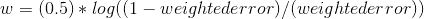
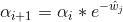
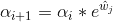

# AdaBoost 背后的直觉和工作

> 原文：<https://medium.com/analytics-vidhya/intuition-and-working-behind-adaboost-1c559f8d7a73?source=collection_archive---------13----------------------->

有多种机器学习算法对数据进行分类。在之前的博客文章中，我们已经看到了[支持向量机](/analytics-vidhya/math-behind-support-vector-machines-642421e45b08)和[逻辑回归](/analytics-vidhya/logistic-regression-b35d2801a29c)的工作原理，现在是时候探索另一种称为 AdaBoost 或自适应 Boosting 的算法了。这是决策树算法的一个变种。

AdaBoost 是一个更大的算法集的一部分，属于称为集成学习的方法。集成学习背后的整个思想是创建多个学习模型而不是一个模型，并预测值。

AdaBoost 通过创建多个弱学习器，根据每个学习器中该点的预测将权重与每个数据点相关联，并最终给出输出，来预测值。

**弱学习者与助推:**

它们基本上是在数据特征子集上运行的多个模型(在本例中是决策树)。这些弱学习者有一个特别有趣的特性，我们将在创建 boosting 算法时利用它，该算法是欠拟合或低方差的。

为了更好地理解，请看下图

多重决策难题

让我们假设我们必须使用机器学习算法来预测某人是否会买房。我们不是创建一个决策树或逻辑回归模型来预测，而是创建多个弱学习器，即决策树桩或深度为 1 或 2 的弱逻辑回归模型或树，一个接一个地预测输出。在 AdaBoost 中，我们以这样一种方式装配系统，即在先前的学习器中预测不佳的特征在随后的模型中预测到较好的结果。

让我们给上面的决策树桩一个输入的例子。

对树桩的投入

上述输入中的*数字室*为“ *2* ”，这将转到主伐桩和产量预测“ *+1* ”。 *sqft* 将转到第二个树桩，并将产生预测“ *+1* ”，*草坪*将得到预测“ *-1* ”，类似地*区域*将得到预测“ *+1* ”。因此，我们需要问的最后一个问题是，我们如何结合来自各种弱学习者的所有这些预测，并对上述数据点给出一个最终预测？。这是通过下面的公式完成的

第一个数据点的加权投票方案

每个方案的预测，即+1 或-1

我们基本上是在乘以与每个树桩相关联的权重，再乘以预测值，并与来自每个树桩的其余值相加之后，得到最终符号。

最终预测方程。l 树桩数。

**AdaBoost:**

AdaBoost 的工作方式如下:

1.)首先，每个数据点用等于(1/数据点的数量)的权重'*α*初始化。

2.)然后，对于每个弱学习器或模型，我们迭代计算预测值，然后继续计算权重' *w* '(加权误差)，并基于此重新调整下一次迭代的'*α*'项，直到最后。

3.)在所有迭代完成之后，我们基于上面的等式计算预测。

这里我们需要问两个关于 AdaBoost 的基本问题，我们将如何更新权重' *w* '以及我们将如何更新' *alpha* '值。？

在该算法中，我们所做的是将所有被错误分类的数据点的权重相加，然后除以所有数据点的权重，即

对错误分类点的权重求和

加权误差公式

创建加权误差后，我们确保更新与每个树桩相关联的权重，其公式为

更新每个树桩的重量

上面的等式非常有趣:

对于加权误差= 0.5 的值，它将产生“0”，因为输出为(1/2) * log(1)等于 0，而以正确方式对点进行分类的良好决策树桩将具有非常低的加权误差，这意味着((1-加权 _ 误差)/加权 _ 误差)的高值，取该值的一半 log 将产生具有高值的正权重。对于分类不好的树桩，权重会很低。

在下面关于更新' *alpha* '的部分中，我们将看到为什么具有良好分类的决策树桩具有高权重，而与不良分类相关联的树桩具有低权重值。

在权重被更新之后，我们以这样的方式更新α，即被错误分类的点比被正确分类的点被给予更大的重要性，从而确保我们的机器学习模型更多地迎合错误分类的点。这是借助于指数函数完成的。当预测正确时，使用下面的公式更新与每个数据点相关联的 alphas

i ->针对每个数据点，j->针对每个树桩

当预测不正确时，我们使用以下公式更新与每个数据点相关的 alpha 值

i ->针对每个数据点，j->针对每个树桩

在这里使用带正负符号的指数函数是至关重要的，因为每当一个点被正确分类时，我们就在指数的顶部使用一个负值以及与树桩相关联的权重。对于' *w* '的高值意味着被正确分类的点在下一个树桩中的重要性较低。如果一个树桩在某组数据点上分类失误，那么与这些点相关联的 alpha 值将在下一个树桩中具有更高的值，这是通过赋予它们更大的重要性来实现的。

最后，一旦我们有了基于我们的训练数据的所有树桩以及相关联的权重(不是加权误差而是与每个树桩相关联的权重)，我们就可以计算必须分类的数据的预测，

最终预测方程。l 树桩数。

github 要点如下。

**注意:**要点仅针对 adaboost，而非创建决策树桩

请随意在评论中指出任何错误。