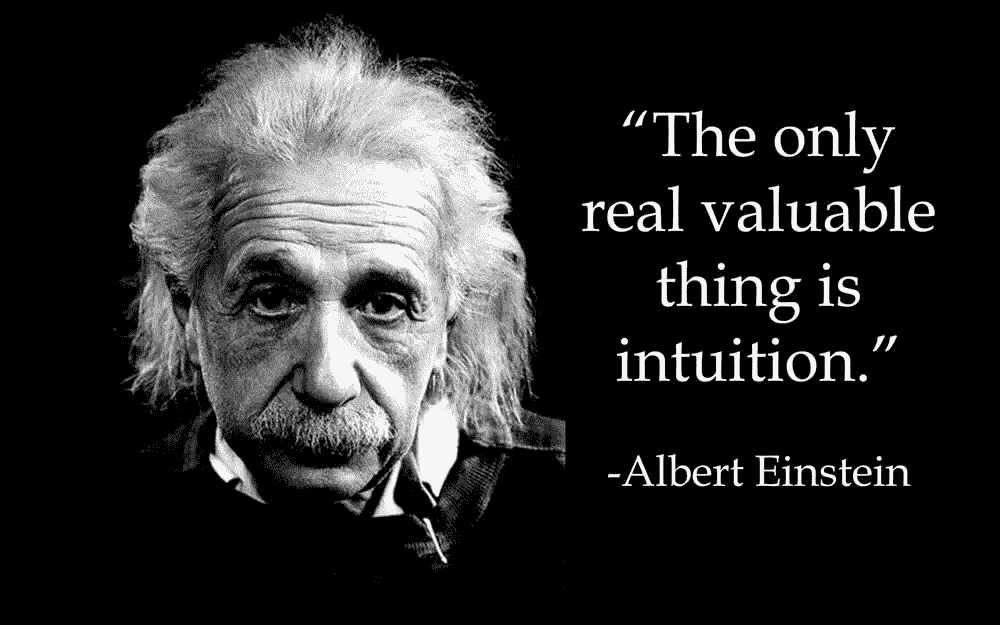
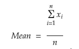
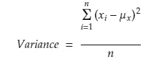
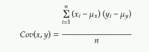
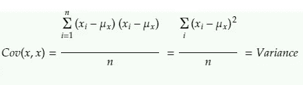
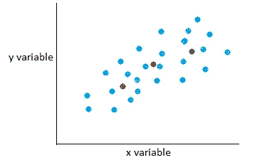
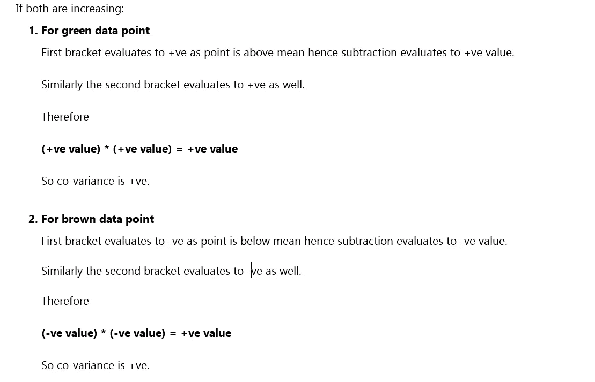
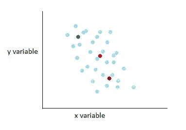

# 协方差背后的直觉

> 原文：<https://medium.com/analytics-vidhya/intuition-behind-covariance-24795c6cba47?source=collection_archive---------16----------------------->

我们在学校里学习了各种术语，如均值、中位数、众数、协方差等，梳理了它们的公式。今天，当我们想成为 ML 工程师或数据科学家时，我们也在做同样的事情。

> 仅仅知道公式是不够的，如果是这样的话，你和一个上学的孩子有什么区别。

> 曾经想知道为什么当变量同向变化时，协方差为正，而当变量负向变化时，协方差为负。

我们都知道这个公式，所以我们和上学的孩子处于同一水平。 ***这对我打击很大*** 然后我决定对事物有一种直觉，不再囫囵吞下它们的公式。

> 我向你保证，在这篇文章结束时，你会有足够的信心说“是的，我和上学的孩子是不同的，因为孩子只知道公式，而我知道公式背后的直觉”

让我们开始吧。

所以我们都知道**的意思是**不过是数据的平均值。**方差**是数据分布的度量，意味着我们的点离均值有多远/多近。

让我们看看他们的公式:

# **1。平均值**

平均值公式

这个公式是不言自明的，它是值的总和除以值的个数。

## 2.**差异**

方差公式

根据定义，该公式计算的是平均值，即数据点离平均值有多远。减法项被平方，以避免+ve 和-ve 值无效。

有些人可能会想为什么我们不取绝对值。取绝对值并不能正确地捕捉价差。我建议你尝试一些既有绝对值又有平方值的例子，你自己会找到答案。或者，如果您仍然不相信，请阅读此。

现在来看最重要的话题，这也是这篇文章的目的。

## 3.**共方差**

> 单词 Co- **variance** 中有术语 **variance** ，所以它一定与 VARIANCE 有关，否则他们可能会把它命名为类似于**沙鲁克·汗的东西。**

记住这个东西(方差而不是 SRK ),让我们看看它的公式。

协方差公式

这个公式看起来类似于方差公式。如果我们用 x 代替 y，那么它将成为方差公式。

> 因此，术语**方差**出现在**协方差**中，而不是**沙鲁克·汗中。**

**Co**-方差也有术语 **CO** 意为**对。**这类似于术语“同乘者”,同乘者同样是指两个实体之间的差异。

现在，我们还听说，如果 *x* 和 *y* 同向变化，那么协方差为正(+ve)，如果它们反向变化，那么协方差为负(-ve)。

让我们试着找出这背后的原因。

# 直觉

让我们考虑一个例子，其中 *x* 和 *y* 都以相同的方向变化，假设两者都在增加。

这里我们假设两个变量都在增加。

两个变量同向变化(增加)

红色数据点是平均值，棕色数据点低于平均值，绿色数据点高于平均值。我们希望涵盖高于和低于平均值的两种情况。

我们将把协方差公式分成两部分。第一部分是与 x 相关的第一个()括号，第二部分是与 y 相关的第二个括号。

> 这让我们理解了为什么如果两个变量都在增加，那么协方差就是正的。同样，如果两个变量都在减少，也可以证明。

如果 *x* 和 *y* 都反方向变化

两个变量的变化方向相反

这里我们假设 x 增加，y 减少。

红色数据点是平均值，棕色数据点低于平均值，绿色数据点高于平均值。

正如我们上面所做的，同样我们将把协方差方程分成两部分。

> 类似地，我们已经理解了当变量以相反方向变化时，为什么协方差是负的。

> 现在我们可以说，我们不同于那些上学的孩子，因为我们有一些直觉来解释事情为什么会这样。

但是，仍然有很多事情我们没有问为什么就接受了？

> 如果可以用协方差来检验两个变量是否相关，为什么我们还需要相关性？

原因是协变只给了我们变量是同向变化还是反向变化的方向。但是要量化 T21 的这一点，相关性可以帮助我们。

我会想出许多这样直观的文章，所以敬请期待！

欢迎在下面留言或提问，你可以在 Linkedin 上找到我。欢迎对我下一步该写什么提出建议。