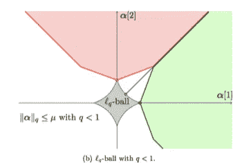

# L1-L2 正则化背后的直觉

> 原文：<https://medium.com/analytics-vidhya/intuition-behind-l1-l2-regularisation-2ac1e6a1bd81?source=collection_archive---------1----------------------->

正则化是使预测函数不太适合训练数据的过程，希望它能更好地概括新数据。这是正规化的一般定义。今天，我们将深入挖掘机器学习的两个著名的正则化，即 L1 和 L2 正则化，用纯数学的眼光。

在深入研究正则化技术之前，我们将建立一个基础，我们首先要考虑的是假设空间。为了捕捉 ML 中从 X 到 Y ( *f:X→Y)* 的学习，我们通常会提出一些假设 h1，…，hn，其中 h∈H。这里，H 是您的假设空间或集合。所有这些假设或预测函数都有一定程度的复杂性。复杂程度可以用特征的数量、多项式的次数或决策树的深度来衡量。

图 1:复杂性的不同度量

给定假设空间 F，考虑 F 中复杂度至多为 r 的所有函数:

*Fr*= { F∈F |ω(F)≤r }

*Fr* 是复杂度≤ r 的假设空间 *F* 的子集，这里 r 是一个超调参数，我们可以从交叉验证阶段学习，并为我们的预测函数计算出最佳 r。

现在我们跳到称为伊万诺夫正则化的第一种形式的约束正则化。在下面的等式中，我们最小化经验风险，即我们的损失函数被约束在假设空间上，其复杂性不大于 r。

图 2:伊万诺夫的正规化形式

第二种形式的惩罚正则化被称为吉洪诺夫正则化，其中我们将乘以超参数𝝀的预测函数的复杂性添加到我们的目标函数中。

图 3:吉洪诺夫正则化形式

我们可以直观地看到，当我们得到一个高度复杂的假设时，它会将目标函数射得更高，其主要目的是最小化。𝝀的大小平衡了我们要找到的假设的复杂性与我们拟合数据的程度或经验风险的大小之间的权衡。约束和惩罚形式的正则化之间的主要区别在于，在前者中，我们已经约束了假设空间，这使得优化函数更容易最小化损失，而在后者中，我们必须运行许多批次来使其正则化和最小化。如果我们通过调整 r 得到的所有可能值等于我们通过调整𝝀.得到的所有可能值，我们可以说这两种形式是等价的

图 4:吉洪诺夫形式的岭回归

图 Ivanov 形式的岭回归

我们可以看到脊线回归方程的吉洪诺夫和伊万诺夫形式，同样适用于套索回归。

图 6:岭回归的正则化路径

在图 6 的第一部分中，我们可以看到特征系数从更正则化到更不正则化的路径。约束和非约束系数之间的比率告诉我们我们在模型上做的正则化的数量。x 轴上的值来源于我们采用不同的 *r.* 值的比率。最初，系数非常小，这是因为它的约束边界受到严重惩罚，随着我们进一步移动，系数变得不受约束，经验风险处于最小值。

图 7:套索回归的正则化路径

对于 Lasso 回归，我们可以看到，当模型被大量正则化时，一些特征的系数在一段时间内为 0。这是 Lasso 回归的 USP，它提供了系数的稀疏矩阵，可用于多种方式，如识别较慢的非线性模型的重要特征，存储特征的内存较少，有时可以提供更好的预测。为什么套索回归给出稀疏模型，我们将在下一节讨论它

**为什么 lasso 回归给出稀疏解？**

图 8:以 w1 和 w2 为轴的 L1 正则化的参数空间

约束菱形给出了系数 w1+w2 ≤ r，而 w-hat 是经验风险最小的无约束系数空间。当我们进一步移动无约束空间，使其更具约束性时，它会演变成一个椭球体，并在轴上或边线上触及我们的约束空间。第一个接触点给出了我们系数的解，如果它接触轴，我们得到稀疏解，如果它接触边，我们得不到稀疏解。现在的问题是，它给出稀疏解的概率有多大。

图 9:套索回归稀疏背后的原因

我们可以从图 9 中看到，无论何时 w-hat 无约束空间位于红色和绿色之间的区域，它将接触边线上的约束空间，并给我们非稀疏解，但无论何时它位于红色或绿色空间，它将接触轴上的约束空间，并给我们稀疏解。这适用于参数空间的所有四个象限。并且 w-hat 的中心位于𝛂- **1** 和𝛂- **2** 之间的区域的概率比𝛂- **1** 和𝛂- **2 所覆盖的区域要小得多。**

图 10:不同形式的约束空间

图 11:当 q≤1 时矩阵甚至是稀疏的

因此，我们涵盖了正则化的不同形式，以及套索回归给出稀疏矩阵的原因。敬请关注更多关于机器学习的深度文章。

礼貌:大卫·罗森博格(彭博)