# 朴素贝叶斯算法背后的直觉&拉普拉斯(加性)平滑

> 原文：<https://medium.com/analytics-vidhya/intuition-behind-naive-bayes-algorithm-laplace-additive-smoothing-e2cb43a82901?source=collection_archive---------2----------------------->

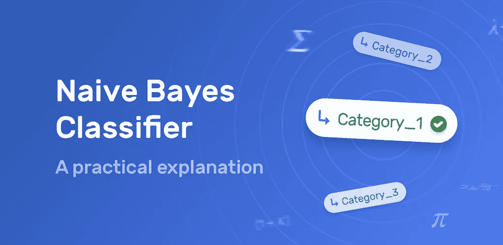

在这篇博客中，我将描述“**朴素贝叶斯算法**”背后的直觉。在进入算法之前，让我们熟悉一些概率基础知识。

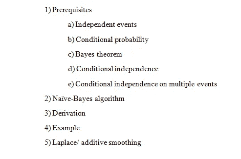

目录

如果你熟悉这些先决条件，那么从“*朴素贝叶斯算法*部分开始。

# **1)先决条件**:

我将简要介绍一下这些话题。

**a)独立事件**:如果一个事件的发生不影响另一个事件的发生，那么这些事件被认为是独立的。

例如:A=观察 dice1 上的 6，B =观察 dice2 上的 5，两者都是独立的，因为 dice1 结果不影响 dice2。

> *P(A ∩ B) = P(A) * P(B)*

类似于上面的例子，如果我们只有一个骰子呢

A=P(在 dice1 中滚动 6)和 B=P(在 dice1 中滚动 5)那么，

P(A ∩ B) = 0

由于两者从不同时发生，并且两个事件使用相同的骰子，因此这些事件被称为“**互斥事件**”。

**b)条件概率:**这是一种“假设一个事件已经发生，另一个事件发生的概率”的度量。当 B 已经发生时，A 发生的概率表示为

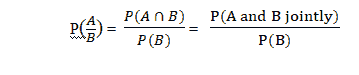

A 和 B 的条件概率

在上面的符号解释如下。从独立性的简单定义来看，如果 A，B 是任意两个独立事件，那么

P(A ∩ B) = P(A) * P(B)(即*联合概率*

但是在“*联合概率”*中我们不知道，这些事件是相依的还是独立的。所以，这两个事件的独立性是:

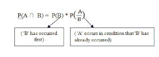

联合问题。事件 A，B

**c)贝叶斯定理:**用于根据一个事件与另一个事件的关联来计算该事件发生的概率。它假设所有事件都是有条件独立的。

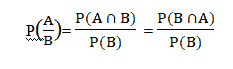

给定 B 的概率

在上式中代入“*联合概率 p(A∩B)* 后，

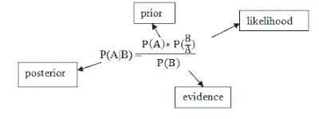

给定 B 的概率

**d)条件独立:**给定 C，称 A 和 B 是条件独立的，当且仅当

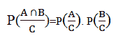

Prob。给定 C 的(A *∩* B)

其中假设 A，B 是独立的。

**Ex:** A=人 *p1* 回家晚的概率，

B=人 *p2* 晚回家的概率，

C=城市里有暴风雨。

首先，求解独立事件 A，b 的条件概率。

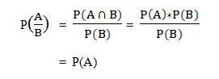

但是，假设“C”已经给出，那么 *P(都很晚回家|它是暴风雨)是*

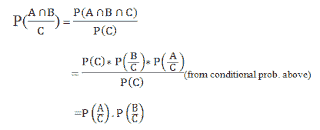

因此，给定条件“C”(即有条件独立)，A、B 是独立的。

假设如果事件 C= " *城市有暴风雨，p1 和 p2 住在同一个地方&使用相同的交通工具*

那么 P(A|C)和 P(B|C)不再是条件独立的，因为 A，B 现在是依赖的，因为它们来自同一个位置。

**e)多个事件的条件独立性:**

当我们解决“*朴素贝叶斯算法*”的推导时，这个推导将是至关重要的。

现在，让我们看看如何在给定的条件下扩展“*多个事件的条件独立性”* A，B，C，D，E，F…… &。

假设一些独立的事件 A、B、C、D、E、F，并且在事件“Z”已经发生的条件下给出，根据条件独立性定义，所有这些都变成条件独立性。

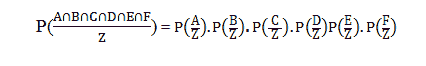

事件 A，B 的条件概率。f 给定事件 Z

终于！利用这些概念，我们得出*“朴素贝叶斯算法”的推导。*让我们将此应用于我们的训练数据集。

你现在可以跳了…..；)

# **2)朴素贝叶斯算法:**

在机器学习中"*朴素贝叶斯分类器是一族简单的概率分类器，基于应用贝叶斯定理，在特征之间具有强(朴素)独立性假设。*

*所有朴素贝叶斯分类器都假设在给定条件下(即类别标签)，一个特征的值独立于任何其他特征的值。
例如，如果一个水果是红色的，圆形的，直径约 10 厘米，则可以认为是苹果。朴素贝叶斯分类器认为这些特征中的每一个都独立地影响该水果是苹果的概率，而不考虑颜色、圆度和直径特征之间的任何可能的相关性。*

*因为它假设事件的独立性，朴素贝叶斯模型在大多数情况下充当基准模型。*

## *如果你对推导部分感兴趣，直接跳到推导部分下面的“例子”部分。*

# ***3)推导:***

*假设我们有“n”个观察值的训练数据，具有 4 个离散变量的特征 F(1–4)和 1 个具有“k”个类别的类别标签(这里是/否，k=2)。*

*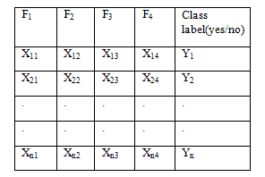*

*数据集的结构*

*如果一个新的观察值来自 ***测试数据*** ，让那个没有类标签的查询点 Yq &点 Xq *< xq1，xq2，xq3，xq4 >* 。任务是为给定的 Xq < xq1、xq2、xq3、xq4 >预测分类标签‘Yq’(*是/否*)。Xq 的每个分量都是其对应特性的值。*

> *给定所有特征，计算分类标签“Yk”的概率(*是/否*)，*

*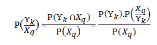*

*Prob。给定查询特征的标签*

*对于所有类别标签 Yyes，Yno，分母是常数。分子不过是联合概率，也就是*

*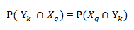*

> *现在，根据给定所有特征的类标签“Yk ”,开始求解所有特征的概率，*

*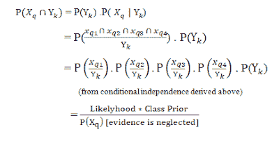*

*Yq 的类别标签是从给定“k”个类别的 Xq 的概率中获得的(*是/否*，其具有最大值。*

*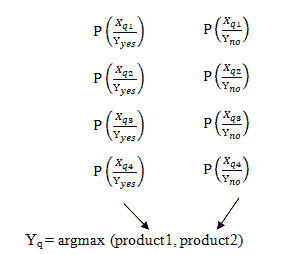*

*如果产品 1 高于产品 2，则 Yq 被分类为“是”,反之亦然。*

***注意:**如果任何一个特征是连续的，那么概率是从高斯 PDF 得到的。*

**

*先给这个留个大句号，从一个例子开始。*

# ***4)举例:***

*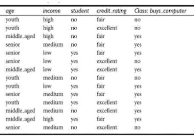*

*四大特征<f1 f2="" f3="" f4="">是。</f1>*

*如果我们从测试数据中得到一个查询点 Xq <youth high="" yes="" excellent="">预测是否买电脑？</youth>*

*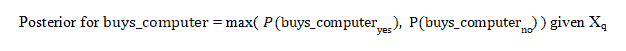*

> ***第一步:**计算 buys_computer = yes 的后验概率，给定 Xq <青年，高，学生，优秀>。*

*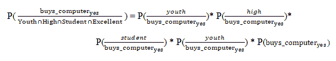*

*Prob。考虑到所有功能，buys _ computer =是*

*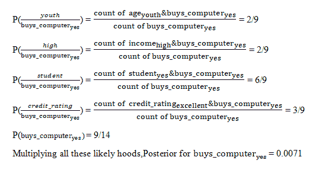*

*可能性概率*

> ***第二步:**同理求 buys_computer = no 的后验概率。*

*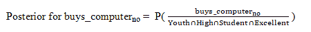*

*将所有这些可能的头罩相乘，buys_computer=no 的后验概率为 0.0102*

*因此，max(0.0071，0.0102)显示，预测 class label="no "，这样学生就不买电脑了。*

***注**:证据概率(即分母/基本事实)被忽略，因为它在整个计算过程中是恒定的。*

**

# ***5)拉普拉斯**(或)加法**平滑:***

*这是为了解决零概率的问题而引入的- *“如果查询点包含一个新的观察值，在计算概率时在训练数据中还没有看到这个观察值”*。*

*让我们用相同的数据集来处理这个问题，但是使用不同的查询点 Xq。*

*Xq*

*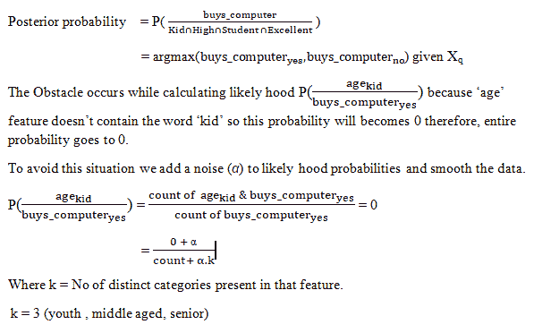**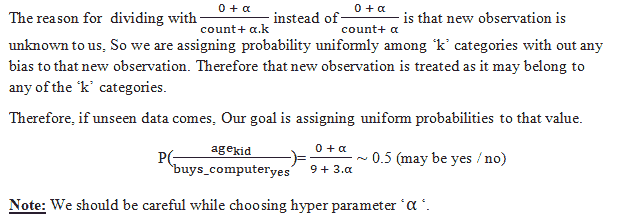*

*α是噪声超参数*

***注意事项:***

*'α'不能太高或太小，应根据“*偏差-方差*”权衡适当选择。*

*“α”不应干扰分配给未知数据/新观测值的统一概率。*

***寻找最优‘α’:***

*使用肘图，尝试绘制“性能指标”v/s“α”超参数。*

***缺点:***

*一个最大的缺点是，由于它的条件独立性假设，它忽略了特征之间的相关性。*

*********************** **结尾****************************

*sklearn 中有不同版本的朴素贝叶斯，如 BernoulliNB、MultinomialNB(用于离散变量)、GaussianNB(用于连续变量),它们的用法略有不同，这可以通过 sklearn 的文档来理解。*

***参考文献:***

*[https://en . Wikipedia . org/wiki/Independence _(probability _ theory)](https://en.wikipedia.org/wiki/Independence_(probability_theory))*

*[https://en.wikipedia.org/wiki/Conditional_probability](https://en.wikipedia.org/wiki/Conditional_probability)*

*[https://en.wikipedia.org/wiki/Bayes%27_theorem](https://en.wikipedia.org/wiki/Bayes%27_theorem)*

*https://en.wikipedia.org/wiki/Conditional_independence*

*[https://math . stack exchange . com/questions/248911/conditional-probability-pa-intersect-b-intersect-c](https://math.stackexchange.com/questions/248911/conditional-probability-pa-intersect-b-intersect-c)*

*[https://en.wikipedia.org/wiki/Additive_smoothing](https://en.wikipedia.org/wiki/Additive_smoothing)*