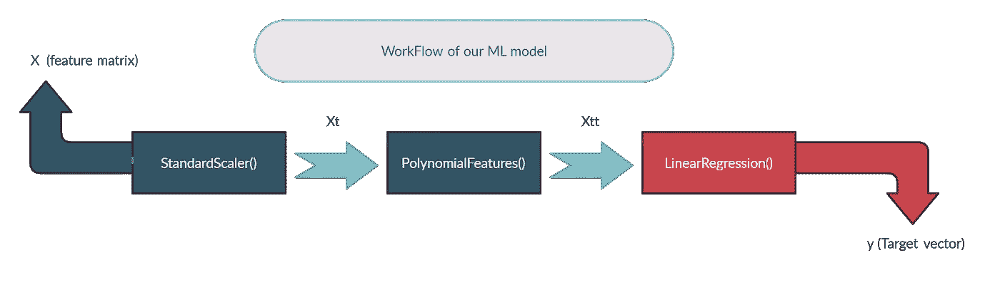
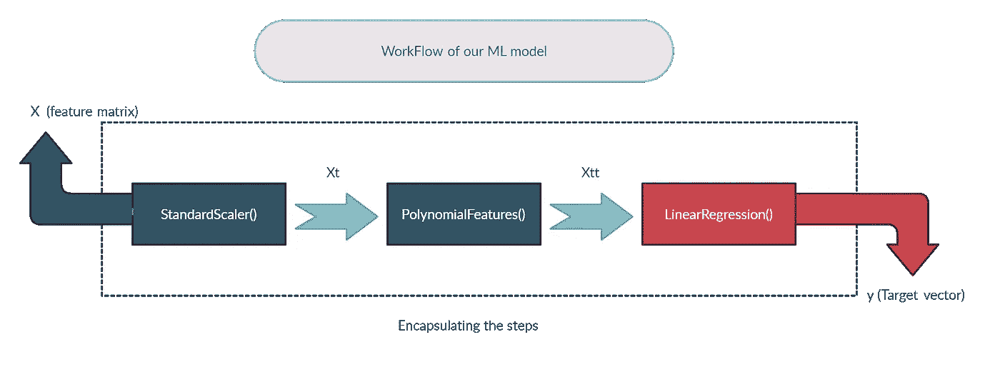

# 直觉让你更好地理解 ML 中的管道

> 原文：<https://medium.com/analytics-vidhya/intuition-for-better-understanding-of-pipelines-in-ml-625696809b72?source=collection_archive---------28----------------------->

一个简单的方法来理解 ML 中的管道意味着什么，以及它们为什么重要。

马丁·克奇纳切克在 [Unsplash](https://unsplash.com?utm_source=medium&utm_medium=referral) 上的照片

## **简介**

你好。在这篇文章中，我们将讨论 *what* 、 *why、*和*pipeline 在创建 ML 模型时如何工作，还有一些与 pipeline 相关的功能没有在这篇文章中讨论，但这篇文章的主要目的是开发一种直观的方式来更好地理解 ML pipelines，如果你想要这个主题的完整深度，那么你可以参考这里的文档[https://scikit-learn.org](https://scikit-learn.org/)。*

任何给定的 ML 项目都有几个步骤，从从各种来源提取正确的数据(也称为数据挖掘)，将数据转换并转化为数据集(也称为数据预处理)，为数据集选择正确的模型(也称为模型选择)，根据选择的模型训练和测试数据集(也称为数据建模)，检查模型的性能(也称为模型评估)，最后将模型部署到工作平台(也称为模型部署)。

所有这些步骤有时可能非常复杂，并且更难跟踪，因此在代码可再现性和代码调试时可能会出现问题。

我们将一步一步地理解什么是管道，然后我们将看到为什么这些是有用的，最后我们将试图理解这些实际上是如何工作的，我希望你能获得更多的见解，并喜欢阅读这篇文章。

## **什么是管道？**

根据定义，管道是:

> **流水线**用于帮助机器学习工作流程自动化。它们通过使一系列数据在一个模型中进行转换和关联来运行，该模型可以被测试和评估以获得结果，无论是积极的还是消极的

通俗地说，管道可以简单地被认为是一个“黑匣子”，它接收输入数据，并在考虑了我们以简单明了的方式进行的所有步骤后给出输出*(我们将在本文稍后讨论这些输入和输出以及内部工作方式)*。

为了更好地理解这一点，让我们考虑一个示例，其中我们使用 scikit-learn 库提供的 *California housing* 数据集，对于我们的要求，让我们考虑我们想要首先缩放该数据集的数据(*或*特征)，然后向其添加多项式特征，最后使用基于缩放后的多项式变换数据集的预测器类来预测值(*或*目标)。*(注意，以上所有步骤都是使用 scikit-learn 库实现的)*

图片来自 [AshutoshGhattikar](https://medium.com/u/8ddfb861440?source=post_page-----625696809b72--------------------------------)

现在让我们来逐步查看我们主题的代码，

## 为什么是管道？

正常方法的主要问题是，如果我们有一个新功能，要像旧功能一样经历所有的步骤，那么我们必须记录我们之前采取的所有步骤。另一方面，管道将所有连续的步骤“绑定”为单个块，然后在单个步骤中自动执行该块的流程。

考虑下面的代码片段，了解我们的 ML 模型的普通直接方法的步骤。

在上面的代码片段中，每个步骤有 3 个单独的类，即，将特征缩放到特定的平均值，将多项式特征添加到这些缩放的特征，然后使用线性回归预测值，我们必须使用变量 ***Xt*** 和 ***Xtt*** 手动绑定所有这些步骤，并且我们必须为每个类使用不同的内置方法，即， ***fit()*** 和 ***predict()*** 用于线性回归，而 ***fit()*** 和 ***transform()*** 用于转换类 StandardScaler()和 PolynomialFeatures()，尽管所有这些步骤看起来都很简单，但有时我们的模型可能比这更复杂，因此这些步骤可能容易出错，或者随着类的增加而变得更复杂。

为了使事情变得真正简单，我们实现了 scikit-learn 库提供的 Pipeline 类。

在上面的代码片段中，代码更加简单，易于调试或复制，并且具有与直接方法相同的功能，我们不再需要通过使用变量显式绑定代码片段，并使用各自的内置方法来拟合、转换或预测目标向量。现在我们知道了为什么我们必须使用管道，让我们知道这些管道实际上是如何在内部工作的。

## **管道是如何工作的？**

流水线的工作是按照面向对象的编程原则进行的，流水线对象封装了给定的顺序步骤，一个步骤的输出将是另一个步骤的输入，但是作为一个整体，将只有一个输入和一个输出，为了理解这一点，以一种简单的方法再次考虑上面的例子， 我们必须使用 StandardScaler()类缩放特征 ***X*** ，然后调用 fit()和 predict()方法将特征转换为缩放后的特征，缩放完成后，我们必须进行类似的转换，即使用 PolynomialFeatures()类进行多项式特征转换，其中我们使用之前转换的特征***【Xt】***作为其 ***的参数来调用 fit()和 transform()方法，*** 最后，在完成所有转换后，我们使用 LinearRegression()类和 fit()、predict()方法，并预测我们转换后的特征 ***Xtt*** 以获得值 ***。* **

pipeline 类的对象接受一个列表的参数，该列表将连续的步骤作为该列表的元素，我们的 pipeline 对象充当预测器*(注意:根据管道的最后一步， 管道要么是变换器类，要么是预测器类，然后我们可以相应地使用内置方法)*因此我们可以直接传递未处理的特征，并期望通过 LinearRegression()类预测值，因为该特征按顺序通过所有给定的步骤，即缩放、多项式特征化，最后使用线性回归进行预测。

图片由 [AshutoshGhattikar](https://medium.com/u/8ddfb861440?source=post_page-----625696809b72--------------------------------) 提供

如果你能坚持到这里，那么我真的很感谢你阅读这篇文章，如果你喜欢这篇文章，请考虑给它一个向上的投票，并欢迎公开的建议。

祝你有美好的一天，学习愉快！！😊

这篇文章的完整代码可以在这里找到:[https://github.com/AshutoshGhattikar/ML-pipelines.git](https://github.com/AshutoshGhattikar/ML-pipelines.git)