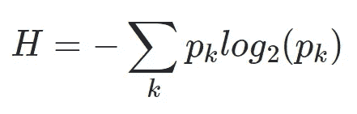

# 直觉:信息熵

> 原文：<https://medium.com/analytics-vidhya/intuition-information-entropy-cae61cb159a8?source=collection_archive---------10----------------------->

转化为计算机科学和信息理论的热力学的一个重要概念是 ***熵*** 。它是建立在它之上的其他主题的重要基础，如**信息增益**和**决策树分析**。

让我们从你可能已经了解或想知道的事情开始:

> **为什么随着温度的升高，冰会转化为水，然后水又转化为蒸汽？**
> 热是能量的一种形式。随着我们减少水的热能，我们慢慢地但逐渐地减少水分子拥有的能量状态的数量，结果水转化为更稳定的固体形式，冰。类似地，当我们增加热能时，能量结构的数量增加，一些获得比以前更高的能量状态，导致转化为蒸汽。

卢克·贝斯利在 [Unsplash](https://unsplash.com?utm_source=medium&utm_medium=referral) 上拍摄的照片

随着更多的能量被广泛分散，冰变成水并最终蒸发。系统内能量分散的量度称为熵。再举一个例子，想想用微波炉做爆米花会发生什么。热能积聚并通过谷粒扩散，导致其中一些迅速移动。

**热力学的熵如何转化为计算机科学和信息论？**

想想看，当水分子是冰，然后是水，最后蒸发时，测量它们拥有多少热能。在过渡阶段之间，能量一定是逐渐增加的。例如，一定有一段时间，一些冰转化为水，但不是全部，一些水转化为蒸汽，但不是全部。如果我们数一下低能和高能分子的数量，很明显，低能态的分子不断减少，高能态的分子不断增加。

这个概念用计数来解释，本质上就是信息论中的熵。换句话说，**熵是分子存在的方式的*数量。***

现在，让我们再举一个例子来从数学上理解熵。想象我们有三桶球。在第一个桶里，我们有 4 个红球。在第二个桶中，我们有 3 个红色球和 1 个白色球，在第三个桶中，我们分别有 2 个红色球和 2 个白色球。

信息熵被定义为以下等式:

熵是每个类别 k 的概率乘以它们的对数的总和

让我们计算上面每个桶的熵。对于全部由红球组成的**第一桶**来说，一个人每次抽到一个球并让它变红的概率是 100%的 1/1。由于桶中只有红球，熵可以计算如下:

> H =-p * log(p)。将 p 代入 1，我们得到:H = -1 * log(1) = 1* 0 = **0** ！

所以，装满所有红球的桶的信息熵是 0。

现在，在**第二个** **桶**有 3 个红球和一个白球的情况下。抽中红球的概率是 3/4 = 0.75 或 75%，抽中白球的概率是 1/4 或 0.25。由于球有两种*类别*或颜色，等式可以应用为:

> h =-(0.75 * log(0.75)+0.25 * log(0.25))。代入对数值，我们得到:
> H = **0.244**

同样，对于第三个桶，每种类型有两个球:

> h =-(0.5 * log(0.5)+0.5 * log(0.5))=**0.3**

因此，类似于第一个例子，第一个桶具有最低的信息熵，第二个较高，第三个具有最高的信息熵。**当你失去关于你的绘画内容的确定性知识时，我们说信息熵增加了。**

在我的下一篇文章中，我将探讨基于信息熵的信息增益这一主题。