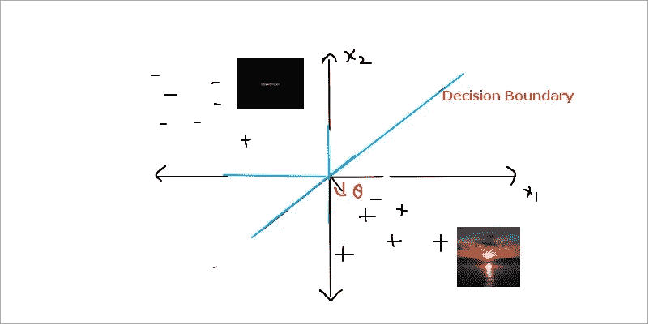
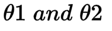
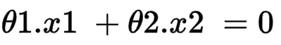
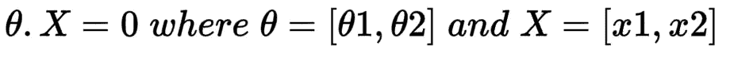
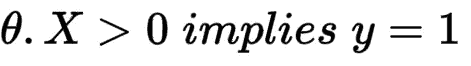
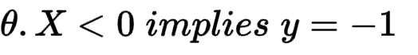

# ML 算法的直觉:线性分类器和θ向量表示

> 原文：<https://medium.com/analytics-vidhya/intuitions-of-ml-algorithms-linear-classifiers-and-theta-vector-representation-ded7ee6c8bcb?source=collection_archive---------12----------------------->

机器学习算法的理论、表示和演绎背后的直觉可以作为实际应用中模型架构选择和设计的强大工具。

让我们从分析二维数据集 X 开始，目的是对其进行分类。

例如，让 X 代表一组日期。设集合 X 中的每一天 X 由两个特征表示。

> 早上 7 点的 x₁:温度
> 
> 凌晨 4 点的 x₂:温度

让 y 代表分类输出，不管太阳在特定的一天是否出来(1 或-1)

现在，让我们假设一个线性分类器有可能实现上述目标。

*(假设是为了说明，日出事件是复杂的，仅仅两个特征可能不足以达到线性分类。)*

N 

您可以看到，如果温度在凌晨 4 点(x2)为负，但如果在上午 8 点(x1)为正，则当天很有可能是晴天。

到目前为止，一切顺利。从上面的图像中，我们确实观察到有一条蓝色的线性分类器决策边界线，它似乎在分类积极的日子(晴天+1)和消极的日子(阴天-1)方面做得不错。

它被称为决策边界线，因为它一边的分类是积极的，另一边是消极的。

我们如何表示这条线？

它穿过原点，因此它应该是这样的形式

> **A.x1 + B.x2 = 0:等式 1**

上面的方程有两个未知数 A，b，我们称它们为

**引入θ矢量分量**

表示决策边界的等式 1

上面的等式直观地给出了等式 2，其本质上是输入向量[x1，x2]和θ向量的点积。

表示决策边界的等式 2

点积为零，因此θ垂直于分类器的决策边界。因此，分类器可以用θ向量来描述。

在这种情况下，分类器输出可以描述为

晴天分类

阴天分类

到目前为止，我们已经看到了线性分类器和用θ向量表示决策边界的直觉。

在下一篇文章中，我们将研究线性分类器的决策余量理论和铰链损失概念背后的直觉。