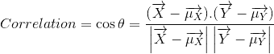
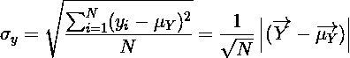
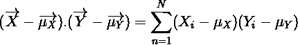
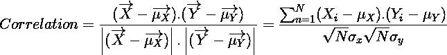

# 使用线性代数直观解释相关性和协方差

> 原文：<https://medium.com/analytics-vidhya/intuitive-explanation-of-correlation-and-covariance-using-linear-algebra-b42e8b5170ab?source=collection_archive---------9----------------------->

数学是如此有趣，如果只是死记硬背而没有直观的理解，那将是不礼貌的。

在互联网上，人们可以找到几十种对他/她正在寻找的概念的解释。但大部分都只是数学公式，所谓的解释就像遵循每一步，证明运算是对的。但这不是理解。那不是学习。学习应该是直觉的，理解是自然的。

今天我们要看两个统计学概念，分别是 **(1)协方差**和 **(2)相关性**。

我们正在研究两个不同参数之间的关系，我们称之为 **X** 和 **Y.** 这种情况下的关系不是因果关系，就像一个参数的变化伴随着另一个参数的变化(两个都增加/减少，一个增加/另一个减少等等)。(此外，需要注意的是，我们将在此研究的相关性是**皮尔逊相关性**，它仅捕获参数之间的**线性关系**，因此两个非线性相关参数之间的皮尔逊相关性可能为 0。)

你可以把 X 想成是苹果的数量，Y 想成是超市卖的柠檬的数量。x 和 Y 将由对应于不同销售日的几个测量值组成。因此，如果数据来自 10 天，X 和 Y 将分别由 10 个值组成，每个值对应于不同日期的销售额。我们想知道苹果和柠檬的销售是否有关系。

我们将使用线性代数来建立直观的理解，所以让我们把 X 和 Y 看作一个向量。X 和 Y 的第一个值对应于我们空间中的轴-1，第二个值对应于轴-2，依此类推…

这部分很关键。“X 增加/减少”是什么意思？X 的所有值都是常数吗？怎么能说 X 增加了呢？x 只是测量值的名称。x 没有恒定的值。在任何特定的一天，售出的苹果数量相对于其他数量可以更大/更小或相同，但没有增加，我们只是在 x 中查看不同的测量值。因此，当我们说一个参数增加或减少时，它是相对于该参数中的其他测量值。

从这个事实我们可以推测，每一个参数都有它自己的空间，在那里“增加”、“减少”和“不变”是有意义的。为了使 X 和 Y 共享相同的空间，我们必须从它们中减去它们的平均值(元素方面),这样它们的增加/减少/不变行为将同时对 X 和 Y 具有一般意义。(当 X 和 Y 大于它们的平均值时，它们的行为相似，当 X 大于平均值但 Y 小于平均值时，它们的行为成反比)。

嗯，我们正在研究两个向量之间的关系……难道[点积](/@enginalpman/intuitive-explanation-of-dot-product-pythagorean-theorem-and-the-law-of-cosine-a168cc470472)不是提升向量的相似分量吗？这对我们的情况会有帮助。

但是在继续之前，让我们考虑一下我们将要用来定义 X 和 y 之间关系的度量，极端的情况是什么？

1.  两个变量之间没有相关性，X 值的变化并不伴随着 Y 值的有意义的变化(相关性=0)
2.  X 和 Y 之间有很强的正相关性，每次 X 的值发生变化，总是伴随着 Y 在**相同方向**的相同对应变化(相关性= +1)
3.  X 和 Y 之间有很强的负相关性，每次 X 的值发生变化，总是伴随着 Y 在与相反的**方向上同样的相应变化(相关性= -1)**

所以我们在寻找一个值在[-1，1]范围内的度量。这个值和它与参数之间的关系让我想起了一个**余弦**函数。如果两个向量方向相同，它们之间的角度将是 **0⁰** ，这将为我们提供 **cos(0) = + 1，**如果它们指向相反的方向，它们之间的角度将是 **180** ⁰和 **cos(180⁰) = -1** ，如果它们没有共同点并且彼此垂直，它们之间的角度将是 **90⁰** 和 **cos(90⁰) = 0。**

因此，使用 X 和 Y 之间角度的余弦作为相关性的度量似乎是合理的😎

从点积我们知道:

X 和 y 的点积。

正如我之前提到的，我们必须从参数中减去它们的平均值，这样它们才会在同一个空间中。我们可以把参数的平均值看作一个向量，它的值在它们的轴上是相同的，并且等于相应参数的平均值。所以最终的[点积](/@enginalpman/intuitive-explanation-of-dot-product-pythagorean-theorem-and-the-law-of-cosine-a168cc470472)将是:

我们决定使用余弦作为度量，因此:

就是这样！相关性就是我们正在研究的参数之间的夹角的余弦值。但是它看起来与通常用于关联的不同。所以在结束这篇文章之前，我想向你们展示我们发现的和常用的相关公式是一样的。我还将展示如何使用线性代数来计算协方差。

