# 随机不相关/相关变量的和/差的直观解释

> 原文：<https://medium.com/analytics-vidhya/intuitive-explanation-of-sum-difference-of-random-correlated-variables-22f9768a2ba?source=collection_archive---------14----------------------->

哇那个标题太乱了！这是因为我们要看 4 个概念，分别写它们可能会导致更多的混乱。无论如何，希望你在标题之后来到这里，并准备做一些数学😎

## 随机不相关/相关变量之和的平均值:

在讨论随机变量的方差之前，让我们先讨论一下它们的均值。

比方说，平均一天预计会看到 4 个穿绿色 t 恤的人(姑且称之为 X)。所以一天中平均可以看到 4 个穿绿色 t 恤的人。我们也知道平均一天有望看到 3 只狗(姑且称之为 Y)。

那么一天看到绿 t 恤和狗的人的期望值是多少呢？可以预期看到 4 件绿色 t 恤和 3 只狗，所以它们总和的期望值是 4 +3 = 7。

变量是否不相关或相关并不重要，它们的和的平均值只是它们各自平均值的和。

## 随机/相关变量差异的平均值:

就像前一部分一样，但是我们将减去数值而不是增加数值，因为这就像是在问我期望看到的 X 的实例比 y 的多多少。

在我们的例子中，它是 4–3 = 1。人们可以期待看到更多穿绿色 t 恤的人而不是狗。

## 随机不相关变量之和的方差:

在我发表的另一个故事中，我提到了从参数中减去它们的平均值，使它们共享相同的空间。理解这一点对于理解接下来的概念至关重要，因此阅读这个故事可能会有所帮助。

我们将对 X 和 y 做同样的事情，所以它们现在在同一个空间，我们可以将它们相加来研究它们和的性质。

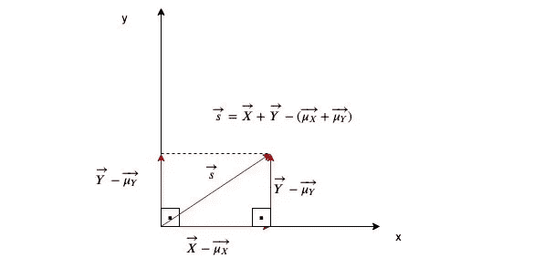

这也满足了共享同一空间的概念。向量 s 是随机变量 X 和 Y 的和(从中减去它的均值，与其他参数共享同一个空间)。

在继续之前，我想让你们看看，方差是参数向量的大小除以该参数的测量次数。

方差的正式定义😒：

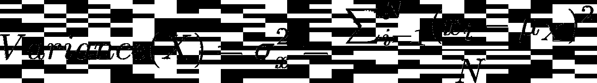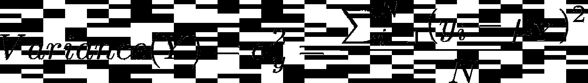

线性代数方差👍

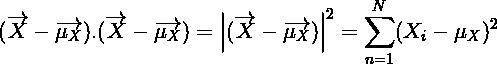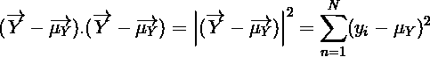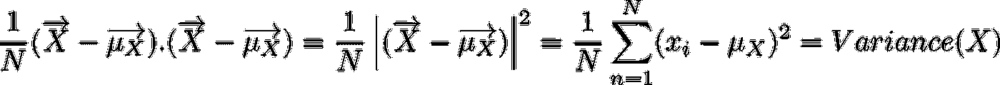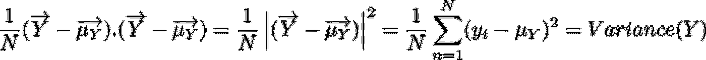

所以如果我们想找到 X+Y 的方差，我们需要做的就是计算这个空间中向量 X+Y-(mean(x)+mean(y))的大小。

它们相互垂直，所以我们可以用勾股定理来计算 s 的大小。

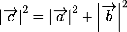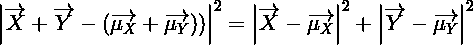

如果我们用 N 除两边，我们会得到:

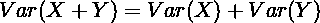

那就是随机变量之和的**方差！**

## 随机不相关变量之差的方差:

所有共享相同空间的东西也适用于这种情况。

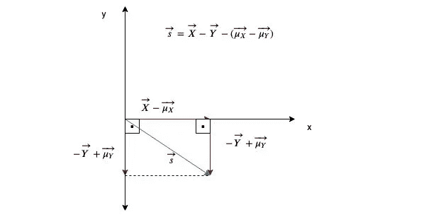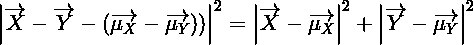

将每边除以 N:

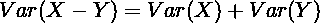

## 相关变量之和的方差:

如果变量是相关的，它们之间的角度不是 90⁰.

但是我们的目标是一致的。我们想计算这两个向量之和的大小，除以 N 得到方差。为此，我们将使用余弦定律。

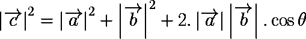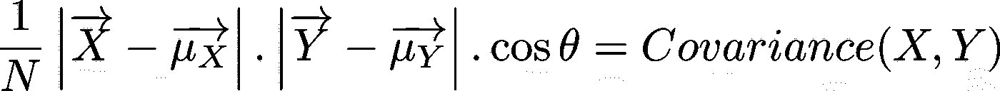

我们将在最终公式中使用协方差。[链接到解说](/@enginalpman/intuitive-explanation-of-correlation-and-covariance-using-linear-algebra-b42e8b5170ab)

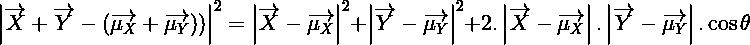

如果我们用 N 分两边

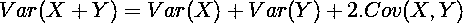

那就是**相关变量之和的方差！**

## 相关变量差异的方差:

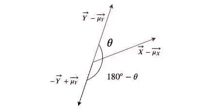

那就是**相关变量之差的方差！**

(由于θ的选择，公式中协方差的符号在其他公式中可能不同)

我们的θ:

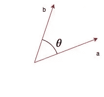

θ的不同选择:

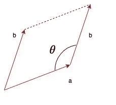

哇，这是一个强烈而直观的推导。我们已经利用线性代数推导出了随机变量和相关变量的和/差的方差。

不要死记硬背，保持直觉👍😎