# 高斯过程的直观介绍

> 原文：<https://medium.com/analytics-vidhya/intuitive-intro-to-gaussian-processes-328740cdc37f?source=collection_archive---------2----------------------->

去年，在我计算机科学学士学位的最后一年，我修了两个机器学习的硕士模块。在一次讲座中，教授用七张幻灯片的方程介绍了高斯过程。不用说，没有人知道发生了什么事。

这篇文章的核心是我关于高斯过程的笔记，它的解释帮助我对它们如何工作有了更直观的理解。大部分内容来源于[南多·德·弗雷塔斯的精彩讲座](https://youtu.be/4vGiHC35j9s)和这篇[博客文章](http://bridg.land/posts/gaussian-processes-1)。希望对别人有用。

我也在 [OpenGenus IQ](https://iq.opengenus.org/intuitive-introduction-to-gaussian-process/) 发表了这篇文章。

# 什么是高斯过程？

高斯过程是一种非参数模型，可用于表示函数的分布。

我们来分解一下这个定义。

## 模型是参数化的还是非参数化的意味着什么？

## **参数模型**

参数模型假设数据分布(输入点、图像等的集合。)可以完全根据有限的一组参数θ来定义。例如，在简单的线性回归中，参数是方程 y = mx + c 中的 m 和 c。

使得如果模型被给定参数，则未来预测独立于数据。下图举例说明了这一点，其中 x 是未来预测，参数是θ，D 是观测数据。

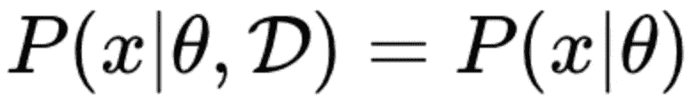

这意味着有限的参数集θ包含了你需要知道的关于数据的一切。

> **即使数据量是无界的，模型的复杂度也是有界的。因此，参数模型不是很灵活。**

这些模型的一些例子是多项式回归、逻辑回归和混合模型。

我喜欢通过把参数模型想象成一个自满自大的人来记住这一点。不管你给他们什么新信息，他们总是会得出相同的结论，因为他们的思维模式是固定的。

## **非参数模型**

这些模型假设**数据分布** **不能用一组有限的参数**来定义。

这些类型的模型通常是通过假设一个无限维的θ来定义的，我们可以把它看作一个函数(我将在下面进一步解释)。

通过这样做，θ能够从数据 D 中捕获的信息量可以随着数据量的增长而增长。使得这些类型的模型比参数模型更加灵活。

高斯过程(GP)就是这些模型之一。
它们很酷，因为它们允许我们:
-对任何黑箱函数建模
-对不确定性建模(在信心很重要的情况下很有价值，比如医疗保健)

现在我们知道了 GPs 的非参数化意味着什么，接下来我们来看看如何使用高斯函数建模。

# 使用高斯函数建模

> 关键思想:任何函数都可以用无限维多元高斯分布来建模

这是一个如此混乱的说法，简直是在乞求被拆封。

## 高斯的基础

好的第一步是了解什么是高斯(正态)分布及其含义。

你们中的许多人对下面显示的正态分布的钟形曲线非常熟悉。

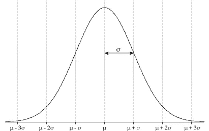

高斯分布(来源:[https://amsi . org . au/ESA _ Senior _ Years/Senior topic 4/4f/4f _ 2 content _ 3 . html](https://amsi.org.au/ESA_Senior_Years/SeniorTopic4/4f/4f_2content_3.html))

和它的方程一样，下面显示的是多元高斯分布方程。其中，μ是均值，σ是协方差矩阵。

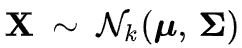

一个 *k* 维随机向量的多元正态分布(来源:维基百科)

**高斯分布通常用于描述任何一组聚集在平均值周围的相关随机变量。**

在我下面的草图中，蓝色代表 2D 高斯。蓝点代表平均值(sigma ),它描述了高斯分布的中心位置。适马是协方差矩阵，它描述了每个随机变量相对于其他随机变量的变化情况。

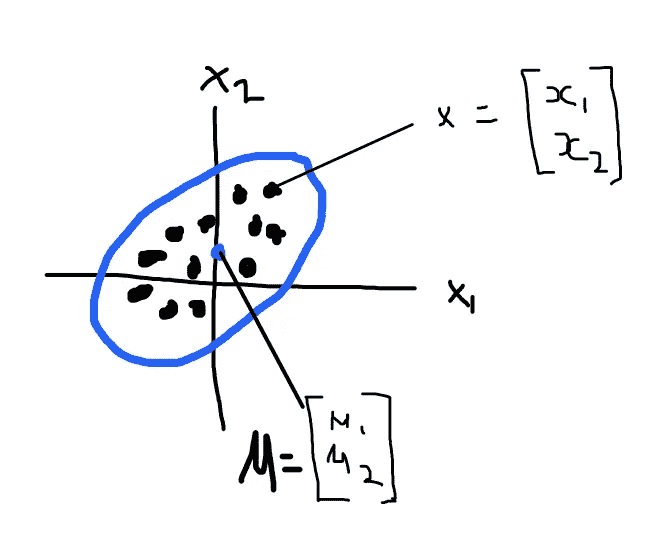

现在我们对高斯函数的组成有了一些了解，让我们看看如何使用高斯函数来得到一些点，最终得到一个函数。

## 我们如何从高斯函数中得到点或函数？

一旦我们通过定义均值和协方差矩阵建立了高斯模型，我们就可以用它来产生数据(也称为抽取样本)。

一种常见的采样技术是反向 CDF(累积分布函数)采样。如果我们知道分布的 CDF，我们可以产生一个随机样本。简单来说，就是产生一个介于 0 和 1 之间的随机(均匀分布)数，并将其与逆 CDF 一起使用，从高斯分布中获得一个值。再一次，我在下面的草图中展示了这一点。

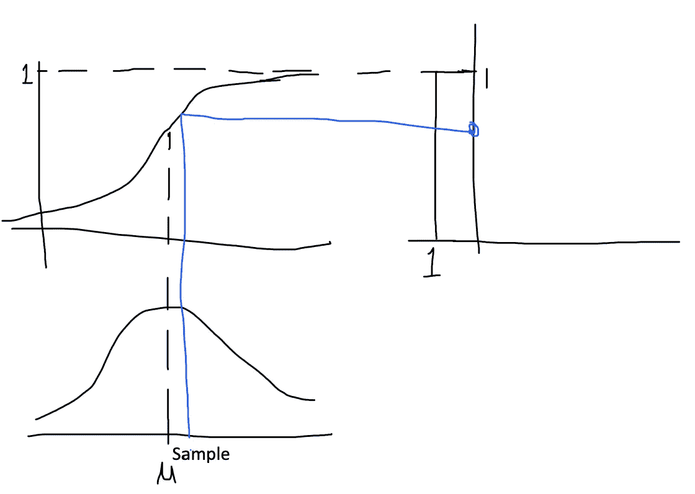

反向 CDF 采样图

所以现在你可能会说“这和函数有什么关系！！!"。

如果我们有一个 2D 高斯函数，我们用刚刚学过的技巧对它进行采样，我们得到 2 个点。我们可以画出这两点，然后把它们按顺序连接起来，形成一条线。你想做多少次都可以。在下面这张来自([http://bridg.land/posts/gaussian-processes-1](http://bridg.land/posts/gaussian-processes-1))的图片中，他们对高斯进行了 10 次采样，得到了 10 条线。

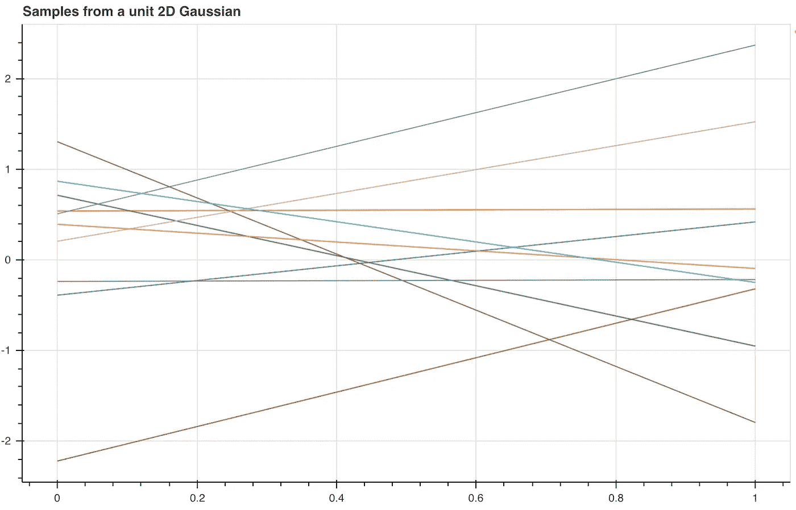

来自高斯的采样点(来源:[http://bridg.land/posts/gaussian-processes-1](http://bridg.land/posts/gaussian-processes-1)

> 这里的关键事实是，对于 N-D 高斯函数，如果你采样一次，就会得到 N 个点。

因此，如果对一个 3D 高斯样本进行采样，您将获得 3 个点，对一个 30D 高斯样本进行采样，您将获得 30 个点，如果对一个无限维高斯样本进行采样，您将获得无限多个点。

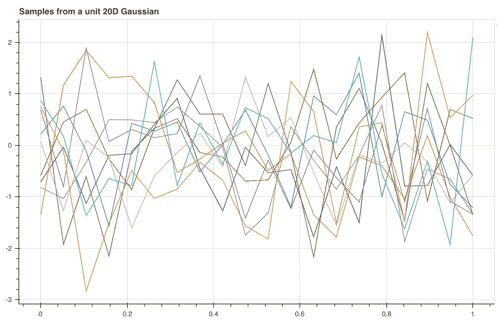

来自 20D 高斯的 10 个样本(来源:【http://bridg.land/posts/gaussian-processes-1】T2)

> 随着维度的数量越来越接近无穷大，这意味着我们不需要把这些点连接起来，因为我们将有一个点来代表每一个可能的输入。

要从 GP 中抽取样本，你需要提供均值和协方差，然后神奇的事情就发生了。不要担心这和以前略有不同。这是因为在下面的例子中，我们从多元高斯分布(MVG)中抽取样本。想法仍然是一样的，我们可以生成点，并将其附加到一个采样向量。你使用分解，因为它允许我们得到类似于矩阵平方根的东西，这样我们可以把我们的 MVG 表示为单位 MVG 的变换。

```
def draw_samples(self, mean, covariance, num_samples=1):
 # Every time we sample a D dimensional gaussian we get D points 
 all_samples = []# SVD gives better numerical stability than Cholesky Decomp 
 num_dimensions = len(mean) for _ in range(0, num_samples):
   z = np.random.standard_normal(num_dimensions) [U, S, V] = np.linalg.svd(covariance)
   A = U * np.sqrt(S) all_samples.append(mean + np.dot(A, z))return all_samples
```

**对我来说，每一个可能的输入都得一分听起来很像一个函数。**

但是这些图真的很吵。这是因为在这些图表中，他们没有对这些点的相似程度施加任何限制。

为了平滑函数(上面的线),我们需要一个被称为平方指数核的相似性度量(下图)。根据这个函数，如果两个输入点相等，那么它的值是 1，否则它们之间的距离越远，它就越趋向于 0。

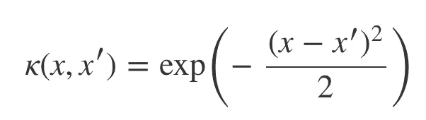

平方指数核函数(来源:维基百科)

```
def kernel(self, a, b):
 # Squared Exponential Kernel Function for GP
 square_distance = np.sum((a — b) ** 2)
 return np.exp(-0.5 * square_distance)
```

使用核函数填充高斯协方差矩阵意味着当您执行采样时，如果采样点在空间上接近，则它们之间应该不会有太大变化。产生看起来更好的线条(见下图),但是这并没有告诉我们如何实际建模一个函数。

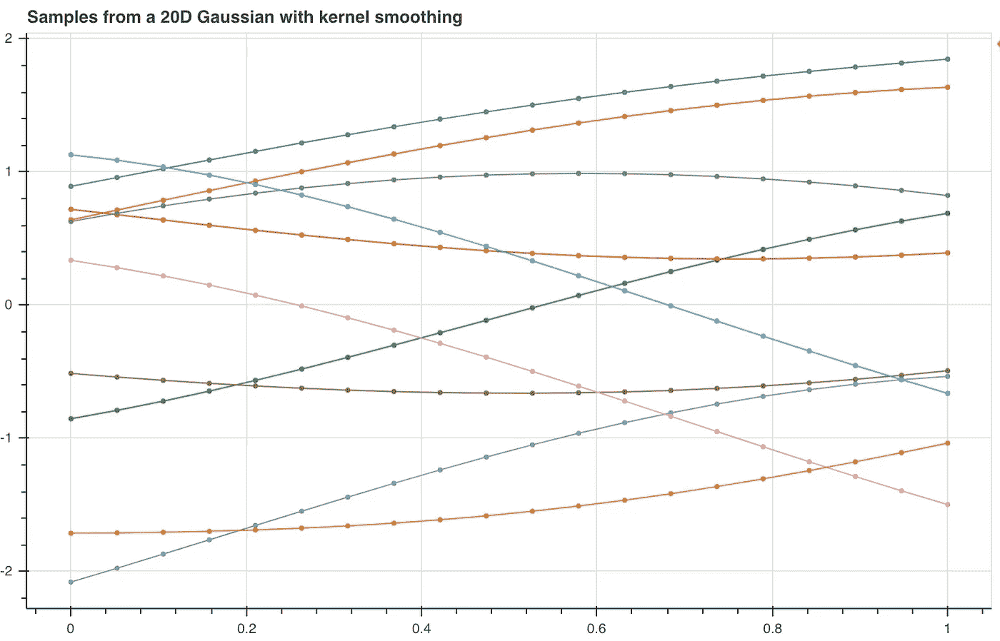

10 个样本来自具有内核的 20D 高斯(来源:[http://bridg.land/posts/gaussian-processes-1](http://bridg.land/posts/gaussian-processes-1)

在本节中，我们已经看到，可以对高斯过程进行采样以获得函数，从而使高斯过程成为函数的分布。

# 模拟一个函数

让我们假设有一个函数，我们正试图从这个秘密函数给定一大堆数据来建模。

## 我们如何培养一名全科医生？

我们有数据点，x，我们用它来构造协方差矩阵，它描述了给定数据点之间的关系。但重要的是要记住，分布是在标签上，y 的。

```
def train(self):
 # GP training means constructing K
 mean = np.zeros(len(self.train_x))
 covariance = self.build_covariance(self.train_x, self.train_x) return mean, covariance
```

当我们想要预测一些新的数据集 x*的标签 y*的时候呢？

这是开始变得棘手的时候，因为我们需要从联合分布到条件分布。

为什么？因为 MV 高斯分布被定义为联合分布。

为了更接近，我们可以做一个小把戏，将新的 y*和 x*添加到定义中，但只模拟 p(y，y*| x，x*)。

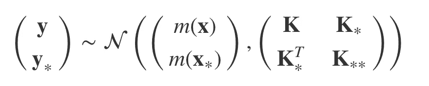

高斯过程(来源:[http://bridg.land/posts/gaussian-processes-1](http://bridg.land/posts/gaussian-processes-1)

但是我们想要 p(y* | x，y，x*)。我们如何得到它？

我们需要以 y*上的多元高斯为条件，因为我们只想要 y*上的分布。对我们来说幸运的是，有人已经完成了所有的工作，弄清楚如何做[这个](https://en.wikipedia.org/wiki/Multivariate_normal_distribution#Conditional_distributions)。它告诉我们如何更新均值和协方差，以便在给定 x*和训练数据(x 和 y)的情况下预测 y*。

```
def _predict(self, covariance_k):
 k = covariance_k
 k_star = self.build_covariance(self.train_x, self.test_x)
 k_star_star = self.build_covariance(self.test_x, self.test_x) k_star_inv = k_star.T.dot(np.linalg.pinv(k))
 mu_s = k_star_inv.dot(self.train_y)
 sigma_s = k_star_star — np.matmul(k_star_inv, k_star)

 return (mu_s, sigma_s) 
```

新的平均值告诉我们 y*值是多少，新的方差让我们得到一个可信的测量值。我们可以用这个新的均值和协方差来对函数进行采样。除了点的函数之外，我们还得到置信上限和置信下限的函数。

下面是 Scikit-learn 的一个示例结果。当你接近数据点(观察值)时，不确定性会变小。观察将任何预测的函数绑定到该区域。

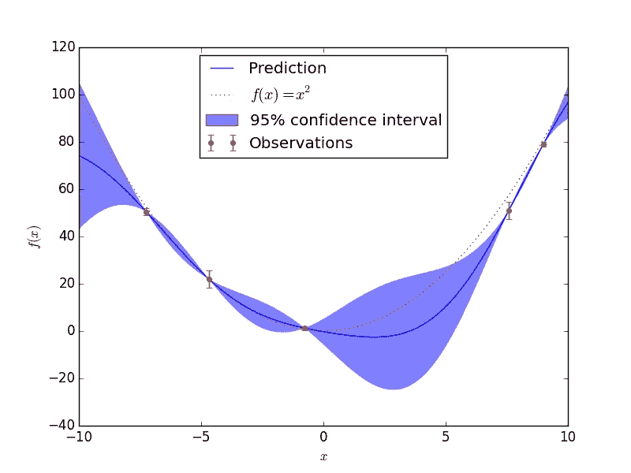

# 高斯过程的复杂性

对于大小为 N 的数据集，复杂度如下:
时间复杂度:θ(N)
空间复杂度:θ(N)

高斯过程是非常强大的，但是由于其巨大的时间复杂度，不幸的是在许多现实世界的应用中使用它们是不可行的。

这篇文章中的所有代码都可以在我的 GitHub 知识库中找到[这里](https://github.com/reido2012/ML-Methods)。

# 资源

我强烈推荐下面这些不可思议的资源。
[高斯过程简介](http://bridg.land/posts/gaussian-processes-1)
[南多·德·弗莱塔斯的高斯过程简介](https://youtu.be/4vGiHC35j9s)