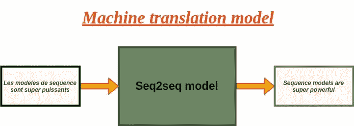
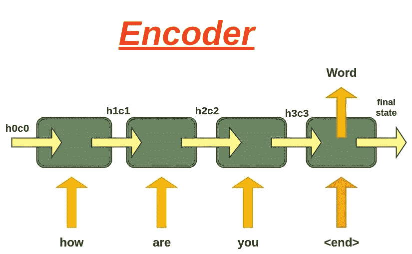
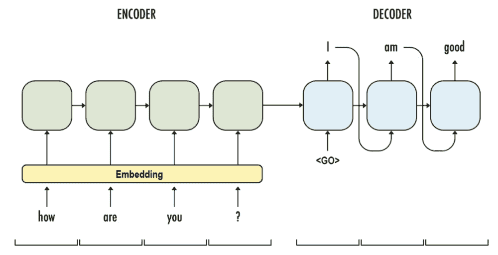
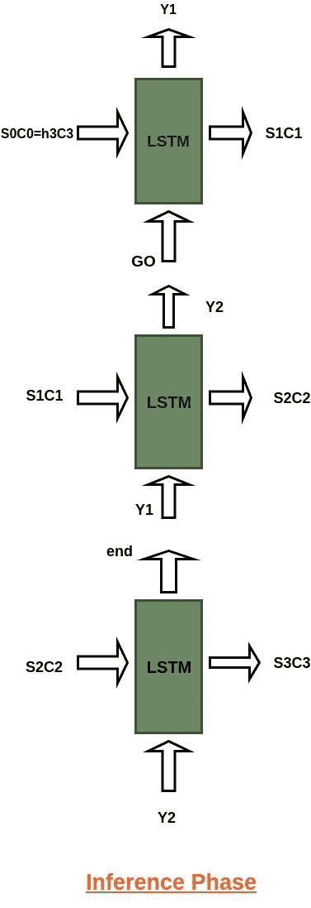
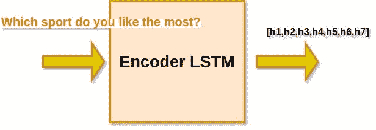
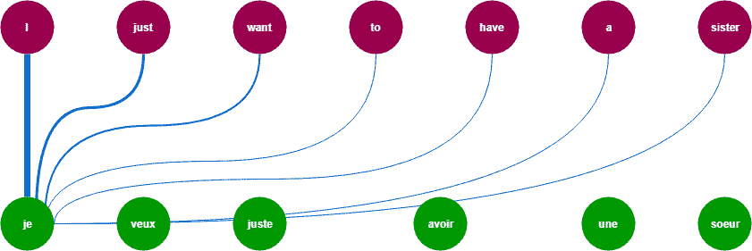
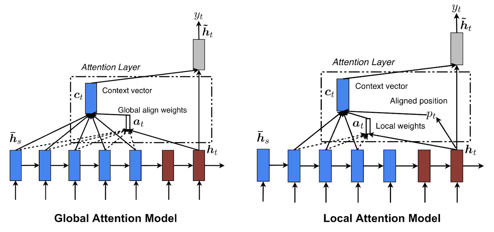

# 对 Seq2seq 模型的直观理解&深度学习中的注意机制

> 原文：<https://medium.com/analytics-vidhya/intuitive-understanding-of-seq2seq-model-attention-mechanism-in-deep-learning-1c1c24aace1e?source=collection_archive---------1----------------------->

在本文中，我将向您解释序列到序列模型，它最近在诸如机器翻译、图像字幕、视频字幕、语音识别等应用中显示出巨大需求。

## 目录:

1.  Seq2seq 模型是什么？
2.  为什么我们需要 seq2seq 模型？
3.  它是如何工作的？
4.  Seq2seq 模型的局限性？
5.  注意机制是什么？
6.  我们为什么需要它&它如何解决问题？
7.  它是如何工作的？
8.  代码实现
9.  结论
10.  参考

# Seq2seq 型号:

谷歌在 2014 年首次推出了 Sequence to sequence。让我们来看看 seq2 seq 模型是什么？序列到序列模型尝试将固定长度的输入文本映射到固定长度的输出文本，其中模型的输入和输出的长度可能不同。正如我们所知，循环神经网络的变体，如长短期记忆或门控循环神经网络(GRU)是我们最常用的方法，因为它们克服了消失梯度的问题。

让我们举个例子来弄清楚它是什么:



这里我们可以观察到一种语言被翻译成另一种语言。有许多例子如下:

1.  语音识别
2.  机器语言翻译
3.  命名实体/主题提取
4.  关系分类
5.  路径查询应答
6.  语音生成
7.  聊天机器人
8.  文本摘要
9.  产品销售预测

我们将 seq2seq 模型或编码器-解码器模型分为两个阶段:

1.  训练阶段，即编码器和解码器下的过程。
2.  推理阶段，即测试期间的过程。

让我们进入第一阶段——培训阶段

# 培训阶段:

因此，在训练阶段，我们设置我们的编码器和解码器模型。设置后，我们训练我们的模型，并通过逐字或逐字符读取输入来预测每个时间戳。

在进行训练和测试之前，需要清理数据，我们需要添加标记来指定句子的开始和结束。因此该模型将理解何时结束。让我们来看看编码器架构！

# 编码器:

让我们通过图表来理解，这样我们就能清楚地看到编码器部分的流程。



因此，从编码器作为 LSTM 网络的图中，我们可以直观地看到，在每个时间戳，单词被读取或处理，并且它从传递给编码器模型的输入序列中捕获每个时间戳的上下文信息。

在 fig 中，我们传递了一个类似“How are you <end>”的例子，这个例子是一个字一个字处理的。在编码器中需要注意的一点是，我们返回最终隐藏状态(h3)和单元状态(c3)作为解码器模型的初始化状态。</end>

# 解码器:

As decoder 也是一个 LSTM 网络，它逐字读取整个目标序列或句子，并预测偏移一个时间步长的相同序列。

解码器模型被训练来预测给定前一个字的序列中的下一个字。为了更好地理解解码器模型流程，让我们浏览一下 fig:



图片来源— [链接](https://mc.ai/implement-of-seq2seq-model/)

**< Go >** 和< **end >** 是在将目标序列送入解码器之前添加到目标序列中的特殊标记。解码测试序列时目标序列未知。因此，我们开始预测目标序列，只需将第一个字传入解码器，解码器通常是< **Go >** 标记，或者您可以指定任何想要的标记。和< **end >** token 信号指定要建模的句子的结尾。

# 推理阶段:

在训练我们的编码器-解码器或 Seq2seq 模型之后，在目标序列未知的新的看不见的输入序列上测试该模型。因此，为了获得对给定句子的预测，我们需要建立推理架构来解码测试序列:

## 那么它是如何工作的呢？

以下是解码测试序列的步骤:

1.  首先，对整个输入序列进行编码，并用编码器的内部状态初始化解码器。
2.  Pass < **Go >** token 或您指定作为解码器输入的 token。
3.  用内部状态运行解码器一个时间步长
4.  输出将是下一个单词的概率。将选择具有最大概率的单词
5.  将最大概率字作为输入传递给下一个时间步长中的解码器，并用当前时间步长更新内部状态
6.  重复步骤 3-5，直到生成< **end >** 令牌或达到目标序列的最大长度。

让我们来看一张图，图中我们给出了输入，并展示了推理过程是如何完成的，以及一个句子的编码-解码是如何完成的:



# 那么 seq2seq 模型为什么会失败呢？

因此，我们了解了编码器-解码器模型的架构和流程，因为它非常有用，但也有一些限制。正如我们所看到的，编码器接收输入并将其转换为固定大小的向量，然后解码器进行预测并给出输出序列。它对短序列工作良好，但当我们有一个长序列时就失败了，因为编码器很难将整个序列存储到一个固定大小的向量中，并从序列中压缩所有的上下文信息。正如我们观察到的，随着序列大小的增加，模型性能开始下降。

## 那么如何克服这个问题呢？

# 注意:

为了解决这个问题，我们引入了注意机制的概念。因此，在这种情况下，我们将重点放在序列的特定部分，而不是预测单词的整个序列。基本上，在注意中，我们不丢弃来自编码器状态的中间体，但是我们利用它来从所有状态生成上下文向量，以便解码器给出输出结果。

让我们通过一个例子来理解注意力机制是如何工作的:

> **来源序列:**“你最喜欢哪项运动？
> 
> **目标序列:**“我爱板球”



所以注意力的想法是利用输入序列的所有上下文信息，这样我们就可以解码我们的目标序列。让我们看看我们提到的例子。目标序列中的第一个字**‘我’**和源序列中的第四个字**‘你’**相连，对吗？类似地，目标序列中的第二个字**‘love’**与源序列中的第五个字**‘like’**相关联。正如我们可以观察到的，我们更加关注源序列中的上下文信息，比如体育，比如你。

因此，它不是遍历整个序列，而是关注序列中的特定单词，并基于这些单词给出结果。



来源:[链接](https://machinetalk.org/2019/03/29/neural-machine-translation-with-attention-mechanism/)

## 它是如何工作的:

我们已经从理论上了解了注意力是如何工作的，现在是从技术上了解的时候了，因为我们将坚持我们的例子“你最喜欢哪项运动？”。

逐步步骤:

## 1.计算每个编码器状态的分数:

因此，我们将使用所有编码器状态来训练我们的前馈网络(编码器-解码器),因为我们记得我们正在用编码器最终状态来初始化解码器初始状态。因此，通过训练我们的网络，我们将为使用注意力的状态生成高分，而我们忽略了低值的分数。

设 s1、s2、s3、s4、s5、s6 和 s7 是对应于状态 h1、h2、h3、h4、h5、h6 和 h7 产生的分数。因为我们假设我们需要更多地关注状态 h2、h4 和 h5，而忽略 h1、h3、h6 和 h7，以便预测“I”，所以我们期望上述神经生成分数，使得 s2、s4 和 s5 高，而 s1、s3、s6 和 s7 相对低。

## 2.计算注意力权重:

生成分数后，我们对这些分数应用 softmax，以获得权重 w1、w2、w3、w4、w5、w6 和 w7。因为我们知道 softmax 是如何工作的，所以它会给出 0-1 范围内所有权重值的总和的概率。

例如:

w1=0.23，w2=0.11，w3=0.13..所有权重总和为 1。

## 3.计算上下文向量:

在计算注意力权重之后，现在我们将计算上下文向量，解码器将使用该向量来预测序列中的下一个单词。

context vector = E1 * h1+E2 * H2+E3 * H3+E4 * H4+E5 * H5+E6 * h6+E7 * H7

显然，如果 e2 和 e4 的值高，而 e1、e3、e5、e6 和 e7 的值低，则上下文向量将包含来自状态 h2 和 h4 的更多信息和来自状态 h1、h3、h6 和 h7 的相对较少的信息。

## 4.使用先前时间戳的输出添加上下文向量:

在这里简单地添加我们的上下文向量和 **< Go >** 令牌，因为对于第一个时间戳，我们没有先前的时间戳输出。

在这个解码器生成一个单词的序列输出后，同样地，我们将得到序列中每个单词的预测。一旦解码器输出<end>，我们就停止生成一个单词。</end>

**注:**

1.  与 seq2seq 模型不同，我们为所有解码器时间戳使用固定大小的向量，但是在注意机制的情况下，我们在每个时间戳生成上下文向量。
2.  由于注意机制的优势，模型的性能得到了改善，我们观察到了更好的结果。

注意力机制有两种不同的方式，我们不会深入探讨。所以这两个类取决于你需要如何从输入序列中压缩上下文向量信息:

1.  全球关注
2.  当地的关注

让我们深入研究一下。



来源:链接

## 全球关注:

这里，注意力放在所有的源位置上。换句话说，编码器的所有隐藏状态都被考虑用于导出关注上下文向量**。这里我们将关注所有中间状态，并收集所有上下文信息，以便我们的解码器模型预测下一个单词。**

## 当地注意:

这里，注意力仅放在几个源位置上。仅考虑编码器的几个隐藏或中间状态来导出受关注的上下文向量，因为我们仅重视序列的特定部分。

# 用代码解释:

```
import necessary package:#Packagesimport pandas as pd
import re
import string
from string import digits
import numpy as np
from sklearn.utils import shuffle
from keras.layers import Input, LSTM, Embedding, Dense,Dropout,TimeDistributed
from keras.models import Model
```

读取数据:

```
data = pd.read_csv('./mar.txt',sep='\t',names=['eng','mar'])data.head()
#Output
eng mar
0 Go. जा.
1 Run! पळ!
2 Run! धाव!
3 Run! पळा!
4 Run! धावा!
```

预处理数据:

```
# lowercase all the character
source['eng']=data.eng.apply(lambda x: x.lower())
target['mar']=data.mar.apply(lambda x: x.lower())
# Remove quotes
data.eng=data.eng.apply(lambda x: re.sub("'","",x))
data.mar=data.mar.apply(lambda x: re.sub("'","",x))#specifying to remove punctuation
exclude = set(string.punctuation)
# Remove all special character
data.eng=data.eng.apply(lambda x: "".join(ch for ch in x if x not in exclude))
data.mar=data.mar.apply(lambda x:"".join(ch for ch in x if x not in exclude))#Remove all numbers from text
remove_digits = str.maketrans('','',digits)
data.eng=data.eng.apply(lambda x: x.translate(remove_digits))
data.mar = data.mar.apply(lambda x: re.sub("[२३०८१५७९४६]", "", x))# Remove extra spaces
data.eng=data.eng.apply(lambda x: x.strip())
data.mar=data.mar.apply(lambda x: x.strip())
data.eng=data.eng.apply(lambda x: re.sub(" +", " ", x))
data.mar=data.mar.apply(lambda x: re.sub(" +", " ", x))# Add start and end tokens to target sequences
data.mar = data.mar.apply(lambda x : 'START_ '+ x + ' _END')
```

构建词汇:

```
# Vocabulary of English storing all the words in a set and same for marathi vocab
all_eng_words=set()
for eng in data.eng:
    for word in eng.split():
        if word not in all_eng_words:
            all_eng_words.add(word)# Vocabulary of marathi 
all_marathi_words=set()
for mar in data.mar:
    for word in mar.split():
        if word not in all_marathi_words:
            all_marathi_words.add(word)# Max Length of source sequence to specify wat size will be there for input 
lenght_list=[]
for l in data.eng:
    lenght_list.append(len(l.split(' ')))
max_source_length = np.max(lenght_list)
max_source_length
#35# Max Length of target sequence to specifying wat size will be for target output
lenght_list=[]
for l in data.mar:
    lenght_list.append(len(l.split(' ')))
max_target_size = np.max(lenght_list)
max_target_size
#37input_words = sorted(list(all_eng_words))
target_words = sorted(list(all_marathi_words))#storing the vocab size for encoder and decoder
num_of_encoder_tokens = len(all_eng_words)
num_of_decoder_tokens = len(all_marathi_words)
print("Encoder token size is {} and decoder token size is {}".format(num_of_encoder_tokens,num_of_decoder_tokens))
#output
Encoder token size is 8882 and decoder token size is 14689#for zero padding
num_of_decoder_tokens += 1 
num_of_decoder_tokens
#output
14690# dictionary to index each english character - key is index and value is english character
eng_index_to_char_dict = {}# dictionary to get english character given its index - key is english character and value is index
eng_char_to_index_dict = {}for key, value in enumerate(input_words):
    eng_index_to_char_dict[key] = value
    eng_char_to_index_dict[value] = key#similary for target i.e marathi words
mar_index_to_char_dict = {}
mar_char_to_index_dict = {}for key,value in enumerate(target_words):
    mar_index_to_char_dict[key] = value
    mar_char_to_index_dict[value] = key
```

将数据分为训练和测试:

```
# Splitting our data into train and tes partfrom sklearn.model_selection import train_test_splitX, y = data.eng, data.mar
X_train, X_test, y_train, y_test = train_test_split(X, y, test_size = 0.3)print("Training data size is {} and testing data size is {}".format(X_train.shape, X_test.shape))
#output
Training data size is (23607,) and testing data size is (10118,)
```

批量训练数据:

```
#we will not train on whole data at time instead we will train on batch so as to reduce computation and increase learning and performace of modeldef generate_batch(X = X_train, y = y_train, batch_size = 128):
    while True:
        for j in range(0, len(X), batch_size):

            #encoder input
            encoder_input_data = np.zeros((batch_size, max_source_length),dtype='float32')
            #decoder input
            decoder_input_data = np.zeros((batch_size, max_target_size),dtype='float32')

            #target 
            decoder_target_data = np.zeros((batch_size, max_target_size, num_of_decoder_tokens),dtype='float32')

            for i, (input_text, target_text) in enumerate(zip(X[j:j+batch_size], y[j:j+batch_size])):
                for t, word in enumerate(input_text.split()):
                    encoder_input_data[i, t] = eng_char_to_index_dict[word] # encoder input seq

                for t, word in enumerate(target_text.split()):
                    if t<len(target_text.split())-1:
                        decoder_input_data[i, t] = mar_char_to_index_dict[word] # decoder input seq
                    if t>0:
                        # decoder target sequence (one hot encoded)
                        # does not include the START_ token
                        # Offset by one timestep since it is one time stamp ahead
                        decoder_target_data[i, t - 1, mar_char_to_index_dict[word]] = 1

            yield([encoder_input_data, decoder_input_data], decoder_target_data)
```

定义编码器型号:

```
latent_dim = 256
# Encoder
encoder_inputs = Input(shape=(None,))
enc_emb =  Embedding(num_of_encoder_tokens, latent_dim, mask_zero = True)(encoder_inputs)
encoder_lstm = LSTM(latent_dim, return_state=True)
encoder_outputs, state_h, state_c = encoder_lstm(enc_emb)# We discard `encoder_outputs` and only keep the states.
encoder_states = [state_h, state_c]
```

定义解码器模型:

```
# Set up the decoder, using `encoder_states` as initial state.
decoder_inputs = Input(shape=(None,))
dec_emb_layer = Embedding(num_of_decoder_tokens, latent_dim, mask_zero = True)
dec_emb = dec_emb_layer(decoder_inputs)
decoder_lstm = LSTM(latent_dim, return_sequences=True, return_state=True)hidden_with_time_axis = tf.expand_dims(latent_dim, 1)                score = Dense(tanh(Dense(enc_output) + Dense(hidden_with_time_axis)))attention_weights = softmax(score, axis=1)                #       
context_vector = attention_weights * enc_output
context_vector = tf.reduce_sum(context_vector, axis=1)x = Concatenate([tf.expand_dims(context_vector, 1),dec_emb], axis=-1)decoder_outputs, _, _ = decoder_lstm(x,
                                     initial_state=encoder_states)decoder_dense = TimeDistributed(Dense(num_of_decoder_tokens, activation='softmax'))
decoder_outputs = decoder_dense(decoder_outputs)decoder_outputs = Reshape(decoder_outputs, (-1, decoder_outputs.shape[2]))model = Model([encoder_inputs, decoder_inputs], decoder_outputs)
```

编译模型:

```
model.compile(optimizer='adam', loss='categorical_crossentropy', metrics=['accuracy'])train_samples = len(X_train)
val_samples = len(X_test)
batch_size = 64
epochs = 50
```

训练我们的模型:

```
history=model.fit_generator(generator = generate_batch(X_train, y_train, batch_size = batch_size),
                    steps_per_epoch = train_samples//batch_size,
                    epochs=epochs,
                    validation_data = generate_batch(X_test, y_test,    batch_size = batch_size),
                    validation_steps = val_samples//batch_size)
```

保存我们的模型:

```
model.save_weights('./weights.h5')
```

推理模型:

```
# Inference model
#storing encoder input and internal states so as to give to decoder part
encoder_model = Model(encoder_inputs, encoder_states)#specifying hidden and cell state for decoder part as vector process it will get output predicted and again we add to decoder statesdecoder_state_input_h = Input(shape=(latent_dim,))
decoder_state_input_c = Input(shape=(latent_dim,))
decoder_states_inputs = [decoder_state_input_h, decoder_state_input_c]dec_emb2= dec_emb_layer(decoder_inputs) # Get the embeddings of the decoder sequence# To predict the next word in the sequence, set the initial states to the states from the previous time stepdecoder_outputs2, state_h2, state_c2 = decoder_lstm(dec_emb2, initial_state=decoder_states_inputs)
decoder_states2 = [state_h2, state_c2]
decoder_outputs2 = decoder_dense(decoder_outputs2)
 # A dense softmax layer to generate prob dist. over the target vocabulary# Final decoder model
decoder_model = Model(
    [decoder_inputs] + decoder_states_inputs,
    [decoder_outputs2] + decoder_states2)
```

解码顺序:

```
def decode_sequence(input_seq):
    # Encode the input as state vectors.
    states_value = encoder_model.predict(input_seq)
    # Generate empty target sequence of length 1.
    target_seq = np.zeros((1,1))
    # Populate the first character of target sequence with the start character.
    target_seq[0, 0] = mar_char_to_index_dict['START_']# Sampling loop for a batch of sequences
    # (to simplify, here we assume a batch of size 1).
    stop_condition = False
    decoded_sentence = ''
    while not stop_condition:
        output_tokens, h, c = decoder_model.predict([target_seq] + states_value)# Sample a token
        sampled_token_index = np.argmax(output_tokens[0, -1, :])
        sampled_char = mar_index_to_char_dict[sampled_token_index]
        decoded_sentence += ' '+sampled_char# Exit condition: either hit max length
        # or find stop character.
        if (sampled_char == '_END' or
           len(decoded_sentence) > 50):
            stop_condition = True# Update the target sequence (of length 1).
        target_seq = np.zeros((1,1))
        target_seq[0, 0] = sampled_token_index# Update states
        states_value = [h, c]return decoded_sentence
```

列车数据测试:

```
train_gen = generate_batch(X_train, y_train, batch_size = 1)
k=-1k+=1
(input_seq, actual_output), _ = next(train_gen)
decoded_sentence = decode_sequence(input_seq)
print('Input English sentence as per data:', X_train[k:k+1].values[0])print('Actual Marathi Translation as per data:', y_train[k:k+1].values[0][6:-4])print('Predicted Marathi Translation predicted by model:', decoded_sentence[:-4])#output
Input English sentence as per data: i want something to drink. Actual Marathi Translation as per data:  मला काहीतरी प्यायला हवंय.  Predicted Marathi Translation predicted by model:  मला काहीतरी प्यायला हवंय.
```

测试数据测试:

```
val_gen = generate_batch(X_test, y_test, batch_size = 1)
k=-1#Adam
k+=1
(input_seq, actual_output), _ = next(val_gen)
decoded_sentence = decode_sequence(input_seq)print('Input English sentence as per data:', X_test[k:k+1].values[0])print('Actual Marathi Translation as per data:', y_test[k:k+1].values[0][6:-4])print('Predicted Marathi Translation predicted by model:', decoded_sentence[:-4])
#outputInput English sentence as per data: i dont speak ukrainian. Actual Marathi Translation as per data:  मी युक्रेनियन बोलत नाही.  Predicted Marathi Translation predicted by model:  मी युक्रेनियन भाषा बोलत नाही.
```

对于看不见的查询:

```
loading our model and model weights , compiling itmodel.load_model('./model.h5
model.load_weights('./weights.h5')model.compile(optimizer='adam', loss='categorical_crossentropy', metrics=['accuracy'])#pre-processing step
from string import digits
def pre_processing(sentence):
    sentence = sentence.lower()
    sentance = re.sub("'","",sentence).strip()
    sentence = re.sub(" +", " ", sentence)
    remove_digits = str.maketrans('','',digits)
    sentence=sentence.translate(remove_digits)
    sentance = ' '.join(e.lower() for e in sentance.split() if e.lower() not in exclude)return encoder_input_data
```

设置推理模型:

```
# Inference model
#storing encoder input and internal states so as to give to decoder part
encoder_model = Model(encoder_inputs, encoder_states)#specifying hidden and cell state for decoder part as vector process it will get output predicted and again we add to decoder states
decoder_state_input_h = Input(shape=(latent_dim,))
decoder_state_input_c = Input(shape=(latent_dim,))
decoder_states_inputs = [decoder_state_input_h, decoder_state_input_c]dec_emb2= dec_emb_layer(decoder_inputs) # Get the embeddings of the decoder sequence# To predict the next word in the sequence, set the initial states to the states from the previous time stepdecoder_outputs2, state_h2, state_c2 = decoder_lstm(dec_emb2, initial_state=decoder_states_inputs)
decoder_states2 = [state_h2, state_c2]
decoder_outputs2 = decoder_dense(decoder_outputs2)
 # A dense softmax layer to generate prob dist. over the target vocabulary# Final decoder model
decoder_model = Model(
    [decoder_inputs] + decoder_states_inputs,
    [decoder_outputs2] + decoder_states2)#decoding unseen query:
def decode_sequence(input_seq):
    # Encode the input as state vectors.
    states_value = encoder_model.predict(input_seq)
    # Generate empty target sequence of length 1.
    target_seq = np.zeros((1,1))
    target_seq[0, 0] = mar_char_to_index_dict['START_']stop_condition = False
    decoded_sentence = ''
    while not stop_condition:
        output_tokens, h, c = decoder_model.predict([target_seq] + states_value)# Sample a token
        sampled_token_index = np.argmax(output_tokens[0, -1, :])
        sampled_char = mar_index_to_char_dict[sampled_token_index]
        if (sampled_char == '_END'):
            break;
        decoded_sentence += ' '+sampled_char

        target_seq = np.zeros((1,1))
        target_seq[0, 0] = sampled_token_index# Update states
        states_value = [h, c]return decoded_sentence
```

# 结论:

1.  我们理解 seq2seq 模型背后的概念，它的工作原理和局限性。
2.  我们也明白了如何使用注意机制来解决 seq2seq 模型的问题。因此，通过使用注意机制，该模型能够找到输入序列和输出序列之间的映射。
3.  通过增加训练数据集和使用双向 LSTM 获得更好的上下文向量，可以提高模型的性能。
4.  使用**波束搜索策略**解码测试序列，而不是使用贪婪方法(argmax)
5.  根据 **BLEU 分数**评估您的模型的性能
6.  注意力的唯一缺点是它很费时间。为了克服这个问题，谷歌引入了“变压器模型”，我们将在未来的博客中看到。

# 参考:

1.  [https://www.appliedaicourse.com/](https://www.appliedaicourse.com/course/11/Applied-Machine-learning-course)
2.  [https://www . coursera . org/lecture/NLP-sequence-models/Attention-model-lSwVa](https://www.coursera.org/lecture/nlp-sequence-models/attention-model-lSwVa)(吴恩达关于注意力的解释)
3.  https://arxiv.org/abs/1409.3215
4.  【https://keras.io/examples/lstm_seq2seq/ 
5.  [https://arxiv.org/abs/1406.1078](https://arxiv.org/abs/1406.1078)

## 代码:

完整代码将更新到我的 Github repo: [***此处***](https://github.com/Mrjaggu)