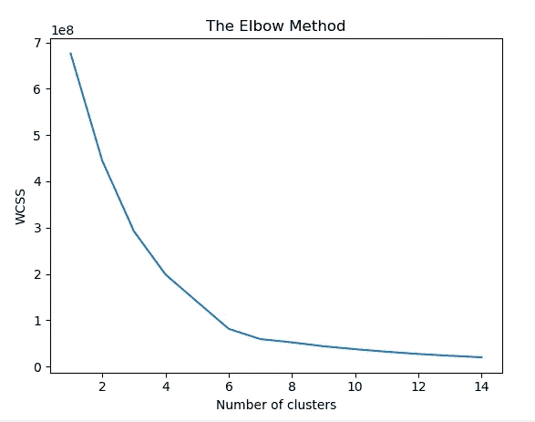

# KNN 和 RNN 的库存预测(间歇需求)

> 原文：<https://medium.com/analytics-vidhya/inventory-prediction-intermittent-demands-with-knn-rnn-b14f9388bdbf?source=collection_archive---------7----------------------->


哇哦！

机器学习已经进行了 6 个月，这是我的“第一个”挑战(尝试用我在过去 6 个月里学到的东西重做我过去的项目)

⭐ *先决条件*
*1) K 近邻
2)递归神经网络*

⭐ *这篇文章的目的
详述了我的项目方法。我是来学习的！任何人有任何建议/反馈，请随时在下面评论！*

我们开始吧！💪

# 目录

🐼 [**项目概述**](#2ef6)
🐼 [**【我的尝试】项目#1 (RNN)**](#c991)
🐼 [**项目外带**](#0232)

# **项目概述**

曾经有一个项目要求您预测库存销售，而您的团队收到的唯一数据是每个库存项目的每月销售数字？销售甚至是稀疏和断断续续的(即不定期发生)，使得任何种类的预测乍一看似乎是不可能的。

为了更清楚地了解我的团队需要处理什么，让我们看一下数据截图(数据被屏蔽以隐藏敏感信息)。由于业务性质(修理工业机械)，销售是断断续续的。


图 1:数据截图

我们的第一反应是获取更多的数据，否则我们怎么能仅凭上面的数据进行预测呢？不幸的是，对于我的团队来说，这并没有按计划进行，所以我们不得不利用我们所拥有的。

最终，结果是**不令人满意**。

在了解了各种机器学习模型后，我决定再次尝试这个项目，希望能取得更好的结果。

# 我尝试解决项目#1 (RNN)

**为解决问题而采取的步骤概述:**

1.  [探索性数据分析(‘EDA’)](#995a)
2.  [数据预处理](#da6e)
3.  [用模型进行训练和预测(RNN)](#7281)

## 步骤 1)探索性数据分析(“EDA”)

我不会深入探讨为 EDA 做了什么。为了节省你的时间，让我们直接跳到结果。对于那些不确定 EDA 是什么的人，这里有一篇关于它的好文章。[点击这里](/code-heroku/introduction-to-exploratory-data-analysis-eda-c0257f888676)

**根据 EDA，以下是调查结果:**

1.  数据集稀疏，超过 95%的数据销售时间少于 15/33 个月；
2.  某些库存项目的销售高度相关，因为工业机械的维修通常需要库存的组合；
3.  过去几个月的销售对于预测当月的销售很有用(销售通常基于持续几个月的项目；
4.  数据集是有限的，每个库存项目仅提供了 30+月销售额。总共有 400 多个独特的库存项目。

基于以上发现，以下是我的行动计划:

1.  仅对销售额≥15/33 个月的库存进行预测。对于那些有<15/33 months, I believe that the client should not stock up;
2.  Categorize each inventory item using K-nearest neighbors algorithm (‘KNN’);
3.  Use Recurrent Neural Network (‘RNN’) model where the past 3 months sales will be used to predict current months sales;
4.  Assume that all inventories in a category behaves similarly. We will train the RNN model using all data from all inventories in a category. Prediction of an inventory will be based on the category it belongs to.

*销售的人(以上是我目前能做出的最佳判断，如果有人有更好的方法，请告诉我！)*

## 步骤 2)数据的预处理

**采取以下步骤对数据进行预处理:**

1.  [从数据集](#73ce)中过滤出< 15/33 月销售额的存货项目
2.  [K-最近邻(‘KNN’)对剩余库存项目进行分类](#d2e1)
3.  [将分类数据集分割成训练数据集和测试数据集](#2826)
4.  [将训练数据集和测试数据集拆分为 X (3 个月前)和 y(当月)](#7281)
5.  [缩放数据集](#62ab)

```
# Import libraries
import numpy as np
import pandas as pd
import matplotlib.pyplot as plt
import seaborn as snsimport math
from sklearn.metrics import r2_score, mean_squared_error
from sklearn.preprocessing import MinMaxScaler, RobustScaler
from sklearn.model_selection import train_test_split
from sklearn.cluster import KMeansfrom keras.models import Sequential
from keras.layers import Dense
from keras.layers import LSTM
from keras.layers import Dropout
from keras import optimizers
```

**1。从数据集**中过滤出< 15/33 月销售额的库存项目

我运行了下面的代码来获取一个数据集‘inventory _ df ’,它包含销售额≥ 15/33 个月的库存。

```
# Importing the training set
dataset = pd.read_csv("Data_Modified.csv")# Extract the inventories features
inventory_df = dataset.iloc[:,1:].astype('int')# Filter out inventories that has sales of <15/33 months
number_of_zeroes = (inventory_df == 0).astype(int).sum(axis=0)insufficient_data_columns = []
for inventory in range (0, inventory_df.shape[1]):
    if inventory_df.shape[0] - number_of_zeroes[inventory] <=17:
        insufficient_data_columns.append(inventory)inventory_df = inventory_df.drop(inventory_df.iloc[:, insufficient_data_columns], axis=1)
```

**2。k-最近邻(' KNN ')对剩余库存项目进行分类**

然后，我继续绘制类内平方和(wcss)与类数的关系图，以找到库存项目的最佳类别数。

```
from sklearn.cluster import KMeans# Using the elbow method to find the optimal number of clusters
inventory_array = inventory_df.T.iloc[:,:].astype('int').values
wcss = []
for i in range(1,15):
    kmeans = KMeans(n_clusters=i, init='k-means++', max_iter=300, n_init=10, random_state=0)
    kmeans.fit(inventory_array)
    wcss.append(kmeans.inertia_)
plt.plot(range(1, 15), wcss)
plt.title('The Elbow Method')
plt.xlabel('Number of clusters')
plt.ylabel('WCSS')
plt.show()
```



图 2:肘法

从模型中，我选择聚类为 4。如果你想更多地了解 KNN，我发现了一篇对我很有用的文章。[点击这里](https://towardsdatascience.com/a-simple-introduction-to-k-nearest-neighbors-algorithm-b3519ed98e)

将 k-means 应用于数据集，以获得一个列表“inventory_with__categories ”,该列表将每个库存编号与其各自的类别(0–3)相匹配。

```
# Applying k-means to the dataset
kmeans = KMeans(n_clusters=4, init='k-means++', max_iter=300, n_init=10, random_state=0)
categories = kmeans.fit_predict(X)# Create a list matching inventory numbers with their category
inventory_with_categories = []
for i in range (len(inventory_df.columns)):
    one_inventory_with_category = [inventory_df.columns[i], categories[i]]
    inventory_with_categories.append(one_inventory_with_category)
```

根据类别“inventory_with_categories”拆分原始数据集“inventory_df”。这允许我得到‘complete _ dataset’，一个包含每个类别数据集的列表。

```
# Split the dataset by categories
def split_dataset_by_category (inventory_dataset, inventory_categories, number_of_categories=4):
    complete_dataset = []
    for i in range(number_of_categories):
        training_set_cat = pd.DataFrame()
        for inventorynumber, category in inventory_categories:
            if category == i:
                if training_set_cat.empty:
                    training_set_cat = inventory_dataset.loc[:,[inventorynumber]]
                else:
                    training_set_cat = pd.concat([training_set_cat, inventory_dataset.loc[:, [inventorynumber]]], axis=1)
        complete_dataset.append(training_set_cat)

    return complete_datasetcomplete_dataset = split_dataset_by_category (inventory_df, inventory_with_categories, number_of_categories=4)
```

此时，我注意到有些类别包含超过 5 个库存项目，这对模型的训练来说太少了。

我尝试用不同的变化重做整个过程(例如，改变类别的数量，将≤ 15/33 个月改为≤ 10/33 个月等。)，希望能在每个品类中获得更多的库存商品。然而，一些类别仍然只有很少的库存项目。

无论如何，我决定继续这个项目，并使用库存项目数量最多的类别(类别= 0，库存数量= 69)来粗略了解使用 RNN 是否是一种合理的方法。

**3。将分类数据集分成训练数据集和测试数据集**

将“完整数据集”拆分为“完整训练数据集”和“完整测试数据集”。两者都是包含每个类别的训练数据集和测试数据集的列表。

```
# Split into training and test set
def split_train_test(complete_dataset):
    complete_train_dataset = []
    complete_test_dataset = []
    for dataset in complete_dataset:
        dataset_train, dataset_test = train_test_split(dataset, test_size=0.2, shuffle=False, random_state=0)
        complete_train_dataset.append(dataset_train)
        complete_test_dataset.append(dataset_test)
    return complete_train_dataset, complete_test_datasetcomplete_train_dataset, complete_test_dataset = split_train_test(complete_dataset)
```

**4。将训练数据集和测试数据集分成 X(前 3 个月)和 y(当前月)**

将“complete_train_dataset”和“complete_test_dataset”拆分为 X 和 y。X(过去 3 个月的销售额)将用于预测 y(当月销售额)。这允许我返回‘split _ complete _ train _ dataset’和‘split _ complete _ test _ dataset ’,这两个列表都包含每个类别 X 和 y。

```
def split_into_batches(complete_dataset, batch=3):
    split_dataset = []
    for dataset in complete_dataset:
        dataset = dataset.values

        X_total = [] # 3 month input for EACH COLUMN
        y_total = [] # 1 month output for EACH COLUMNS
        for inventory in range (0, dataset.shape[1]):
            X = []
            y = []
            for i in range(batch, dataset.shape[0]):
                X.append(dataset[i-batch:i, inventory])
                y.append(dataset[i, inventory])

            X, y = np.array(X), np.array(y)

            X_total.append(X)
            y_total.append(y)

        X_total = np.concatenate(X_total)
        y_total = np.concatenate(y_total)

        split_dataset.append([X_total, y_total])

    return split_datasetsplit_complete_train_dataset = split_into_batches(complete_train_dataset, batch=3)
split_complete_test_dataset = split_into_batches(complete_test_dataset, batch=3)
```

**5。缩放数据集**

对于预处理的最后一步，我使用了 [sklearn 鲁棒定标器](https://scikit-learn.org/stable/modules/generated/sklearn.preprocessing.RobustScaler.html)。我选择了这个定标器，因为它对“异常值”具有很强的鲁棒性，因为数据稀疏，销售断断续续，销售可以被视为“异常值”。

缩放后，我得到' scaled _ split _ complete _ train _ dataset '，' scaled _ split _ complete _ test _ dataset '和' complete_y_train_scalers '。“complete_y_train_scalers”是最后预测的逆变换所必需的。

```
# Scale using RobustScaler
def robust_scaler_reshape(split_complete_train_dataset, split_complete_test_dataset):
    scaled_split_complete_train_dataset = []
    complete_y_train_scalers = []

    scaled_split_complete_test_dataset = []

    for i in range (len(split_complete_train_dataset)):
        # Scale and reshape X_train
        sc_train_X = RobustScaler(quantile_range=(25.0, 75.0))
        X_train_scaled = sc_train_X.fit_transform(split_complete_train_dataset[i][0])
        X_train_scaled = np.reshape(X_train_scaled, (X_train_scaled.shape[0], X_train_scaled.shape[1], 1))

        # Scale and reshape X_test
        X_test_scaled = sc_train_X.transform(split_complete_test_dataset[i][0])
        X_test_scaled = np.reshape(X_test_scaled, (X_test_scaled.shape[0], X_test_scaled.shape[1], 1))

        # Scale and reshape y_train
        sc_train_y = RobustScaler(quantile_range=(25.0, 75.0))
        y_train_scaled = sc_train_y.fit_transform(split_complete_train_dataset[i][1].reshape(-1, 1))

        # Scale and reshape y_test
        y_test_scaled = sc_train_y.transform(split_complete_test_dataset[i][1].reshape(-1, 1))

        scaled_split_complete_train_dataset.append([X_train_scaled, y_train_scaled])
        scaled_split_complete_test_dataset.append([X_test_scaled, y_test_scaled])
        complete_y_train_scalers.append(sc_train_y)

    return scaled_split_complete_train_dataset, scaled_split_complete_test_dataset, complete_y_train_scalers    

scaled_split_complete_train_dataset, scaled_split_complete_test_dataset, complete_y_train_scalers = robust_scaler_reshape(split_complete_train_dataset, split_complete_test_dataset)
```

## 步骤 3)用模型(RNN)进行训练和预测

由于问题的性质，我选择了 RNN(也就是说，本月的销售额可以用上月的销售额来预测)。我还尝试使用其他监督机器学习模型(如 XGBoost)来解决这个问题。如果有人想知道进展如何，一定要让我知道，我可以在以后写一篇文章来跟进！😊

**采用以下步骤训练模型并进行预测**

1.  [训练模型](#fea9)
2.  [利用测试数据预测](#d14f)
3.  [可视化结果](#9c0f)

**1。训练模型**

我分别为每个类别训练 RNN 模型，并返回“all_models”，这是一个包含每个类别的训练模型的列表。

```
def model_training(scaled_split_complete_train_datase):
    category = 0
    all_models = []
    for training_category in scaled_split_complete_train_datase:

        regressor = Sequential()
        # Adding the first LSTM layer and some Dropout regularisation
        regressor.add(LSTM(units = 500, return_sequences = True, input_shape = (training_category[0].shape[1], 1)))
        regressor.add(Dropout(rate = 0.2))

        # Adding the second LSTM layer and some Dropout regularisation
        regressor.add(LSTM(units = 100, return_sequences = True))
        regressor.add(Dropout(rate = 0.2))

        # Adding the third LSTM layer and some Dropout regularisation
        regressor.add(LSTM(units = 50, return_sequences = True))
        regressor.add(Dropout(rate = 0.2))

        # Adding the fourth LSTM layer and some Dropout regularisation
        regressor.add(LSTM(units = 25, return_sequences = False))
        regressor.add(Dropout(rate = 0.2))

        # Adding the output layer
        regressor.add(Dense(units = 1))

        # Compiling the RNN
        adam = optimizers.Adam(lr=0.001)
        regressor.compile(optimizer = adam, loss = 'mean_squared_error')# Fitting the RNN to the Training set
        history = regressor.fit(training_category[0], training_category[1], epochs = 500, batch_size = 10, use_multiprocessing=True) #Usually 200 epochs

        category += 1
        print(f'MSE for category {category}: {str(history.history["loss"])}')

        all_models.append(regressor)

    return all_modelsall_models = model_training(scaled_split_complete_train_dataset)
```

**2。利用测试数据进行预测**

使用上面训练的模型，我对测试数据集进行了预测，并返回了“模型 _ 性能”和“所有 _ 预测”。
“模型 _ 性能”包含每个模型的 R2 和 RMSE。
‘all _ predictions’是包含每个预测的数据帧的列表。每个数据帧都有预测数据集和实际数据集。

```
def model_predict(all_models, scaled_split_complete_test_dataset, complete_y_train_scalers):
    model_performance = []
    all_predictions = []
    for i in range(len(all_models)):
        predicted_inventory_sale = all_models[i].predict(scaled_split_complete_test_dataset[i][0])
        predicted_inventory_sale = complete_y_train_scalers[i].inverse_transform(predicted_inventory_sale)
        tested_inventory_sale = complete_y_train_scalers[i].inverse_transform(scaled_split_complete_test_dataset[i][1])

        # Analysis of model performance
        R_squared = r2_score(tested_inventory_sale, predicted_inventory_sale)
        RMSE = math.sqrt(mean_squared_error(tested_inventory_sale, predicted_inventory_sale))
        model_performance.append([i, R_squared, RMSE])

        # Combine predictions into a dataframe
        predictions = np.concatenate([tested_inventory_sale.reshape(-1,1), predicted_inventory_sale.reshape(-1,1)], axis=1)
        predictions = pd.DataFrame(predictions, columns=['total_test', 'total_pred'])  
        all_predictions.append(predictions)

    model_performance = pd.DataFrame(model_performance, columns=['category', 'R2', 'RMSE'])  

    return model_performance, all_predictionsmodel_performance, all_predictions = model_predict(all_models, scaled_split_complete_test_dataset, complete_y_train_scalers)
```

**3。可视化我们的结果！**

让我们首先来看看我们的模型在测试数据上的表现


图 3:每个类别的模型性能

上表显示了每个类别的模型性能。如上所述，我们将只查看类别 0 和类别 1，类别 2 和类别 3 中只有 1 个库存项目。

从表中可以看出，该模型的 R2 得分较低，表现不佳。

接下来，让我们为类别 0 绘制一个简单的图形！

```
# Visualise predictions for category 0
plt.plot(all_predictions[1].loc[:, 'total_test'].values, color = 'red', label = 'Pred')
plt.plot(all_predictions[1].loc[:, 'total_pred'].values, color = 'blue', label = 'Real')
plt.title('Inventory Sale Prediction')
plt.xlabel('Time')
plt.ylabel('Inventory Sale')
plt.legend()
plt.show()
```


图 4:类别 0 的预测与实际(库存销售)的图表

从图表来看，这个模型似乎预测得很好。低 R2 分数很可能来自于尖峰信号。用 RNN 模型的其他参数重新训练该模型很可能会产生更好的结果。

# 外卖食品

唷！终于搞定了。这个项目总共花了我 2 天时间，以下是我的主要收获:

1.  RNN 模型肯定可以用来预测这样的数据集。我相信如果库存分类能够和客户一起完成，模型的性能会更好。此外，更多的数据(例如，更多的月销售额)肯定会产生更好的模型。

机器学习领域我还是新手。如果您对如何改进该方法有任何建议/反馈，请在下面留下您的评论！🙇