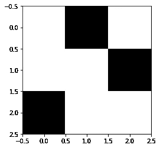
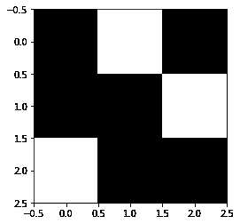
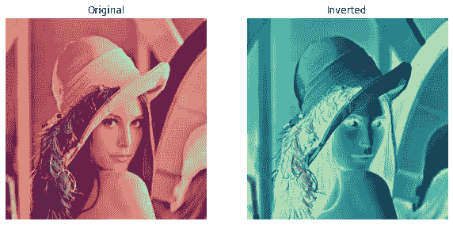
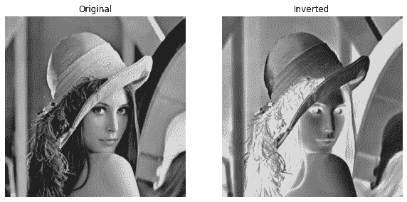
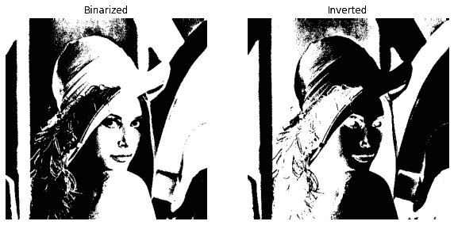

# 使用 NumPy 的广播方法反转图像

> 原文：<https://medium.com/analytics-vidhya/inverting-an-image-using-numpys-broadcasting-method-1f5beb7f9fa5?source=collection_archive---------1----------------------->


Jr Korpa 在 [Unsplash](https://unsplash.com?utm_source=medium&utm_medium=referral) 上拍摄的照片

在本文中，我们将学习如何使用 NumPy 反转图像。为了得到一些要点，我们有两个值 **0** 和 **1** 。这里 **0** 代表**黑色**而 **1** 代表**白色**。当我们对这些值进行反演时，我们得到:

*   0 →反转→ 1
*   1 →反转→ 0

以上只有当我们两个值时才起作用。 **0** 为**低**和 **1** 为**高**。如果我们将同样的情况与像素值仅为 1 和 0 的二进制图像联系起来，则反转将会发生。用文字来说，我们可以说从**白**黑**到**黑**白**白**。**

## 广播

不像列表，如果我们想给列表的值加一个数。我们遍历每个元素并添加数字。然而，在 NumPy 中，我们不需要遍历每个元素并添加。相反，我们可以将数组列表视为单个元素，并添加数字。NumPy 会自动将该数字添加到数组列表的所有元素中。这种技术被称为广播。

广播技术适用于矩阵和阵列。与普通循环相比，它的速度非常快。

```
>>> import numpy as np
>>> M = np.array([1, 2, 3, 4, 5, 6])
>>> M = 3 + M
>>> M
array([4, 5, 6, 7, 8, 9])
>>>
```

让我们看看随机矩阵的演示。

## 白色—黑色

下面可以看到**黑白**矩阵和图像的简单演示。

*   1 显示为**白色**
*   0 显示为**黑色**

```
>>> import numpy as np
>>> image_b = np.array([
... [1,0,1],
... [1,1,0],
... [0,1,1]])
>>> image_b
array([[1, 0, 1],
       [1, 1, 0],
       [0, 1, 1]])
>>>
```

如果我们形象化上面的矩阵，我们可以看到类似下面的东西。



作者图片

## 黑色-白色

下面可以看到**黑白**矩阵和图像的简单演示。

*   1 变为 0 → **黑色**
*   0 变为 1 → **白色**

```
>>> # Broadcasting
>>> image_i = 1 - image_b
>>> # image_i = ~ image_b
>>> image_i
array([[0, 1, 0],
       [0, 0, 1],
       [1, 0, 0]])
>>>
```

如果我们形象化上面的矩阵，我们可以看到类似下面的东西。



作者图片

要将一个矩阵转换成一个逆矩阵，我们也可以使用操作' **~** '。它以同样的方式工作。

> 如果你想知道具体如何将图像转换成二进制，你可以参考我的文章，在那里我解释了彩色和灰度图像的程序。

由于图像已经被二值化，所以上述实现是可行的。如果我们想把这个应用于一个彩色的非二值化的图像呢？情况会有所不同。让我们看看我们能为这些做些什么。

# 编码时间到了

我们主要使用的软件包有:

*   NumPy
*   Matplotlib
*   OpenCV


作者图片

## 导入包

## 阅读图像

上述函数读取灰度或 RGB 图像，并返回图像矩阵。

## 用库实现代码

对于使用 ***cv2*** 库反转图像，我们可以使用库中可用的方法 ***bitwise_not()*** 。我们可以将图像矩阵作为参数传递给方法。

上面的函数返回传递的原始图像的反转图像。绘制时可以看到同样的情况。

让我们测试一下上面的函数—



作者图片



作者图片

我们已经获得了彩色和灰度图像的反转图像。

## 从头开始代码实现

为了反转图像，我们必须应用使用 NumPy 的广播技术。我们必须从 **255** 中减去每个像素值。是因为一幅图像中最高的像素值或颜色值是 **255** 。无论哪种方式，我们都可以对图像应用' **~** '(求反)操作。

让我们测试一下上面的函数—


作者图片


作者图片

就是这个！我们已经成功地编写了将图像转换成反转图像的代码。结果类似于库代码的结果。

让我们看看当应用于二值化图像时会产生什么结果。我已经给出了没有代码的结果(这是显而易见的)。



作者图片

反转图像与二值化图像正好相反。因此，这就结束了本文的议程。

你一定要看看我在个人资料中关于同一主题的其他文章。

如果你喜欢，你可以在这里给我买咖啡。

[](https://www.buymeacoffee.com/msameeruddin)