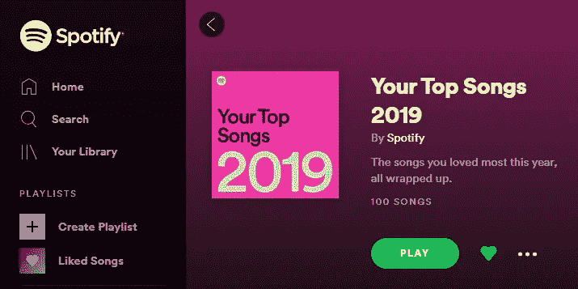

# 使用 Python 研究 Spotify 年度最佳播放列表:第 1 部分

> 原文：<https://medium.com/analytics-vidhya/investigating-spotify-top-of-year-playlists-using-python-part-1-c9525ca8abb6?source=collection_archive---------13----------------------->

今年早些时候，Spotify 根据用户的收听习惯，在 2019 年播放列表中重新列出了用户的年度最佳 100 首歌曲。他们还策划了十大播放列表来标志 2020 年的开始。

我想与普通用户相比探索我的热门歌曲，所以我从这些播放列表中提取了歌曲数据，并将其与 Spotify 根据用户群发布的一般“年度最佳”播放列表进行比较。

我使用 Spotify API 提取播放列表数据，并使用 python 进行一些简单的数据探索。在这篇文章中，我将概述我的工作，并向你展示你如何可以拉你自己的播放列表，比较你自己的音乐品味，或建立自己的分析。代码可以在[我的 GitHub 库](https://github.com/emondvin/Spotify_Data_Analysis)中找到。

## 要访问 Spotify API，您需要:

*   [spotipy](https://spotipy.readthedocs.io/en/latest/) python 模块
*   访问 Spotify API:为自己申请一个[开发人员 potify](https://developer.spotify.com/)账户，并获得所需的权限

我发现这些帖子在学习抓取 Spotify API 进行数据分析时很有用。

*   [https://medium . com/deep-learning-turkey/build-your-own-Spotify-playlist-of-best-playlist-recommendations-fc 9 ebe 92826 a](/deep-learning-turkey/build-your-own-spotify-playlist-of-best-playlist-recommendations-fc9ebe92826a)
*   [https://medium . com/@ rare loot/extracting-Spotify-data-on-your-favorite-artist-via-python-d 58 BC 92 a 4330](/@RareLoot/extracting-spotify-data-on-your-favourite-artist-via-python-d58bc92a4330)

## 使用 Spotify 访问 Spotify API

首先，你需要授权自己访问 Spotify API。使用 spotipy 很容易做到这一点。

在上面的代码中，您需要输入自己的客户端 ID、密码、用户名和基于您的 Spotify for developers 帐户的重定向 URL。Spotify 为您的项目提供了其他有趣的范围，其中一些允许您阅读自己的播放列表或与您的帐户互动。

找到你的 Spotify 用户名可能会很烦人，尤其是当它与你的 facebook 账户绑定在一起的时候。我在 Spotify 网站上找到了我的帐户，检查了网页元素，搜索了“appid”，这是从你的 facebook 帐户生成的变量名。

一旦你有了这个授权设置，你就可以开始探索 Spotify 的 API 了！

## 提取播放列表数据

我使用 [pandas](https://pandas.pydata.org/) ，这是一个强大的 python 数据分析和操作工具，目的是创建数据帧并将数据导出到 csv。探索 [Spotify 的 API 文档](https://developer.spotify.com/documentation/web-api/reference/object-model/)可能有助于理解数据是如何嵌套的，以及如何在代码中访问它。

注意，上面的代码依赖于本文中出现的第一个代码块中的授权流。

我创建了一个函数来编译播放列表数据和我感兴趣的特性。首先，我从播放列表中提取歌曲，并根据曲目 id (URI 用于识别 Spotify API 中的歌曲)、名称和各自的艺术家将它们分开。

使用曲目 id，我编译了 Spotify 用来将曲目描述成熊猫数据图的[特性](https://developer.spotify.com/documentation/web-api/reference/tracks/get-audio-features/)。此外，我还添加了该曲目的流行度，以及与该曲目艺术家相关的流派。Spotify 不按流派分类，只按艺术家分类，所以流派必须单独提取，并根据艺术家追加到曲目中。一旦所有数据都排列在数据帧中，就可以很容易地导出为. csv 格式，以供进一步分析。

现在，获取播放列表数据只需对您选择的播放列表使用 get_playlist_feats 函数。我选择从我的个人资料和 Spotify 的普通用户群中调出“201X 排行榜”和“十年排行榜”。导出。csv 文件，数据已准备好进行分析。

以下是 Spotify 2019 年加拿大播放列表的数据:

在第二部分中，我将探索这些数据，通过比较我自己的精选播放列表和 Spotify 的播放列表，来看看我的品味与 Spotify 的有何不同。

如果您有任何问题，请随时联系我们！