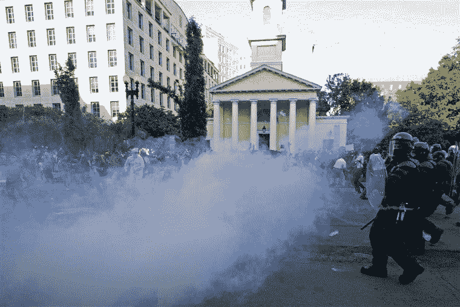
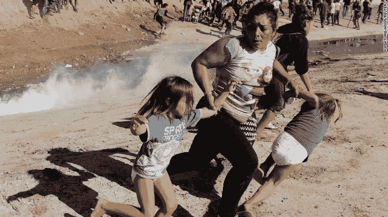
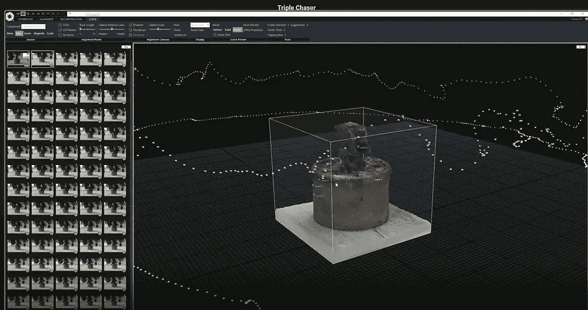
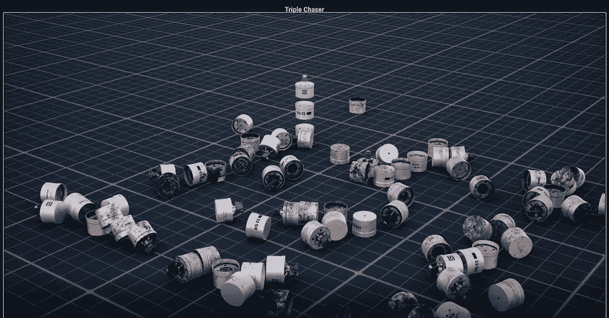
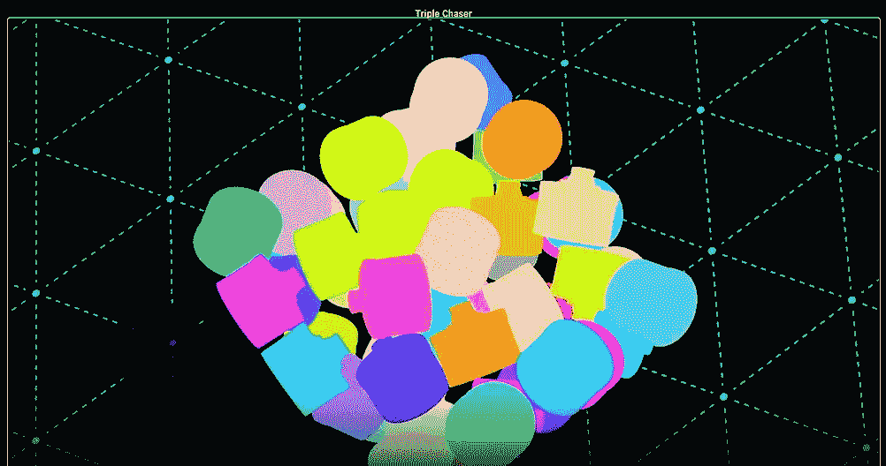
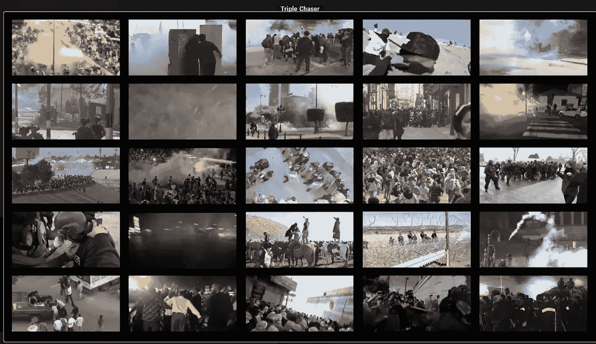
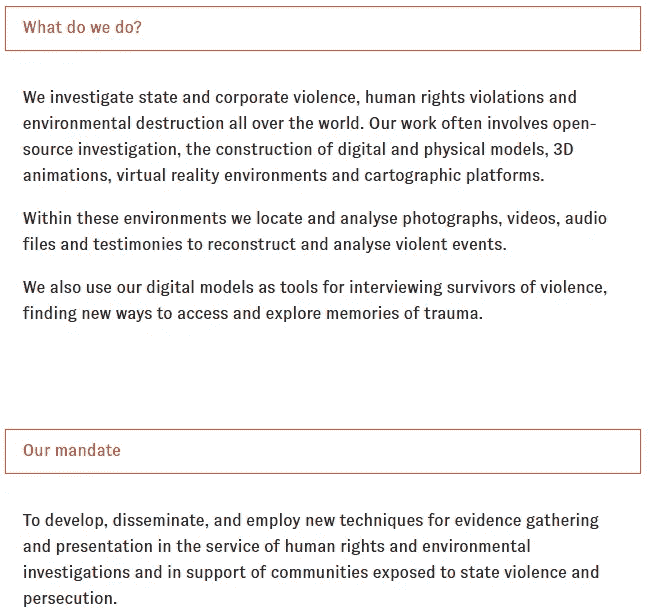

# 用 ML & CV 调查国家和企业暴力

> 原文：<https://medium.com/analytics-vidhya/investigating-state-corporate-violence-with-ml-cv-4a1719a37a1f?source=collection_archive---------15----------------------->

法医建筑对计算机视觉和机器学习的使用揭示了侵犯人权的行为，并扩大了关于道德慈善事业的对话

构建卷积神经网络(cnn)来对 Jupyter 笔记本上的图像进行分类，超出了我在过去几个月的大会数据科学沉浸式会议(T1)上所期望了解的范围。当我们结束这一周的精彩课程时，我讲述了去年在纽约惠特尼博物馆双年展上看到的一个令人不安的艺术装置，当时我从未听说过计算机视觉或卷积神经网络这两个术语。

乔治·弗洛伊德抗议之后，执法部门使用催泪瓦斯的行为再次受到审查。九个州的立法者引入了禁止催泪瓦斯的立法，波特兰、丹佛和西雅图已经暂停使用催泪瓦斯驱散人群。专制政府使用催泪弹镇压公共场所的集体和平抗议，而就在几年前，我们自己的政府甚至在蒂华纳/圣地亚哥边境对妇女和儿童使用催泪弹。

左图:Jose Luis Magana/AFP-Getty Image(来自 nbcnews.com)|右图:【CNN.com 

严重的皮肤过敏反应、失明、支气管痉挛、过敏性休克、呼吸困难、定向障碍、肺水肿或脑水肿的危险、心律失常，甚至死亡，这些只是催泪瓦斯对暴露于催泪瓦斯中的人的影响的一些例子。

具有讽刺意味的是，去年受惠特尼博物馆委托，*三重追逐者*装置由[法医建筑](https://forensic-architecture.org/)(以及劳拉·珀特阿斯&普拉西斯电影公司的作品)组装。一些简单的事实:

[野生动物园](https://safariland.com/)制造催泪瓦斯

沃伦·坎德斯是野生动物园的总裁

沃伦·坎德斯通过销售催泪瓦斯发了大财

沃伦·坎德斯 ***曾是惠特尼博物馆董事会*** 副主席

为了揭露针对平民的暴行，法医建筑(FA)团队开始训练计算机视觉(cv)分类器来识别 Safariland 的三重追逐手榴弹的使用。这些使用过的手榴弹的图像是罕见的，在网上找到不到 100 个后，FA 开始创建它们的合成数据集。除了找回之前发射的手榴弹的积极分子的照片和视频，FA 还使用了[公开可用的规格](https://www.defense-technology.com/wp-content/uploads/2020/06/Triple-Chaser-Grenade.pdf)和标签变体(不同的语言)来构建手榴弹的 3d 数字模型。在将数字图像与粗体图案和逼真的照片背景进行对比后，彩色遮罩被用来告诉分类器手榴弹在图像中的位置，确保分类器能够识别手榴弹。训练模型上的什么是 ***而不是*** 一枚三重追踪手雷同样重要。(完整视频)

图片来自三重追踪器安装视频的截图

就在该装置首次亮相几周后，坎德斯辞去了他在惠特尼委员会的副主席职务，他的妻子是博物馆绘画和雕塑委员会的联合主席。今年 6 月 9 日，坎德斯宣布，他将剥离 Safariland 向执法和军事机构出售“人群控制解决方案，包括化学制剂、弹药和警棍”的部门。

催泪瓦斯的使用实例来自三重追踪器装置 [***视频***](https://forensic-architecture.org/investigation/triple-chaser) 的截图

[正如艺术报纸](https://www.theartnewspaper.com/news/what-price-philanthropy-american-museums-wake-up-to-public-concern)指出的:

> “纽约惠特尼美国艺术博物馆(Whitney Museum of American Art)副主席沃伦·坎德斯(Warren Kanders)的离职……正迫使美国博物馆公开考虑其董事会的构成……尽管美国博物馆在很大程度上依赖于私人慈善事业，但没有统一的最佳实践指南来帮助它们任命董事会成员或决定应该接受或回避哪种受托人。'

坎德斯、科兹洛夫斯基、赛克勒家族，只是捐款或董事会席位背后的名字会受到严格审查的几个例子。在任命有争议的人物进入我们最受尊敬的机构的董事会方面没有真正的保障，围绕道德慈善的讨论从未像现在这样重要。

与此同时，法证架构将继续使用音频分析、数据挖掘、地理定位、计算机视觉、机器学习、虚拟现实、摄影测量和其他前沿技术来调查国家和企业暴力并揭露其他侵犯人权行为。根据他们的网站，FA 的一些调查类别包括:空袭，海上，边境，化学袭击，拘留，失踪，环境暴力，火灾，法医海洋学，遗产，土地权，移民和警察暴力。

欲了解更多信息，请访问取证架构[网站。](https://forensic-architecture.org/)

图片来自法医建筑网站

这篇文章使用的文章:

[https://news . artnet . com/art-world/forensic-architecture-triple-chaser-Whitney-biennial-1544911](https://news.artnet.com/art-world/forensic-architecture-triple-chaser-whitney-biennial-1544911)
[https://www . nytimes . com/2019/07/25/arts/Whitney-Warren-kanders-resigns . html](https://www.nytimes.com/2019/07/25/arts/whitney-warren-kanders-resigns.html)
[https://www . CNN . com/2018/11/25/us/San-ysidro-port-entry-closed](https://www.cnn.com/2018/11/25/us/san-ysidro-port-of-entry-closed/index.html)