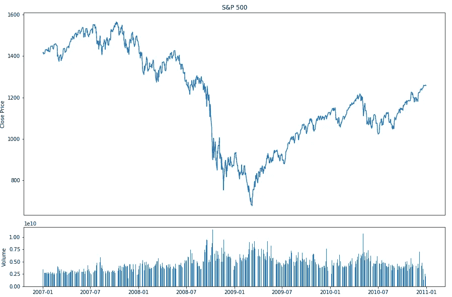
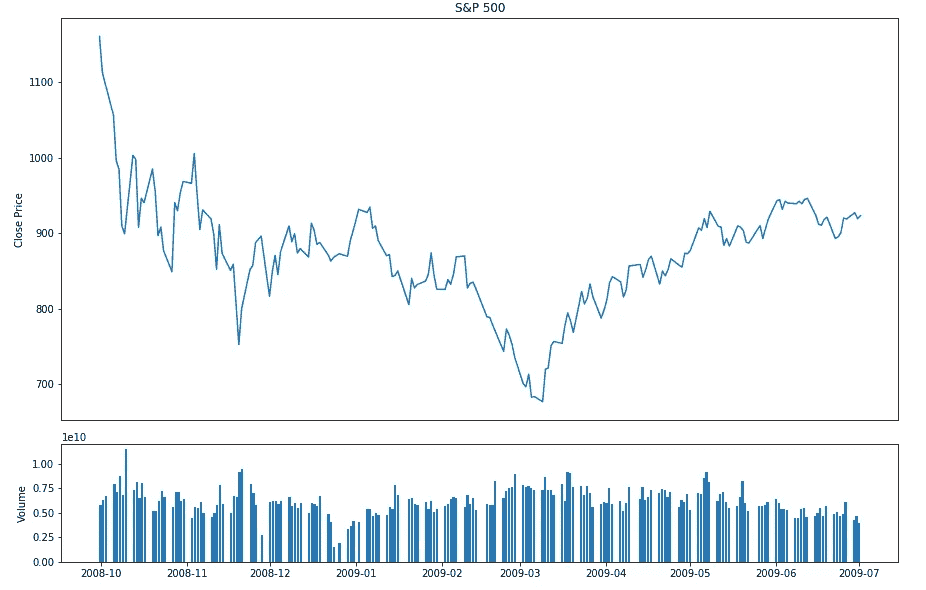
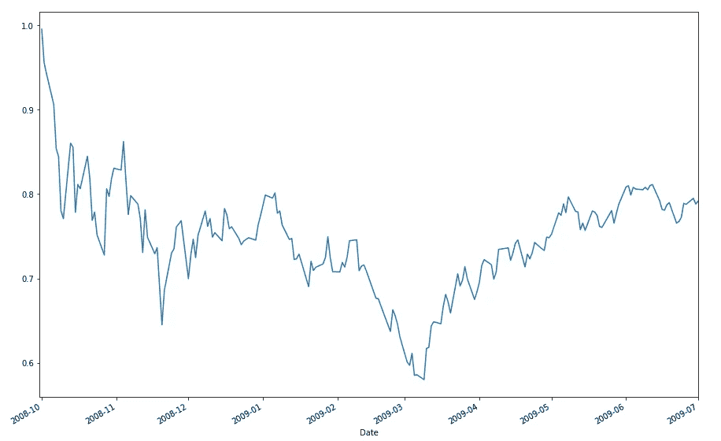
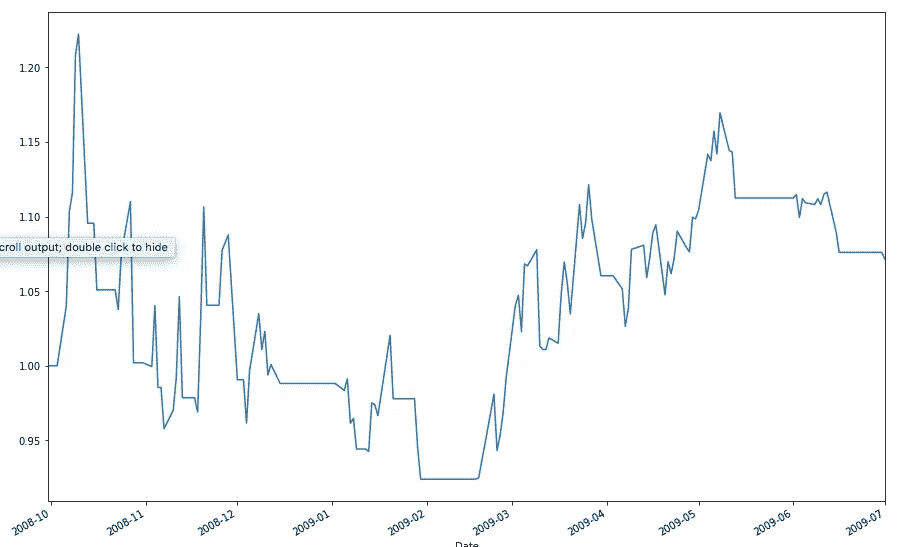
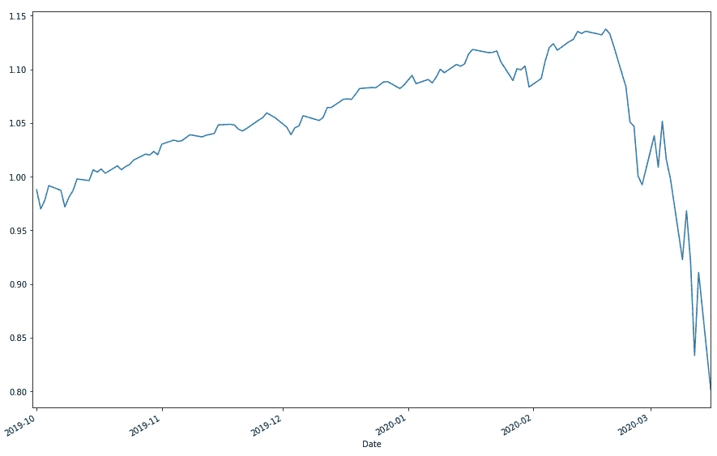
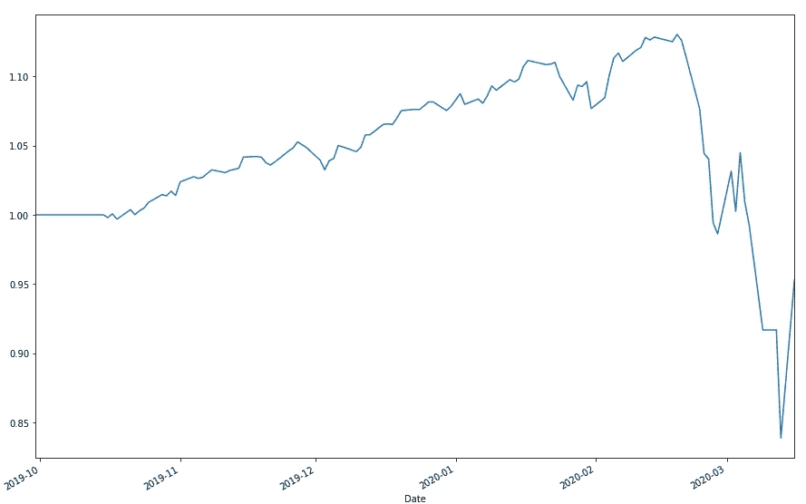

# 在 Covid19 危机时期投资

> 原文：<https://medium.com/analytics-vidhya/investing-in-the-time-of-covid19-crisis-a7982d22b3cc?source=collection_archive---------28----------------------->

根据著名基金经理彼得·林奇的说法，他把富达管理到了最顶峰，一场危机之后是股市崩盘，是因为整体股票的估值已经很高，而且容易修正。

抛售的理由有多种形式，例如希腊债务危机、次级抵押贷款，以及现在的冠状病毒。

## 什么是危机？

在我看来，危机仅仅是经济增长的下降，由于未来的不确定性，人们停止花钱，开始储蓄。由于消费者停止消费导致销售缓慢，许多企业停止扩张，或者可能开始关闭现有业务。

## 所有的危机都一样吗？

当然不是，我们在空气中感受到的恐惧有多种形式。在 2008 年的次贷危机中，这种担忧是非常系统性的，导致了许多大公司的纾困、合并和国有化。

在电晕病毒危机中，在我个人看来，没有系统性的恐惧在不远的将来。没有大公司需要救助，必要的合并等，大银行有充足的流动性，美联储降息近 0%来刺激经济，中国派出他们有经验的团队去其他国家抗击冠状病毒。即使是第一次，我觉得整个世界比以往任何时候都更加团结一致，以打击共同的敌人，Covid 19

## 在投资方面该怎么做？

我们应该等到科学家发现疫苗吗？或者，也许我们都可以停止吃垃圾食品，吃更多的水果和蔬菜，以使我们的身体能够对抗冠状病毒本身。

或者，也许我们可以看看图表，也许它会告诉我们一些东西。

首先，让我们看一下 2008 年危机前和危机后复苏的图表:

2007 年至 2011 年标准普尔 500 图表

我们能利用过去的信号预见未来吗？你不希望在 2008 年末卖掉你的房子并投入所有的资金吗？当然没那么戏剧化，但我们会努力的。

从定量的角度来看，数据的抽样非常关键，因为许多指标都是以累积的方式来衡量的，如 OBV(对平衡量)、ADX 等。所以根据上面的图表，让我们放大到 2008 年末，我们会看到那里发生了什么。

崩溃和复苏前的标准普尔 500 图表

看起来这个时间框架对于 algo 来说是足够好的采样周期。

现在，让我们比较一下，如果我们使用买入并持有策略，我们会得到的回报，与我们在这个时间段内使用我们的算法会得到的回报。

买入并持有策略的累计回报率下降了 20%左右

同样，累计回报率约为 7-8%

因此，按绝对值计算，我们的算法在同一时期的回报率比买入并持有策略高 27%左右。

那么导致现在的日冕崩溃之前的时期呢？出于我们算法的目的，我将使用 2019 年 10 月到现在的时间框架

在此期间，买入并持有策略将导致收益率下降负 20%

我们的算法在同一时期公布了负 5%的下降

尽管这不是涅槃，但我们的算法仍然比买入并持有策略高出 25%。

注意:这篇文章是为了教育的目的，而不是为了真正的金钱实践。

稍后，我将发布这篇文章的后续部分，在那里我将更多地讨论算法本身。第二部分

亨利·赫尔曼万
henryhermawan09@gmail.com