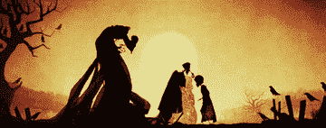
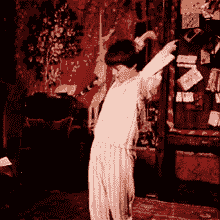
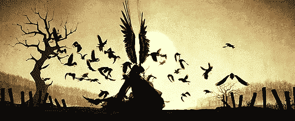

# 隐形斗篷——OpenCv 项目

> 原文：<https://medium.com/analytics-vidhya/invisible-cloak-opencv-project-ce3a613f3ed3?source=collection_archive---------17----------------------->

你是一个陶工吗，如果是的话，我有一些你喜欢建造或再造的东西。

你是一个波特迷吗，我有一样你会喜欢制作或再造的东西——隐身衣。是啊！正是这件斗篷让哈利·波特隐形，成为三大死亡圣器之一。我们将通过 OpenCV 实现这一点。



死亡的礼物

# **这将如何运作？**

该算法在原理上非常类似于绿色筛选。但是不像绿色筛选，我们删除了背景，在这个应用程序中，我们删除了前景！我们用不同颜色的布料做斗篷，你可以选择不同的颜色，你可以用和哈利波特一样的红色。

1.  捕获并存储背景帧。
2.  使用颜色检测算法检测彩色布料。
3.  通过生成遮罩来分割出彩色布料。
4.  生成最终的增强输出，以创造神奇的效果。



# **要使用的库:**

1.  cv2
2.  numpy

```
import cv2
import numpy as np
```

# **捕捉背景**

我们必须用背景像素替换对应于布料的当前帧像素来生成不可见性。为此，我们需要存储一帧背景。

```
import cv2
cap = cv2.VideoCapture(0)

while cap.isOpened():
    camWorking, background = cap.read()
    if camWorking:
        cv2.imshow("image", background)
        if cv2.waitKey(5) == ord('q'): **# q to capture** cv2.imwrite('image.jpg', background) **# saving image**
            break

cap.release()
cv2.destroyAllWindows()
```

# **隐形斗篷**

你的斗篷是什么颜色的？

听起来简单吗？我们有一个 RGB(红绿蓝)图像，很容易以 RGB 的形式设定阈值并得到我们的蒙版。由于 RGB 值对光照高度敏感，结果证明这并不有效。因此，即使斗篷是红色的，也可能存在一些区域，在这些区域中，由于阴影，相应像素的红色通道值非常低。

正确的方法是将我们图像的颜色空间从 RGB 转换到 HSV(色调饱和度值)。

**什么是 HSV？**

它是我们通过眼睛实际看到的东西(颜色+强度)

1.  色调:该通道对颜色信息进行编码。色调是模型的颜色部分，用 0 到 360 度的数字表示。色调可以被认为是一个角度，其中 0 度对应于红色，120 度对应于绿色，240 度对应于蓝色。(颜色)
2.  饱和度:该通道编码颜色的强度/纯度。饱和度描述特定颜色的灰色量，从 0 到 100%。将该分量减少到零会引入更多的灰色并产生褪色效果。有时，饱和度显示为从 0 到 1 的范围，其中 0 是灰色，1 是原色。
3.  值:该通道对颜色的亮度进行编码。图像的阴影和光泽组件出现在此通道中。值与饱和度结合使用，描述颜色的亮度或强度，范围为 0-100%，其中 0 表示完全黑色，100 表示最亮，显示最多颜色。(黑色+彩色)

使用 HSV 颜色空间的主要优点是颜色/色调/波长仅由色调分量表示。



**让我们编码并理解**

我们在这里做的是读取背景图像，然后当我们的相机打开并处于工作状态时，我们记录当前显示。

我们正在寻找和计算 rgb 到 hsv 的值，你也可以谷歌和使用可用的在线转换，并写下颜色的上限和下限，以便颜色只能在该范围内被掩盖。

在第一部分中，我们提取斗篷的彩色像素(这里是红色)并遮蔽所有其他像素。(显示此选项将显示白色斗篷，其余为黑色)

我们现在正在改变蒙版，在第二部分，我们将所有的彩色像素替换为边框。

我们将检测到的红色区域的像素值替换为静态背景的相应像素值，并最终生成一个增强输出，该输出创建了神奇的效果，将我们的衣服转换为隐身衣。为了做到这一点，我们首先使用 bitwise_and 操作来创建一个图像，其像素值对应于检测到的区域，等于静态背景的像素值，然后将输出添加到我们从中分割出红布的图像(res1)中。

最终显示的是旧背景帧像素和不属于斗篷颜色的新帧像素的组合。

[https://github . com/syedareehaquasar/Invisible-cover/blob/master/output . MP4](https://github.com/syedareehaquasar/Invisible-Cloak/blob/master/output.mp4)

上面的是一个红色的斗篷，你可以访问下面的链接，创造更多不同颜色的斗篷。

[](https://github.com/syedareehaquasar/Invisible-Cloak) [## syedareehaquasar/隐形斗篷

### 一个用 Python-OpenCv 制作的可以让你隐形的程序。此回购包含 2 种类型的程序使用所有…

github.com](https://github.com/syedareehaquasar/Invisible-Cloak)