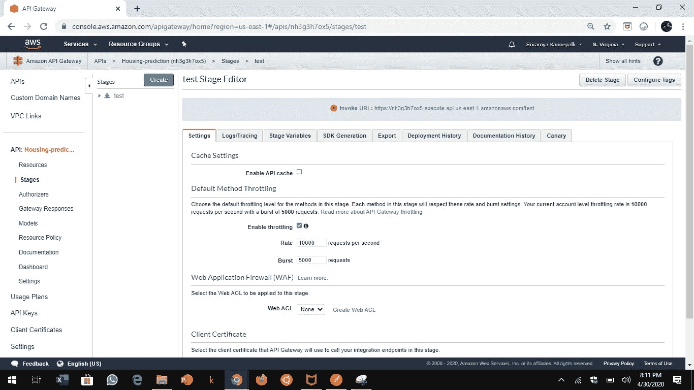

# 使用 AWS Lambda 调用 Amazon SageMaker 端点

> 原文：<https://medium.com/analytics-vidhya/invoke-an-amazon-sagemaker-endpoint-using-aws-lambda-83ff1a9f5443?source=collection_archive---------1----------------------->

## 使用 API Gateway 和 AWS Lambda 调用 Amazon SageMaker XGBoost 回归模型端点的分步指南

照片由 [Unsplash](https://unsplash.com?utm_source=medium&utm_medium=referral) 上的 [h heyerlein](https://unsplash.com/@heyerlein?utm_source=medium&utm_medium=referral) 拍摄

假设您在这里是因为您已经部署了 SageMaker ML 模型端点，试图理解使用 AWS Lambda 函数托管它的过程。如果是，那我们开始吧..

**注:**如果没有，可以通过阅读我之前的博客 [Random Forest 和亚马逊 SageMaker](/@sriramya.kannepalli/random-forest-and-xgboost-on-amazon-sagemaker-and-aws-lambda-29abd9467795) 上的 XGBoost 来创建一个 XGBoost SageMaker 端点，实现这个 jupyter 笔记本。

Jupyter 笔记本，用于将 XGBoost 部署为 SageMaker 端点

# 我的端点在哪里？

现在，在 SageMaker 中训练和部署模型之后，您可以从 SageMaker 控制台的 SageMaker >推断>端点中复制您部署的端点的名称。在 AWS Lambda 函数中定义环境变量时，我们将使用端点名称。

# **创建 AWS Lambda 函数**

在 AWS 控制台中搜索“Lambda ”,然后单击“函数”下的“创建函数”。

屏幕截图—在 AWS Lambda 中创建新函数

选择运行时 Python 3.6，并在函数代码中添加以下示例代码:

然后点击“保存”。

python 中的 lambda_function 代码示例

点击编辑环境变量>添加环境变量并添加

密钥:“端点名称”

值:'【T12'并点击'保存'。

如果您正在实现上述示例教程中使用的 XGBoost 模型端点，则您的值字符串可能采用以下格式:

值:'[xgboost-YEAR-MONTH-DATE-xx-xx-xx-](https://console.aws.amazon.com/sagemaker/home?region=us-east-1#/endpoints/xgboost-2020-04-30-22-01-11-369)XXX '

# 定义 IAM 角色

然后向上滚动并点击“权限”选项卡。

点击执行角色>角色名称

您将被重定向到 IAM 控制台。

1.  在策略名称下单击您的策略。
2.  点击编辑策略> JSON
3.  在现有 JSON 字符串的末尾添加逗号，并在末尾包含以下字符串。

4.不要忘记点击“审查政策”和“保存更改”。

这将赋予 Lambda 函数调用 SageMaker 模型端点的权限。

# **API 网关**

现在在 AWS 控制台中搜索 API 网关

*   单击 REST API 部分下的“导入”。

*   在“创建新 API”下选择“新 API”。

*   在设置中输入“API 名称”，然后单击“创建 API”。您将被重定向到以下屏幕——

*   单击“创建资源”。输入“资源名称”并单击“创建资源”。例如，我将我的资源命名为“住房预测”

*   单击“操作”和“创建方法”

*   选择“过帐”方法，然后单击“'✔️”。

*   输入 Lambda 函数名并点击“保存”。

*   现在转到“操作”并点击“部署 API”。

*   选择“新阶段”并输入阶段名称。例如，对于测试或生产，单击“部署”。

*   现在点击 Stages > test 下的 POST，复制以<your-function-name>结尾的调用 URL</your-function-name>

注意:您的 URL 应该以<your function-name="">结尾，而不是“test”。</your>

现在我们有了 Lambda 函数、API 网关和测试数据(从测试数据中复制单个数据点)，让我们使用 Postman 测试它，它是一个用于测试 web 服务的 HTTP 客户端。你可以在这里下载最新版本的邮递员。

将调用 URL 放入 Postman，如下图所示，并选择 POST as 方法。在 Body 选项卡中，放置测试数据，如下图所示。选择 Send 按钮，对于 XGBoost 教程中显示的测试数据，您将看到返回的结果为“1005792.625”。

万岁！！🎊🎉🎊您已经创建了一个由 Amazon SageMaker 部署和托管的模型端点。然后使用调用端点的无服务器架构(一个 API 网关和一个 Lambda 函数)调用端点。

现在你知道如何使用 AWS Lamda 无服务器函数调用 Amazon SageMaker 托管的机器学习模型端点了..恭喜你！！！👏👏👏

照片由[苏珊·奎尔斯拍摄](https://unsplash.com/@kirbyphotography?utm_source=medium&utm_medium=referral)在 [Unsplash](https://unsplash.com?utm_source=medium&utm_medium=referral)