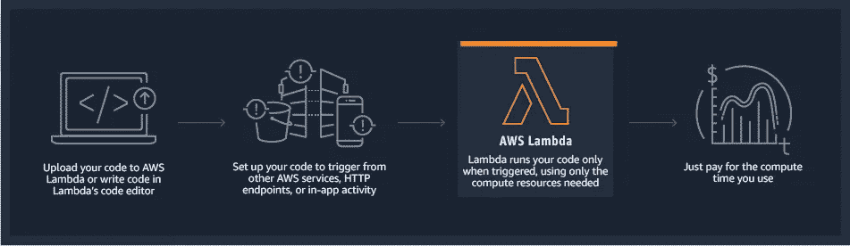

# 从 S3 调用 AWS lambda

> 原文：<https://medium.com/analytics-vidhya/invoking-aws-lambda-from-s3-33ae8bee8c35?source=collection_archive---------16----------------------->

## 学习目标

1.  设置 AWS 帐户
2.  AWS 服务 S3、Lambda、IAM 等概述
3.  为 Lambda 创建 IAM 角色
4.  创建 Lambda 函数
5.  为 Lambda 函数创建触发器

# 设置 AWS 帐户

开始之前，请准备好您的 AWS 帐户。您可以使用 [AWS 免费层](https://aws.amazon.com/free/?all-free-tier.sort-by=item.additionalFields.SortRank&all-free-tier.sort-order=asc)，AWS 免费层会在每个新的 AWS 帐户上自动激活。通过 AWS 免费层，您可以在一定的使用限制内免费试用一些 AWS 服务。

AWS 免费层包括三种不同类型的产品:

*   **试用:**这些是从您激活服务之日开始的短期试用优惠。试用期结束后，您需要支付标准费用。
*   **12 个月免费:**这些优惠提供初始注册日期后 12 个月内的有限使用。在 12 个月免费使用期限到期后，或者如果您的应用程序使用超出了免费等级限制，您需要支付标准费率。
*   **永远免费:**这些优惠面向所有 AWS 客户，不会在您的 12 个月 AWS 免费层期限结束时过期。

> 然而，并不是所有的 AWS 服务都是免费的。您可以通过 AWS 免费层使用情况警报来跟踪您的免费层使用情况。

# AWS 服务 S3、Lambda、IAM 等概述

*   **IAM** : AWS 身份和访问管理( [IAM](https://docs.aws.amazon.com/IAM/latest/UserGuide/introduction.html) )是一个 web 服务，帮助您安全地控制对 AWS 资源的访问。您使用 IAM 来控制谁被验证(登录)和授权(有权限)使用资源。
*   **S3** :亚马逊简单存储服务([亚马逊 S3](https://aws.amazon.com/s3/) )是互联网存储。你可以使用亚马逊 S3 在任何时间、任何地点存储和检索任何数量的数据。

图片来源:AWS

*   **Lambda**:[AWS Lambda](https://docs.aws.amazon.com/lambda/latest/dg/welcome.html)是一个事件驱动的无服务器计算平台，由亚马逊提供，作为亚马逊网络服务的一部分。它是一种计算服务，运行代码以响应事件，并自动管理该代码所需的计算资源。

图片来源:AWS

## **自动气象站组件**

**函数:**Lambda 函数由您提供的代码、相关的依赖项和配置组成。这是一个独立的部署单位。一个 Lambda 函数将被一个事件触发，所以你有越多的事件，越多的 Lambda 函数将被调用。此外，lambda 函数可以同步或异步触发其他 Lambda 函数。

**触发器:**触发器是调用 Lambda 函数的 AWS 服务或资源。你可以用 Lambda **控制台**，Lambda **API** ，AWS **SDK** ，AWS **CLI** 和 AWS 工具包直接调用 Lambda 函数。您还可以配置其他 AWS 服务来调用您的函数，或者您可以配置 Lambda 从流或队列中读取并调用您的函数。

触发器类型/调用

*   **同步调用**:等待函数处理事件并返回响应。
*   **异步调用** : Lambda 将事件排队等待处理，并立即返回响应。

> 对于异步调用，Lambda 处理重试，并可以将调用记录发送到目的地。

**目的地:**目的地是 AWS 资源，它在调用成功或失败后接收调用的记录。如果要设置目的地，应该创建一个角色并附加相关权限，授权 Lambda 函数访问 AWS 资源。

> 运行代码时不考虑服务器。仅为您消耗的计算时间付费— **AWS**

# 为 Lambda 创建 IAM 角色

如果一个 Lambda 函数需要调用其他 AWS 服务，我们需要创建一个 IAM 角色，它可以在执行时承担这个角色。为我们的 Lambda 函数创建一个 **IAM** 角色，以便能够连接到 **S3** 和 **CloudWatch 日志**。

**导航到 IAM 控制台页面，从左侧菜单中选择角色，如果没有 lambda 角色，则创建一个新角色。**

图片来源:AWS

图片来源:AWS

选择 Lambda 作为受信任的实体，添加以下受管策略:

*   **亚马逊 3ReadOnlyAccess**
*   **CloudWatchLogsFullAccess**

给角色起个名字**“S3-拉姆达-角色”。**

# 创建 Lambda 函数

## **导航至 AWS Lambda 控制台页面。**

选择创建函数，从头开始创建一个函数，将其命名为**“S3-λ-Fxn”**。选择 Python 3.6 **你可以选择你的版本**。

图片来源:AWS

**使用从上一任务创建的策略。**

图片来源:AWS

图片来源:AWS

# 为 Lambda 函数创建触发器

现在是时候配置我们的 Lambda 函数由 S3 事件触发了。

## 为 Lambda 配置 S3 事件

1.  导航到 AWS S3 控制台页面。
2.  导航到我们的输入设置-…桶。
3.  导航到存储桶的属性。
4.  滚动到该时段的事件。
5.  在 Events 窗口中，选择 Add notification 并设置以下属性:
    为事件添加一个有意义的名称，选中所有对象创建事件，并在“**Send to”**中选择在之前的任务中创建的 Lambda 函数并保存。

## 确认 S3 事件触发器是否被添加到我们的 Lambda 函数中。

图片来源:AWS

## 尝试触发一个 S3 事件并检查 CloudWatch 日志，您会看到显示的消息。

照片由[斯捷潘·乌纳尔](https://unsplash.com/@semisunar?utm_source=medium&utm_medium=referral)在 [Unsplash](https://unsplash.com?utm_source=medium&utm_medium=referral) 拍摄