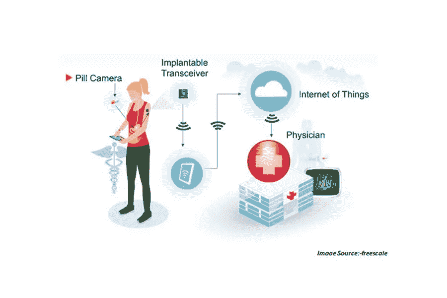

# 物联网和医疗保健的未来

> 原文：<https://medium.com/analytics-vidhya/iot-and-the-future-of-healthcare-4b4fa96cfb56?source=collection_archive---------24----------------------->

## *物联网将如何改变医疗保健领域*

**图像信用** : [smartData 企业—“医疗中的物联网”](https://www.smartdatainc.com/iot-in-healthcare/)

# 物联网:崛起

很难准确指出这个术语何时成为公众的主流，除了它意味着“物联网”之外，对它知之甚少。似乎它应该是不言自明的，在某种程度上，它是。然而，需要更深层次的理解来认识其演变的原因及其包含的含义。

> **技术术语**:一个由相互连接的计算设备、物体、技术设备、网络节点、接收器和无数其他设备组成的系统，所有这些设备都有能力在整个网络中不断传输大量数据，而无需任何人机界面交互。
> 
> 通俗地说:在手机成为智能手机之前，它唯一的功能就是发信息和打电话(想象一下！).然后，互联网成立了。现在，它可以给你播放视频，播放歌曲，阅读书籍，回应你的声音。

重要的是，将设备、物品、这些东西连接到互联网打开了一个可能性的世界，我们作为消费者和企业都从中受益。在过去的十年里，随着能够连接到网络的东西的数量急剧增加，我们很高兴地使它们成为可能，人们开始认为我们只是想把所有存在的东西都连接到互联网上。

> **→因此，这个术语在 2010 年中期被创造出来——物联网**

# 它如何以及为什么重要

被归类为[物联网的事物有三个重要的功能](https://www.iotforall.com/what-is-iot-simple-explanation/)，它们相互联系、协同工作，并提供各自独特的优势。

> 1.收集和发送信息:通过传感器从环境中收集信息来帮助决策。
> 
> 2.接收信息并根据信息采取行动:像打印机和汽车这样的东西接收信息，然后相应地采取行动，如打印文件或开门。
> 
> 3.双管齐下:一个自我维持、自我调节的系统，如智能恒温器，它可以收集信息，将信息发送到适当的渠道，而不需要反馈，可以接收信息并采取相应的行动——所有这一切都导致了一个高效的简化流程。

物联网影响着我们日常生活中的一切。从我们旅行的方式，我们购物的方式，我们交流的方式，我们工作的方式，甚至是我们甚至没有意识到的方式。

联网汽车一直在迅速崛起，因为汽车制造商不仅能够通过嵌入汽车的传感器和摄像头收集大量数据，还能够利用他们随着时间的推移收集的关于交通行为、驾驶模式、城市基础设施和不断变化的交通法规的数据。

# 卫生保健

与其他领域相比，物联网在医疗保健领域的潜力可能更大。能够从种类繁多的传感器中收集关键医疗保健数据所带来的好处是惊人的。举几个例子，有个性化远程医疗、疾病预防和监测、通过血压和糖尿病进行健康监测，以及神经传感器。

除了最受欢迎的健康“监控”设备可穿戴设备，其他可以监控医院资产的设备可以通过不断发送基本医院设备的实时数据来拯救数百人的生命。这些设备开始大量进入医疗保健领域，无论是医生还是患者。超声波、温度计、血糖监测仪、心电图仪等设备越来越多地相互连接，并不断相互通信。

佩戴心脏监测器的患者的实时监控可以立即将数据传输给医疗保健专业人员，他们可以立即分析数据并挽救生命。

这就产生了一个新的物联网子类:IoMT——医疗物联网。这些包括一系列支持互联网的医疗设备，它们以匿名方式不断相互通信，并存储在受保护的环境中，如云:AWS、Google Cloud、Azure 等。

> 根据 Gartner 的数据，目前医疗保健领域的物联网预计将在 2020 年增长 29%。

# 医疗保健面临的挑战

人们可以想象，通过包含数百万患者个人健康信息的设备存储大量数据，然后通过庞大的网络传输，这为潜在的[危险数据泄露](https://www.theselfemployed.com/article/future-of-iot-in-healthcare/)打开了大门，这些数据不仅可能暴露患者的个人和机密数据，而且可能暴露医疗机构的个人和机密数据。

这完全说得通。有理由假设，如果医疗机构准备移交受 HIPAA(健康保险便携性和责任法案)保护的数千份机密医疗记录，那么负责处理这些数据的组织应该能够像保护自己的记录一样保护它们。

鉴于这只是物联网时代的开始，适当的身份认证技术尚未在大量增长的数据中得到适当的审查或测试。此外，容纳和处理[“互联设备的普及”](https://www.theselfemployed.com/article/future-of-iot-in-healthcare/)所需的医疗保健基础设施尚未完成，因此医疗保健机构将不得不合作并携手工作，从根本上改变他们通过手头的数据聚合在整个网络中提供服务的方式。

事实上，[物联网安全研究所的主席和创始人艾伦·米哈利奇已经帮助建立了一个安全框架](https://securityintelligence.com/articles/the-potential-and-perils-of-the-iot-in-healthcare/)，该框架表明了保护大量通信渠道、设备和接口的指导方针。根据他的框架，医疗保健机构应该以这样的方式进行配置，即数据和信息流应该在所有各方、利益相关者、工程师、架构师之间共享，所有这些人都必须完全符合安全框架，以便任何威胁或攻击都可以让机构准确地指出他们的漏洞所在。

# 总体挑战

在讨论医疗保健的安全问题之前，人们对这个快速增长的物联网环境中的隐私安全和安全性有许多担忧。行业和政府组织刚刚开始了解他们在监管方面将面临的挑战，还没有达到提供可行解决方案的顶点，更不用说就此数据的监管进行信息丰富的讨论了。

例如，2016 年 10 月 21 日，域名系统发生大规模 DDoS(分布式拒绝服务)攻击，导致 Twitter、Github 等网站无法访问。这一特定攻击是由一个僵尸网络实施的，该网络由大量物联网设备组成，包括摄像头、IP 网关、保姆摄像头等。

在上面提到的关于联网和自动驾驶汽车的例子中，投入巨资的公司同样仍处于试点阶段，因为他们测试了这些物联网设备如何能够成功地相互交互并在没有人类输入的情况下变得高效，在这种情况下，驾驶员控制车辆。然而，这并不容易，因为已经有几十个记录在案的案件，关于车辆无法注册模糊的形状，结果是人，在某些情况下，甚至根本没有注册他们。最重要的是，鉴于每个城市和州的道路、高速公路和街道的独特架构，它概括了这些公司能够将他们的车辆部署到主流中，以及公众适应它们的漫长道路。

# 应对挑战的目标

[从根本上说，物联网系统需要一些目标](https://en.wikipedia.org/wiki/Internet_of_things#Privacy_and_security_concerns)。它们如下:

1.  数据机密性—恶意第三方不得访问传输和存储的数据
2.  数据完整性—任何类型的数据损坏都必须是可检测的
3.  不可否认性—任何数据发送者都不能否认自己发送的数据
4.  数据可用性—任何传输和存储的数据都必须是可访问的，并允许有权访问该数据的授权方访问

尽管人们试图降低物联网带来的风险，但仍存在进入市场的障碍，计划进入物联网领域的企业在很大程度上仍停留在试点阶段，无法扩展其基础设施以适应这一庞大的网络。

然而，随着组织开始将其数据转移到基于云的系统，第一步已经呈指数级发生，这主要是物联网格局的核心所在。云服务提供商同样配置了大量的数据保护措施来保护这些数据。

虽然随着物联网网络的扩展，网络安全风险将越来越成为一个令人担忧的问题，但它在医疗保健领域*尤其*至关重要，在医疗保健领域绝对**没有出错的余地**。

# 后续步骤

对于任何医疗保健专业人员、机构、监管组织来说，在医疗保健中正确接受和实施物联网之前，最重要的一步是参与关于安全和隐私专业人员实施和共同遵守的框架的实质性讨论，以及他们的相关同行。

成功的关键最终在于持续的**沟通**和**讨论**，同时行业跟上物联网的发展步伐。

# 感谢阅读作家协会——一个笔名为的出版物

在 ManyStories.com**上分享你的故事，接触更多读者。 [**在 repeat**](http://pensignal.com/?penaid=5c9d9cd86b86e65745140bfa) 上自动发布你的故事，并发出信号以增加参与度。**

****