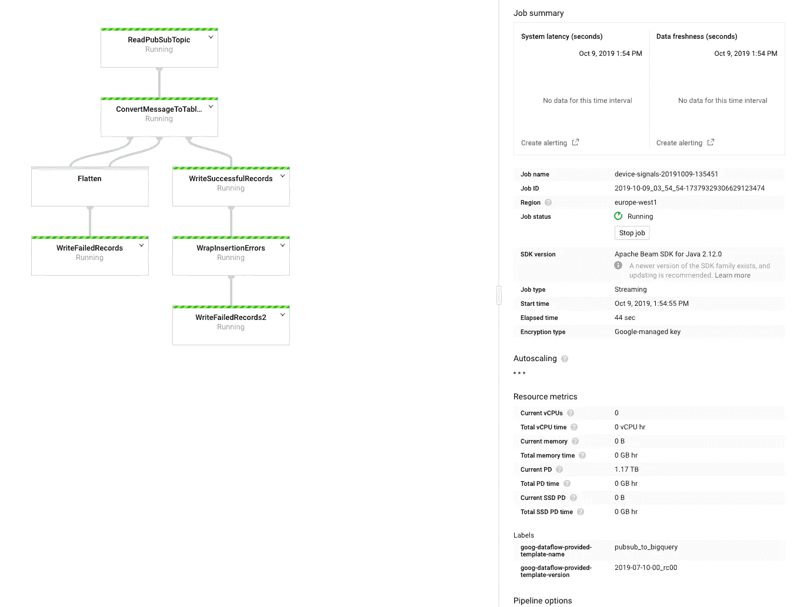
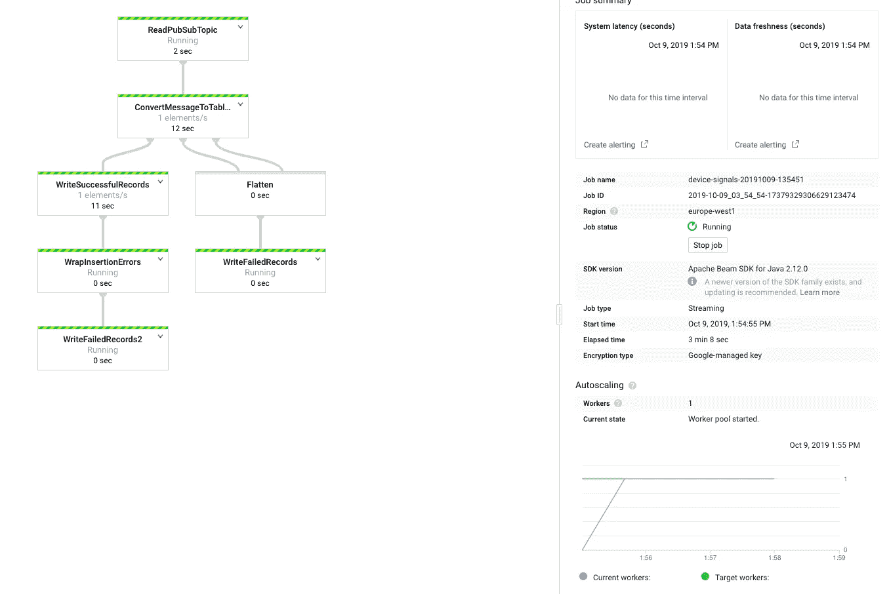
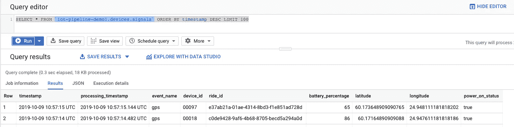
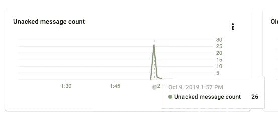

# GCP 的物联网数据管道，多种方式

> 原文：<https://medium.com/analytics-vidhya/iot-data-pipelines-in-gcp-multiple-ways-part-2-893269d56371?source=collection_archive---------8----------------------->

## 第 2 部分:加载实时数据、转换和存储


[维克多](https://unsplash.com/@victor_g?utm_source=medium&utm_medium=referral)在 [Unsplash](https://unsplash.com?utm_source=medium&utm_medium=referral) 上的照片

欢迎阅读本系列的第 2 部分。《T4》前情提要第 1 部分我们配置了发布/订阅主题和 BigQuery，并对虚拟数据运行了一些测试查询。

接下来，我们开始实际接收一些实时数据，将其转换并存储到我们的 BigQuery 表中。

正如我之前提到的，有多种方法可以做到这一点，在这一部分，我们将重点关注一款名为[云数据流](https://cloud.google.com/dataflow/)的产品。

> 云数据流是一种完全托管的服务，用于以流(实时)和批处理(历史)模式转换和丰富数据，具有同等的可靠性和表达能力，不需要更复杂的解决方案或妥协。借助其无服务器的资源配置和管理方法，您可以获得几乎无限的容量来解决您最大的数据处理挑战，同时只需为您使用的资源付费。

为了省去用 Java 或 Python 编写自己的束流的麻烦，我们将利用 Google 的[预制模板，并使用我们定制的 DST 转换器来处理数据。](https://cloud.google.com/dataflow/docs/guides/templates/provided-templates)

> 云数据流模板允许您在云存储上暂存管道，并从各种环境中运行它们。
> Google 提供了一套[开源](https://github.com/GoogleCloudPlatform/DataflowTemplates)云数据流模板。

因此，让我们为数据流设置我们的项目。首先，我们需要一些新的环境变量，记得使用和第 1 部分中相同的变量。
你也可以使用 [Git 库](https://github.com/jerryjj/iot-pipelines-series)并按照那里的指示来设置它们。

```
export GCP_ZONE=$GCP_REGION-b # choose a zone from selected region
export BUCKET_NAME=$GCP_PROJECT_ID-dataflow
export PIPELINE_FOLDER=gs://${BUCKET_NAME}/devices
```

现在让我们使用 gcloud 在项目中启用新的 API

```
ENABLE_APIS=(
"storage-api.googleapis.com" \
"dataflow.googleapis.com"
)gcloud services enable --project=$GCP_PROJECT_ID ${ENABLE_APIS[@]}
```

接下来，让我们创建我们的云存储空间

```
# If your region is outside EU, change accordingly
gsutil mb -p $GCP_PROJECT_ID -l eu gs://$BUCKET_NAME
```

如前所述，我们将为我们的 Pub/Sub to BigQuery 流管道使用 Google 提供的模板，更具体地说，我们将使用此模板[https://cloud . Google . com/data flow/docs/guides/templates/provided-streaming # cloud-Pub Sub-topic-to-big query](https://cloud.google.com/dataflow/docs/guides/templates/provided-streaming#cloud-pubsub-topic-to-bigquery)，并且我们将利用该模板的 UDF(用户定义函数)支持。

为了开始部署模板，我们首先需要定义我们的 UDF 函数，并将其存储到 Google 云存储中，以便数据流运行程序可以访问它。

让我们编写下面的 UDF 变换函数，并将其保存为 udf.js

然后，让我们将这个文件复制到我们的云存储桶中

```
gsutil cp udf.js $PIPELINE_FOLDER/udf.js
```

现在，我们准备在数据流中启动管道，一旦我们执行以下命令，管道将创建一个订阅我们的发布/订阅主题，并开始侦听传入的消息，解析它们并将它们存储到 BigQuery。

```
JOB_NAME=device-signals-`date +"%Y%m%d-%H%M%S"`gcloud dataflow jobs run $JOB_NAME \
--project=$GCP_PROJECT_ID \
--region $GCP_REGION --zone $GCP_ZONE \
--gcs-location gs://dataflow-templates/2019-07-10-00/PubSub_to_BigQuery \
--parameters \
"inputTopic=projects/$GCP_PROJECT_ID/topics/$PS_TOPIC_ID,\
outputTableSpec=$GCP_PROJECT_ID:$BQ_DATASET_ID.$BQ_TABLE_ID,\
outputDeadletterTable=$GCP_PROJECT_ID:$BQ_DATASET_ID.${BQ_TABLE_ID}_deadletter,\
javascriptTextTransformFunctionName=transformDeviceSignalEvent,\
javascriptTextTransformGcsPath=$PIPELINE_FOLDER/udf.js"
```

现在，我们可以转到 GCP 控制台中的数据流仪表板来监控管道。



管道正在预热

现在，正如您所看到的，尽管发布/订阅主题中没有可用的数据，但已经有最少数量的虚拟机在运行并等待数据。

因此，让我们给他们一些事情做，并启动我们的设备模拟器，开始向我们的发布/订阅主题发送一些数据。

为此，首先必须从 Github 中克隆这个文章系列[库，并设置模拟器/自述文件中提到的先决条件。](https://github.com/jerryjj/iot-pipelines-series)

要使用 10 台设备运行模拟器，请运行以下命令

```
# this will launch 10 devices in Helsinki, Finland by default
cd simulator/
DEVICE_COUNT=10 node src/index.js
```

您应该会看到发送不同信号的设备的一些调试输出

现在，如果您返回到 GCP 控制台的数据流视图，您应该会看到处理数据的步骤。



处理传入数据的管道

现在打开 BigQuery 仪表板，执行下面的查询，查看数据库中最新的 100 个条目(替换您的项目 ID)

```
SELECT * FROM `YOUR_PROJECT_ID.devices.signals` ORDER BY timestamp DESC LIMIT 100
```



好了，你拿到了。现在，您有了一个数据流管道，可以处理从设备到 BigQuery 表的所有数据。

点击云控制台用户界面，查看数据流日志，查看发布/订阅主题和订阅视图，以熟悉其他设置。

例如，当您检查您的订阅仪表板时，您将看到未确认消息的峰值。发生这种情况是因为我们的模拟器正在向主题发送事件，但是数据流还没有准备好开始从订阅中读取它们。



如您所见，一旦管道准备就绪，它就会提取所有旧消息并进行处理。

记住停止你的数据流管道，这样它就不会继续产生费用。为此，请停止模拟器(CTRL-C)并运行以下命令

```
JOB_ID=$(gcloud --project $GCP_PROJECT_ID dataflow jobs list --region $GCP_REGION --status active --filter=name:device --format="value(id)")gcloud --project $GCP_PROJECT_ID dataflow jobs drain --region $GCP_REGION $JOB_ID
```

数据流的定价基于所选的机器类型、最大工人数量、磁盘大小等。根据数据量，该管道(默认情况下)每月的成本约为 256-768 美元。

这就结束了我们这个系列的第二部分。在下一部分，我们将讨论如何使用云函数在没有数据流的情况下做到这一点。

感谢您的阅读，这里是第三部分的链接。