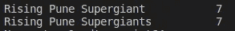
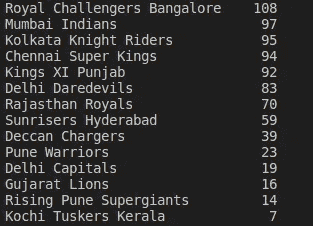
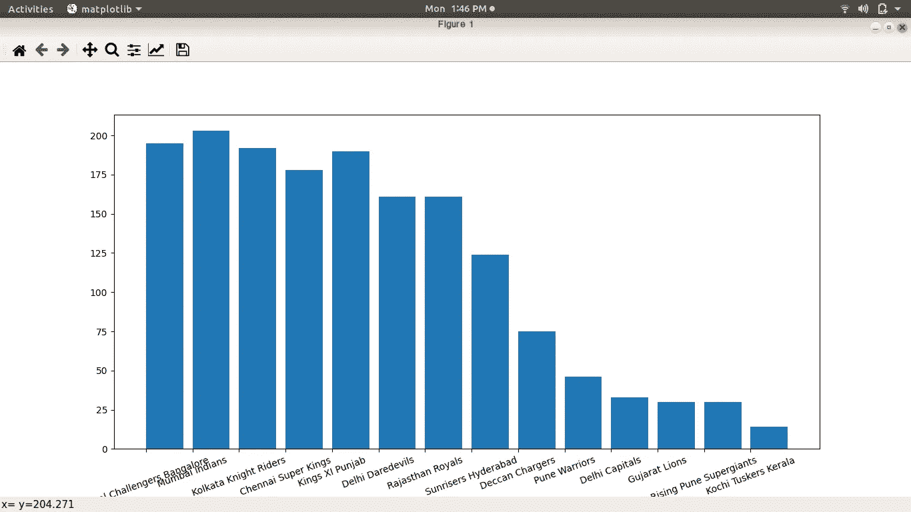

# 用 Pandas 和 Matplotlib 进行 IPL 数据分析

> 原文：<https://medium.com/analytics-vidhya/ipl-data-analysis-with-pandas-and-matplotlib-cade024625de?source=collection_archive---------14----------------------->

嗨，大家好，希望你们会喜欢看印度超级联赛。你有兴趣分析同样的 IPL 数据吗？！那这篇文章就送给你了！！

**本练习的先决条件:**

*   计算机编程语言
*   熊猫
*   Matplotlib
*   下载的数据集

**正在下载数据集:**

让我们下载数据集开始数据分析。下面的链接有 IPL 从 2008 年到 2020 年的全部数据，

[](https://www.kaggle.com/patrickb1912/ipl-complete-dataset-20082020) [## IPL 完整数据集(2008-2020)

### 最新和完整的 IPL 数据集

www.kaggle.com](https://www.kaggle.com/patrickb1912/ipl-complete-dataset-20082020) 

您可能需要登录以获取数据集。

**咱们码:**

一旦你下载了数据集，解压并准备使用它。这里我要分析文件“IPL Matches 2008–2020 . CSV”。它有所有比赛的细节，比如哪个队打了比赛，谁赢了，最佳球员等等..在这个练习中，我想知道每个队的总比赛次数。现在让我们导入必要的库，

```
import pandas as pdimport matplotlib.pyplot as plt
```

现在，我们需要获取解压后的 csv 文件，并将其作为 dataframe 存储在一个变量中，

```
df = pd.read_csv('/home/siddharth/Downloads/IPL Matches 2008-2020.csv',index_col='id')
```

要使用打印功能检查数据是否已加载到变量中，

```
print(df)
```

Dataframe 是一种二维数据结构，类似于具有行和列的表格。因为我们需要找到所有球队的比赛总数，所以我们只需要引用两列(即“team1”和“team2”)。让我们得到两列的唯一值，

```
team1 = df['team1'].value_counts(dropna=False)
team2 = df['team2'].value_counts(dropna=False)
print(team1)
```

在上面的代码片段中，我们获得了列 team1 和 team2 的唯一值。尝试打印 team1 系列(系列在 dataframe 中表示为一列)。



拼写错误的团队名称

您可能会注意到团队名称“Rising Pune Supergaints”缺少“s ”,这导致它将团队作为单独的值进行计数。

**我们来清理数据:**

为了清理数据，我们只需要将字符串替换为以“s”结尾的团队名称，

```
df["team1"]=df["team1"].replace("Rising Pune Supergiant","Rising Pune Supergiants")
df["team2"]=df["team2"].replace("Rising Pune Supergiant","Rising Pune Supergiants")
```

因此，上述代码将在系列 team1 和 team2 中用“Rising Pune Supergiants”替换“Rising Pune super giants”。现在，您将知道第一组和第二组系列中的正确队数，



修正了团队人数

**计算球队的比赛总数:**

为了计算各队的比赛总数，您需要计算两列中球队名称的出现次数——“team 1”和“team2”。下面的逻辑将有助于获得所有球队的比赛总数，

```
teams={}
for i in team1.index:
   t1=team1[i]
   t2=team2[i]
   teams[i]=t1+t2
print(teams)
```

在上面这段代码中，我们将球队定义为一个字典，以球队名称作为键，以球队比赛的次数作为值。team1.index 变量将保存 team1 列的整个索引值。我们试图在两列(“团队 1”和“团队 2”)中添加团队名称的出现次数。

现在让我们使用 matplotlib 在图形中绘制值和键。

```
plt.bar(range(len(teams)), teams.values(), align='edge')
plt.xticks(range(len(teams)), list(teams.keys()),rotation=20)
plt.show()
```

我们试图用条形图显示输出，对 y 轴使用 bar 函数，对 x 轴使用 xticks 函数。然后使用 show()函数显示它。

你得到的图表应该如下图所示，



完整图形

**完整代码:**

快乐分析！！:-)