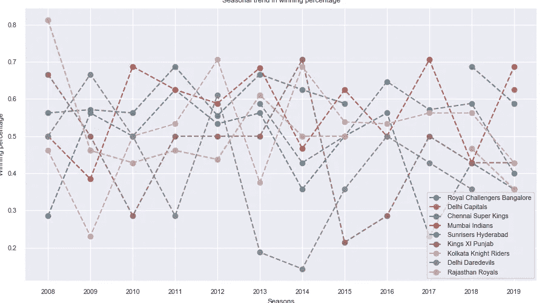

# 通过描述性分析粗略介绍 IPL

> 原文：<https://medium.com/analytics-vidhya/ipl-descriptive-analysis-d142ae11d5f2?source=collection_archive---------12----------------------->

板球是印度的一种宗教，印度超级联赛是印度次大陆最著名的赛事。板球是一项古老的英国运动，类似于棒球，关于这项运动的规则，请参见，[https://en.wikipedia.org/wiki/Cricket](https://en.wikipedia.org/wiki/Cricket)。我写这篇文章是为了通过分析 2008 年到 2019 年的数据，向一个不熟悉联赛的读者介绍联赛(不是这项运动)。数据从 Kaggle 数据集下载。https://www.kaggle.com/nowke9/ipldata/[非常感谢数据馆长@Navanesh Kumar。联赛采用 T20 赛制，每支球队最多有 20 回合的比赛时间。要理解这篇文章中的行话，请参考维基文章，或者随便对一个印度人说几句贬低板球的话——你会收到一篇关于板球的详尽论述。](https://www.kaggle.com/nowke9/ipldata/)

让我们先看看联赛进行了多少个赛季，每个赛季有多少支球队参加

因此，该联盟在 2008 年宣布，每个赛季至少有 8 支球队参加。2011/2012/2013 赛季有一批实验队，但从 2014 年开始，联盟恢复了 8 支球队的比赛模式。

现在来看看哪个队参加了多少个赛季。

图 1 参与人数

这进一步表明，在所有 12 个赛季中，球队之间的参与并不与只有 4 支球队参与一致。

# **第一部分——最成功的团队**

图 2 谁是冠军？

就哪个队赢得最多冠军而言，孟买印度人队名列榜首。参见图 2。然而，赢得冠军只是成功的衡量标准之一。让我们看看哪个队的胜率最高

图 3 各赛季球队的胜率

从上面可以看出，德里首都的胜率最高，但图 1 显示，他们只参加了一个赛季，所以这个值实际上是一个离群值。参加了 10 个赛季，胜率超过 60%的钦奈超王，可以被判定为最成功的球队。

# **第二部分团队成功的趋势**

成功——以胜率衡量是一个与赛季相关的指标，因为球队的组成和战略会随着赛季的变化而变化。为了对此进行评估，绘制了图 4——获胜百分比的趋势

图 4 胜率趋势

从上面的图中可以得出以下几点

1.  显然**孟买印度人**是上赛季(2019 年)最好的球队，赢得了几乎 70%的比赛
2.  几乎所有球队的胜率都比上赛季有所下降
3.  **德里夜魔侠**在 2018 年经历了一次改造，并被重新命名为**德里首都**——就当前赛季的胜率而言，这确实对他们有利。但是现在决定还为时过早
4.  **拉贾斯坦皇家队**一开始是联盟中最好的球队，但从未复制他们最初的成功
5.  趋势的差距表明球队没有参加各自的赛季(例如，钦奈超级国王队)

# **第三部聪明船长**

比赛开始时，队长要决定是上场还是击球。这个决定最终导致游戏的输赢。如果他们赢了掷币游戏，聪明队长是由这个队领先并赢得游戏的次数来衡量的。这必须每个赛季都要做，因为球队的策略每个赛季都会改变，这影响到队长的掷球决定。所以这张图也是和上一张一样的趋势

图 5 聪明船长的趋势

1.  钦奈超级国王队有一个非凡的队长和战略团队——但在两个赛季(2008 年和 2012 年)
2.  2013 年和 2014 年——德里夜魔侠队的最差队长在掷硬币时没有赢得任何比赛

从直觉上来说，感觉团队的胜率和团队/队长的决策有多聪明之间一定有某种关联。人们可以通过绘制趋势线的重叠来直观地检查这一点，以检查它们是否相互跟随

图 6 win _ PERC 和 cap_smartness 的趋势叠加图

注意图 6 中每个图的标题中的皮尔逊相关系数，它就在团队名称旁边。皮尔逊相关用于量化两种趋势的相似性。从图 6 中，趋势清楚地表明，在队长的聪明程度和胜率之间确实存在正相关关系。我们可以得出结论，队长/团队的策略，尤其是在掷硬币时，对获胜非常重要。

# **第 4 部分——15 轮过后，车队会加速吗？**

观众和评论员有一种假设，认为球队在比赛的最后 5 局(16-20 局)会打得更有侵略性。为了检验这一假设是否有价值，绘制了两个随机样本的平均得分分布图(也称为运行率)——一个样本取自 1-15 次运行率，另一个样本取自 16-20 次运行率

图 7 运行速度上 15 年前后的分布叠加图

两个群体的模式明显不同，但为了从统计上得出两个群体的均值不同的结论，可以对 16–20 和 1–15 之间的运行得分均值(run_rate)进行单尾统计 t 检验。

使用称为**t-检验的工具对样本总体均值的差异进行统计检验。**对 **mu_post_15 — mu_pre_15*，**进行显著性水平为 0.05 的 t 检验，我们可以安全地接受 **mu_post_15** 大于 **mu_pre_15 的假设。**关于 t-test 的技术实现细节，请参考[笔记本](https://github.com/adarbha/IPLDataAnalysis)。

*mu_post_15 和 mu_pre_15 分别是样本运行率的后 15 倍和前 15 倍的平均值

# **结论**

本文旨在通过对数据进行描述性分析，向不了解印度超级联赛的读者介绍印度超级联赛。从分析中可以得出以下结论

1.  在任何给定的赛季中，至少有 8 支球队参加联赛——然而，球队的参赛情况在不同的赛季中并不一致
2.  不同的球队在不同的赛季有不同的胜率。胜率最高的队伍赢得更多冠军
3.  以胜率衡量的团队成功与队长在掷硬币时的决策成功正相关
4.  据统计证明，在一场比赛中超过 15 次后，球队的得分率会更高

分析的源代码可以在[这里](https://github.com/adarbha/IPLDataAnalysis)找到