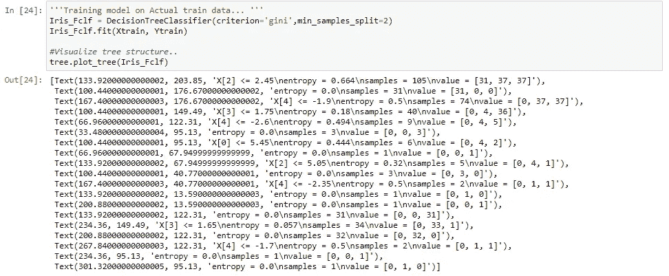

# 基于决策树算法的虹膜数据预测

> 原文：<https://medium.com/analytics-vidhya/iris-data-prediction-using-decision-tree-algorithm-7948fb68201b?source=collection_archive---------1----------------------->

@ Task 我们已经给出了具有 3 个类别的样本花的虹膜数据集来训练我们的算法/分类器，目的是如果我们向该分类器提供任何新数据，它将能够相应地预测正确的类别。

现在，我们开始导入一些 python 库来读取数据文件或可视化我们的数据点。要下载 Iris 数据集 [***点击此处***](https://github.com/BhaveshBhagat/Decision_Tree_classifier/blob/main/Iris.csv) 并获取 ipython 笔记本，链接如下。

读取 csv 文件的 python 代码

在阅读了 csv 文件数据之后，现在我们探索数据集，并对数据集有一些基本的了解..

# 数据集的一些基本信息

Iris_data 总共包含 6 个特征，其中 4 个特征(SepalLengthCm，SepalWidthCm，PetalLengthCm，PetalwidthCm)是独立特征，1 个特征(物种)是因变量或目标变量。Id 列类似于每个数据点的序列号。

所有独立特征具有非空浮点值，目标变量具有类标签(鸢尾-setosa、鸢尾-杂色、鸢尾-virginica)

前 10 项记录

数据的基本信息

使用“Iris_data.describe()”函数，我们可以获得一些数字信息，如总数据点数、平均值、标准偏差值、50%值等。对于数据集中的每个数字要素。这将有助于我们理解一些基本的数据统计分析。

正如我们看到的，每个类(物种)都有相等数量的数据点，所以我们的 Iris 数据称之为平衡数据集。在我们的数据集中，没有一个类是完全主导的。

# 可视化虹膜数据

为了可视化数据集，我们使用 Matplotlib 或 seaborn 作为 python 库。他们有许多像散点图，直方图，条形图，计数图等。为了更好地理解可视化数据…

通过查看散点图，我们可以说，与橙色(杂色)或绿色(virginica)特征点(SepalLengthCm，SepalwidthCm)相比，所有蓝点(Iris-setosa)完全分离

通过查看配对图的结果，我们确定所有的蓝点都与其他两个类别很好地分开。但是 Versicolor 和 virginica 彼此部分重叠。

在 pair plot 中，我们看到了一些特征组合，它们具有很少重叠的黑白杂色和海滨锦鸡儿，这意味着这些特征对于我们的分类任务非常重要。

# 探索一些新功能

在这里，我只是试图在现有功能的帮助下找到一些新功能。利用各特征之间的差异来获取更多的信息，并通过绘图将其可视化。

现在使用配对图基于类别标签查找关系 b/w 新特征。

*   在结对图的帮助下，我们获得了一些新的信息，但这些信息更有可能与我们之前看到的主要数据特征相似。

每个组合都很好地分离了鸢尾，但有一些重叠的黑白杂色和海滨锦鸡儿。

# 建筑分类模型

首先，我们需要删除 Id 列，因为它对分类标签没有用处..

使用 graphviz 库可视化决策树

因为我们的模型已经被训练…现在，我们可以使用交叉验证方法来验证我们的决策树，以获得我们的模型的准确性或性能得分。

*   正如我们所知，我们选择的功能运行良好，模型在验证或实际测试数据上给出了非常好的准确性分数。
*   因此，现在我们可以在实际训练数据集上训练我们的模型，使用选定的特征在真实世界案例中评估/部署我们的模型。

'''基于实际训练数据的训练模型…' ' '

为在真实世界案例中部署而构建的最终决策树…

在实际测试数据上检查模型的性能…

这就是我们如何使用 python 读取、分析或可视化鸢尾数据集，并构建一个简单的决策树分类器，用于预测新数据点的鸢尾物种类别，我们将这些数据点输入分类器…

如果你想得到完整的代码，那么 Iris 数据集和 ipython 笔记本的链接。ipynb)这里是*。*