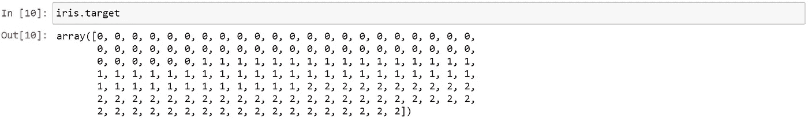

# 使用 KNN 的虹膜数据集分析

> 原文：<https://medium.com/analytics-vidhya/iris-data-set-analysis-using-knn-bfea147423ee?source=collection_archive---------1----------------------->

你已经完成了所有的阅读部分，你知道算法是如何工作的；你知道你能用给定的数据做什么；如何处理数据，你什么都懂，却不知道从哪里开始你的数据科学之旅。

今天，我将引导您完成这个数据科学的“Hello World”计划。这将使您清楚地知道如何从给定的数据集开始。在我们开始之前，我想提一下，Iris 数据集是一个分类问题，也就是说，我们必须根据为我们的模型提供的某些输入来分类它是属于 Versicolor、Setosa 还是 Virginica 类。

在虹膜类的分析和预测中，我们将使用 K-最近邻(KNN)算法。所以我们开始吧！

1.  我们需要导入所需的必要库，并且为了处理 iris 数据集，我们需要从 **sklearn** 库中导入它。

2.现在我们将看到我们的数据是什么样子的。

在上图中， **iris.feature_names** 用于查看特性名称， **iris.target_names** 用于查看我们上面已经讨论过的目标名称。有三个目标名称，即 Setosa、Versicolor 和 Virginica。最后， **iris.data** 用于查看数据集中的实际数据。该数据显示了萼片长度(cm)、萼片宽度(cm)、花瓣长度(cm)和花瓣宽度(cm)的值。

3.在开始处理数据之前，我们需要将这些数据转换成数据帧，以便处理这些数据。这可以在 **pandas** 库中提供的内置函数的帮助下轻松完成。

我们可以用**。head()** 函数查看数据的前 5 个值。如果您希望看到数据的最后 5 个值，我们可以使用**。tail()** 函数。现在我们来看看我们的目标值。

4.现在，我们将目标列添加到数据框中，并查看数据中的前 5 个和后 5 个值。

5.现在我们将使用一个名为 **pairplot** 的函数，它存在于 **seaborn** 库中。Pairplot 将使特征彼此可视化，我们将得到一个可视化图表，该图表将有助于仅选择相关特征，从而提供更好的结果。

在上面的可视化中，我们可以看到目标值是如何分布的，以及哪些特征有助于正确区分目标值。如果我们仔细观察，我们会发现通过选择**花瓣长度(厘米)**和**花瓣宽度(厘米)**，我们可以很容易地区分所有的虹膜类别。现在我们将为**花瓣长度(厘米)**和**花瓣宽度(厘米)**单独绘制一个图。这可以通过使用 **matplotlib** 库很容易地绘制出来。

上图清楚地显示了所有三个 iris 目标类之间的区别。

6.现在我们将数据拆分为**训练**数据和**测试**数据。用 **sklearn** 库就能轻松搞定。

导入 KNeighborsClassifier 后，我们将创建一个对象(在本例中，knn 是对象)。我们将在循环中执行模型的训练，以便我们可以获得‘n _ neighbors’的最合适的值。拟合模型，使用“knn.predict()”执行预测。我们将计算培训和测试分数，然后将其附加到各自的列表中。之后，我们将使用 **matplotlib** 库中的 **plot()** 绘制训练和测试分数。通过绘图，我们可以知道“n_neighbors”的值是多少，这样我们就可以进行训练。

上面的可视化显示了关于 k 值的精度结果。从上面的可视化可以得出，k=3 是一个合适的值。所以这个实验我们取 k=3(你可以取 k=4 对结果进行实验，看看 k=3 时和结果相差多少)。

因此，我们获得了 96.66%的准确率，这是一个很好的成绩。由于这是一个平衡的数据集，我们使用准确度分数。此外，我们将看到预测的混淆矩阵。

所以，这就是这部分的全部内容。希望你们都喜欢。