# 基于自动最大似然法的鸢尾属物种分类

> 原文：<https://medium.com/analytics-vidhya/iris-species-using-auto-ml-pycaret-327985fb362f?source=collection_archive---------11----------------------->


点击了解关于 iris [数据集](https://en.wikipedia.org/wiki/Iris_flower_data_set)的更多信息。

点击查看完整的[代码](https://www.kaggle.com/jerryjohn1995/iris-species-best-simple-accurate-100-pycaret)。

# **1。简介**

在这篇文章中，我们将学习如何通过一种方法来建立一个模型，这种方法与普通的传统方法或其他 Kaggle 作品中使用的所谓 raw 方法完全不同。传统方法的缺点是在数据预处理、特征选择、模型选择、超参数调整等方面浪费了大量的时间..这些天来，许多汽车 MI 是可用的，可以很容易 pip 安装和使用非常有效。许多耗时的工作可以简单地用几行代码完成。在大多数情况下，这种方法比使用传统方法制作的模型精度更高。

# **2。关于数据集**

表格中的每一行都代表一朵鸢尾花，包括它的种类和它的植物部分的尺寸，萼片和花瓣，以厘米为单位。在这里，我们正在寻找三种不同种类的鸢尾花。他们是

1.  杂色鸢尾
2.  刚毛鸢尾
3.  海滨鸢尾

它包括每种鸢尾的 50 个样本以及花的一些特征。一种花与另外两种花是线性可分的，但是另外两种花彼此不是线性可分的。

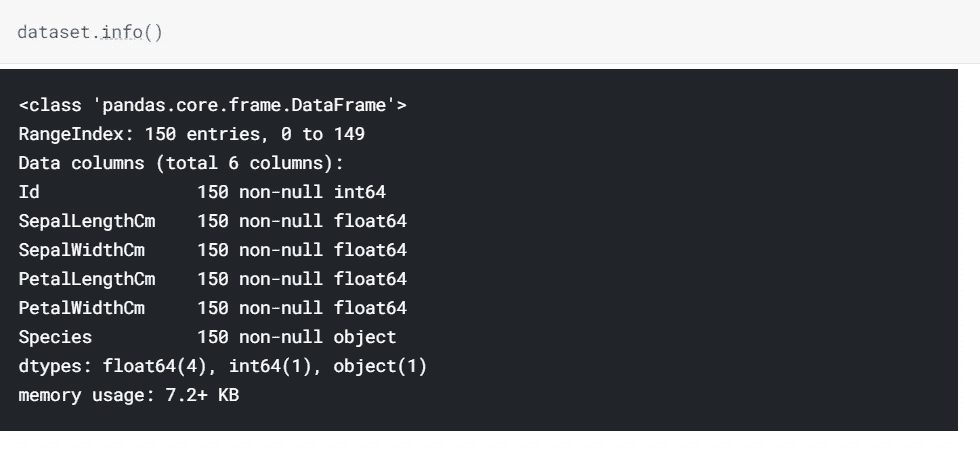

# **3。**安装必要的软件包

在我们进入编码部分之前，首先导入所有必要的包。

```
!pip install pycaretimport numpy as np *# linear algebra*
import pandas as pd *# data processing, CSV file I/O (e.g. pd.read_csv)*
import matplotlib.pyplot as plt *#Data visualization* 
import seaborn as sns *#Data visualization*
```

**pycaret** : *我们这里使用的 AutoML 是 pycaret*

**numpy** :用于线性代数的库

**pandas** :用于*数据处理的库，CSV 文件 I/O(如 pd.read_csv*

matplotlib :用于数据可视化的库。

**seaborn** :用于数据可视化的库。

# 4.获取数据

我们可以使用熊猫图书馆获得数据集。

```
*# Getting the dataset to "dataset" variable*

dataset = pd.read_csv("../input/iris/Iris.csv") 
*# the iris dataset is now a Pandas DataFrame**# Showing first 5 rows.*

dataset.head()
```

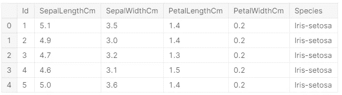

前五排

# 5.现在我们通过比较每一列来绘制图表。

**a .花瓣长度&花瓣宽度**

```
sns.FacetGrid(dataset,hue='Species',size=5).map(plt.scatter,'PetalLengthCm','PetalWidthCm').add_legend()
```

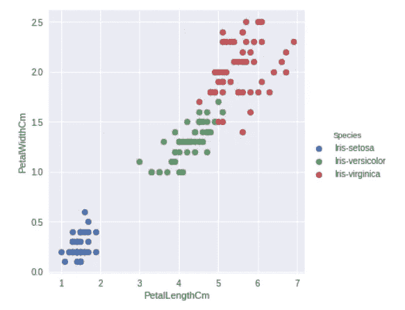

**花瓣长度&花瓣宽度**

**b .萼片宽度&花瓣宽度**

```
sns.FacetGrid(dataset,hue='Species',size=5).map(plt.scatter,'SepalWidthCm','PetalWidthCm').add_legend()
```

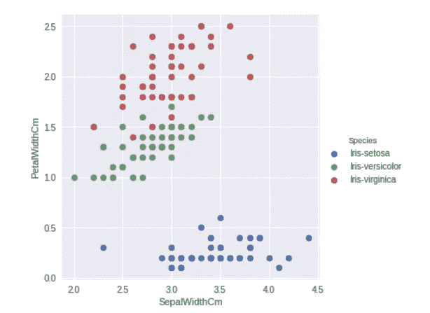

**萼片宽度&花瓣宽度**

**c .萼片宽度&花瓣长度**

```
sns.FacetGrid(dataset,hue='Species',size=5).map(plt.scatter,'SepalWidthCm','PetalLengthCm').add_legend()
```

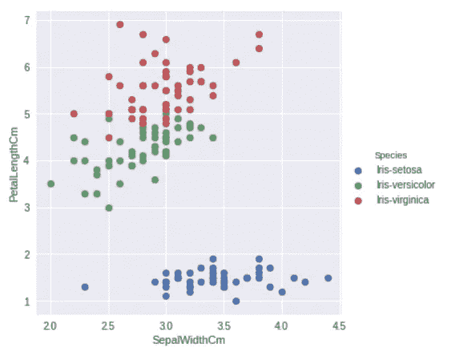

**萼片宽度&花瓣长度**

**d .萼片长度&花瓣宽度**

```
sns.FacetGrid(dataset,hue='Species',size=5).map(plt.scatter,'SepalLengthCm','PetalWidthCm').add_legend()
```

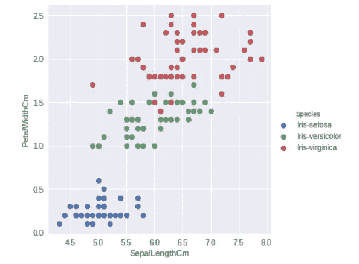

**萼片长度&花瓣宽度**

**e .萼片长度&花瓣长度**

```
sns.FacetGrid(dataset,hue='Species',size=5).map(plt.scatter,'SepalLengthCm','PetalLengthCm').add_legend()
```

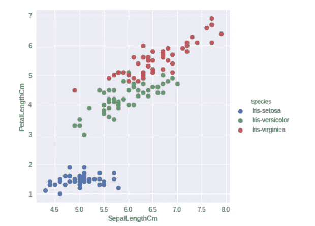

**萼片长度&花瓣长度**

**f .萼片长度&萼片宽度**

```
sns.FacetGrid(dataset,hue='Species',size=5).map(plt.scatter,'SepalLengthCm','SepalWidthCm').add_legend()
```

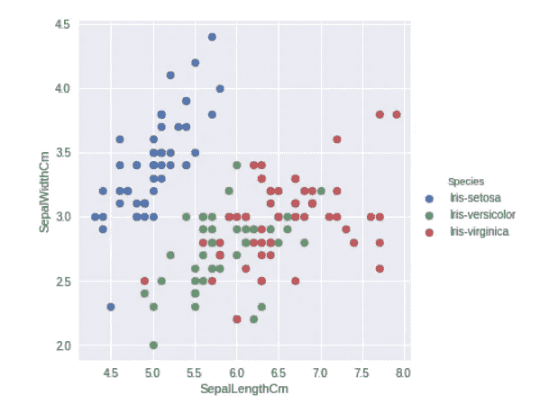

**萼片长度&萼片宽度**

# 6.检查数据集是否平衡或不平衡

**没有空值，数据是完好的，所以这里不需要数据预处理。**

我们知道有三种不同的鸢尾花(即:杂色鸢尾、刚毛鸢尾和海滨鸢尾)。对于每个分类问题，如果数据集是平衡的(即:如果有两个类感染(1)和未感染(0)，总共有 1000 行数据，我们可以说数据集是平衡的，如果数据集的 50%感染(1)，而另 50%未感染(0))。在我们的例子中，如果所有三个物种都有大约相同数量的数据，那么这是最好的情况。(如果数据集不平衡，那么有很多机会出现欠拟合和过拟合)

下面我们来检查一下这个条件。

```
dataset['Species'].value_counts().plot.pie(explode=[0.1,0.1,0.1],autopct='**%1.1f%%**',shadow=True,figsize=(10,8))
plt.show()
```

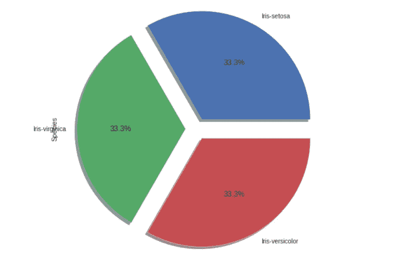

**这是一个平衡数据集**

# 7.为模型选择准备数据

在这一步中，我们将数据集一分为二。第一部分包含用于训练和测试的 95%的数据。剩余的 5%被存储起来，并用于尝试我们开发的最终模型(该数据被命名为未见过的数据)。

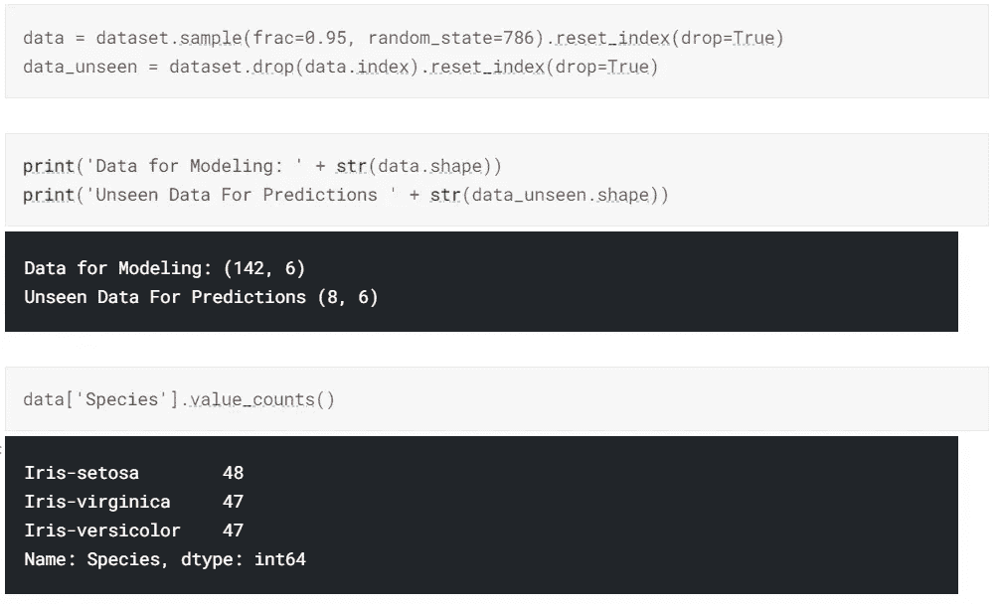

# 8.导入 pycaret 分类方法

我们在这里使用的自动 Ml 是 pycaret。它的工作非常简单，因为我们想给数据集作为数据，我们的目标列作为目标。我们还可以设置一些其他功能，如下所示。

```
*# Importing pycaret classification method*

from pycaret.classification import **# This is the first step of model selection*
*# Here the data is our datasets, target is the labeled 
column(dependent variable), section is is random number for future identification.*exp = setup(data = data, target = 'Species', session_id=77 )

*# After this we will get a list of our columns and its type, just confirm they are the same. Then hit enter.*
```

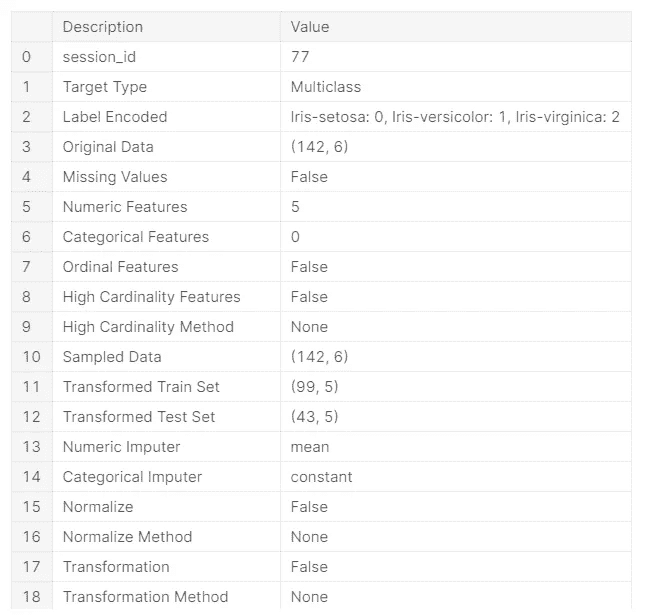

我们得到的输出

> 完成后，我们将得到一个列及其类型的列表，只需确认它们是相同的。然后按回车键。

# 9.比较模型

在确认列类型之后，我们可以用两个 ML 算法运行数据集，并比较性能，如下所示。

```
*#This command is used to compare different models with our dataset.*
*#The accuracy,F1 etc of each model is listed in a table.*
*#Choose which model you want*
compare_models()
```

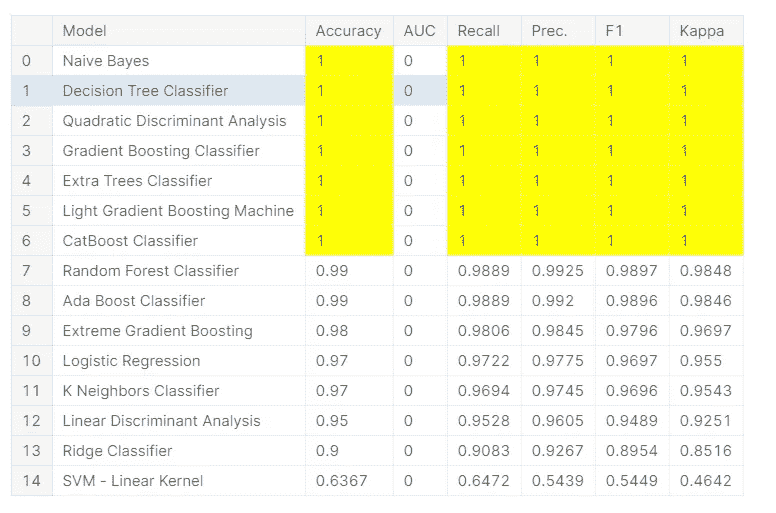

在上表中，我们可以看到许多具有良好精度的模型。

> *下一步是决定使用哪种算法，然后复制它的代码。*

**不同型号的代码如下。**

逻辑回归**‘lr’**

k 最近邻**‘KNN’**

朴素贝叶斯**‘nb’**

决策树**‘dt’**

SVM(线性)**‘支持向量机’**

SVM(径向基函数)**‘径向基函数支持向量机’**

高斯过程**‘GPC’**

多层感知器**‘多层感知器’**

山脊分级机**‘山脊’**

随机森林**‘RF’**

二次圆盘。分析**‘qda’**

AdaBoost**‘ada’**

梯度推进分类器 **'gbc'**

线性圆盘。分析**‘LDA’**

额外树分类器**‘et’**

极端梯度推进 **'xgboost'**

光梯度增强**‘light GBM’**

催化增强分类器**‘催化增强’**

# 10.创建模型

现在使用代码创建模型。

```
*# With this command we are creating a Naives Byes model*
*# The code for Naives Byes is " nb "*
*# fold is the number of fold you want*

nb_model = create_model('nb', fold = 10)
```

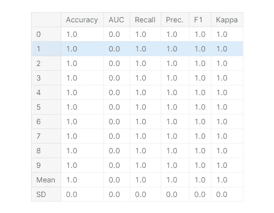

该表显示了所有 10 次折叠的精确度和其他读数。

现在调整超参数。

> *调整 hyper 参数将有助于提高精确度和其他功能。*

## 对于不平衡的数据集，我们主要看 F1 分数，因为我们的数据集是平衡的，我们可以使用精确度。

> 对于这些数据集，我们已经获得了 100%的准确率。因此，没有 t *调整超参数，*它会工作。

# 11.调整超参数

```
nb_tuned = tune_model('nb')
```

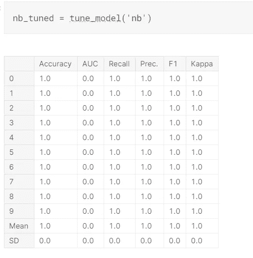

# 12.绘制 ROC 曲线

随着曲线向 x 和 y 轴移动，性能会提高。

```
plot_model(nb_tuned, plot = 'auc')
```

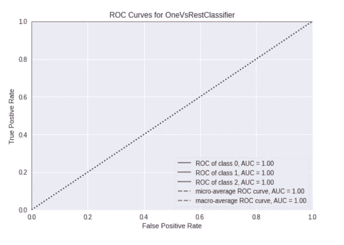

# 13.混淆矩阵

```
plot_model(nb_tuned, plot = 'confusion_matrix')
```

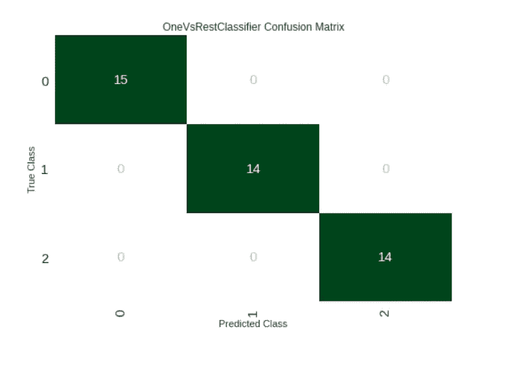

这里我们可以看到每一个值都被准确预测。一切都是积极的。

# 14.使用测试数据集预测准确性

```
predict_model(nb_tuned);
```


## 我们得到的精度为 1(即 100%的精度)

# 15.用看不见的数据检查

最初，我们将一部分数据集分离为看不见的数据集，用于检查最终开发的模型。下面我们正在检查这个。结果是带有标签和分数(最后两列)的数据框。其中标签是预测的标签，分数是机器认为具有准确度的百分比。

```
new_prediction = predict_model(nb_tuned, data=data_unseen)
```

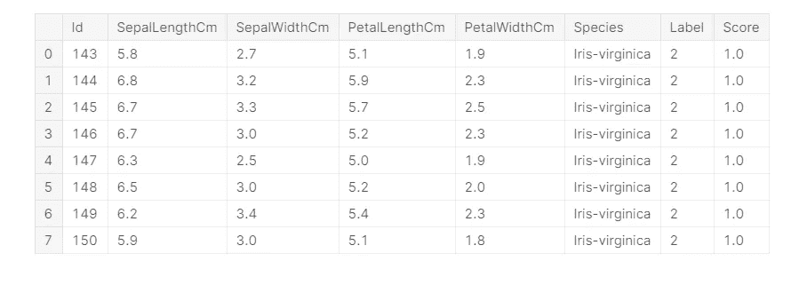

# 16.摘要

正如我们在上面看到的，我们得到了一个 100%精确的高精度模型，没有过度拟合。自动 Ml 更受欢迎，因为它耗时更少，而且效果非常好。对于经验不足的人来说，超参数调整并不容易，但它对模型的性能有很大的影响。

没有十全十美的，如果有人发现任何错误或建议，请在下面不吝赐教。