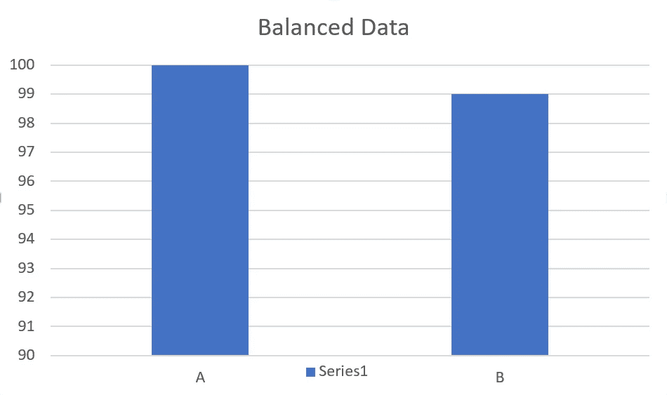
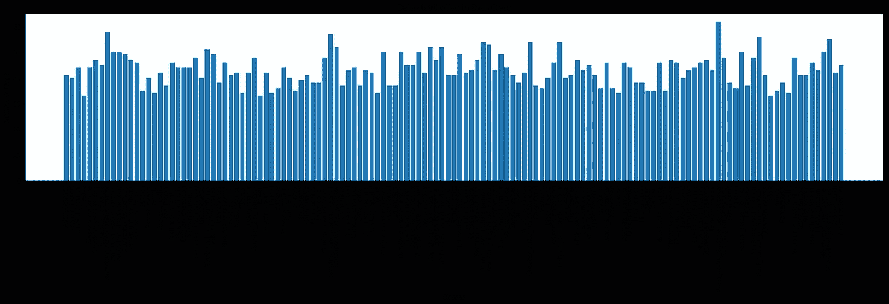
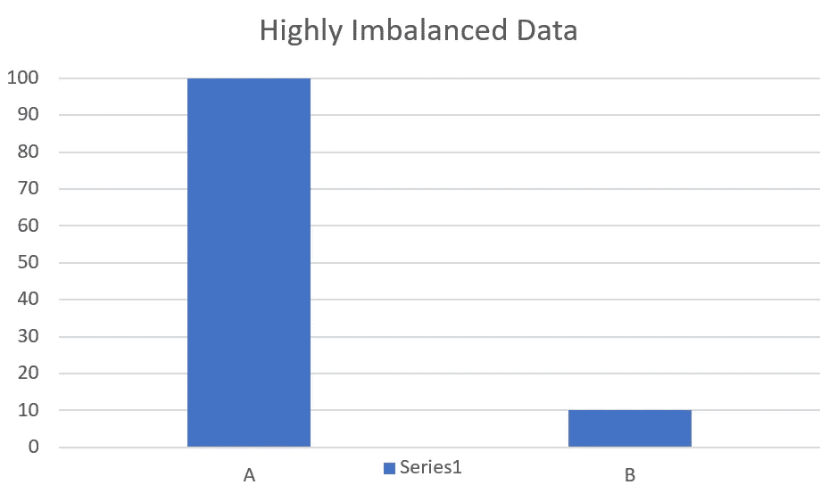
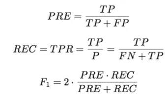

# 准确性是评价的唯一标准吗？？？是啊！而且没有！

> 原文：<https://medium.com/analytics-vidhya/is-accuracy-the-only-metric-of-evaluation-yes-and-no-6a65590ec39d?source=collection_archive---------19----------------------->

[玛丽·莱扎瓦](https://unsplash.com/@marilezhava?utm_source=medium&utm_medium=referral)在 [Unsplash](https://unsplash.com?utm_source=medium&utm_medium=referral) 上拍摄的照片

答案是一个**【是】**和一个**【否】**。每个人都有自己的条件。

什么时候答案会是肯定的？？？

如果数据是平衡的，则精确度可以是评估模型性能的唯一评估度量。

让我们考虑另一个例子。在下面的数据中，我们显示了各个品种的狗的数量。我们如何处理这种情况？准确性是评估的唯一标准吗？？让我们看看。

答案还是一个**“是”**。因为它取决于数据的阈值。尽管在上述条件下数据是不平衡的，但对每个品种的贡献计数超过了阈值(即 30)。因此，精确度可用于评估这种数据的模型性能。

那么，什么时候答案会是一个**“不”**？？？

当数据完全不平衡时，准确性不能作为评估模型性能的唯一指标。

上述情况的一个例子是欺诈性数据。与正常交易相比，欺诈交易的数量相当低。

在这种情况下，该模型被预测为给出良好的准确性，但是该模型也是有偏差的，并且更多地面向正常交易。因此，准确性不是评估模型性能的好指标。

在这种数据不平衡的情况下，除了准确性之外，还有哪些指标可以用于评估？？？

就是**精度**和**召回**。

**精度:**

模型给出的真阳性与实际结果的比率。

**回忆:**

真阳性与模型给出的预测结果的比率。

据观察，除了准确性之外，总有一个额外的度量来评估模型的性能。有必要在**准确度和精确度**或**准确度和召回**之间进行近似权衡。

使用度量的折衷策略，我们可以对模型预测的结果及其性能做出很好的现实结论。

快乐学习！