# 加拿大准备减少限制了吗？新冠肺炎回归分析

> 原文：<https://medium.com/analytics-vidhya/is-canada-ready-to-reduce-restrictions-a-covid-19-regression-analysis-6d16ae0cd71b?source=collection_archive---------35----------------------->

过去几周，加拿大各省政府已经开始着手减少新冠肺炎的限制。通过重新开放公园、公共场所和非必要企业，社会开始再次互动。这些决定引发了一场争论，即做出改变是否为时过早，以及这是否会引发病毒的另一次爆发。此外，人们质疑政府为什么取消社会距离措施，而不是旅行限制。绝大多数新新冠肺炎病例是通过社区传播的(Miller & Zafar，2020)。我认为，尽管通过聚会传播的新病例数量巨大，但加拿大准备逐步取消限制。然而，老年人更容易受到病毒的不良影响，应该继续隔离。下图 1 显示了每个省的新冠肺炎阳性病例总数。y 轴代表各省，并根据新冠肺炎阳性病例的数量进行排序。而 x 轴表示每个省迄今为止经历的病例数。图 1 是一个重要的图像，因为报告新冠肺炎病例数量最多的省份正是减少限制的省份。史蒂夫·兰伯特报告称，魁北克、安大略、阿尔伯塔和萨斯喀彻温是放松措施的省份(2020)。令人惊讶的是，受冲击最大的省份是那些再次开放的省份。政治和经济因素可能会影响政府开放魁北克、安大略和阿尔伯塔的决定。

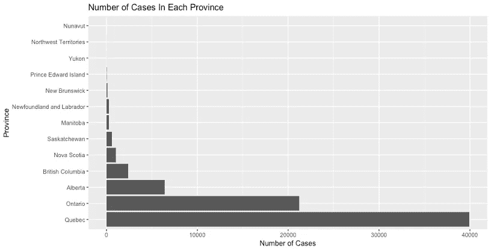

**图 1——加拿大各省总病例的详细情况**

作为卡尔加里人，我决定对艾伯塔省的病例数对限制解除的反应做一个总结，如图 2 所示。图 2 中的 y 变量是艾伯塔省到目前为止的病例总数，x 变量是从 3 月到 5 月的时间序列，每 15 天标记一次。x 轴从 3 月初开始，因为这是艾伯塔省首次报告病例的时间。在图 2 上还绘制了三条彩色线；蓝色、绿色和红色。蓝线标记 3 月 17 日，这一天艾伯塔省宣布进入紧急状态，绿线代表 5 月 4 日，这一天艾伯塔省宣布重新开放其市政公园，红线对应 5 月 8 日，当时省政府宣布餐馆、酒吧和咖啡馆可以在 5 月 14 日开放。比较绿线前后黑点的斜率，可以看到略有增加，表明报告的新病例比例较高。据推测，新病例的激增是放松社会距离措施的结果。人们已经开始再次相互交流，去远足，在后院聚会，这些会议可能会影响通过社区传播的新病例的数量。由于艾伯塔省的新增病例激增，省政府已经调整了他们的决定，因此卡尔加里和一个名叫布鲁克斯的小镇的餐馆在 5 月 25 日之前不允许营业(Dormer，2020)。卡尔加里和布鲁克斯被挑出来的早期重新启动，因为这两个被认为是艾伯塔省的 COVID 热点。

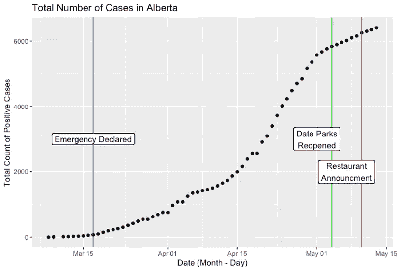

**图 2——艾伯塔省与政府决定相关的案件总数**

关注新新冠肺炎病例的传播类型，图 3 绘制了加拿大社区和旅行诱发病例之间的比较。x 变量用整数表示一年中的某周(即 01 = 2020 年 1 月 1 日，52 = 2020 年 12 月 24 日)。而 y 变量表示该周新增病例的数量，颜色表示病毒是通过旅行还是社区传播。分析图 3 突出了旅行是加拿大早期病毒传播的主要来源。预计在第 3 周和第 11 周之间会出现大量由旅行引起的病例，因为这是病毒进入加拿大的途径，而且当时国际旅行非常流行。此外，第 3 周和第 4 周没有社区传播的迹象，因为它和加拿大的病例尚未报告。然而，第 11 周(3 月 2 日)后通过社区传播的极端优势解释了为什么社会距离措施到位。可以看出，加拿大每周新增病例数在第 16 周达到高峰后持续下降。必须说明的是，用于评估传播类型的数据集包含约 34，000 个数据点，约为加拿大已报告病例的一半。数据点的这种差异是因为数据集仅使用详细病例报告的数据。

**图 3 —旅行和社区引起的新冠肺炎病例数量的每周比较**

进一步研究加拿大每周传播类型之间的比较，由社区传播引起的新病例的百分比与旅行传播的百分比一起绘制在图 4 中。图 4 的 y 轴表示每个表单传送的每周新病例的百分比。而 x 轴是自 4 月 5 日以来的每周分解，颜色对应于传输类型。最近几周，几乎所有的新病例都是由社区引起的。这些压倒性的百分比提出了一个问题，即现在开始重新开放业务是否还为时过早。

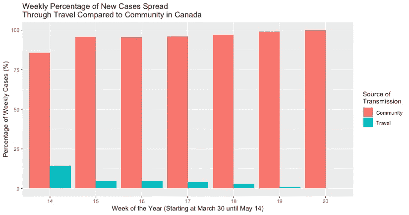

**图 4——4 月 5 日之后通过社区传播的每周病例与通过旅行传播的病例百分比对比**

不同年龄段表现不同。当我年轻的时候，我可以整天呆在家里玩电子游戏。那么病毒传播的类型会因年龄而异吗？某些年龄组更容易从社区感染病毒吗？图 5 显示了各年龄组社区传播的病例总数。x 轴上的年龄组是:1 代表 0-19 岁，2 代表 20 多岁的人，3 代表 30 岁，以此类推，一直到 80 年代。y 轴是每个年龄组通过社区发现的病例总数。图 5 显示了一种模式，其中 50 多岁、40 多岁、30 多岁和 20 多岁的人通过社区接触新冠肺炎的次数比其他年龄段的人多。这种趋势可以被认为是有职业的人，仍然参加工作并接触到许多其他人的群体。这种分布的另一种解释可能与家庭责任有关。这些群体中的人可能必须供养家庭，这可能涉及到去高风险场所，如杂货店。最后，从这个情节中一个有趣的观察是 80 多岁的人从他们的社区接触到了新冠肺炎。这些信息可以与老年护理机构联系起来，在那里，老年人被集中在一起，家人不断来访。

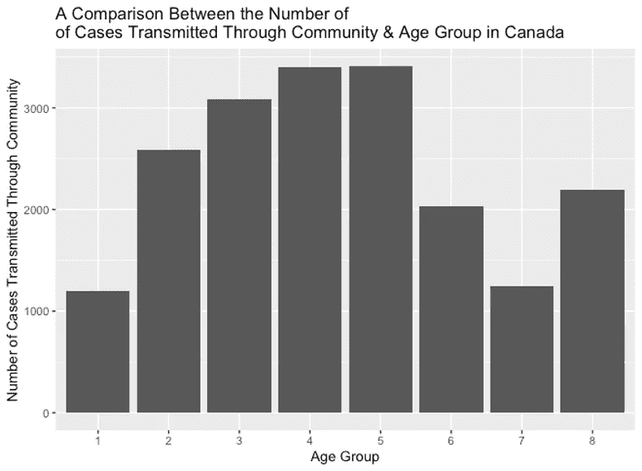

**图 5——不同年龄组通过社区传播传播的病例数**

考虑到之前的调查集中在传播病毒的不同年龄组，是否有年龄组经历更可怕的影响？图 6 显示了新冠肺炎病毒检测呈阳性并住院治疗的人数。图 6 的 x 轴是前面图 5 中提到的相同的年龄组，而 y 轴代表在这些年龄组中由于新冠肺炎而住院的总人数。图 5 的分布是线性的，这意味着年龄的增加对应于住院人数的增加。这一观察结果与疫情早些时候发表的各种新闻文章一致，这些文章声称老年人因其老化的免疫系统而面临更大的风险。

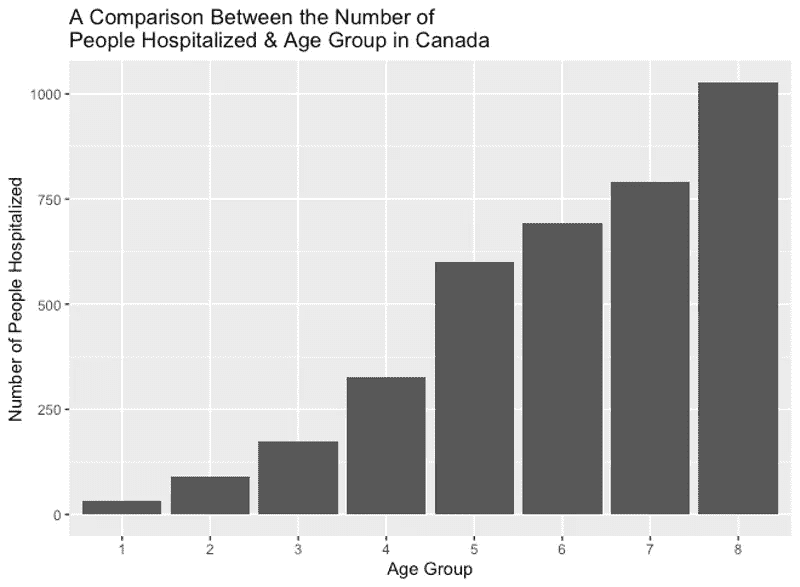

**图 6——每个年龄组中因新冠肺炎而住院的人数**

通过应用线性和多变量回归，可以确定变量之间的相关性。回归允许统计模型定量地解释模式，并确定变量之间是否可能存在关系。图 3、图 4 和图 5 都探讨了通过社区传播的新冠肺炎病例。图 3 和图 4 突出显示了社区传播的增加，图 5 显示了年龄和社区传播之间的模式。图 7 显示了一个回归模型，其中传播类型(1 =旅行，2 =社区)是一个人年龄的函数。该模型的研究结果表明，随着年龄的增长，传播类型也在增加。随着较大的传输类型值是团体，较大的年龄与团体传输相关。然而，由于模型生成的 p 值为 0.294，这种关系不显著，因此无效。此外，1.1 的小 F-统计表明没有预测变量，在这种情况下，年龄，与传播类型有关。

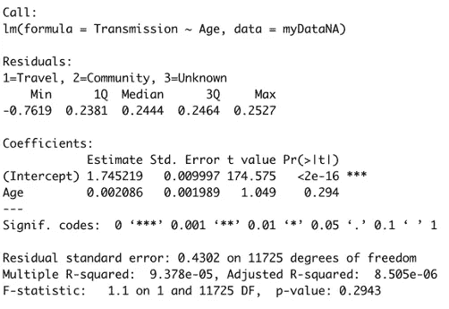

**图 7 —传输类型和年龄回归模型**

为了确定与传播类型相关的显著相关性，开发了各种回归模型。最有力的模型是图 8，将传播类型与日期和住院联系起来。数据集中的住院值要么是 1(如果此人住院),要么是 2(如果未住院)。这解释了与医院相关的负系数。住院率每降低一个单位，传播率就增加 88.3 个单位。预计医院不是导致社区传播可能性的一个可能因素。对此的一个理由是，随着住院人数的增加，接触新冠肺炎的其他病人、游客和工作人员的人数也在增加。此外，日期的正系数表明，日期每增加一个单位，变速箱类型就增加 0.0041 个单位。传播类型的增加代表着向社区传播的转变，因为社区传播在数据集中用数字 2 表示。这一观察表明，随着时间的推移，社区传播的数量上升。此外，该模型显示了日期和医院之间的积极互动。更具体地说，随着单位医院中的日期和人数减少，传播类型增加 0.00481。这种互动如此表现的一个原因是，随着时间的推移，住院人数减少，导致人们不再将疫情视为如此极端的问题，并开始放松社交距离措施。这些动作导致更大量的社区报告传输。模型中的所有 p 值表明每个预测因子都是显著的，大的 F 统计表明至少有一个预测因子在预测反应中是有用的。这种模型的一个缺陷是 R 平方值低。r 平方值用于表示模型的有用程度以及它对数据方差的解释程度。与至少 0.60 的商业标准相比，0.18 的 R 平方是低的。为什么该模型中的 R 平方较低的解释与不规则数据点有关，也称为“噪声”。噪声会影响模型的强度，因为模型无法解释数据中的差异。噪声很可能会影响模型中的关系。图 8 中创建的模型图可以在图 9 中看到，用红点表示。图 9 中还包括传达整个疫情新病例传播类型的黑点。此图中的 y 轴是传播类型，值 1 对应于出行，值 2 对应于社区传播。x 轴是从二月初到五月中旬的时间序列。该图直观地证实了较低的 R 平方值，因为模型所考虑的数据点数量最少。图 9 通过红点随着时间的推移向上移动，传达了在整个 3 月和 4 月传播类型如何从旅行转移到社区。图右侧从 2 下降到大约 1.5 的一组红点可能与住院治疗的减少有关。随着人们开始从病毒中恢复，卫生保健专业人员提供了改进的治疗程序，住院人数已经下降。当住院人数减少时，从我们的模型获得的传播值减少。

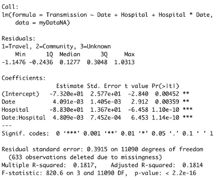

**图 8 —传播类型、日期和住院回归模型**

**图 9——传播类型、日期和住院回归模型图**

图 6 中呈现的年龄和住院之间的线性关系需要更多的研究，才能有把握地说存在相关性。图 10 和图 11 中显示的回归模型就是这样做的。图 10 中年龄组的微小 p 值表明年龄和住院之间有显著相关性。该模型表明，年龄组每增加一人，住院人数预计将增加 146.4 人。在该模型中需要指出的其他临界值是大的 F 统计量和高的 R 平方值。F 统计量再次证明年龄组与住院预测有关，而 R 平方值证实了该模型是有用的。图 11 中的曲线以红色显示模型，黑色数据对应于图 6 中的值。x 轴是本报告前面定义的各个年龄组，y 轴对应于该年龄组的住院人数。该图是线性的，并且将数据点拟合为最佳拟合的精确线。

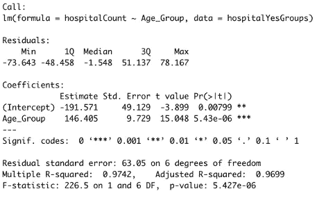

**图 10——住院人数与年龄回归模型的函数关系**

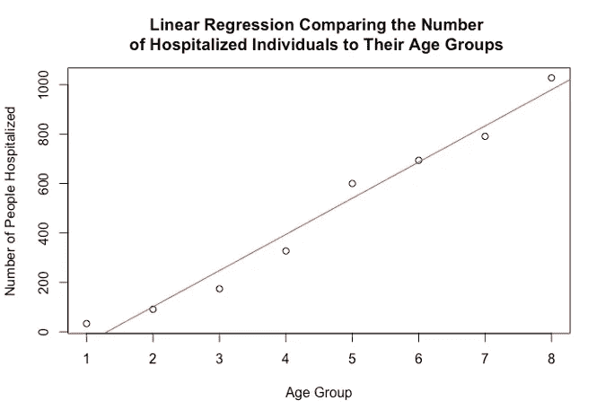

**图 11——住院人数与年龄回归模型的函数关系图**

最后，图 12 模拟了艾伯塔省确诊病例数，作为日期和已完成测试的多变量函数，包括两者之间的相互作用。这种交互是存在的，因为已经完成的测试的数量与已经过去的时间有关。从数学上讲，这个模型是显而易见的，它的重要性在所有预测因子的小 p 值、大 F 统计量和高 R 平方值中得到证明。然而，正是这个模型的图(如图 13 所示)使它变得有用。图 13 用红点显示模型，用黑点显示艾伯塔省的实际确诊病例。图 13 中的 x 变量代表不同的日期，y 变量对应于这些日期的确诊病例总数。模型的轨迹基于过去的事件，使用报告的数据绘制曲线。可以看出，尽管图 2 所示的限制有所减少，但 5 月份实际报告的案例与模型的预期相比已经持平。这一观察意味着各省可以成功地以渐进的速度重新开放社会领域，并经历较低数量的新病例。

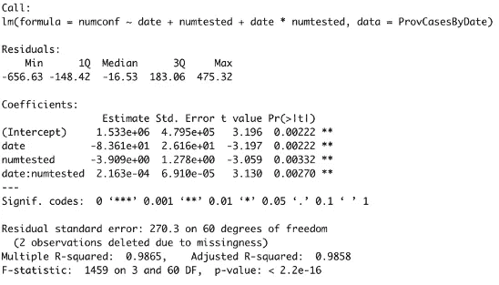

**图 12 —艾伯塔省确诊病例数与日期和检测次数的函数关系**

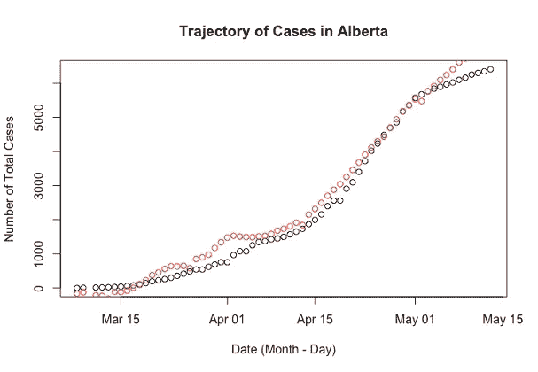

**图 13 —艾伯塔省确诊病例数与日期和检测次数的函数关系图**

最后，尽管担心新的病例会在社区中迅速蔓延，但加拿大准备开始重新开放社会。事实表明，像阿尔伯塔省这样的地方已经成功地开始了重新流行，同时使新病例的数量降到了最低。然而，为了有效地减轻病毒的社区传播，重要的是老年人保持距离，因为他们因病毒而住院的机会更大。如图 8 和图 9 所示，这种住院治疗可导致更大量的社区传播。

**参考文献**

多默博士(2020 年 5 月 13 日)。*卡尔加里和布鲁克斯的餐馆和发廊将于 5 月 25 日重新开业:肯尼总理。*检索自[https://Calgary . CTV news . ca/restaurants-and-hair-salons-in-Calgary-and-brooks-to-reopen-may-25-premier-kenney-1.4938158](https://calgary.ctvnews.ca/restaurants-and-hair-salons-in-calgary-and-brooks-to-reopen-may-25-premier-kenney-1.4938158)

南兰伯特(2020 年 5 月 3 日)。随着新冠肺炎限制的放松，一些省份将在周一享受更多的自由。检索自[https://www . theglobeandmail . com/Canada/article-some-provinces-to-enjoy-more-freedom-Monday-as-新冠肺炎-restrictions/](https://www.theglobeandmail.com/canada/article-some-provinces-to-enjoy-more-freedom-monday-as-covid-19-restrictions/)

米勒，a .扎法尔，a .(2020 年 3 月 24 日)。*一个根本性的转变:现在加拿大超过一半的新冠肺炎病例是通过社区传播的。*检索自[https://www . CBC . ca/news/health/coronavirus-Canada-community-spread-covid 19-1.5508830](https://www.cbc.ca/news/health/coronavirus-canada-community-spread-covid19-1.5508830)

**使用的数据集:**

加拿大政府。(2020).*冠状病毒病详细确诊病例(新冠肺炎)(初步数据)，加拿大公共卫生署。*从 https://www150.statcan.gc.ca/t1/tbl1/en/tv.action?取回 pid=1310076601。2020 年 5 月 14 日检索

加拿大政府。(2020).加拿大新冠肺炎的交互式数据可视化。2020 年 5 月 14 日从[https://health-infobase.canada.ca/covid-19/.](https://health-infobase.canada.ca/covid-19/.)取回的