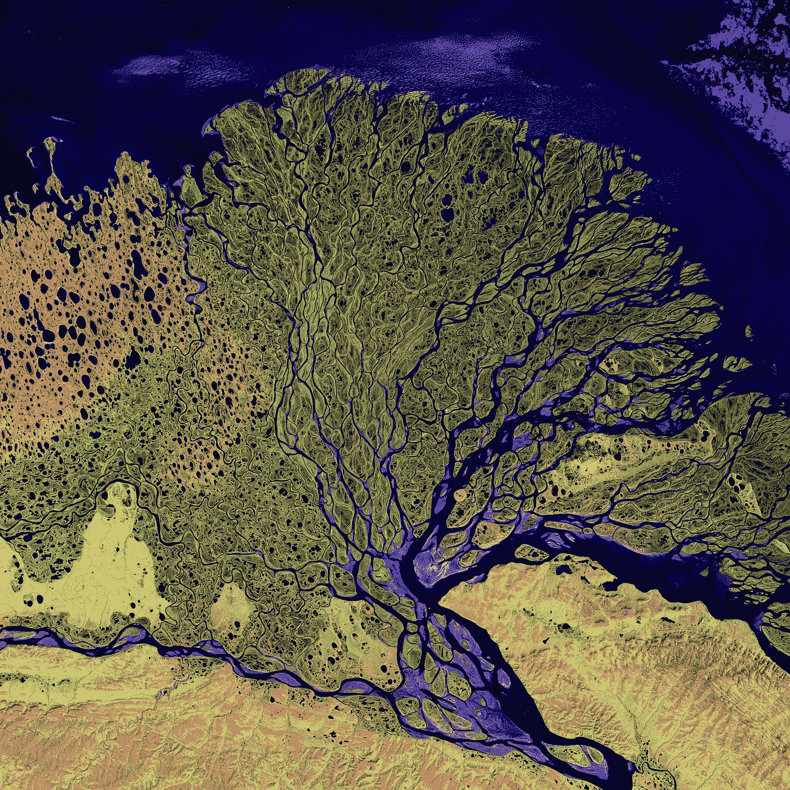
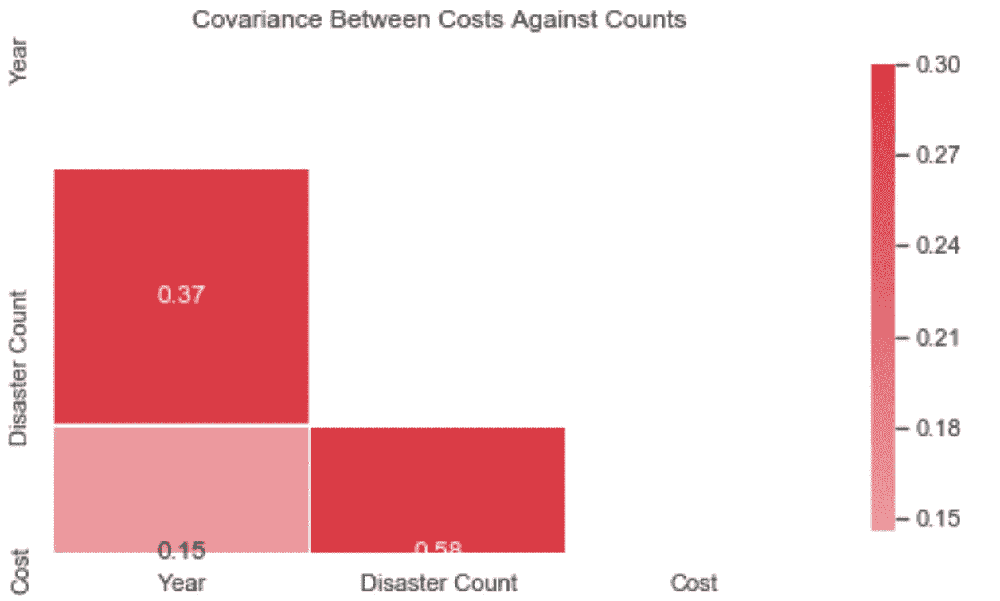

# 气候变化是个问题吗？你怎么知道的？

> 原文：<https://medium.com/analytics-vidhya/is-climate-change-a-problem-how-do-you-know-d91f97631b35?source=collection_archive---------15----------------------->


美国国家海洋和大气管理局在 [Unsplash](https://unsplash.com/s/photos/climate-chnage?utm_source=unsplash&utm_medium=referral&utm_content=creditCopyText) 拍摄的照片

# 被误导的代价

让我们面对现实吧，今天的信息比人类历史上任何时候都更容易获得。互联网本质上给了我们一个全球性的电话游戏，世界各地的每个人都可以加入进来。

然而，今天的信息传播方式存在一个问题，就像在任何电话游戏中常见的那样:随着信息的传播，它们往往会被扭曲。他们变得容易受到怀疑和欺骗。



令人惊叹的俄罗斯勒拿河卫星图像，这里是世界上最大的荒野保护区之一。[美国地质调查局](https://unsplash.com/@usgs?utm_source=unsplash&utm_medium=referral&utm_content=creditCopyText)在 [Unsplash](https://unsplash.com/s/photos/climate-denial?utm_source=unsplash&utm_medium=referral&utm_content=creditCopyText) 拍摄的照片。

也许没有什么问题比气候变化更受错误信息的影响。例如，[YouGov-Cambridge global ism Project](https://www.theguardian.com/world/2019/may/01/populism-what-is-yougov-cambridge-globalism-project-methodology)最近进行的一项全球调查发现，在世界上最富裕的 23 个国家中，美国排名第三，认为人类与气候变化无关的人口比例最高[(《卫报》，“美国是否认气候变化的温床”)。从阴谋论者到不准确的报道，有一件事是肯定的:这些天到处都是错误的信息。](https://www.theguardian.com/environment/2019/may/07/us-hotbed-climate-change-denial-international-poll)

## 气候变化:数据驱动的视角

如果你像我一样，你相信科学是一种天赋。这是我们了解真相的最好工具之一。它应该被每个人分享。我们这些自认为知道真相的人，有责任与他人分享。

也就是说，在这篇博文中，我向你提出了一个看似简单的挑战:*你如何知道自己是对的？*

> “这个世界上最大的挑战之一，是对一个主题了解得足够多，以至于认为自己是对的，但对这个主题了解得不够多，以至于认为自己是错的。”— [*尼尔·德格拉斯·泰森，世界著名天体物理学家*](https://mstr.cl/38Ut5p8)


作为数据可视化示例的比特币统计图表。由[汤姆·巴雷特](https://unsplash.com/@wistomsin?utm_source=unsplash&utm_medium=referral&utm_content=creditCopyText)在 [Unsplash](https://unsplash.com/s/photos/lightning?utm_source=unsplash&utm_medium=referral&utm_content=creditCopyText) 上拍摄。

要知道你对气候变化的判断是对是错，需要对数据有扎实的理解。数据科学不仅仅是数字——它是一种实践，能够从最初可能出现的完全不同的证据中推导出*的含义*。

虽然我只是 Make School 的一名学生[，但在这篇博文中，我想与你分享我迄今为止对数据科学的了解——如何*分析*它，如何*可视化*它，最重要的是，如何*从中得出结论*—通过对气候变化数据集的探索。](https://makeschool.com)

## 学习目标

在这篇博文中，我们将进行一次*探索性数据分析，*，这是指检查数据集以观察任何有趣的模式或其他值得注意的结论的过程。这是任何数据科学家工作常规的一部分。

**学习目标** 完成这篇文章后，你将能够做到以下几点:

1.  认识到几种统计方法的相关性，包括均值、中值、概率和其他从数据中辨别科学真理的方法。
2.  讨论在使用一种统计方法和另一种统计方法时可以做出的权衡。
3.  识别分析数据时可能出现的误导性结论！

**我们将使用的工具**


数据科学家常用的技术工具。形象归功于 [Make 学校关于 GitHub.com 的 DS 1.1 课程库。](https://github.com/UPstartDeveloper/DS-1.1-Data-Analysis/blob/master/Lessons/IntroductiontoDataScience.md)

如果你像我一样，刚刚开始进入数据科学领域，你可以使用我在 Kaggle.com 上发布的笔记本，像教程一样跟随这一探索。您需要做的就是确保您的机器上安装了以下工具:

1.  [Python(3.7 或更高版本)](https://www.python.org/downloads/)，一种在数据科学家中广受欢迎的计算机编程语言
2.  [pandas](https://pandas.pydata.org/pandas-docs/stable/index.html) ，一个流行的 Python 库，我们将使用它轻松地分析我们的数据
3.  [scipy](https://www.scipy.org/install.html) ，Python 中的另一个库，我们将使用它对我们的数据进行统计计算
4.  [matplotlib](https://matplotlib.org/users/installing.html) 和 [seaborn](https://seaborn.pydata.org/installing.html) ，它们也是 Python 中的库，我们将使用它们来创建数据的可视化

**什么是 Kaggle？**
Kaggle 是一个网站，来自世界各地的数据科学家在这里发布他们的发现，了解彼此的工作，并在数据科学竞赛中争夺奖项！如果你想看我的发现背后的代码，我欢迎你查看我关于 Kaggle.com 的笔记本。

**什么是 Jupyter 笔记本？这是另一个工具，它使 Python 中的数据科学比常规文本编辑器中的数据科学更容易上手。**

我欢迎你的怀疑:你可以安装 [Jupyter Notebook](https://pypi.org/project/jupyterlab/) 以便能够复制我通过 Kaggle 笔记本中的代码找到的结果；或者更好的是，您可以试验更精细的分析方法！请点击[我的 GitHub 库](https://github.com/UPstartDeveloper/climate-change-analysis/)的链接，将笔记本和它的 CSV 文件下载到你的本地电脑上。

Kaggle 是与志同道合的研究人员一起学习和教授数据科学的绝佳资源。如果你发现关于这个数据集的一些新奇有趣的东西，我鼓励你也把你的发现发布到 Kaggle 上！

当然，你可能会想，“如果我想了解更多关于气候变化的知识，为什么我不能谷歌一下(插入*知名媒体渠道*或*知名研究机构*)关于气候变化的说法？”你知道吗？我同意你的看法，但这有什么意思呢？

显然我在这里提出的分析会有缺点。我只是一个人；“自己动手”(也称为“DIY”)并不是严谨调查复杂科学问题的正确方法。换句话说，在这篇文章中，我并不声称自己拥有终极真理。


你不需要一个花哨的头衔或如画的灯光来成为一名业余爱好者；你只需要好奇心和一个目标！由[汤姆·巴瑞特](https://unsplash.com/@wistomsin?utm_source=unsplash&utm_medium=referral&utm_content=creditCopyText)在 [Unsplash](https://unsplash.com/s/photos/lightning?utm_source=unsplash&utm_medium=referral&utm_content=creditCopyText) 上拍摄的照片。

无论我在这篇博文中说什么，都不应该取代你为核实事实所做的一切；我鼓励你在这个问题上做自己的研究(建议参考资料的链接在本文末尾)。

如果有的话，我打算通过这篇文章*赋予*你力量；因此，当你做自己的研究时，你会更好地认识真相；因为你将拥有和在脸书、谷歌、麻省理工学院等机构工作的专业数据科学家一样的工具。

# 我所学到的:气候变化分析

## 1.随着时间的推移，自然灾害发生了怎样的变化？

**使用集中趋势** *(用于灾难计数)* 的测量方法进入这一分析，你可能会奇怪为什么气候科学家首先要谈论这么多自然灾害。

答案可以追溯到*数据—* 尽管是灾难性事件，但自然灾害并非完全不寻常。如果我们能发现自然灾害的趋势，比如它们的频率，或者损失的成本是如何随时间变化的，等等。，我们可以更好地理解它与其他数量(即人为碳排放，已知其在全球范围内[上升](https://www.wri.org/blog/2018/12/new-global-co2-emissions-numbers-are-they-re-not-good))的联系，这些数量显示了*相关性，*并有助于证明气候变化正在导致我们的星球上发生的影响。

我们数据集中的年份代表一个总体，其中每年发生的自然灾害数量是我们的数据点之一。数据科学家在任何人群中计算的统计数据通常从集中趋势的*度量开始—* 也就是均值、中值和众数！这些数字有助于我们找到人群中的数据点趋向的值——例如，在荷兰所有成年男性中有一个平均身高。


总体中的值不会偏离平均值太远！对于正态分布尤其如此。在这个堆栈溢出问题上，图的功劳归于[爱德华多·苏凡。](https://stackoverflow.com/questions/53560923/python-imshow-scale-for-normal-distribution-2d-numpy-array-data)

给定这个值(psst，它是 5 英尺 11 英寸)，我们可以做的一件有用的事情是*做一个预测*。继续我们的例子:如果我要在我们的人口中增加另一个荷兰人，我让你预测他的身高，你预测大约 5 英尺 11 英寸不是很有意义吗？

*一、每十年自然灾害平均数的变化:*
在我们的自然灾害数据集的情况下，我通过提出以下问题开始了我的分析:灾害的平均数每年是如何变化的？

然后我意识到我可以问一个更好的问题，因为上面的问题不会显示一个*分布*，而是会被归类为一个*时间序列图*(后面会有更多)。

因此，我改变了我的方法，转而问:在这个数据集中，十年内自然灾害的平均数量是如何变化的？

我只是着眼于所有的自然灾害，并没有指定任何具体的实体。

**1900-2010 年自然灾害平均发生率的变化**


十年平均值在整个 20 世纪上升，在 21 世纪之交急剧下降。[参见 Kaggle.com 上的代码](https://www.kaggle.com/upstartdev/climate-change-analysis)。

然后我用每十年自然灾害的中位数做了同样的事情。

**1900-2010 年每十年自然灾害发生率中位数的变化**


中位数出现了与平均值相似的趋势。[参见 Kaggle.com 上的代码](https://www.kaggle.com/upstartdev/climate-change-analysis)。

## 等等，什么？为什么自然灾害的数量减少了？

这些图表中的急剧下降着实让我震惊，它让我意识到我自己的偏见的影响，我认为随着时间的推移，自然灾害会变得越来越频繁。

当断言自然灾害可能与气候变化的不利影响没有任何联系时，气候反向论者能提出一个有效的观点吗？

**调查来自数据的意想不到的结果** 为了看得更远，我决定放大你在前两张图中看到的最后十年:2000-2010 年。

我用熊猫生成了一个这些年来全球自然灾害发生的时间序列，而不是十年的平均值或中位数。


每年自然灾害发生的时间序列显示

**回归均值** 我们究竟该如何解释这一点？根据直觉和前面的两张图表，我们可能倾向于认为自然灾害的发生率在 2000 年前后有所下降。

然而，从左边的图表中，我们现在发现了一个非常不同的故事:趋势是完全随机的！通过仔细观察并绘制 2000 年至 2010 年间个别年份的自然灾害数量，我们发现我们的数据似乎是在向平均值进行*回归。*从本质上说，这意味着我们的数据有些不可预测。

虽然不方便，但这似乎遵循了科学共识——影响这个星球上气候的因素很多，我们无法根据小样本数据得出结论。我们需要很多年才能退一步看整体趋势。

也就是说，我认为让 2000 年的经济衰退继续下去是合理的，这样我们就不会说，在很大程度上，我们可以预计十年内自然灾害的平均数量会增加；因为在过去的几十年里，我们有数据可以跟踪这一趋势。

## 2.观测到的自然灾害数量可能会增加吗？

现在我们*可以*在这里放弃我们的手，说基于我们的大部分数据(仅仅是 1900-2018 年)，未来几年自然灾害的数量将会增加。分析完毕。

然而，作为一名数据科学家，我的工作不是简单地打勾。这项工作还没有结束，因为我们的结论中有一个明显的疑点:这只是十年来的趋势，而且在过去十年中(正如我们上面看到的)有所下降！

那么，对于我们还没有数据的未来几年，全球自然灾害的发生会造成什么样的影响，有没有一个更为确定的预测呢？我们如何验证下降趋势是否会继续？

**贝叶斯定理**


贝叶斯定理是一个强大的公式，用于计算在特定情况下发生事件的概率。照片归功于[爱德华·凯撒。](http://kaeser-technotopia.blogspot.com/2014/10/vergewaltigung-und-statistik.html)

贝叶斯定理是我们用来计算条件概率的公式——即给定一个事件(姑且称之为 A)发生的几率，给定另一个事件(姑且称之为 B)也发生的几率。

在我的分析中，我使用贝叶斯定理来计算在本世纪未来某一年*(也称为 20XX 年)发生的自然灾害数量*大于平均自然灾害数量*的概率…*

1.  *…1900 年至 2000 年的所有年份？*
2.  *…1900 年至 2018 年的所有年份？(因为为什么要让 2000 年成为我们止步的一年？)*

*在这两种情况下，事件 A 和 B 的定义相同:*

```
*P(A) = the year 20XX number of disasters > mean number of disasters
P(B) = the year 20XX occurs*
```

*这两种情况的唯一区别是，我们比较的是灾难数量的平均值。我计算了一下数字，发现前者的概率是 37.5%，后者的概率是 45.24%。*

*这是什么意思？尽管不是至少 50%,但我们在本世纪看到一年比过去几年发生更多灾难的可能性肯定是相当大的！*

## *3.世界上的自然灾害真的越来越频繁了吗？*

*我在进行这项分析时，预计所有迹象都指向同一个方向:毫无疑问，每年发生的自然灾害数量将会增加。然而事实并非如此，不是吗？*

*我们上面使用贝叶斯定理预测的概率给了我一些信心；但是，如果自然灾害的数字真的变得更有可能，为什么我们在上面显示的图表中观察到十年平均值和中值的下降？*

**

*从 1900 年到 2018 年的*所有*年间，全球自然灾害年度发生率的变化。*

***时间序列分布**
我决定尝试观察一个时间序列图，试图调和这些看似矛盾的观察结果。*

*在这幅图中，我们确实看到了自然灾害在整个 20 世纪每年都在增加，然后在 2000 年左右下降，正如所料。但是这里还有另一个故事值得注意！*

*虽然灾难发生率在 2000 年左右确实有所下降，但在整个 20 世纪，它仍然比以往任何时候都要高。*

***20 世纪和 21 世纪自然灾害的比较**
这让我相信，使用贝叶斯定理计算的概率确实有一个有效的基础——尽管十年来有起有落，但总的来说，自然灾害仍然比有记录以来更加频繁。*

*为了进一步验证这一点，我根据 20 世纪和 21 世纪发生的自然灾害，创建了一个饼图来显示数据集中自然灾害的相对表现。我发现了什么？*

**

*在本世纪不到 20 年的时间里，发生的自然灾害几乎与整个上个世纪一样多。*

*这两组大致相当！尽管我们的数据集只有 19 年(2000 年至 2018 年)发生在 21 世纪的灾害数据，但与整个 20 世纪相比，21 世纪有如此多的灾害“挤”在它的年份中，以至于它在馅饼中的份额仅略少。*

## ***离群值的影响***

*像往常一样，我们需要仔细检查，以确保我们的数据中没有任何样本会扭曲我们的趋势——比如异常值。例如，如果 21 世纪的某一年碰巧发生了异常多的灾难，那该怎么办？*

***四分位数范围**
为了从数据集中剔除异常值，我计算了灾难发生次数(发生在任何一年内)的第 75 和第 25 个百分位数之间的差异；这给了我*四分位数间距*，或 IQR，它是 56.5。*

**

*照片信贷，使学校的 DS 1.1 课程回购*

*由于这绝不是正态分布的数据总体，我们需要使用 IQR 来确定哪些值应该算作异常值。具体来说，我们需要删除任何小于第 25 个百分位数的差值和 1.5 倍 IQR 的值；以及大于第 75 百分位和 1.5 倍 IQR 之和的任何值。*

***移除异常值**
使用上述方法，在数据集中没有发现异常值。因此，我们可以得出这样的结论，*现在更有说服力的是*，随着时间的推移，每年发生的自然灾害确实在增加——即使它如此微妙，以至于我们可能已经开始认为它是普通的(当然，没有更仔细地研究数据)。*

*有关更多背景信息，请观察下面的方框图，该图是使用 matplotlib 在自然灾害发生数据集上生成的。*

**

*数据的 IQR 是 56.5。数据中的多个值超出了第 75 百分位数，但是使用 IQR 无法找到实际的异常值。*

## *4.就经济成本而言，自然灾害有什么影响？*

***经济成本数据集**
到目前为止，我们已经有了坚实的基础来表明，未来自然灾害发生的频率很可能会增加。虽然我们的工作还没有结束，因为我们还可以做得更好——作为一名分析师，我们如何将这与地球的真实世界结果联系起来？我们将如何回答“那又怎样？”政策制定者、高管和普通公民以一种推动变革的方式提出的问题？*

*当然，气候变化，甚至自然灾害，会以多种方式影响这个星球的发展——尤其是它们的经济成本；这就是我在这里要关注的，因为它在这个数据集中很容易得到。*

*随着时间的推移，经济损失发生了怎样的变化？
有人可能会说，尽管未来自然灾害会越来越多，但我们不一定会看到损失成本上升。虽然这可能是真实的，但由于多种因素，如改进的预测模型、急救人员更快和更好地组织的努力等。，我想通过一个*关联来测试这是否是事实。**

***看到相关性***

**

*显示 1900-2018 年全球自然灾害造成的年度经济成本的时间序列图。它遵循与上述年度灾害发生时间序列图相似的趋势。*

1.  **从数字上看，使用皮尔逊相关性* 左侧的时间序列图显示了 1900 年至 2018 年全球所有自然灾害造成的年度经济成本。对于世界范围内自然灾害的发生，它遵循了与上面所示的时间序列图相似的趋势。
    成本以美元计——假设这些值根据通货膨胀进行了调整(目前我无法确认，但我认为这是合理的，因为我们的世界在数据上是可信的),我们有一个真实的案例，说明一年中每年发生的灾害与该年因灾害造成的年度成本之间存在正相关关系。
    使用皮尔逊相关系数计算时，该值确实为正值！结果大约是 0.75。*
2.  **视觉上，使用热图**

**

*根据右下角的方框，成本和灾难发生率之间的协方差约为 0.58。*

*类似地，当使用 seaborn 生成热图时，成本和灾难发生之间的协方差再次为正，值为 0.58(见右下角的方框)。*

***定义和检验零假设**
为了得到一个明确的结论，我最终决定检验零假设，尝试得出一个结论，即未来自然灾害造成的成本增加的可能性。*

*因此，我将无效假设和替代假设定义如下。*

**零假设:*尽管每年发生的灾害增加，但每年的成本不会增加。*

**替代假设:*成本会逐年增加。*

*我选择使用单样本 t 检验:这是 t 检验，因为我们没有标准差；这是一个样本，因为你肯定已经从愤怒的气候活动家那里听说过，*地球是我们唯一拥有数据的星球。**

*按照惯例，我将我的显著性水平设置为 5%，反过来，我的置信度水平为 95%。使用内置的 scipy 函数，返回的 p 值约为 9.58e-05，换句话说，远低于我们的显著性水平。因此，我拒绝了零假设，留给我们的结论是，由于自然的成本将在未来增加。*

# *总结和资源*

*感谢您今天跟随我！下面我总结了我的分析结果。同样，如果你想更深入地研究我的观察背后的代码，我鼓励你看看 Kaggle 上的笔记本。*

*最重要的是:别忘了继续搜索！气候变化是我们这个时代的一个重大问题，我们所有人受到的教育越多越好。如果你觉得这篇文章有帮助，请分享，也可以查看下面的额外资源来帮助你继续学习数据科学；以及它在看清我们生活的世界的真相中所扮演的角色！*

## *调查结果摘要*

1.  *在小范围内，每年自然灾害的发生似乎是随机变化的。由于影响气候的因素众多，这种上下趋势可能是由于回归到平均值。*
2.  *使用由贝叶斯定理确定的条件概率，我们有将近 45%的机会在未来几年发生全球自然灾害，超过 118 年时间跨度内的平均灾害次数。*
3.  *从 1900 年到 2018 年，我们看到本世纪的自然灾害确实比上个世纪更加频繁。在不到 1/5 的时间里，21 世纪发生的灾害数量几乎等于 20 世纪发生的数量。*
4.  *皮尔逊系数(大约。0.75)和协方差(大约。0.58)值表明，自然灾害发生率的上升与全球自然灾害造成的年度成本之间存在正相关关系。*
5.  *t 检验给我们留下了最强有力的证据，让我们断定未来成本会增加。这是气候变化如此重要的众多原因之一——风暴即将来临，它们将比我们以前见过的更昂贵！*

## *了解更多关于气候变化的信息*

1.  *[CBS 新闻:揭穿关于气候变化的 10 个常见神话](https://www.cbsnews.com/news/climate-change-myths-what-science-really-says/)*
2.  *[胡佛研究所:比约恩·隆伯格提供了一份气候变化的成本效益分析](https://youtu.be/5QyXduteiWE)*
3.  *[真相揭露关于全球变暖的 13 个误解](https://youtu.be/OWXoRSIxyIU)*

## *了解有关数据科学的更多信息*

1.  *[熊猫指令的备忘单](https://pandas.pydata.org/Pandas_Cheat_Sheet.pdf)*
2.  *[熊猫文档](https://pandas.pydata.org/pandas-docs/stable/)*
3.  *[Codecademy 上的数据科学学习路径](https://www.codecademy.com/learn/paths/data-science)*
4.  *[报名 Kaggle](https://www.kaggle.com)*
5.  *科里·谢弗的 Jupyter 笔记本设置教程*
6.  *科里·谢弗的熊猫 v [视频教程](https://www.youtube.com/playlist?list=PL-osiE80TeTsWmV9i9c58mdDCSskIFdDS)和 [matplotlib](https://www.youtube.com/playlist?list=PL-osiE80TeTvipOqomVEeZ1HRrcEvtZB_)*
7.  *[真理深入探究贝叶斯定理的细微差别](https://youtu.be/R13BD8qKeTg)*