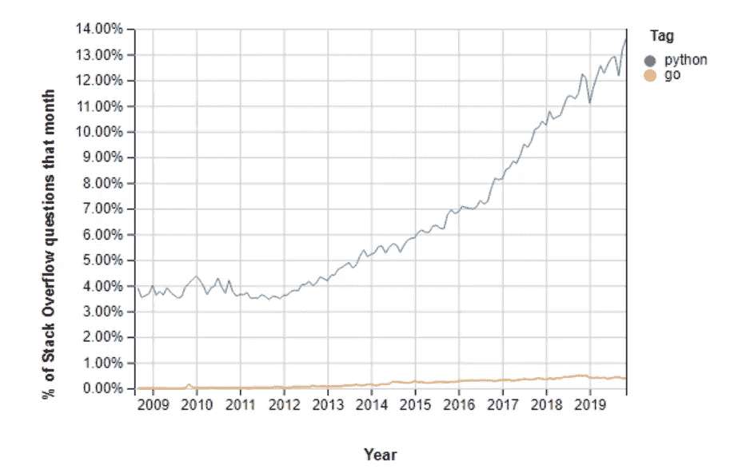
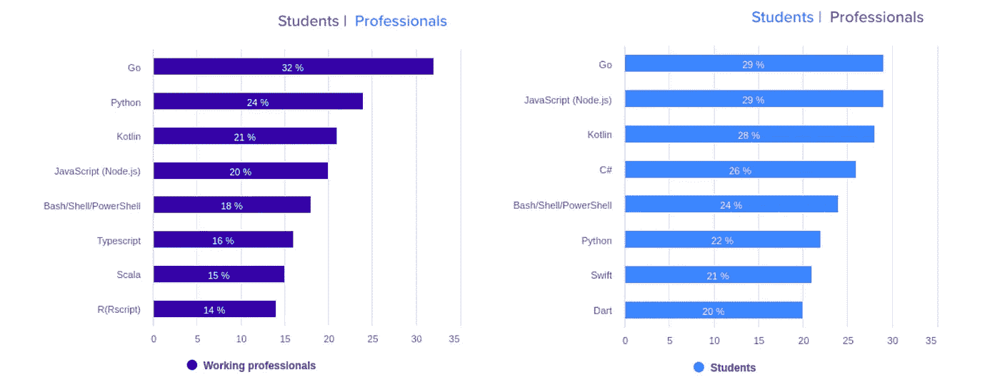

# Go 比 Python 好吗？

> 原文：<https://medium.com/analytics-vidhya/is-go-better-than-python-cabd9ea1c1fc?source=collection_archive---------16----------------------->

40 年前，python 第一次出现在世界上，但它花了近 20 年时间才获得开发者的赞赏。2019 年，它一直是开发者使用最多、最受欢迎的语言。

它在过去 5-7 年的增长是巨大的，这使得开发人员转向 python 进行机器学习和数据科学。在接下来的几年里，Python 将成为上述领域的王者。但是与迄今为止新出现的语言相比，它也有许多缺点。

堆栈溢出趋势与 Python(直到 2019 年)

那么我们来看看什么是 **Python** 和**围棋**..

> **Python** 是一种高级面向对象编程语言。它有内置的数据结构，结合了动态绑定和类型。它还提供对模块和包的支持，这允许系统模块化和代码重用。
> 
> 谷歌开发的编程语言 Go 在过去几年里取得了很大的成功。现代云、网络和 DevOps 软件的很大一部分是用 Go 编写的**，例如 Docker、Kubernetes。**

使用 **Go 的重要原因:**

1.  *Go 允许用户根据操作系统和架构的类型，使用静态链接将所有的依赖库和模块合并成一个二进制文件。*
2.  *由于 CPU 的可伸缩性和并发模型，Go 语言的执行效率很高。*
3.  *Go 语言提供了对多个库和工具的支持。因此，它不需要任何第三方库。*
4.  它有一个处理错误的好方法。

使用 **Python 的重要理由:**

1.  Python 是一种强大的面向对象的语言。
2.  Python 是一种可移植的语言，因此它可以在多种操作系统和平台上运行。
3.  Python 附带了许多预构建的库，这使得开发更加容易和快速。
4.  与 Java、C 和 C++语言相比，语法非常简单。

**围棋的特点:**

*1。简单易读的代码。*

*2。伟大的图书馆。*

*3。并发支持。*

*4。叫做 goLand 的垃圾收集。*

*5。功能强大的标准库。*

*6。包管理。*

*7。静态打字。*

**Python 的特性:**

*1。易于学习、阅读和维护*

*2。高性能*

*3。快速编译时间*

*4。简单、最小语法*

*5。易于部署的静态链接二进制文件*

*6。Python 语言可以用 Java、C、C++编程代码进行解释*

*7。Python 提供自动垃圾收集*

# 为什么去语言？

围棋在 10 年前首次推出。它是由谷歌开发的。它比 Python 有几个优点，这就是我感兴趣的原因。

**简单易学**

> Go is 语法很简单，和 C 语言很相似。如果有人懂 C 或 Java 语言，这就很容易了。访问[此链接](https://golang.org/doc/)了解围棋基本知识。

**快**

> Go 是静态类型和编译语言。这意味着执行速度将比 Python 快几倍。不像 Python，Go 不需要其他语言的帮助，速度更快。

**越来越受欢迎**

根据黑客世界的一项调查，Go 是 2020 年最受欢迎的编程语言。