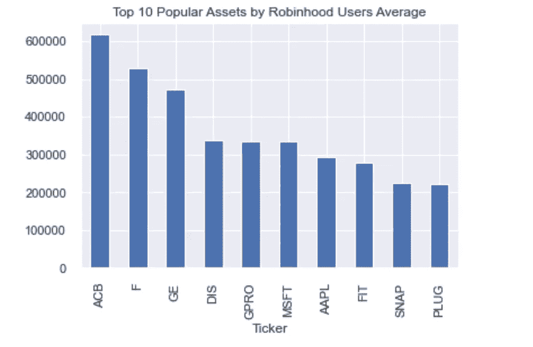
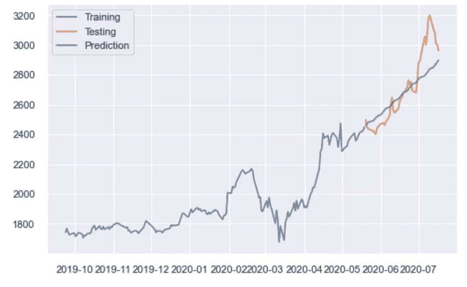

# 投资罗宾汉是个好主意吗？

> 原文：<https://medium.com/analytics-vidhya/is-investing-in-robinhood-a-great-idea-c466ce69cc95?source=collection_archive---------28----------------------->


照片由[杰米街](https://unsplash.com/@jamie452?utm_source=medium&utm_medium=referral)在 [Unsplash](https://unsplash.com?utm_source=medium&utm_medium=referral)

随着金融科技(Fintech)的兴起，我想确定投资者在 Robinhood 平台上独立投资的能力有多强。放弃雇佣财富管理公司管理和处理投资的传统方式，转而进行自我投资，人们真的像他们认为的那样精通金融吗？我想潜得更深一点，看看他们是不是。作为一名前财务顾问，我的千禧一代总会面临这样的挑战:他们想要做出自己的投资选择，而不是接受“专家”的建议，所以我想看看结果到底如何。

我从 Kaggle 收集了一个数据集，其中有 Robinhood 平台上所有资产的所有用户数量，令人惊讶的是，他们定期报告，并且是公开信息。一旦我将我的数据加载到 Jupyter Notebook，清理，压缩，并将其转换为 datetime 数据帧，我就开始了我的 EDA，我的发现真的很有趣。我原本想从过去一年的整体来看 Robinhood 用户，但当我开始我的 EDA 时，我发现了 COVID 19 前后的许多有趣的事情，所以我决定将我的重点转移到那个时间段。


罗宾汉平台的平均每日收盘价


平均每日总罗宾汉用户数

COVID 的正式申报日期是 2020 年 3 月 13 日，从那时起，总用户量增加了 122.26%。我的 COVID 19 时间框架从 2020 年 3 月 13 日开始，直到 2020 年 7 月 17 日我的数据结束。在我看来，用户突然增加的原因是因为更多的人想投资并利用 3 月份股市下跌的机会。我们现在处于隔离状态，通常不了解股市的人现在有时间好奇并投入其中。

现在我想探究罗宾汉用户投资最多的资产，所以我按受欢迎程度列出了前 10 项资产。



接下来，我想 Robinhood 用户中最受欢迎的资产是:

```
 Stock Name       % Change Post COVID     $ Change 03/13 - 07/17
1\. Aurora Cannabis Inc.     22.00%                $9.24 - $11.88
2\. Ford                     20.78%                $5.63 - $6.80
3\. General Electric         -9.80%                $7.84 - $7.07
4\. Walt Disney              15.70%               $102.52 - $118.65
5\. GoPro Inc.               82.56%                $2.70 - $4.92
```


福特汽车 2020 年 9 月 23 日至 2020 年 7 月 17 日的价格变动


2020 年 9 月 23 日至 2020 年 7 月 17 日福特汽车的罗宾汉用户变化

我计算了从 3 月 13 日到 7 月 17 日的百分比变化，得到我的百分比。从百分比变化的角度来看，这些百分比变化，除了通用电气似乎很大。但是所有的资产，除了迪斯尼的股票价格低于 10 美元，从每股 1-2 美元的资本收益来看，它们的回报是非常有限的。

接下来，我想看看 COVID 19 之后最赚钱的资产，看看它们与热门资产相比如何。

```
 Stock Name       % Change Post COVID     $ Change 03/13 - 07/17
1\. Moderna                   345.00%              $21.30 - $94.85
2\. DocuSign                  153.86%              $77.37 - $196.41
3\. Zoom                      129.00%              $107.47 - $246.54
4\. Amazon                     65.94%             $1785.00 - $2961.97
5\. Netflix                    46.60%              $336.28 - $492.99
```


2020 年 9 月 23 日至 2020 年 7 月 17 日的文档设计价格变化


从 2020 年 9 月 23 日至 2020 年 7 月 17 日，文件设计中的 Robinhood 用户变更

我在这里看到的是，Robinhood 用户并没有选择最赚钱的资产。百分比的变化把大众资产打得落花流水，它们的每股平均资本收益超过 300 美元。

经过我的分析，我认为 Robinhood 用户没有投资于最赚钱的资产。最受欢迎的资产是在 COVID 19 之前就可以盈利的资产。由于目前的情况，我们的“新常态”可能会成为永久的现实，投资策略必须转变。汽车、农业、家用电器和娱乐等行业可能再也不会像过去那样了。投资的时候，一定要看大局。

随着公司现在不得不将其业务转移到几乎 100%的数字平台，FAANG 这样的公司比以往任何时候都更加崛起。FAANG 代表脸书、亚马逊、苹果、网飞和 Alphabet(谷歌)。展望未来，投资科技公司似乎是更好的投资举措。在制定业务和投资决策时，必须首先考虑 COVID 19 将如何改变我们的世界。这是一个很多人如果没有接触过的概念，他们自己是不会思考的。正如你从我的发现中看到的，没有某种形式的金融和经济方面的深入知识的自我管理投资将会阻碍利润最大化。仅仅理解低买高卖的方法就能提高你的投资回报率。智能投资是一个主动的过程，而不是被动的过程。如果你对市场做出反应，你将永远落后于市场。与专业人士或至少了解这些概念的人一起工作，将确保你最大限度地发挥你的投资组合增长潜力。

我还创建了一个高级汽车 ARIMA 模型来预测亚马逊的价格。因为这篇文章更多的是关于我的 EDA，所以我不会深入讨论它，但是我想分享我所做的。请查看我的 github 的完整项目和我的模型的解释。

```
plt.figure(figsize=(8,5))
plt.plot(df.Close, label = 'Training')
plt.plot(df_test.Close, label = 'Testing')
plt.plot(prediction2, label = 'Prediction')
plt.legend(loc = 'Left corner')
plt.show()
```



```
prediction2.plot(figsize = (20,5), color = 'red')
df_test.Close.plot(color = 'blue')
plt.title('Predicted Amazon Stock Prices vs. Test Data', size = 24)
```


```
from sklearn.metrics import r2_score
df_test['predicted_stock_price'] = prediction2
r2_score(df_test.Close, df_test.predicted_stock_price)
```


我构建了多个模型，并用不同的参数进行了试验。我开始的 r2 分数是-0.15836897303755193，到了 0.7042667306581。或者从-0.16 到 0.70。我的模型从一点都不精确到相当精确。总的来说，我对我的模型的结果很满意。我肯定会继续调整参数，试图增强它，以便能够预测波动性。我还认为，在我的数据中，3 月份的市场崩盘也造成了一些不准确。