# 有可能根据给定的信息预测谷歌 Play 商店应用程序的评级吗？

> 原文：<https://medium.com/analytics-vidhya/is-it-possible-to-predict-rating-of-google-play-store-apps-based-on-the-given-information-da9a44a3ac1e?source=collection_archive---------5----------------------->

每个安卓用户可能都很熟悉谷歌 Play 商店，那是我用来在安卓手机上下载应用程序的地方。在浏览 Kaggle 数据集列表时，我找到了谷歌 Play 商店应用程序的数据集。

应用程序用于我们日常生活中的一切。人们很挑剔，我想弄清楚一个应用程序如何获得良好的评级？为了更好地理解这个问题，我决定使用数据分析、可视化和机器学习。

Google Play 徽标

# 资料组

我从 Kaggle 下载了我的数据集。网页抓取部分由不同的 Kaggle 用户完成并存储在那里。清理之后，我将数据集从 10841 行缩减到 9367 行。

我还有第二个数据集，里面有应用程序用户的评论，我最初打算通过找到每个应用程序评论的平均情绪来合并这个数据集。不幸的是，只有 865 个应用的评论。

# 探索性分析

数据集的清理部分完成后，我开始探索。我决定为探索部分提出三个不同的问题:

**问题 1:** 哪些量化特征与应用的评级相关？

这个特殊的问题与特征建模问题有关。我不希望数据集中有相同的要素。

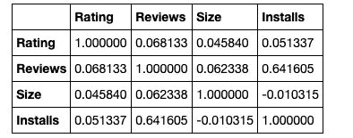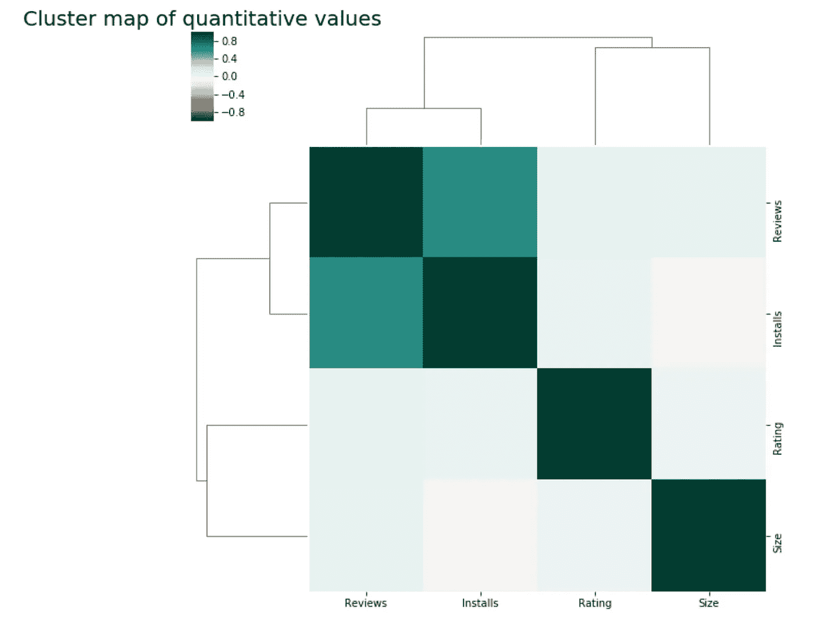

聚类图包括我的数据集的所有定量值。“评论”和“安装”栏的相关系数最高，为 0.64。如果其中一个相关系数更接近 1，这可以表示这两列包含相同的信息。

**问题 2:** 谷歌商店中哪个类别的应用数量最高？

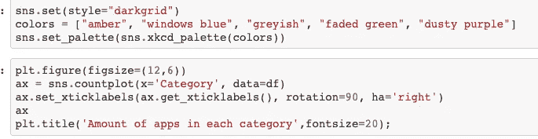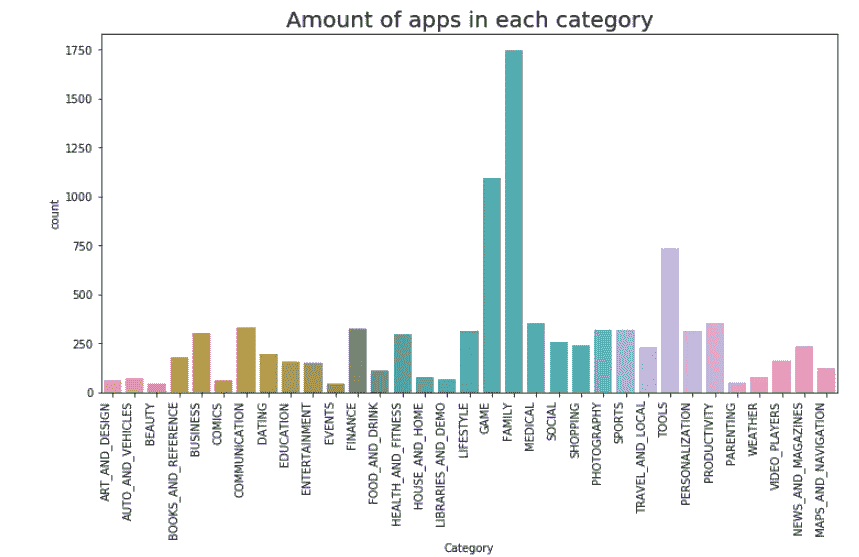

Seaborn 的计数图会自动计算每个类别中所有应用的数量，并创建一个条形图。根据柱状图，最大的应用类别是家庭。第二大类是游戏，第三大类是工具。数量最少的应用是分类:美容、活动和育儿。

**问题 3:** 不同类别的应用平均评分是多少？

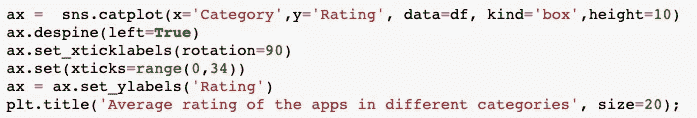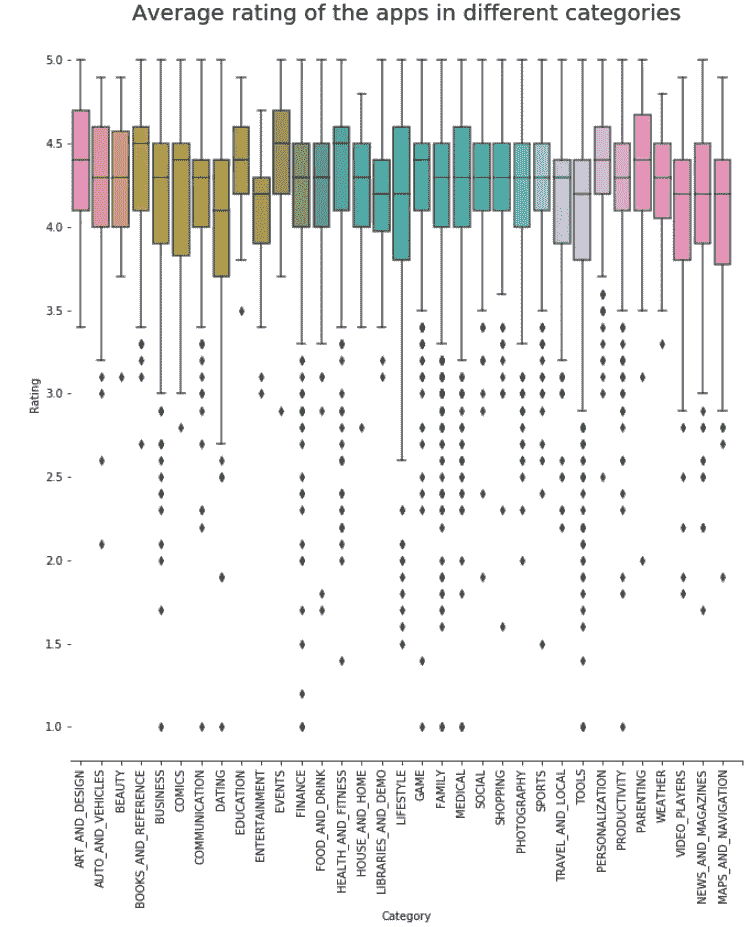

Seaborn 的猫情节是伟大的看到评级范围和每个类别的平均评级。评分范围最高的类别是艺术与设计、活动和育儿。约会类别的评分范围最低。

# 预测建模的准备工作

一旦我的所有列都是正确的格式，我就必须为建模准备数据集。

对于数值变量，我用列的平均值替换未知值。对于分类变量，我创建了[虚拟变量。](https://towardsdatascience.com/the-dummys-guide-to-creating-dummy-variables-f21faddb1d40)

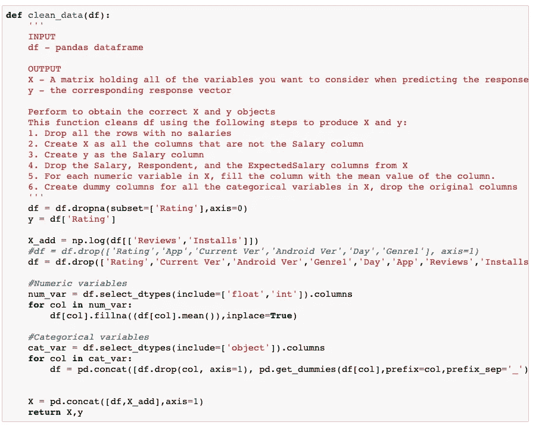

一旦 X 和 y 准备好了，我就用训练集和测试集来划分它们。

正如你在下图中看到的，像评论和安装这样的特性并不是正态分布的。

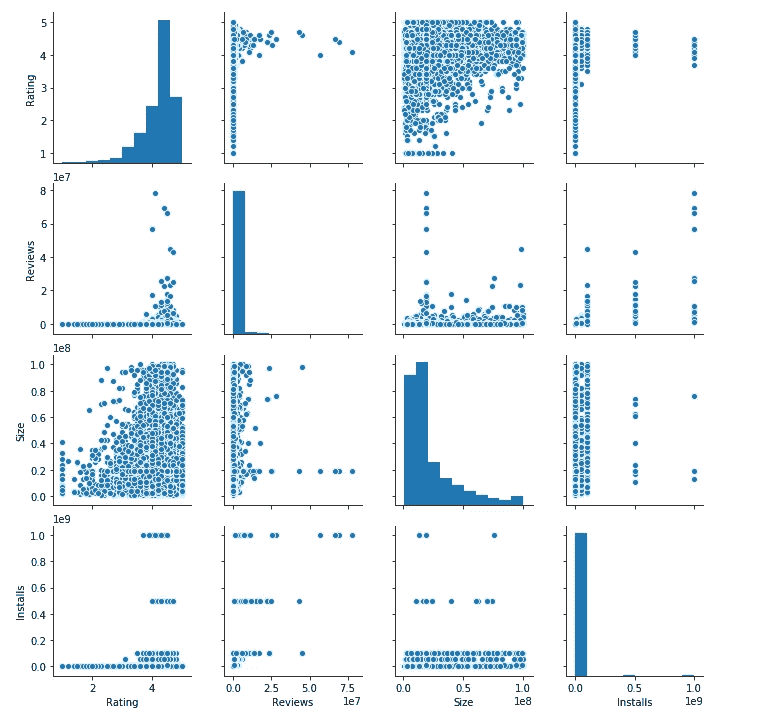

因此，在将数据拟合到线性回归模型之前，我必须对列 reviews 和 installs 使用对数转换。

# 预测建模

**问题 4:有可能根据给定的信息预测谷歌 Play 商店应用的评级吗？**

我建模的目标是预测谷歌应用的评级。这是一个回归问题，因为我试图预测一个连续变量。

我用均方差和均方根误差来评估我的模型。

> **均方差(MSE)** 是一种拟合线与数据点接近程度的度量。对于每个数据点，取该点到曲线拟合上相应 y 值(误差)的垂直距离，并对该值求平方。然后，将所有数据点的所有这些值相加，并且在具有两个参数的拟合(例如线性拟合)的情况下，除以点数减 2。**平方是为了使负值不会抵消正值。均方差越小，拟合越接近数据。MSE 的单位是垂直轴上绘制的任何值的平方。
> 
> **均方根误差(RMSE)** 正好是均方误差的平方根。这可能是最容易解释的统计数据，因为它与纵轴上绘制的数量具有相同的单位。

为了预测评级，我尝试了不同的模型，如线性回归、随机森林回归和 XGBoost 回归模型。将这些模型应用于我的数据集后，XGBoost 回归器产生了最佳的 MSE 和 RMSE。

# XGBoost 回归器

> XGBoost 代表 e**X**treme**G**radient**B**oosting。
> 
> XGBoost 是一种算法，最近在结构化或表格数据的应用机器学习和 Kaggle 竞争中占据主导地位。
> 
> XGBoost 是梯度提升决策树的实现，旨在提高速度和性能。

请参阅下面我用于我的模型的参数:

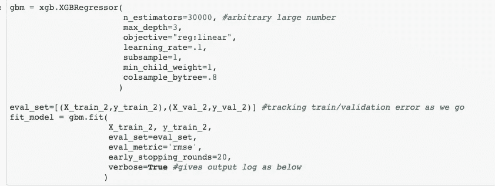

对于这个模型，我将数据集分为训练集、测试集和验证集。模特会对我的模特进行 20 轮的训练来完善我的模特。

以下是测试集的 MSE 和 RMSE 分数的最佳迭代:

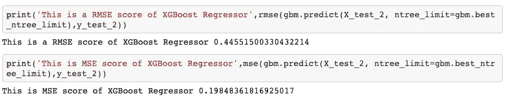

**问题 5:决定 app 评分的重要特性有哪些？**

为了回答这个问题，我可视化了 XGBoost 回归器对于模型中每个特性的重要性系数。

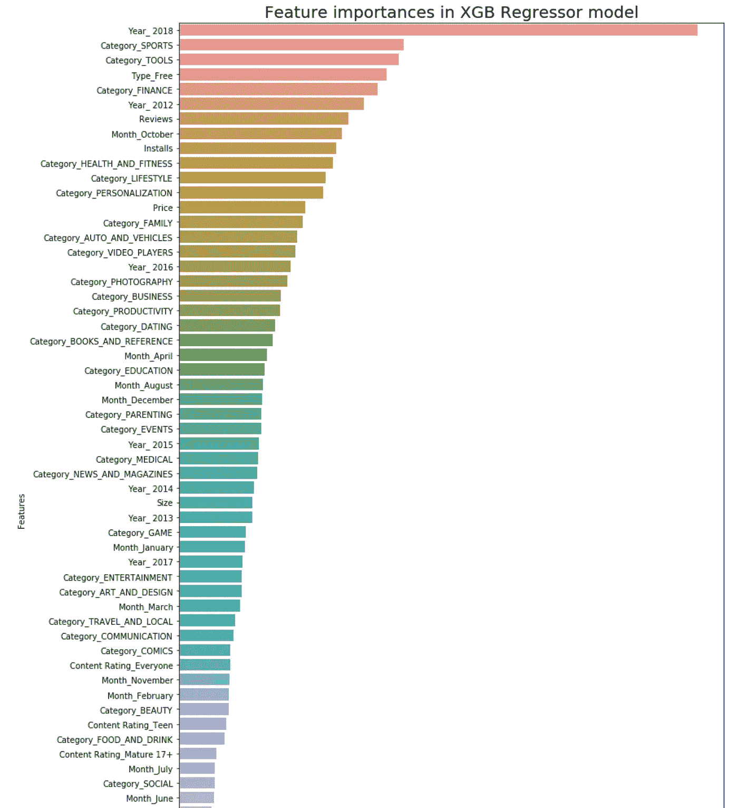

正如你在上面的柱状图中看到的，2018 年制作的应用程序具有最高的重要性系数。体育、工具和金融等类别也会影响评级。免费应用对收视率的影响也更大。

# 参考

数据集的原始来源:[https://www.kaggle.com/lava18/google-play-store-apps](https://www.kaggle.com/lava18/google-play-store-apps)

什么是均方误差和均方根误差？[https://www.vernier.com/til/1014/](https://www.vernier.com/til/1014/)

应用机器学习 XGBoost 温柔介绍:[https://machinelementmastery . com/Gentle-Introduction-XGBoost-Applied-Machine-Learning/](https://machinelearningmastery.com/gentle-introduction-xgboost-applied-machine-learning/)

# GitHub 知识库

 [## AisOmar/GooglePlay

### 这个数据集是从谷歌 Play 商店刮来的，存储在 Kaggle…

github.com](https://github.com/AisOmar/GooglePlay)