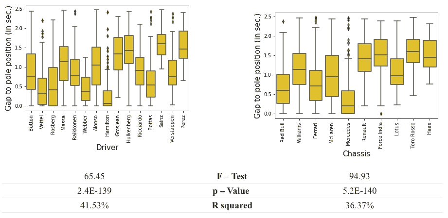

# 真的只是因为车吗？一级方程式车手的实证评估

> 原文：<https://medium.com/analytics-vidhya/is-it-really-only-due-to-the-car-an-empirical-evaluation-of-formula-1-drivers-aee1221ff7e6?source=collection_archive---------9----------------------->

关于任何一项运动的一般性讨论都会在某个时候达到一个团队或运动员的优越性成为话题的地步。例如，一级方程式赛车迷之间的任何讨论都可能会就哪位车手更胜一筹产生分歧。除了情感问题，这也是一个统计问题。问题的出现是因为司机的技术和汽车的性能之间的差距。本文着眼于驾驶员和底盘性能的历史统计数据，以找出驾驶员性能的显著差异。

本文首先讨论应该使用什么变量来确定一个驱动程序的性能。然后给出所用数据的直观和统计描述。然后应用几种统计方法，从非常简单的分析开始。最后，尝试分解具体的汽车，以隔离每个司机的表现。

Python 代码→[https://github.com/pmmsancho/F1](https://github.com/pmmsancho/F1)

# 数据

当比较 f1 车手的表现时，人们可能会倾向于一个显而易见的变量:每位车手的比赛成绩。乍一看这是有道理的，站在领奖台上的人一定是比赛中最好的车手。不幸的是，事情没那么简单。稍微熟悉一级方程式的人都知道，一名车手获胜的运气往往是巨大的。安全车(发生重大事故时部署的汽车，行驶在所有一级方程式赛车的前面以降低比赛速度)、进站、小事故(虚拟安全车)和车队订单只是可能扭曲每位车手真实表现的一些例子。因此，另一个变量可能更合适。

f1 比赛通常在周日举行，而决定每位车手发车位置的资格赛则在前一天，即周六举行。资格赛包括三轮，每位车手都要尽可能创造最快圈速。在资格赛期间，每位车手在赛道上面临的交通流量都比实际比赛中少得多。因此，每个司机都能够以较小的偏差炫耀他们的驾驶技术。在每场资格赛(Q1)的第一轮中，所有车手都可以设定一个时间。第一轮比赛结束后，最优秀的 15 名车手将前往 Q2，在那里进行同样的比赛。最后，在第三季度，十名最佳车手将争夺第一名(杆位)。当然，资格赛中的随机和运气的数量不是零。然而，这肯定比比赛本身要低。

由于这种分析的最终目标是给出关于驱动因素之间的相对性能的指示，感兴趣的变量也是相对的，而不是绝对的。因此，本文关注的性能变量定义为:

感兴趣的因变量

并且被称为 TtP 向前。这个变量取每个车手的资格时间，减去最快的车手的时间。因此，这个变量显示了每个车手比杆位慢多少。

不幸的是，还有一个问题需要考虑。也就是说，所有三轮资格赛之间的赛道条件肯定是不一样的。经常会出现这样的情况，第一轮资格赛阳光明媚，蓝天白云，而第三轮资格赛却大雨滂沱。在 Q1 和第三季度设定的车手时间在这种情况下是不可比的，评估是不可能的。因此，本文中的分析仅关注第三季度设定的时间。不幸的是，这限制了可以被评估的车手数量，因为只有十名车手进入决赛。

这次分析的数据来自网站:[https://www.statsf1.com](https://www.statsf1.com/)。分析的相关时间框架是 2009 年至 2019 年。为了便于编码，只包括了 2009 年比赛的赛道。除了单圈时间，手头的其他变量是赛车的名称、引擎、比赛年份和赛道。

# 到极点的时间了

下面的时间图显示了 2009 年至 2019 年间十个最频繁出现的驾驶员的可变到达极点时间(TtP)的行为。乍一看，这个变量看起来是固定的。平稳的时间序列意味着统计属性，如均值、方差和自相关，在一段时间内是恒定的。平稳性对于确保即将进行的分析产生有意义的系数非常重要。想了解更多关于这个地产的信息，来自 [Eugine Kang](/@kangeugine/time-series-check-stationarity-1bee9085da05) 的文章值得一读。

此外，还对数据集中的每个驾驶员运行增强的 Dickey Fuller 测试(关于该测试的更多信息，强烈推荐来自 [Willie Wheeler](/wwblog/stationarity-testing-using-the-augmented-dickey-fuller-test-8cf7f34f4844) 的文章)，以确保因变量的稳定性。在下表中，可以看到所有变量都明确拒绝单位根的零假设，这意味着数据确实是平稳的。

变量的平稳性也有一个有趣的含义。也就是说，这些年来没有一个司机经历了趋势性的改善(不好也不坏)。

# 不同群体的描述性统计

像所有运动一样，f1 也有更成功和不太成功的车队和车手。在 2009 年至 2019 年期间，一级方程式中的领先车队是梅赛德斯和红牛，分别获得五个和四个建造者和个人车手冠军。一些车队和车手的这种优势在下面的图表中也可以看到。对 TtP 变量进行方差分析(ANOVA ),以评估不同组之间的平均值是否存在统计学显著差异。对于组*驾驶员*和组*底盘*，测试统计非常显著。在方差分析中，测量两种主要的方差。内平方和(SSW)和间平方和(SSB)。SSB 和 SSW 之间的比率显示并标记为 f 检验。例如，明显不同的组在组内具有很小的差异，但在不同的组之间差异很大(高差异)。因此，组分类器可以解释数据集中的部分差异。解释的数量在 R。

2009 年至 2019 年间所有比赛的车手资格认证时间和杆位之间的时间差距的箱线图。数据仅取自第三季度，以确保赛道条件的可比性。

尤其是*奔驰*看着不同*底盘的方框图似乎占了上风。*看车手，可见几名实力强劲的赛车手。较小的箱线图是稳定性能的标志，是赛车手的质量指标。

可能会出现这样一个问题:这些年来，甚至在赛道上，TtP 是否有统计学上的显著差异。下面的图表和统计数据显示了显著的差异，但是这种影响远远小于*底盘*和*驱动*的影响

2009 年至 2019 年间所有比赛的车手资格认证时间和杆位之间的时间差距的箱线图。数据仅取自第三季度，以确保赛道条件的可比性。

方差分析的无效假设是所有组的平均值是相同的。拒绝零假设可以确定不是所有的平均值都彼此相等，但是不清楚哪个组类别彼此不同。

# 直接比较

为了在更精细的水平上探索驾驶员和底盘之间的差异，进行了多次均值差异 t 检验。底盘方面的统计数据集中在三支(相当成功的)车队上*法拉利、红牛*和*梅赛德斯。*下表中的变量显示了 TtP 变量的差异以及置信区间的下限和上限。最后，还给出两个团队的时差是否彼此显著不同的指示。正的平均差异被解释为手头的车队平均比其他车队更接近杆位时间。

从下表中可以看出，特别是法拉利*、红牛*和奔驰*这几支车队的表现优于大多数其他车队。有趣的是，可见*法拉利*和*红牛*的差异并没有显著的零差异。这可能是因为车手*维特尔*驾驶了每支车队大约一半的时间。梅赛德斯*的绝对优势也是显而易见的，统计数据显示其在一级方程式中胜过其他所有车队。**

均值差异测试。数据范围从 2009 年到 2019 年，涵盖 2009 年驾驶的所有赛道。数据限于 Q3，以便控制轨道条件。变量 *Meandifference* 被定义为 vs 车队和手头车队的平均杆位时间之差。因此，正数意味着 vs 较慢。变量*拒绝*表示该差异在 5%的水平上是否显著。变量*下限*和*上限*表示 95%置信区间的边界。

完全相同的方法现在适用于每一个司机。不同之处在于，现在所有车手都与平均 TtP 变量最小的车手进行比较:*刘易斯·汉密尔顿*。可见*汉密尔顿*和除了*维特尔*和*韦伯*之外的所有人的时间设定差异是有统计学意义的。

但是有一个潜在的问题。有人可能会说*汉密尔顿*是最快的车手的唯一原因是因为他享受了驾驶*奔驰*查西的好处。汽车的性能和司机的性能没有明显的区别。因此，驾驶员的技术水平在统计中是模糊的。为了对此进行控制，采取以下措施:首先，应用具有几个控制变量的广泛的普通最小二乘(OLS)回归。之后，会尝试捕捉特定于汽车的性能，然后减去特定于驾驶员的时间。

# 广泛回归

回归可以控制的变量受到手头数据量的限制。可用变量有*驾驶员、发动机、年份、底盘*和*国家*。此外，有理由假设变量*驱动*和*底盘*之间存在交互作用。这是因为，举例来说，一个驾驶弯道非常熟练的司机，在驾驶一辆特别适合这些任务的汽车时，会表现得更好。因此，开好车的优势是相对的，而不是绝对的。用于确定每个驾驶员的个人表现的回归，控制所有其他变量如下所述，并利用虚拟变量获得所有分类信息:

回归使用了 2009 年至 2019 年的数据。2009 年驾驶的所有赛道都被考虑在内。回归(如上所示)控制各种其他效果。然后，变量“净时间”将具有最小回归系数的驱动因素作为极点位置，并将该时间的所有其他驱动因素标准化。考虑到回归中的因变量是到达极点的时间，驾驶员的β系数越小，到达极点的时间越短，意味着时间越好。

非常有趣的是，回归的结果不同于之前进行的简单的收入差异测试。这意味着当控制其他变量时，驾驶员的表现会发生变化。

然而，这种回归也带来了一些问题。运行该回归时，Python 会警告用户该回归中的多重共线性问题。术语多重共线性描述的是回归的独立变量彼此高度相关的状态。由于变量之间的高度相关性，回归无法为变量分配适当的系数权重。这仍然是这种方法的缺陷，不可能区分赛车的性能和车手的性能。

对于两个司机使用同一辆车的情况，可以说哪个司机的技术更好，因为扭曲变量是相同的。下表显示了三支车队中的两名车手，他们在同一支车队中驾驶了一段时间。一个简单的均值差异 t 检验被用于计算每个司机的优势。

数据是在 2009 年至 2019 年期间收集的。然后，数据被进一步限制在两位车手同时驾驶的车队中。“meandiff”变量表示均值相对于极点时间的差异。此外，还显示了置信区间以及测试决策。

这个实验的有趣结果是，Verstappen 的表现比 T2 的表现好得多，这与回归结果所显示的正好相反。这说明了广泛回归方法中面临的多重共线性问题。

# 汽车特效方法

为了解决这个问题，我们计算了赛车的具体影响，然后从每位车手到达极点的平均时间中减去这一影响。想法是这样的:首先，数据一次只限于一个驱动程序。这样做可以控制驾驶员的稳定技能水平。因变量是驾驶员到达极点的时间。自变量包括车手职业生涯中使用的所有*底盘*，以及控制变量，如*年份、发动机*和*国家。*

数据是从 2009 年到 2019 年收集的。对每位赛车手个人的杆位时间历史进行回归。变量*年份、发动机和赛道*的所有回归控制。表格显示了每个驾驶员的底盘系数。因为不是每个车手都是所有车队的车手，所以大部分字段都是空的，标有/符号。

然后，不同*底盘*的系数显示了赛车对到达极点时间变量的特定影响。例如， *M* ercedes 的汽车特定效应相对较低，意味着由于汽车的优越性，不必减去/计入太多。另一方面，如果有人驾驶了一辆相当不成功的赛车(例如*红牛之队*)，那么就必须减去一个更大的赛车特有的影响。由于一个司机一生中很可能驾驶过多辆汽车，因此特定于汽车的影响是对每个司机的加权值。例如，如果有人驾驶 60%的奔驰赛车，40%的奥罗赛车*罗索*赛车，那么该车手的赛车特效就会反映出来。重量代表每个车手在某个赛道上比赛的次数。然后从每位车手到达杆位的平均时间中减去这种赛车特有的影响。下表显示了所述方法的结果:

数据收集自 2009 年至 2019 年。变量“历史平均时间”显示了数据帧内每个驾驶员到达极点的所有驾驶时间的平均值。变量“价值加权汽车效应”是一个简单的价值加权平均值，使用 priod 表的数字。原始时间显示了两个变量之间的差异。因为最快的车手也代表了杆位，所以也显示了变量“净时间”

# 结论

在回顾了比较驾驶员表现的各种方法后，本文中最有效的方法是尝试先计算特定汽车的影响，然后从每位驾驶员的平均 TtP 中减去这一时间。

要强调的是，找出哪位车手在赛道上拥有最佳驾驶技术的最好方法是减少赛车特有效应的影响。也就是说，如果每个人都开同样的车，谁会是最快的。

完整的 Python 代码可以在我的 Github 上找到

Python 代码→[https://github.com/pmmsancho/F1](https://github.com/pmmsancho/F1)