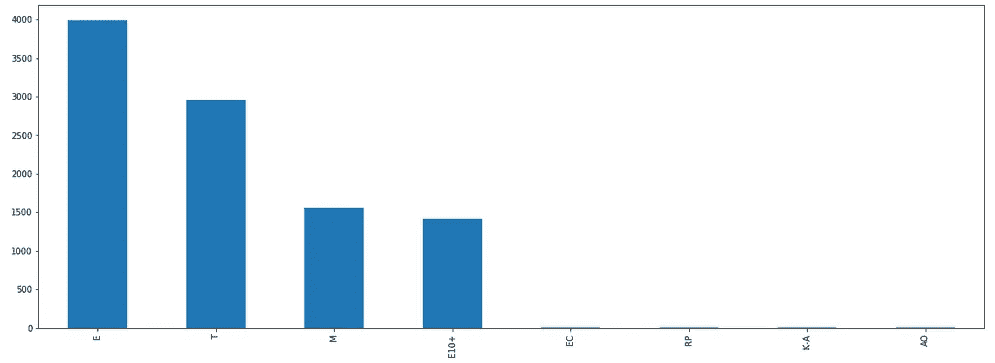
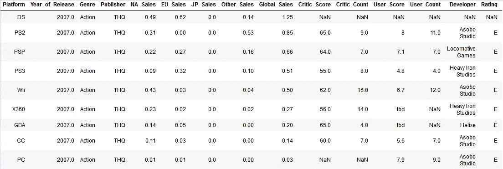
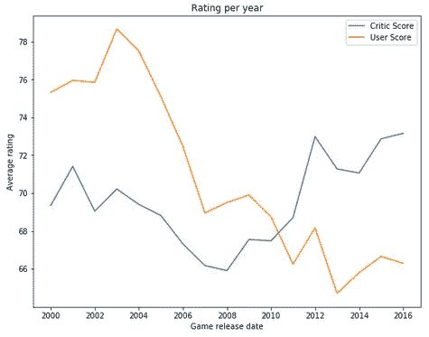
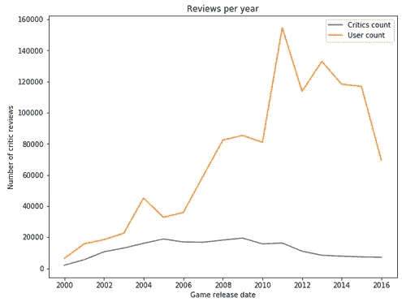
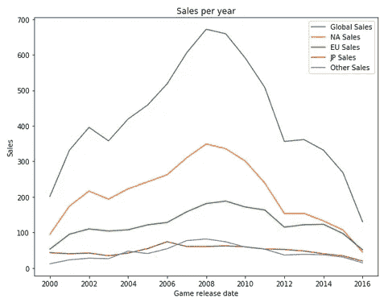
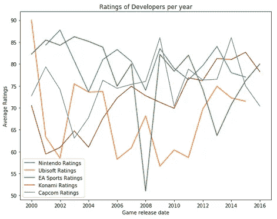
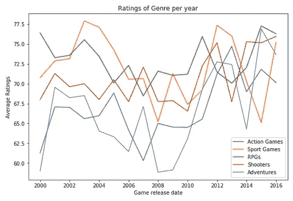
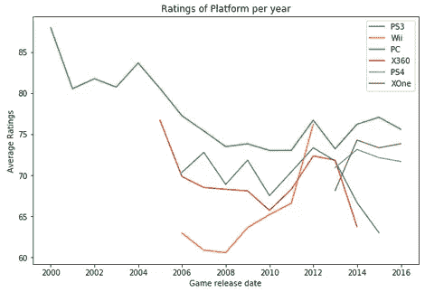
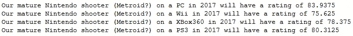
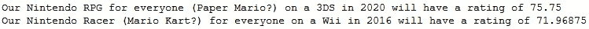

# PC 是高手种族吗？-探索和分析视频游戏的评级和销售

> 原文：<https://medium.com/analytics-vidhya/is-pc-the-master-race-exploring-ratings-and-sales-of-video-games-6b1f91400d63?source=collection_archive---------15----------------------->

如果你和我一样，你的脚趾甲在燃烧，想要最终找到这些问题的答案:

*   Metacritic 是否同意 PC 是优等民族？
*   任天堂在 PC 上开发的成熟射击游戏会获得什么收视率？
*   随着时间的推移，游戏会获得更好的收视率吗？

来和我一起找出这些问题的答案，同时对一个视频游戏数据集进行分析、去神秘化和预测。

> 激烈的格拉姆洛克音乐介绍

让我们来看看**拉什·基卢比**在 [kaggle](https://www.kaggle.com/rush4ratio/video-game-sales-with-ratings) 上提供的一个数据集。

该数据集包含 16719 个不同的游戏和 17 列。
有问题的列是名称、平台、发行年份、类型、出版商、北美销售、欧盟销售、日本销售、其他销售、全球销售、评论家得分、评论家计数、用户得分、用户计数、开发者、评级

遵循 CRISP-DM 流程，第一步是探索我们拥有的数据。

## 探索

评级列主要包含“每个人”、“青少年”、“成熟”和“E10+”的数据(95%+)。

相当多的游戏在数据集中是重复的，这是由于每个游戏可能被移植到不同的平台(甚至是不同的开发者)。对于大多数游戏来说都是如此。在 16719 个游戏中，有 11562 个是重复的。一个示例游戏移植到 9 个控制台(记录是 12 个，只有一个游戏“极品飞车:头号通缉犯”有趣的是“料理鼠王”)。一个没人知道或玩过的游戏，它反映在销量和收视率上。

在数据集的过程中(1980 年至 2016 年)，共有 31 个平台发布了游戏。
事实上，随着时间的推移，加入数据集中的游戏数量越来越少，只有 2000 年及以后的游戏被考虑在内。

## 干净的

在对数据进行初步分析后，现在可能会对其进行清理。为此，复制的游戏被重新命名；总共 7961 场比赛。
数据集还包含“损坏的”行。对我们来说，Corrupt 意味着它还没有发布或者没有开发者和评论家的分数。
列“用户得分”也有“待定”作为可能值；在清理过程中，它被设置为“NaN”(不是一个数字)。2422 个用户分数受到影响并被替换。

## **建模和可视化**

现在我们有了数据，是时候进行分析、可视化、建模和预测了！
让我们看看..

我们可以看到，随着时间的推移，评论家给出了比用户更好的评级，在 2010 年越过了这条线。用户是否更加怀疑？评论家有报酬吗？

过去有更多的用户评论游戏，在 2011 年达到顶峰。让我们看一些销售数字。

从 2003 年到 2008 年，是游戏全球销量的黄金时代。值得注意的是，亚洲地区(特别是中国和韩国，因为他们是“游戏国家”)没有列在这里。销售不足，无法上市。

让我们弄脏看看一些出版商

仔细研究这张混乱的图表，可以看出，任天堂提供了高质量的结果，令人惊讶的是，EA Sports 的收视率并不稳定，尽管同一款游戏每年都有发布。拥有 Pro Evolution 足球的 Konami 赶上了吗？有一点是肯定的。育碧不知道。

这里我们再一次看到了体育比赛的不稳定性。我们还可以看到，火箭推进榴弹不断产生良好的效果。射手越来越好了。

电脑高手-复习-比赛

你一直在等待的图表毫无疑问地显示，根据评论家的说法，PC 是 2000 年至 2016 年的主竞赛。个人电脑似乎在能够接管 Wii 之前就砍掉了它的头，XBox One 可能也会发生同样的事情，但这是另一个数据集的故事。

## **建立机器学习模型预测游戏比分**

在本节中，我们将探讨如何使用 scikit-learn 提供的机器学习库来训练和测试新模型，然后使用该模型来预测结果。

在对用于机器学习的数据集进行了一些调整和准备之后，创建并训练了两个机器学习模型。由于输入数据相对较少，这两个模型都没有得到好的分数。

让我们试着利用它们，在 2017 年在不同的平台上创造一个评级为 M 的任天堂射击游戏。

电脑高手-复习-比赛

我们可以看到，个人电脑获得了最高的收视率。尽管 Wii 在它存在的最后一年走上了坡路，但它似乎提供了最差的(射手)结果。很有可能，“M”级在这种情况下也发挥了更大的作用，这在 Wii 游戏中并不常见。

> PC 是否偏向 PC？不，事情不是这样的。

让我们看看其他可能的任天堂游戏

更多任天堂

任天堂可以在整个领域提供高于平均水平的结果，但 PC 提供最好的评级。

# 现在轮到你了！

请前往 https://github.com/cr00nkz/Video_Games_DataScience 的，体验数据集、模型、数据和其他一切。
我们一起探索数据，分析数据，预测一些新的好玩的游戏。

你想证明，PC 不是优等民族？做吧，请分享你的发现。

谢谢你。