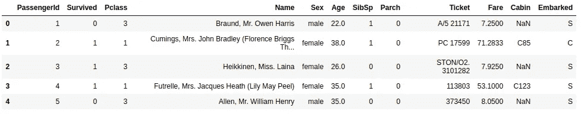
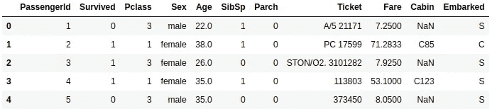
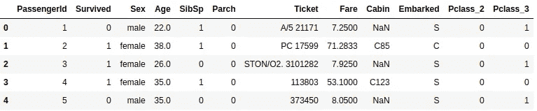
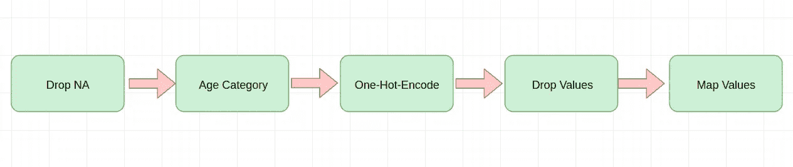
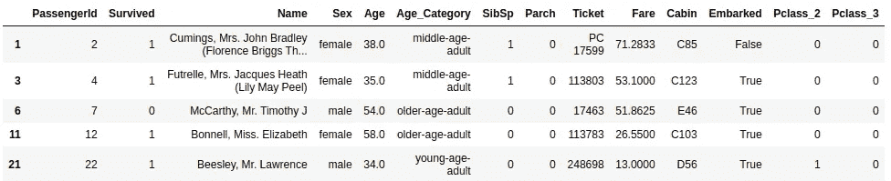

# 流水线在机器学习中重要吗？(带 pdpipe 的管道)

> 原文：<https://medium.com/analytics-vidhya/is-pipeline-important-in-machine-learning-pipeline-with-pdpipe-b6fc9acf20c4?source=collection_archive---------8----------------------->


流水线向量

流水线概念在许多领域中被推广。这个概念对于数据科学非常重要。机器学习模型有许多动态部分。将 ML 过程的这些动态部分结合在一起的过程被称为管道。然后我们才能成功地执行并产生结果。在机器学习中，创建管道是为了允许数据从其原始格式流向一些有用的信息。此外，它还提供了一种机制来建立一个并行管道，以比较几种机器学习方法的结果。

在数据科学中，数据在进入学习模型之前必须经过清理、验证和调整。为此，我们使用了许多预处理阶段。作为初学者，我们在预处理阶段使用单步函数。但是更有效的方法是使用管道。然后，我们可以通过自动化这些预处理阶段来减少时间和错误。

在这篇文章中，我们讨论关于 P**I 与熊猫**[**P 管道**](https://pypi.org/project/pdpipe/) 的关系。对于 Pandas Df 的管道问题，pdpipe 是一个更好的解决方案。

## 安装 pdpipe

```
pip install pdpipe
```

## 导入 pdpipe

```
import pdpipe as pdp
```

我们使用著名的 [**泰坦尼克号数据集**](https://www.kaggle.com/hesh97/titanicdataset-traincsv) 作为例子。在此，我们预测哪些乘客在泰坦尼克号沉船中幸存。它看起来像跟随



## 一条操作流水线

让我们想想领域专家说的，

> 我们可以忽略模型的名称特性。

然后，我们只需从数据集中删除 Name 列。

为此，我们只需创建一个名为 pipeline 的管道对象，并将 DF 传递给这个管道

```
pipeline = pdp.ColDrop('Name')
df= pipeline(df)
```

生成的 DF 如下所示:



## 管道的链级

实际上，我们将管道用于多阶段流程。在 pdpipe 中有很多方法可以做到这一点。最简单的方法是使用+运算符。

> 让我们考虑一下，我们想要删除 Name 列，并对这个分类模型的 Pclass(乘客类)特性进行一次性编码。

因此，我们用 ColDrop 方法创建一个管道对象来删除这个名称。然后我们只需用+=操作符将 one-hot-encode 方法添加到这个对象中。

```
pipeline =  pdp.ColDrop('Name')
pipeline += pdp.OneHotEncode('Pclass’')df=pipeline(df)
```

生成的 DF 如下所示:



Pclass_2 和 PClass_3 由一次热编码创建

**也可以通过提供管道阶段列表来创建管道:**

```
pipeline=pdp.PdPipeline([pdp.ColDrop('Name'),    pdp.OneHotEncode('Pclass')])
```

**此外，make_pdpipeline 方法可用于给出阶段作为位置参数**。

```
pipeline = pdp.make_pdpipeline(pdp.ColDrop('Name'),    pdp.OneHotEncode('Pclass'))
```

**管道阶段也可以链接到其他阶段以创建管道:**

```
pipeline = pdp.ColDrop('Name').OneHotEncode('Pclass')
```

## 管道阶段的类型

*   基本阶段
*   列生成
*   sci kit-学习依赖阶段
*   ntlk 相关级

# 构建完整的预处理管道

> 让我们想想，我们想为我们的泰坦尼克号数据集建立一个完整的预处理管道。

它看起来就像这样，



5 级管道

在此管道中，我们将创建以下 5 个阶段:

*   删除 NAs
*   对年龄特征进行分类
*   一次热编码 PClass 特征
*   放下孩子
*   绘制着手价值观

首先，我们将 NAs 放在这个数据集中。为此，我们创建一个管道对象并调用 DropNa 函数

```
pipeline = pdp.DropNa()
```

然后我们用 ApplyByCols 对年龄特征进行分类。为此，我们定义了年龄类别函数。

```
def age_category(age):
 if age< 15:
 return “child”
 elif age< 25:
 return “teen”
 elif age< 35:
 return “young-age-adult”
 elif age< 50:
 return “middle-age-adult”
 else:
 return “older-age-adult”
```

然后我们通过 ApplyByCols 将这个函数应用到 Age 列，并创建一个新的 Age_Category 特性。

```
pipeline += pdp.ApplyByCols('Age',
age_category,'Age_Category',drop=False)
```

之后，我们对 PClass 特征进行一次热编码

```
pipeline += pdp.OneHotEncode('Pclass')
```

> 让我们想想，领域专家说子类别对于我们的分类模型并不重要。

为此，我们从 Age_Category 列中删除子值

```
pipeline += pdp.ValDrop(['child'],'Age_Category')
```

然后我们将船载价值映射如下:

*   S->真
*   C->假
*   问->真

```
pipeline += pdp.MapColVals(‘Embarked’,{‘S’:True,’C’:False,’Q’:True})
```

最后，我们创建管道的五个阶段。

```
pipeline = pdp.DropNa()
pipeline += pdp.ApplyByCols('Age',age_category,'Age_Category',drop=False)
pipeline += pdp.OneHotEncode('Pclass')
pipeline += pdp.ValDrop(['child'],'Age_Category')
pipeline += pdp.MapColVals('Embarked',{'S':True,'C':False,'Q':True})
```

## 打印管道

我们可以通过打印管道来查看我们的管道。

```
print(pipeline)A pdpipe pipeline:
[ 0]  Drops null values.
[ 1]  Applying a function  to column Age.
[ 2]  One-hot encode Pclass
[ 3]  Drop values child in column Age_Category
[ 4]  Map values of column Embarked with {'S': True, 'C': False, 'Q': True}.
```

> 可以使用 Python 的切片符号对管道进行切片，就像列表一样:

```
pipeline[3]PdPipelineStage: Drop values child in column Age_Category
```

然后，我们将管道应用到我们的泰坦尼克号数据集。生成的 DF 如下所示:



使用 pdpipe，您可以为您的 ML 项目构建强大的管道。更多资源可以参考作者的 [**回购**](https://github.com/shaypal5/pdpipe) (创建附加阶段很酷)。

在[上加我**LinkedIn**](https://www.linkedin.com/in/shashimal97/)