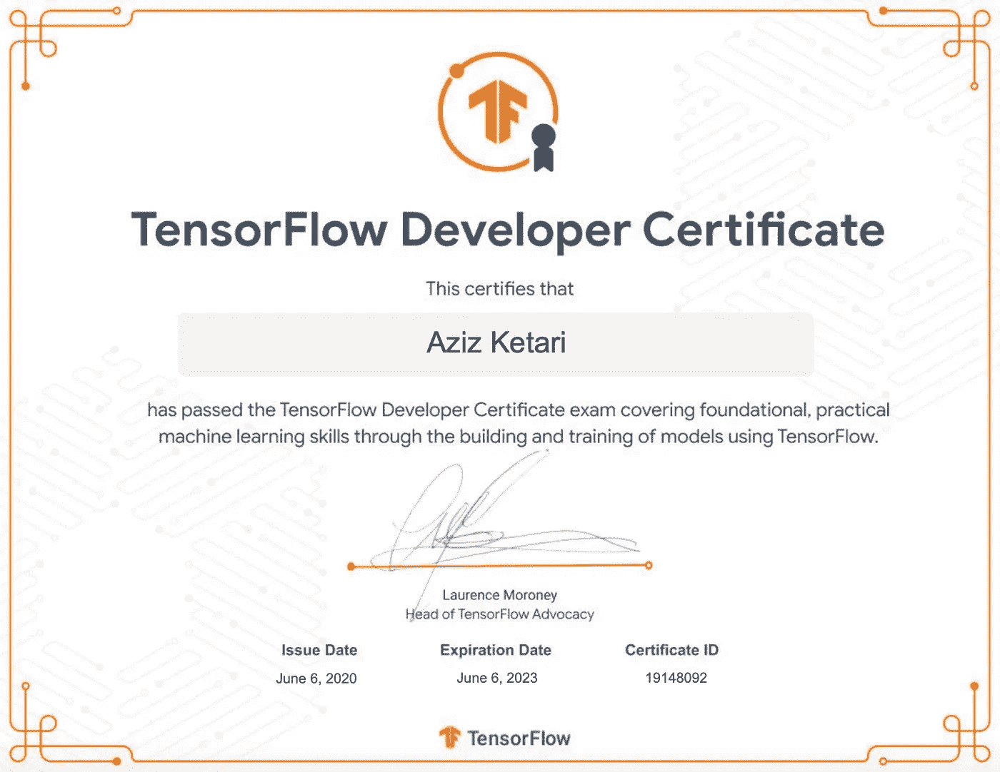
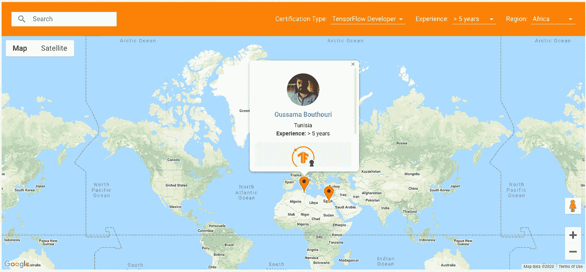
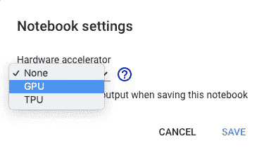
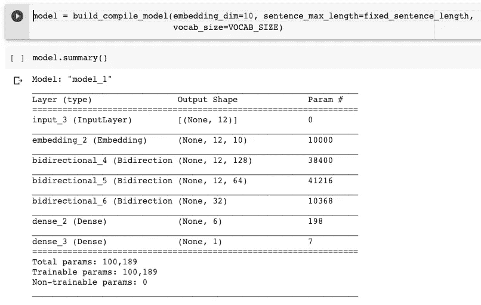
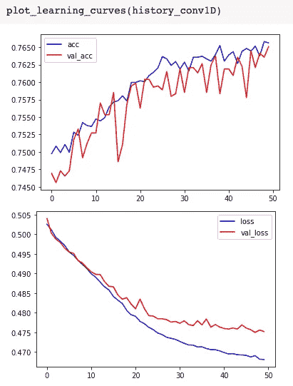
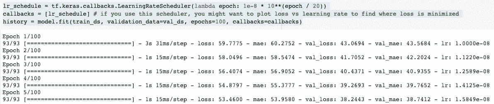
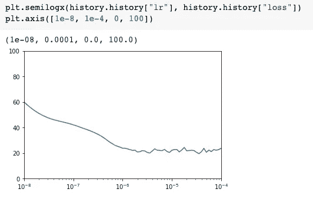

# TensorFlow 开发者证书值吗？

> 原文：<https://medium.com/analytics-vidhya/is-the-tensorflow-developer-certificate-worth-it-56f597ceea75?source=collection_archive---------0----------------------->

从第 0 天到认证需要 3 周时间

> TensorFlow 开发者证书是另一张定价过高(100 美元)的电子纸吗？
> 
> 你真的应该投入时间和精力参加一个 5 小时的考试吗？你将如何衡量这项投资的回报？
> 
> 如果被证实为阳性(无论你选择哪种标准)，计划是什么？

所有这些，都是我在获得认证之前问自己的问题。希望这篇文章能帮助你找到自己的答案。另一方面，如果你正在寻找关于考试的后勤信息，你应该检查 [Tensorflow 证书主页](https://www.tensorflow.org/certificate)。

## 你为什么要获得认证？

*   **宽度与深度:**

> “本证书[…]旨在作为学生、开发人员和数据科学家的基础证书”。来自 [TensorFlow 团队](https://www.tensorflow.org/certificate)

如[考生手册](https://www.tensorflow.org/site-assets/downloads/marketing/cert/TF_Certificate_Candidate_Handbook.pdf)中所述，你将被要求在计算机视觉、NLP 和时间序列任务上建立/训练模型。考题语句很常见(业内)，触手可及。除了训练模型，还会要求您建立输入管道。
但没什么好担心的，你将不必实现任何源自 Google Brain 最新发表的论文的模型架构。

如果你没有机会获得 CV、NLP 或时间序列方面的经验，不要担心，跟随这篇文章，你会得到一个答案。

*   **社区:**

通过考试后(每个问题在提交时评分，并且您有无限的提交尝试机会)，您现在将成为 Tensorflow 认证开发人员“精选”社区的一员！起初，我对这项福利的实用性表示怀疑。然而，我最近发现了它的好用法。

为我的突尼斯同胞感到骄傲！

*有趣的故事(可以跳过这部分):* 我是土生土长的突尼斯人。在玩[认证目录](https://developers.google.com/certification/directory/tensorflow)上的地图插件时，我看到在仅有的两个拥有超过 5 年经验的 Tensorflow 认证开发者(居住在非洲)中，有一个突尼斯人: [Oussama Bouthouri](https://www.linkedin.com/in/boussama/) (考试发布后仅 10 天认证)KUDOS！

## 你应该如何准备？

*   [Coursera:实践专精中的 tensor flow](https://www.coursera.org/specializations/tensorflow-in-practice)

这不是一个赞助链接。我没有收到这个链接的任何佣金。然而，参加 Coursera 课程，你会受益匪浅，不仅对你个人，而且对通过考试也有好处。

就我个人而言，我花了大约 2 周的时间来复习这个专业的内容。我白天确实有工作。因此，对于一个对 Tensorflow 和 Python 有一定了解并有足够动力的人来说，我认为 3 周时间足够复习该课程涵盖的所有内容。

此外，我非常赞同我的一位同事 [Roberto Barbero](https://www.linkedin.com/in/rbarbero/) 在他的[关于 Tensorflow 开发者证书](/@rbarbero/tensorflow-certification-tips-d1e0385668c8)的文章中所说的话。

> 不要陷入‘Shift+Enter’的诱惑。强迫自己打开一个空白的 Colab，自己再打一遍。

*   **Colab 笔记本:**

个人提示😎:您将为此考试训练的大多数模型都将从在 GPU 上训练中受益匪浅。如果你家里没有 GPU，不要担心这里是如何规避问题。将你的代码复制粘贴到一个 [COLAB](https://research.google.com/colaboratory/faq.html) 上并在那里运行。保存模型文件后，将其下载到您的本地机器上的特定目录中，并提交您的答案。

不要忘记更改默认运行时以包含 GPU。Tab →运行时→更改运行时类型

## 你下一步应该做什么？

*   [**Coursera: Tensorflow 在练习专精**](https://www.coursera.org/specializations/tensorflow-in-practice)

认真→去上课程(至少旁听一下)

*   **练习**

没有什么能打败练习。提交模型后，你可能会在考试中面临尴尬的时刻，因为你没有得到最高分。

以下是我亲身经历的时刻:

*   冷汗😰:其中一个模型没有评分。
    分级员抱怨输入形状的问题。或者，分级员在抱怨 lambda 层。
    提示:检查您的输入管道、模型输入形状和问题说明🤦‍♂️.请记住，使用 Lambda 层的模型是不被接受的(截至本文撰写之日)。

另外，请注意，当您显示模型摘要时:

模型摘要

如果您仔细查看输出形状列，您会注意到“无”的提示。没什么好困惑的，它只是指 Tensorflow 图中的一个占位符，可以用任何值填充。当你的模型架构引起形状变化时(例如在 NLP 或时间序列中),这非常方便😉 ).确保你明智地使用它。

*   提交的模型未获得最高分🤔提示:记住你的基本原则:过拟合、欠拟合，以及当它们发生时该怎么做(例如，增加辍学层，训练更多的纪元，增加批量大小，改变学习速率……)

学习曲线

当试图确定过度拟合或欠拟合的情况时，不要忘记绘制模型的学习曲线。
过程是先观察发生了什么？一点点的欠拟合和过拟合，可能还有很多波动/可变性。
然后，列出你如何称呼他们？
-更深的模型
-增加漏层
-增加批量……
(非详尽列表)

我推荐的另一个实践是在更少的时段上使用 [LearningRateScheduler 回调](https://www.tensorflow.org/api_docs/python/tf/keras/callbacks/LearningRateScheduler)，绘制它，然后选择最佳学习率，然后在更长的时段上训练你的模型。

(请记住，当使用错误选择的学习率时，您可能会陷入局部最小值或永远不会收敛)

*   😡没有 TensorFlow 插件？重要提示:如果你在插件列表中没有看到该插件(是的，发生了…)，很有可能你使用的是 Pycharm 2019 版本。
    下载最新的 Pycharm 2020 版本应该可以解决。

## 预订您的考试

(近因学偏见警告)我最近读完了布莱恩·克兰斯顿的回忆录《分部分的生活》，对我来说最重要的一课是相信过程。如果你是一个美式足球迷，在比尔·沃尔什的书《比分会自己搞定》中也有类似的教训。
我非常推荐这两本书。

底线是，如果你准备好了，你就准备好了。
最后一条建议，因为平时工作职责的原因，我在周六上午参加了考试。所以确保你预留了 5 个小时的时间进入你的心流状态(或者深度聚焦)。

虽然这篇文章只列出了一位作者，但实际上它所塑造的建议是由许多鼓舞人心和无私的同事提炼出来的。我最深切地感谢奥马尔·阿比德和达里安·斯科特勒。

无论如何，我希望这篇文章是有用的。从某个地方开始，保持动力，不要停止学习，当你觉得准备好了，你可能已经准备好了。

祝你好运！