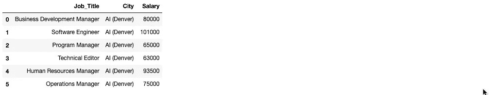

# 大楼里有医生吗？

> 原文：<https://medium.com/analytics-vidhya/is-there-a-doctor-in-the-building-d546b44fa180?source=collection_archive---------11----------------------->

## 对公司招聘实践和趋势的数据探索和分析

**场景:**

丹佛技术中心的一家公司给了我一个数据集。这家公司属于高等教育行业，优先考虑拥有研究生学位的候选人。我在那里的联系人在人力资源部门工作，他们给了我他们从 2017 年到 2018 年大约 15 个月的数据快照。我的联系人提到他们的公司，我将提到人工智能前进，有一个博士候选人在面试过程中的进展问题。

我不得不做相当多的数据清理工作，主要是删除列，将字符串转换成整数，这样我就可以使用工资信息，我还将学士/硕士学位的类型更改为“学士”或“硕士”等。例如，列出他们在 XXX 拥有理科学士学位的候选人被改成了“学士”

我最初的想法是，与其他教育水平较低的申请人相比，博士候选人要求更高的工资，因此导致他们因为起薪点而被淘汰出面试流程。现在就让我们来挖掘数据吧！

在这里，我们来看看考生的分布和他们的教育水平。

与拥有硕士/学士学位的候选人相比，博士生相形见绌。但是等等，那不是会让他们成为更杰出的申请人吗？在这一点上，这是我的想法，但我想看看每个申请人在申请 AI 时陈述的薪水。

这里没有惊喜。AI 的博士候选人平均要求的工资仅略高于那些拥有硕士和学士学位的人。我们可以探究当前申请人的当前状态，看看他们在面试过程中停止了什么。也许这能告诉我们更多关于博士申请者的信息。

每一栏中的橙色显示一名候选人被“聘用”，我无法从图表中看出是否有任何博士被聘用。似乎所有的雇员都来自学士/硕士学位申请者。让我们放大一下博士候选人来确认一下。

似乎我们有一个博士申请者拒绝了，一个退出了，大部分因为“不适合”或“不合格”而被放弃了

在这一点上，这么多的博士候选人不能胜任学士/硕士申请人被录用的相同职位是没有太大意义的。我想知道申请人申请的是什么样的职位？

研究分析师是迄今为止人工智能最受欢迎的职位类型。出于我自己的好奇，我想看看哪个职位的期望工资最高。

“销售顾问”和“项目经理”似乎是求职者最想要的薪水。再说一次，我在 AI 的数据中没有发现什么异常。我确实认为没有博士候选人被录用似乎有点奇怪，但他们也不像学士/硕士学位申请人那样普遍。我想更深入地了解薪水方面，因为我仍然认为这很重要。我去了 Glassdoor.com，发现了一组其他大都市的额外工资数据。

我希望通过从 Glassdoor 引入外部数据来展示的是，人工智能为他们的职位支付的薪酬低于平均水平。我想在 AI 的位置和我在 Glassdoor 数据集中找到的相同位置之间做一个比较。艾很好，给了我他们最近招聘职位的 6 倍起薪。

以下是 AI 职位的起薪:

以下是相同职位的全国平均水平:

现在，我把来自 AI 的薪水/职位和我在 Glassdoor 的数据集中找到的相同职位拿来做比较。

从这个柱状图来看，考虑到生活成本，旧金山在各个方面都领先就不足为奇了。然而，与 Glassdoor 数据集中的其他十个城市相比，AI 似乎也很有竞争力。项目经理是他们唯一低于平均水平的角色。这可能是因为项目经理是一个如此宽泛的术语，AI 可能不会像其他公司那样使用他们的项目经理，因此不需要支付那么高的工资。

有没有这种可能，人工智能得到了很多想要各种薪水的申请人，但只是雇佣了那些相比之下想要更低薪水的申请人？让我们来看看。

从这个图表来看，人工智能似乎没有挑选要求较低工资的候选人来填补他们的职位。在某些情况下，他们实际上接受了要求比一般求职者更高薪水的求职者。这告诉我，AI 更关心找到适合他们角色的合适人选，而不是找到薪水要求最低的候选人。

**结论:**

从 AI 给我的数据来看，我不认为我能自信地说出为什么他们在博士候选人的面试过程中运气不佳。我认为，人工智能的数据集没有提供太多的无形资产。例如，我没有被告知为什么一个候选人不合格或者为什么他们不合适的细节。我知道这在一定程度上是出于隐私考虑，但如果我有权访问这些信息，我就可以量化这些信息，并能够提供更全面的分析。

**偏差:**

数据集中有些职位，如研究分析师和项目经理，是非常宽泛的术语，因公司而异。这使得很难对由多个行业组成的公司进行平等的比较。我觉得，如果有一个由与人工智能处于同一领域的多家公司组成的数据集，将有利于创造一个更公平的薪资比较环境。