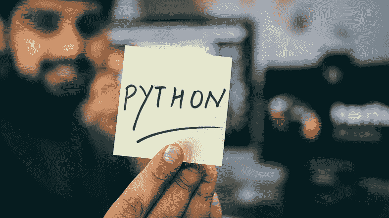
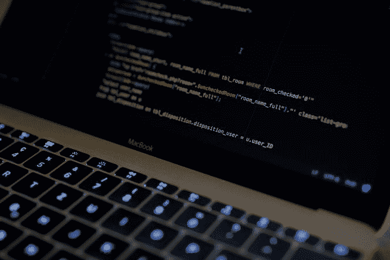
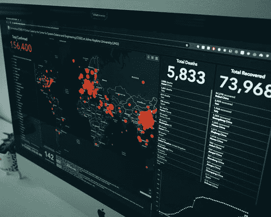

# 对于数据分析来说，Python、SQL 和 Tableau 的三结合足够了吗？

> 原文：<https://medium.com/analytics-vidhya/is-trifecta-of-python-sql-and-tableau-enough-for-data-analysis-db94e2311c21?source=collection_archive---------21----------------------->

从商业角度来看，数据分析就是讲故事，这三项技术是否足以完成整个故事

照片由 [Hitesh Choudhary](https://unsplash.com/@hiteshchoudhary?utm_source=medium&utm_medium=referral) 拍摄于 [Unsplash](https://unsplash.com?utm_source=medium&utm_medium=referral) (左)|照片由卡斯帕·卡米尔·鲁宾拍摄于 Unsplash(中)|照片由[克莱班克斯](https://unsplash.com/@claybanks?utm_source=medium&utm_medium=referral)拍摄于 [Unsplash](https://unsplash.com?utm_source=medium&utm_medium=referral) (右)

整个数据分析过程正在经历一个全新的认知时代。随着越来越多的人连接到互联网，不仅在美国，而且在全球范围内，由于疫情，他们创建的数据点数量呈指数级增长。当不仅个人使用，而且企业和商业使用每天都在增加时，货币化的能力或围绕数据建立的想法比以往任何时候都多。

当我们将数据视为任何信息来源时，无论是实际数据还是元数据，我们可以创建的数据点数量都非常大。你买了什么产品，你搜索了什么网站，我们去了什么地方，你喜欢什么照片，你的变焦电话打了多长时间，谁买了新的 iPhone。

我们现在消费内容的方式不仅涉及社交媒体，还涉及我们的日常生活方式，从购买杂货到送餐，从地点 A 到地点 B 的旅行以及在线购物。我们消费什么样的新闻，你读什么样的书，每一项活动都会产生一个数据点，产生一条线索，从而产生一种模式，可以被分析用来赚钱。世界上最大的公司的商业模式是基于像谷歌和脸书这样的公司的广告。这种广告是有针对性的，这意味着你的数据越多，公司就越有预见性，越有针对性，越准确，正因为如此，他们收取额外费用，收集更多数据的激励现在比以往任何时候都更有价值。

回到理解数据上来，我们通过创建模型和添加与我们的业务问题相关的变量来尝试理解趋势、季节性、预测和预言。与数据相关的典型流程是如何首先收集数据，修改数据以使其对计算机更友好，创建使用数据解决业务问题的模型，并可视化数据以做出准确的决策。

> SQL 用于理解数据集中的异常、缺失值和变量类型，它有助于数据操作、数据提取和数据库管理。
> 
> Python 用于数据建模、预测、回归分析、预测以及更多技术和数据相关的分析。它可以是不同类型的数据，如文本、图像、声音、视频、数字等等。
> 
> 最后，我们使用 Tableau 实现了数据可视化，可以帮助我们理解并利用我们拥有的数据讲述一个故事。它可以帮助我们理解某个特定公司的两个分公司之间的差异，或者某个特定产品的两个销售代表之间的差异。它可以帮助我们分析我们在数据集中看到的不同模式，还可以帮助我们通过数据来完成故事，而光看数据可能很难理解。

有了这三种技术，大多数业务问题陈述和用例不仅可以被解决、回答和构建一个故事，而且还可以建立和通报以前在业务中没有识别或理解的趋势和模式。使用数据来推动决策最早出现在科技公司，但现在已被用于几乎每个部门或行业，从在塔吉特百货购物到驾驶飞船进入太空，从为棒球选择球队到预测公用事业公司下一季度的增长。

技术总是在不断发展，并适应市场的需求和需要，未来这三者能否成立，时间将会证明，但在当前的环境下，它们可以帮助理解很多商业案例。包括一个常见的、被低估的 Excel 资源，它不仅可以被少数数据科学家、软件工程师或高级管理人员用来了解组织内的各个阶层。