# 病毒正在传播:策划 Covid19 爆发

> 原文：<https://medium.com/analytics-vidhya/is-virus-going-viral-plotting-covid19-outbreak-ed0e38543c4f?source=collection_archive---------26----------------------->

## 基于 Python 的代码绘制各种图表，以了解新型冠状病毒疫情的传播


***covid 19***简介:这是一种新发现的冠状病毒，碰巧通过接近感染者而传播，因此具有高度传染性并危及生命。它始于中国武汉，现已传播到全球 180+个国家。你可以点击世卫组织链接[这里](https://www.who.int/emergencies/diseases/novel-coronavirus-2019)，了解更多。

***博客目的*** :当一种疾病在国家间传播，并且没有可治疗的药物时，这种疾病就会爆发。因此，跟踪和追踪其传播变得至关重要。与健康\疾病\医学相关的政府、国际委员会和机构已经投入资源来创建和维护与其传播相关的数据集。

用非常小的 Python 脚本(程序)，我们可以看到和分析受冠状病毒影响的单个和多个国家。此后，人们可以通过查看不同的图表和图示，从数量和质量上对某一特定国家如何应对这种情况进行评论。剧本可以在这里找到:[https://github.com/yatharthaggarwal/Covid19](https://github.com/yatharthaggarwal/Covid19)。

***关于我自己*** :我还不能把自己固定在数学、科学、技术、工程或人工智能的某个特定领域，因此我每天都在学习新的东西。学术上是计算机科学毕业生，专业上做我喜欢的事情。仅供参考这是我的第一个媒体博客。

***数据分析*** :一个*清洗*、*转换*、*建模*数据，发现对决策有用信息的过程。因此，它使这个博客成为对 Covid19 疫情的数据分析，用来做这件事的工具是 Jupyter 笔记本和来自约翰·霍普斯金大学和世界银行的数据集。

***数据集*** :正在使用的数据集是约翰·霍普金斯大学系统科学与工程中心(CSSE)在其 GitHub 页面[[https://github.com/CSSEGISandData/COVID-19](https://github.com/CSSEGISandData/COVID-19)]上给出的一个知识库，该数据集目前每天都在更新。他们还用同样的方法创建了一个仪表板[[https://coronavirus.jhu.edu/map.html](https://coronavirus.jhu.edu/map.html)]。

人口数据取自世界银行数据集:[https://data.worldbank.org/indicator/SP.POP.TOTL](https://data.worldbank.org/indicator/SP.POP.TOTL)。

1 第一步:导入并清理数据集:

Pandas 库最适合这样做:我们为所需的数据集提供 CSV 文件的原始 Github 链接。目前，有 3 个*全球*数据集:

1:确诊病例:每个国家每日检测呈阳性的累计新增病例。

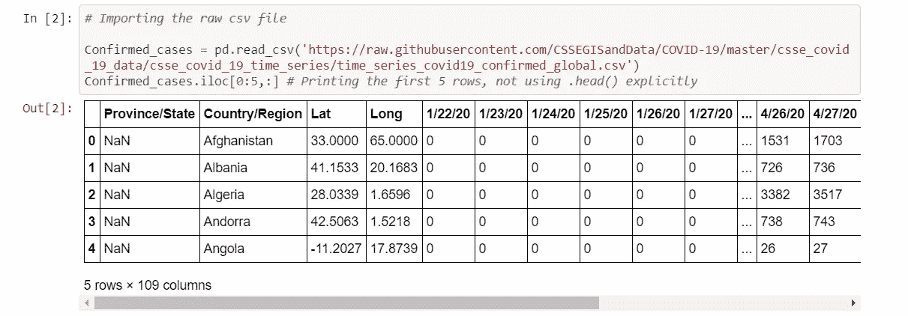

2:死亡病例:各国每日报告的累计死亡人数。

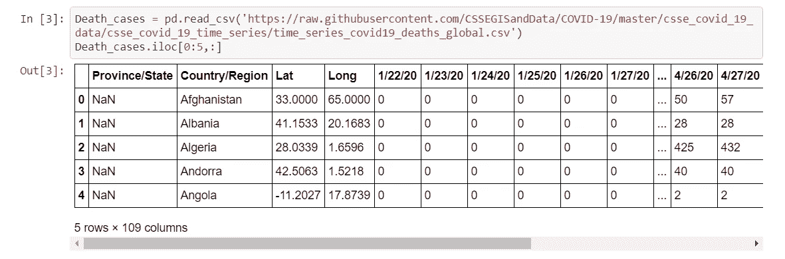

3:痊愈病例:每个国家每天检测为阴性并声称已痊愈的累积病例。

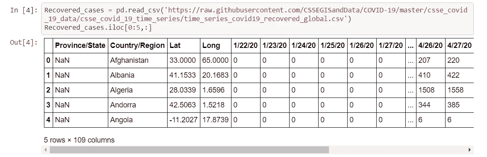

在所有 3 个数据集中，开始日期是 2020 年 1 月 22 日。而且数据每天都会更新，所以没什么需要清理的。索引从不改变，所以解析文件变得非常容易。

4.还有一个从世界银行下载的人口数据，已被清理以符合要求。每个国家 2018 年的数值(人口)被视为最新的人口数据。

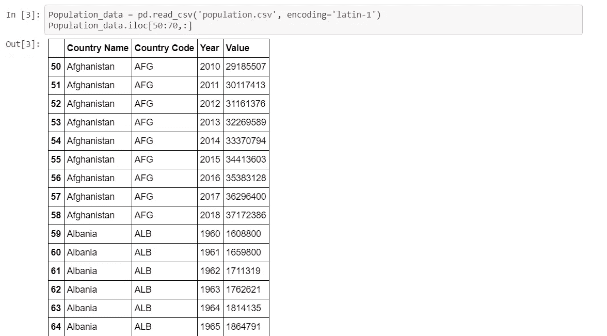

2第二步:转换数据集

在这一步中，我们需要以一种我们可以开始使用的方式来转换我们的数据集。它通常需要清理、删除 NaN 值、将分类数据转换为数字数据，反之亦然。这一步完全取决于项目的要求。

但是这个数据集基本上是干净的。尽管仍有一件事需要做，即将对应于特定国家的所有行相加。例如，加拿大国家有多行需要合并。下面的函数有效地做到了这一点，“FetchData”和其他 Fetch 函数做同样的事情。它们将所有行按列相加(从第 4 个索引开始)。

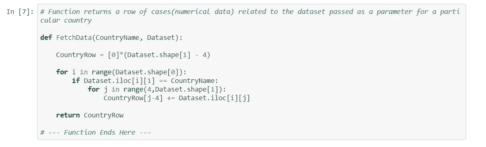

3第三步:可视化

在一个疾病爆发的世界里，处理实时数据变得更加显著，因为它提供了世界在疫情下是如何面对/表现/变化的。

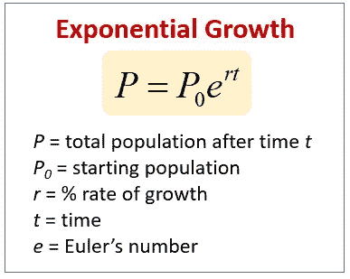

每当我们谈论数字时，数学建模就如影随形，有许多模型可以分析疾病的爆发，尤其是当疾病具有传染性时。

在大多数疾病爆发的初期，我们通常会看到指数增长。(见图中等式)。

有单个国家的图表和多个国家的图表来研究和比较疫情的传播。每个脚本的代码都在他们每个笔记本的 Covid19 Github 存储库中进行了解释。我在这里再次链接:[https://github.com/yatharthaggarwal/Covid19](https://github.com/yatharthaggarwal/Covid19)。

下图显示了使用 Python 中的***matplotlib . py plot***包绘制的图形:

**1。country _ Active _ Cases _ Analysis _ plot . ipynb[单个国家]**

这个脚本为一个特定的国家绘制了两个图表。

第一张图显示了该国日累计确诊病例数，当这些病例超过 300 例时，该图开始。此外，还绘制了病例每 3/5/10 天增加一倍的预测线。

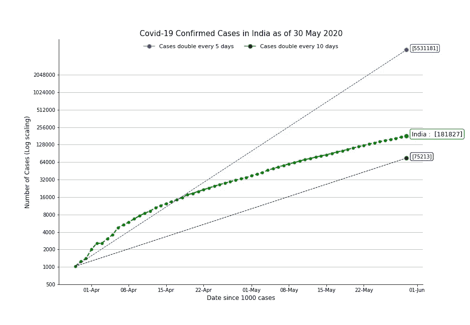

第二个图表显示了同一国家/地区的累计活跃案例，它还提供了疫情在过去 5 天的增长率以及相应的翻倍天数。

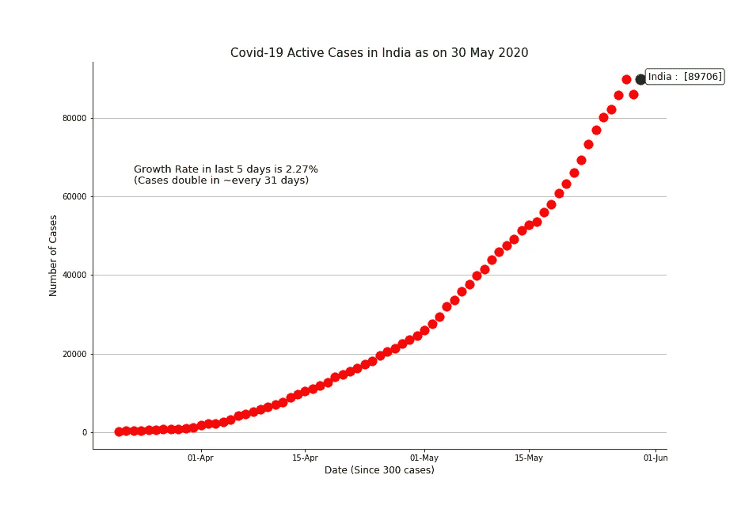

**2。国家 _ 活动案例 _ 增长率 _ 双倍天数。ipynb[单一国家]**

此脚本在对应于左侧 y 轴的红线中绘制了活动案例的每日增长率，在对应于右侧 y 轴的绿线中绘制了这些活动案例的每日翻倍天数。

```
P1 = P0 x e ^ (Rt)
to calculate growth rate(R), we take P1, P0 as active cases at a difference of 5 days and t = 5 daysln(2)/R = t
to calculate doubling days based on above calculated R.
```

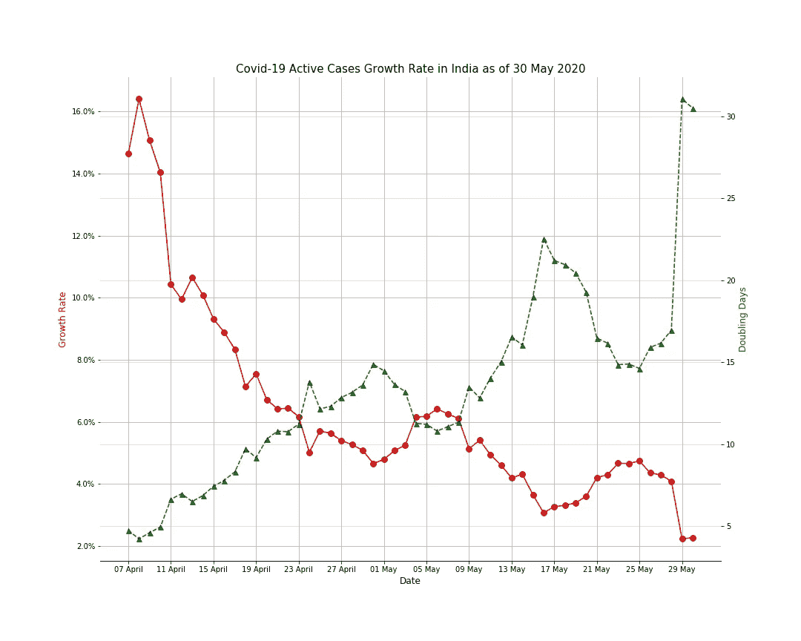

**2。country _ Confirmed _ Cases _ Moving _ Average _ plot . ipynb【单个国家】**

该脚本绘制了特定国家确诊病例(每日冠状病毒阳性病例)的 7 天移动平均值。它还将每日确诊病例显示为与移动平均值的偏差。

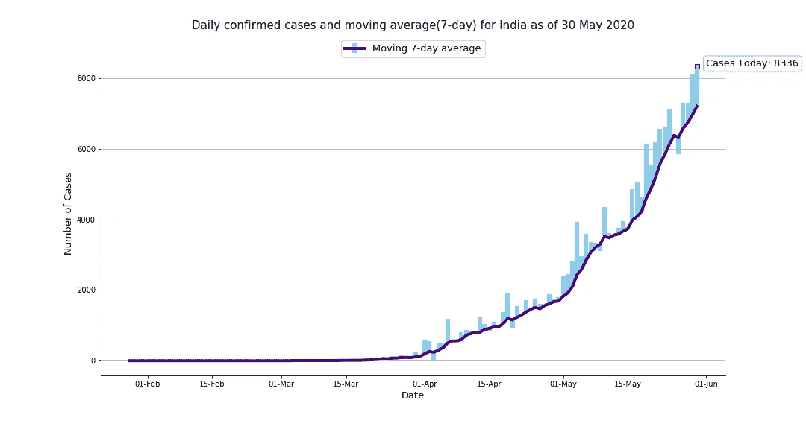

**3。world _ Active _ Death _ Recovered _ Cases _ plot . ipynb【多国】**

此脚本绘制了多个国家在这段时间内的活动、死亡和恢复(ADR)病例的堆积条形图。人们可以看到每个国家如何应对这次冠状病毒爆发，以及哪些国家已经使曲线变平。

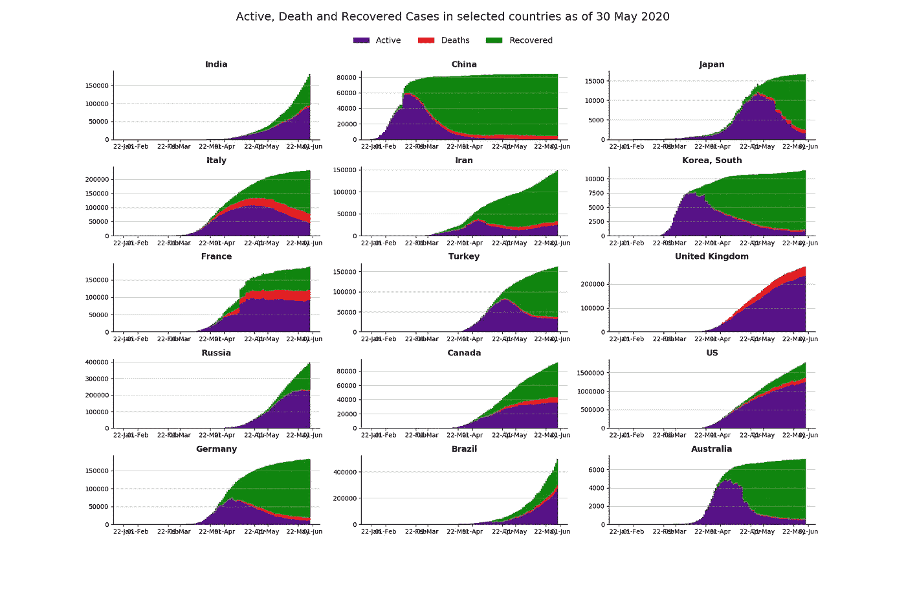

**4。world _ Confirmed _ Cases _ plot . ipynb【多个国家】**

该脚本在一个图表中绘制了几天来全国累计确诊病例数据。自这些国家获得第一批 100 个病例以来，这些数据需要几天的时间。人们可以关注一下自 1980 年以来，疫情地区的每个国家的情况。

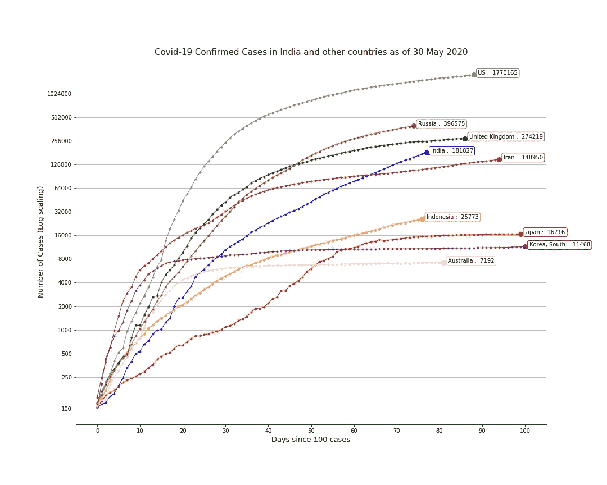

**5。world _ Deaths _ per _ Million _ plot . ipynb[多个国家]**

该脚本绘制了多个国家的水平线图，显示了这些国家的百万分之死亡率(DPM)数据。该图还显示了最后一天以及最后第 5 天、第 10 天 DPM 数据的 3 个标记。

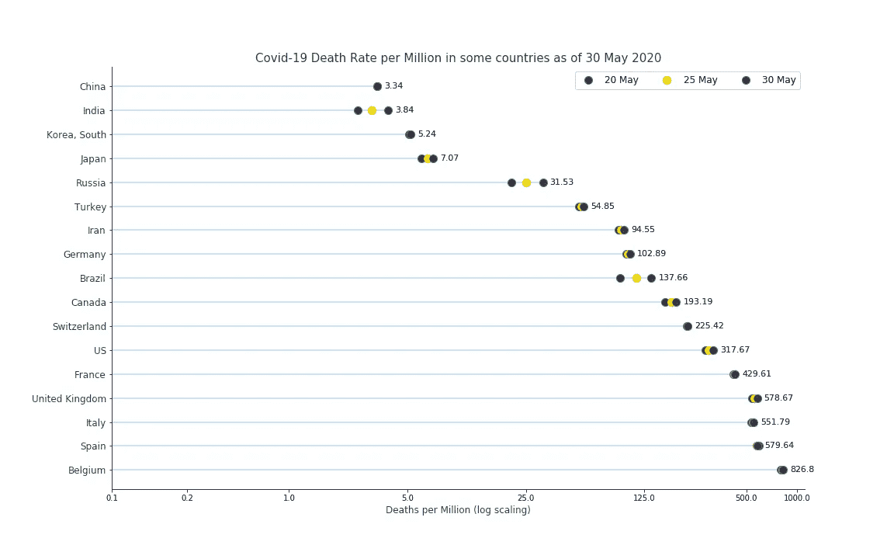

**6。world _ deadlife _ Rate _ plot . ipynb[多个国家]**

该脚本绘制了多个国家在这些天数内的病死率(CFR)。人们可以分析一段时间内某人死于冠状病毒的概率。

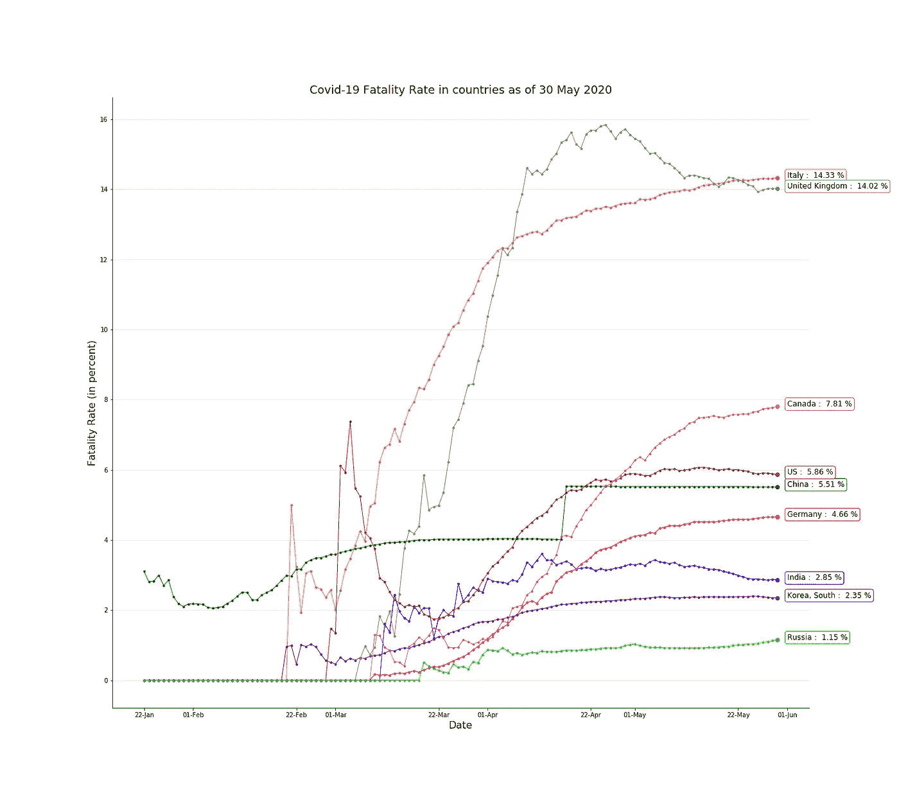

博客缩略图:master1305 制作的商业照片—[www.freepik.com](http://www.freepik.com)