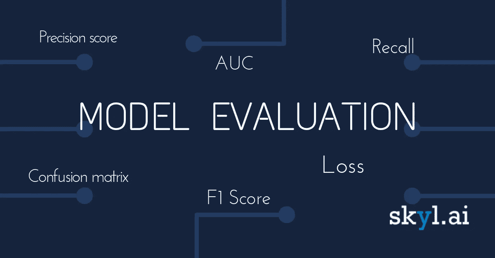
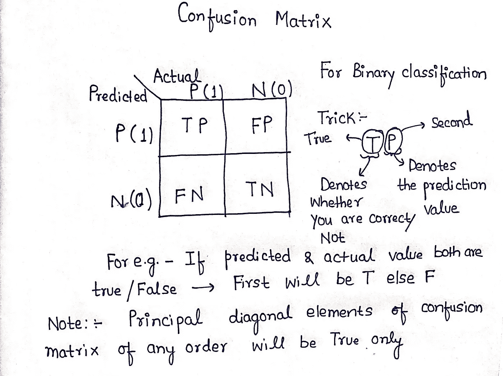
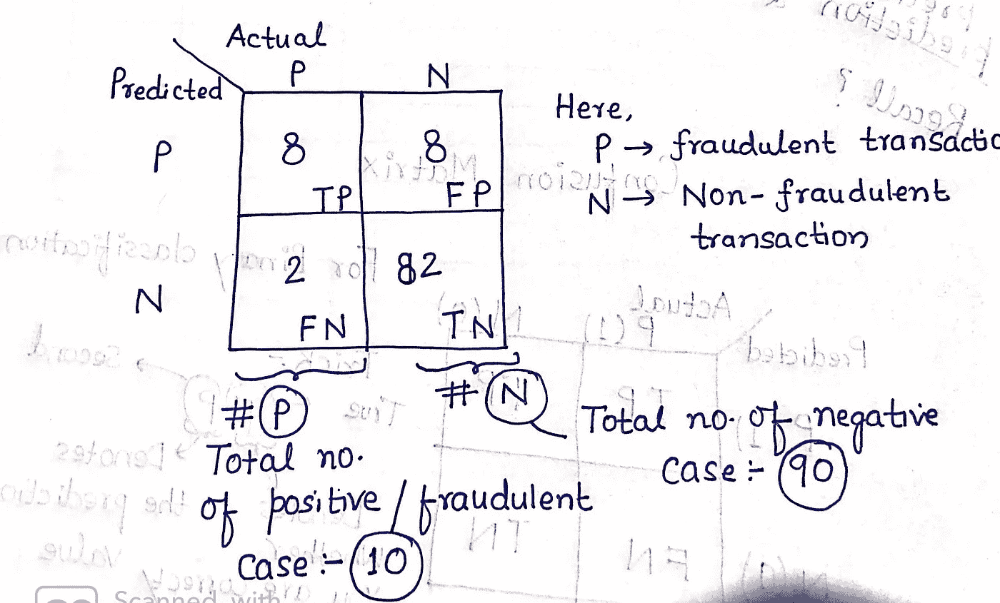
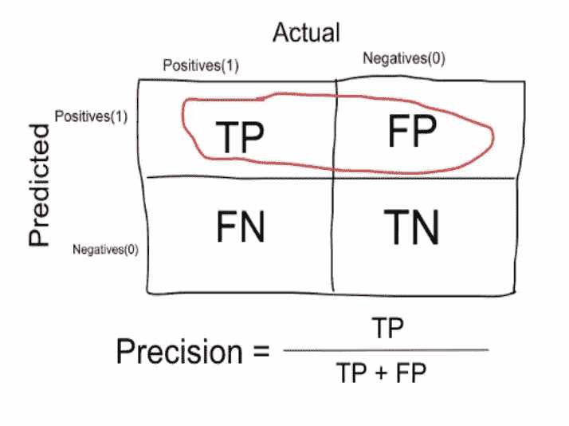
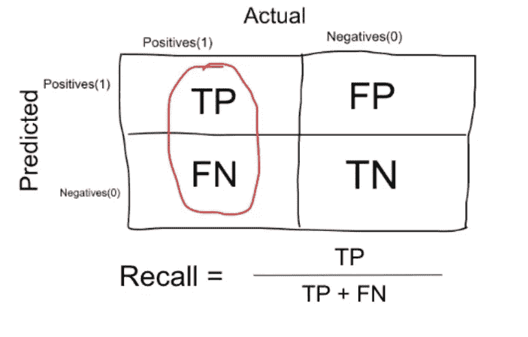

# 你的机器学习模型是在进行幸运的猜测吗？

> 原文：<https://medium.com/analytics-vidhya/is-your-machine-learning-model-making-lucky-guesses-d8968d3a3e62?source=collection_archive---------27----------------------->

*衡量非绩效比绩效要困难得多*

[图片链接](/@skyl/evaluating-a-machine-learning-model-7cab1f597046)

为了理解这个重要的问题，我们需要理解如何评估一个机器学习模型。这是机器学习工作流中的核心任务之一，预测和规划模型在生产中的成功可能是一项艰巨的任务

保持好奇而非批判

在这篇博客中，我们将讨论各种衡量标准来检查机器学习模型的性能。参数如下所述:

1.  准确(性)
2.  精确
3.  回忆

> 在研究机器学习模型的实际性能指标之前，让我们看一下一个叫做**混淆矩阵**的重要参数

# 混淆矩阵

**什么是混淆矩阵，为什么需要它？**

混淆矩阵是一种总结分类算法性能的技术。

如果每个类别中的观测值数量不相等，或者如果数据集中有两个以上的类别，那么单独的分类精度可能会产生误导。

> 混淆矩阵显示了你的分类模型在进行预测时被混淆的方式。

我们中的许多人在创建混淆矩阵时感到困惑。让我们看看下面的记忆技巧，它有助于创建没有任何缺陷的混淆矩阵。

**使用上述记忆技巧创建混淆矩阵**

*注:通常情况下，混淆矩阵主对角线元素中的参数应始终比混淆矩阵中的其他元素大*

让我们举一个小例子来理解与混淆矩阵相关的几个重要参数。

*例如:在一家每天有 100 笔交易的信用卡公司中，10 笔交易实际上是欺诈性的，其余的是非欺诈性的。假设我们的模型以如下所示的混淆矩阵的形式显示交易信息*

演示信用卡交易场景的示例

# **与混淆矩阵相关的术语**

*   **真阳性(TP)** :分类器预测交易为‘欺诈性’且交易实际上是欺诈性的情况。
*   **真实否定(TN)** :分类器预测“非欺诈性”且交易实际上非欺诈性的情况。
*   **假阳性(FP)** :分类器预测为“欺诈性”交易，但交易实际上不是欺诈性的情况
*   **假阴性(FN)** :分类器预测“非欺诈性”但交易实际上是欺诈性的情况。

# 准确(性)

准确度是与全部数据点相比，分类器的正确预测的量度。简而言之，它是正确预测的单位与分类器做出的预测总数的比率

> 精度=TP+TN/(TP+FP+FN+TN)

> 当数据中的目标变量类接近平衡时，精确度是一个很好的衡量标准

*注意:*在以下情况下，精确度并不能给我们最好的图像

1.  如果数据集**不平衡**

***例如*** *。:如果一个数据集包含 100 笔交易，则只有 5 笔是欺诈性交易。假设我们的模型是哑模型，并且预测每一个案例都是非欺诈性的。自那以后，它将欺诈案件归类为非欺诈案件。尽管该模型在预测错误交易方面很糟糕，但该模型的准确率为 95%*

2.如果分类器模型以任何分数的形式提供输出，如**概率分数**

# 精确

当目标是*限制误报数量* (FP)时，通常使用精度。例如，如果我们处理信用卡错误交易的目标是最大限度地减少被归类为欺诈的真实交易的数量，这将是我们关注的指标。

这是通过使用以下公式获得的:

精确

*例:在我们有 100 笔交易的信用卡交易示例中，只有 7 笔是错误交易。假设我们的模型非常糟糕，预测每个案例都是* ***欺诈*** *。因为我们预测每个样本都是欺诈性的，所以我们的分母(真阳性和假阳性)是 100，分子(欺诈性交易和预测样本为欺诈性的模型)是 7。所以在这个例子中，我们可以说* ***这类模型的精度*** *是 7%。*

# 回忆还是敏感

> *“当它实际上是阳性结果时，它正确预测的频率是多少？”*

当目标是*限制假阴性* (FN)的数量时，通常使用召回。在我们的例子中，这将对应于最小化被分类为非欺诈交易的欺诈交易的数量。召回又称为“**敏感度**”和“**真阳性率**”(TPR)。

回忆

*例如:在我们有 100 笔交易的信用卡交易示例中，只有 7 笔是错误交易。假设模型预测每个案例都是欺诈性的。*

*因此，我们的分母(真阳性和假阴性)是 7，分子(具有欺诈性交易且预测案例为欺诈性的模型)也是 7(因为我们预测 7 个案例为欺诈性)。所以在这个例子中，我们可以说* ***召回*** *这样的型号是 100%。这样一个模型的精度(正如我们上面看到的)是 7%*

**什么时候用精准，什么时候用召回？:**

很明显，召回为我们提供了关于分类器在假阴性方面性能的信息(我们漏掉了多少)，而精确为我们提供了关于假阳性方面性能的信息(我们抓住了多少)。

**精准**就是要精准。因此，即使我们设法只捕获了一个有故障的交易，并且我们正确地捕获了它，那么我们是 100%精确的。

**回想一下**与其说是正确捕获案例，不如说是捕获所有具有“欺诈”交易的案例，答案为“**欺诈**”。因此，如果我们总是简单地说每个案例都是“欺诈性的”，我们就有 100%的召回率。

因此，基本上，如果我们想更多地关注最小化假阴性，我们会希望我们的召回率尽可能接近 100%，而精确度不会太差，如果我们想关注最小化假阳性，那么我们的重点应该是使精确度尽可能接近 100%

> 没有硬性规定说在所有情况下什么应该最小化。这完全取决于业务需求和您试图解决的问题的背景。基于此，我们可能希望尽量减少假阳性或假阴性。

# **结论**

理解机器学习模型在看不见的数据上的表现是使用这些评估指标的最终目的。准确度、精确度和召回率等指标是评估平衡数据集分类模型的好方法，但如果数据不平衡且存在类别差异，则 ROC/AUC 等其他方法在评估模型性能方面表现更好，我们将在下一篇博客中讨论

在那之前，请保持关注，祝机器学习愉快。