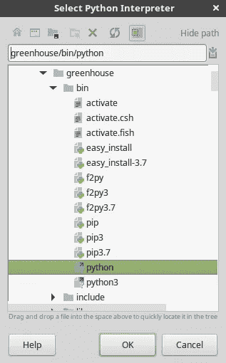

# Python 虚拟环境

> 原文：<https://medium.com/analytics-vidhya/isolated-virtual-python-environments-558916521395?source=collection_archive---------28----------------------->

## 把你的代码放在温室里


照片由 [www.zanda .摄影](https://unsplash.com/@zanda_photography?utm_source=medium&utm_medium=referral)在 [Unsplash](https://unsplash.com?utm_source=medium&utm_medium=referral)

python 环境可以比作温室。

如果你把一株植物从你的院子转移到一个合适的温室，植物的基因组不会改变，但它的行为会改变。它将在最佳条件下生长，不受当前天气的影响。

> 温室里的植物不受外部天气条件的影响。

与 python 项目是一样的。如果我们在一个环境中运行项目，我们只是使用所需的依赖项，它的行为不会随着时间而改变。如果我们对每个项目都使用默认的 python 环境，我们最终可能会删除或更新依赖项，这可能会影响其中一些项目的行为。此外，通过使用专用于项目的 python 环境，在其他机器上设置项目变得更加容易。

> 专用和隔离环境中的项目不受默认环境中的变化的影响。

这么说吧，让我们避免风暴造成的损害，并开始将我们的代码与 python 环境隔离开来。

为此，我们将使用 [virtualenv](https://virtualenv.pypa.io/en/latest/index.html) 创建并管理一个名为**温室**的环境。

要在您的计算机上安装 virtualenv manager，请在命令行中键入以下指令:

注意:下面的 bash 命令与 Linux 和 MacOS 兼容。

```
$ python -m pip install --user virtualenv
```

然后，当您成功安装 virtualenv 时，您就可以开始创建 python 虚拟环境了。为了创建我们的温室环境，我们需要编写以下命令:

```
$ python -m venv greenhouse
```

将在您键入命令的目录中创建环境。

如果您想在您的环境中开始工作，从命令行，您需要激活它。

```
$ source greenhouse/bin/activate
```

请注意，如果您将环境名称视为命令的前缀，则您只是在温室环境中工作，如下所示:

```
(greenhouse) $ <your command here>
```

如果您想检查当前环境的位置，请在终端上写下以下内容:

```
(greenhouse) $ which python 
```

现在，您可以开始在这个环境中安装依赖项和/或运行 python 代码，并从命令行使用它。

要在此环境中安装依赖项，请执行以下操作:

```
(greenhouse) $ pip install <package name>
```

在您的专用环境中安装了项目所需的所有依赖项之后，您可以生成一个需求文件。该文件列出了运行项目所需的所有依赖项。

```
(greenhouse) $ pip freeze > requirements.txt
```

在当前目录下创建了 requirements.txt 文件。现在，您可以将这个文件与您的项目共享，这样其他人就可以轻松地在他们的机器上运行您的代码。

另一方面，如果与您共享一个代码，您也可以创建一个专用于该项目的新环境，并从一个需求文件中安装所有需要的依赖项，方法是:

```
(greenhouse) $ pip install -r requirements.txt
```

当您停止使用温室环境的项目时，您应该停用它。为此，请键入以下命令:

```
(greenhouse) $ deactivate
```

最后但同样重要的是，我们学习了如何在命令行中激活环境，但是在开发阶段，我们需要在 IDE 上激活它。

例如，如果您正在使用 [pycharm](https://www.jetbrains.com/pycharm/) ，在顶栏上，选择*文件*，然后选择*设置*。转到*项目*，选择*项目解释器*。


选择左侧的图标。将会打开一个新窗口，如下所示。



在该窗口中，搜索您存储虚拟环境的位置，并在 *bin* 文件夹中选择 python 文件。

点击*确定*，然后应用新的设置。完成这些后，温室环境现在在当前的 pycharm 项目中是活跃的。

如果您正在使用 jupyter notebook，为了使用您的环境在笔记本上工作，您可以在激活您的环境的情况下从命令行启动 Jupyter Notebook。

```
(greenhouse) $ jupyter-notebook
```

如果你打开笔记本，现在你正在温室环境中工作。

总之，在本文中，您了解了为什么应该使用环境，如何从命令行创建和管理 python 环境，以及如何在 pycharm 和 jupyter notebook 上激活它，这样您在开发代码时也可以激活它。

我希望你喜欢这些内容。下次学习冒险时再见。