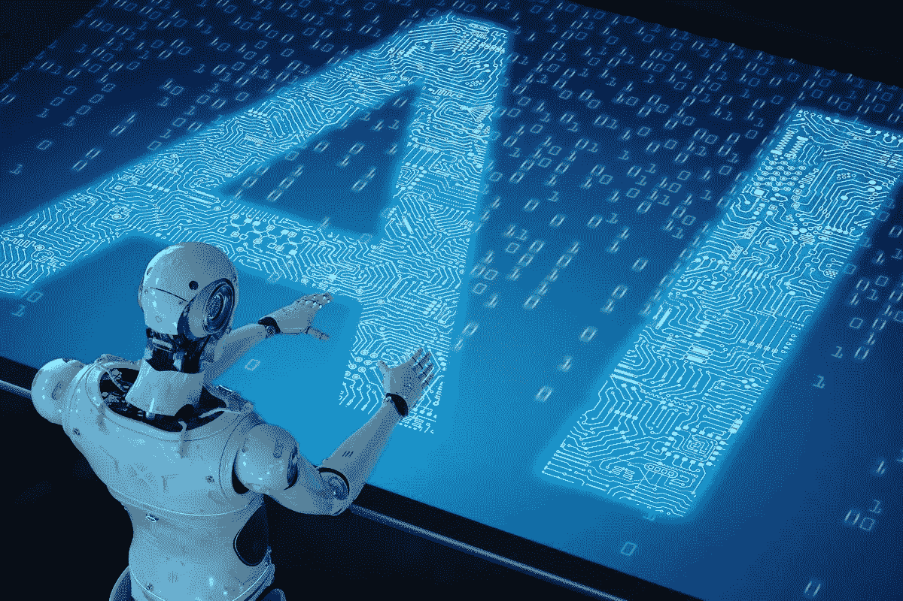

# 以前都是天生的聪明。。。

> 原文：<https://medium.com/analytics-vidhya/it-all-used-to-be-natural-intelligence-371d5360effc?source=collection_archive---------26----------------------->

一个普通人被认为拥有大量的事实、数字、符号和记忆。智人确实是事件的储存库，他们的推理涉及大量本能的、具体化的、无意识的知识。人类信奉的这种自然现象带来了一个问题:是否有任何东西可以被赋予这种智能。可以模仿吗？哲学家、科学家、数学家和工程师花了几个世纪来回答这个问题，他们工作和努力的结果是 AI，是的，人工智能。在这之前，计算机和机器被认为太弱而不能展示智能，它们除了程序什么都不是，除了它们被喂给的东西(垃圾进，垃圾出)之外什么都不给。但最近，故事正在发生变化，世界惊讶地看到机器可以做人类做的事情(甚至做得更好)。

**什么是人工智能？**

顾名思义，人工智能不是由血管中有血的人展示的，而是由主要由塑料和金属芯片制成的无血机器展示的。正是这种现象赋予了机器和计算机识别模式、解释语言和从复杂数据中获取洞察力的能力。简单地说，它允许你的计算机包含一个思想，像你一样思考，从 GIGO 的突出文化中快速漂移。当你的电脑可以执行物体识别、语音识别、解释图像和做许多你本能可以做的事情时，你不会感到惊讶。现在是 21 世纪了！

**人工智能的应用**

你最近一直在附近，对吗？你也一直在使用真正智能的尖端设备和智能手机。也许，你正在打电话，正忙着和你的朋友聊天，你注意到你的电话自动帮你补全了一些单词。不仅如此，你还可以对着手机上的东西说话，期待对方回应“你好，谷歌，什么是人工智能？”。以上是人工智能在你日常活动中微小而不起眼的应用。但是，它有更大的应用吗？请继续阅读！

2015 年 10 月中旬，特斯拉发布了支持自动驾驶汽车的软件。它设计有八个环绕摄像头，可以提供汽车周围 360 度的视野。不仅如此，它还有一台机载计算机，计算能力是上一代的 40 倍。该车嵌入了一些功能，使其能够在其车道内自动转向、加速和刹车。这些都是只有用 AI 才能做到的。
此外，金融机构今天也在使用人工智能系统来记账、组织运营和执行所有其他种类的事情。

而如果你是 macOS、ipadOs 或者 iOS 用户，你今天大概已经通过让 Siri 代你上网来使用 AI 了。或者，如果你使用 windows，Cortana 现在应该是你的虚拟助手，为你设置提醒和待办事项。亚马逊 Alexa 怎么样？这些都是 AI 的产物。现在，电脑和机器可以和你互动了！

人工智能已经巩固了其作为全球商业、技术和医疗保健变革催化剂的地位，并且正在为它主宰和改变我们的叙事铺平道路。但是，一个问题浮现在脑海中，难道人工智能和机器人的出现不预示着人类和工作文化的巨大危险吗？AI 有描绘的那么美吗？

无可否认，人工智能给我们的计算世界带来了先驱们无法想象的巨大便利和变化。它的诸多好处包括:

**1。正确决策**

机器没有情感和所有其他影响人类心理和损害他们决策的东西，因此，它们能够并且将能够在短时间内采取正确的步骤并做出决定。

**2。缺少错误和失误**

这些机器本质上不是投机性的，它们基于数据记录和大型算法工作。这将使他们不容易犯错误和失误。

**3。效率**

我们的人工智能机器的效率已经飙升到如此天文数字的高度，原因是快速处理数据并在瞬间产生结果的能力。

许多人也认为人工智能有其自身的缺点，并预示着许多危险，其中包括:失业和工作问题；利用机器和人工智能进行恶意和邪恶的活动。但是，我们能给出我们对人工智能的最终想法吗？未来人工智能为我们准备了什么？我们只能坐以待毙，看着机器取代人类智慧，并可能给我们的世界带来浩劫。