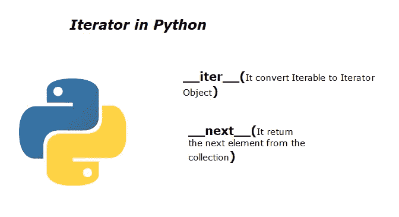
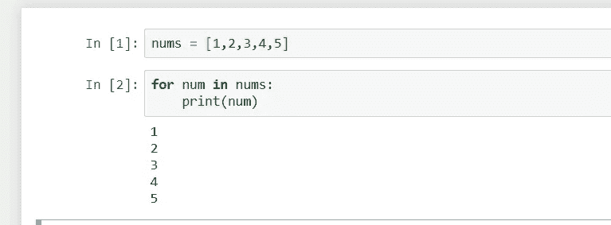
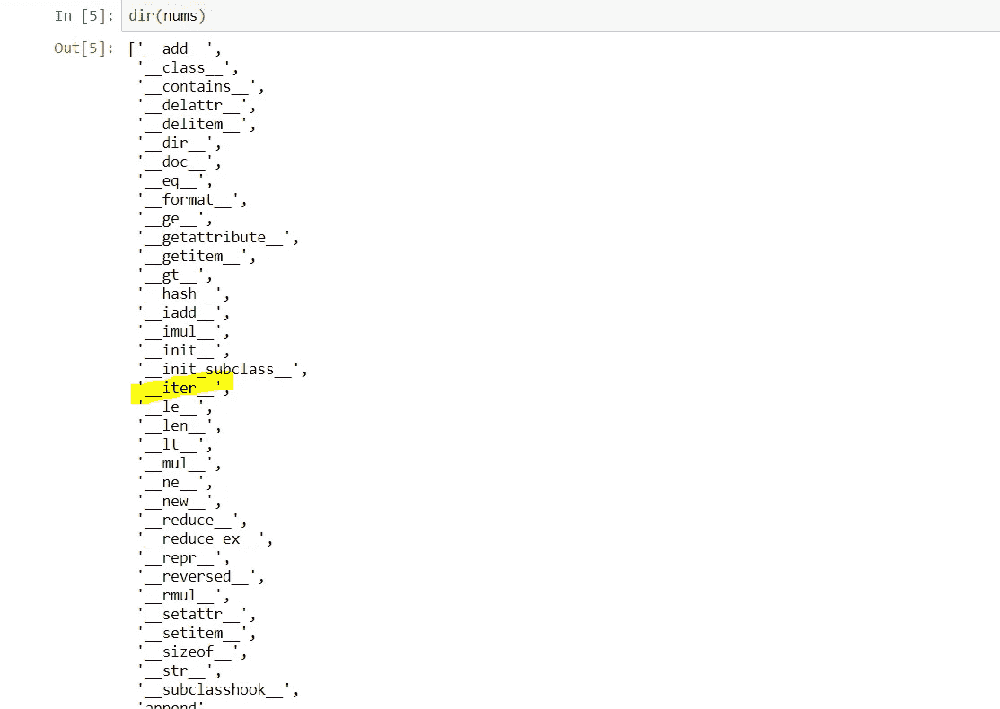
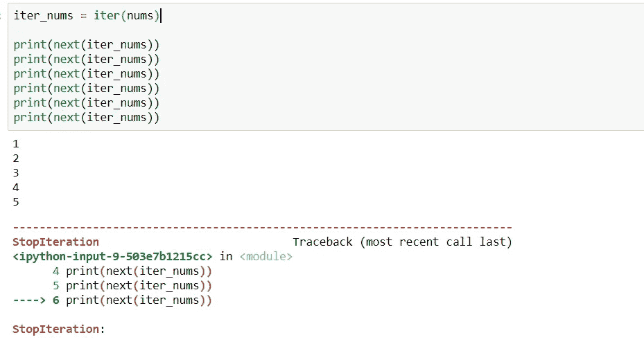
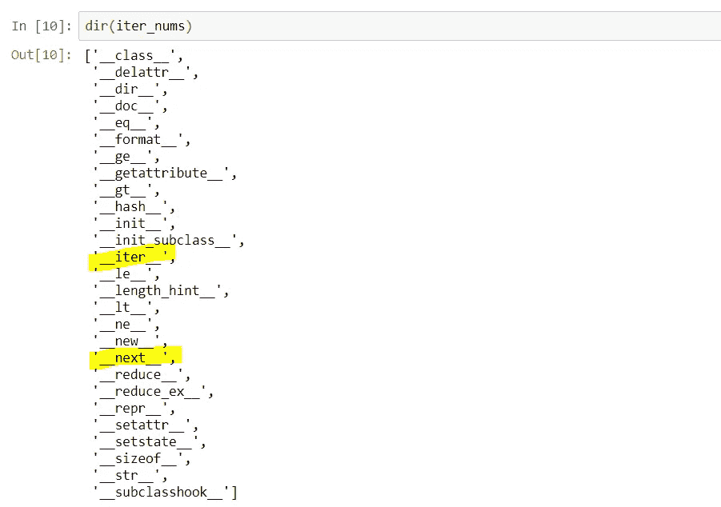
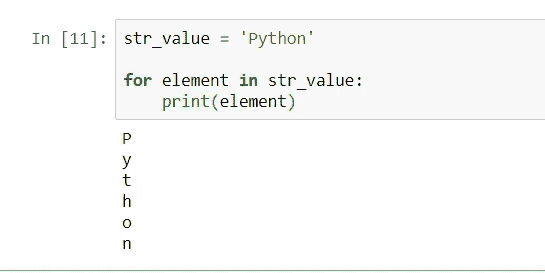
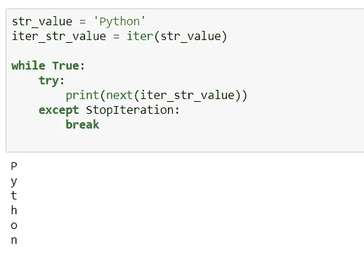

# Python 中的迭代器

> 原文：<https://medium.com/analytics-vidhya/iterator-in-python-658e05ecf031?source=collection_archive---------9----------------------->

这个博客将帮助你理解下面的概念。

*   什么是可迭代的
*   什么是迭代器
*   for 循环下迭代如何工作
*   什么是迭代器协议
*   什么是懒评
*   迭代器的好处

# 什么是可迭代的:

Iterable 是能够一次返回一个成员的任何 Python 对象，并且可以在 for 循环中迭代。列表、字符串、元组都是 iterable 的例子，因为我们可以一个一个地提取这个元素的成员，也可以循环迭代。

在上面的例子中，我们已经创建了 nums 形式的列表，然后使用 for 循环进行迭代。

所以现在的问题是，我们如何知道对象是否是可迭代的？

答:如果对象包含 __iter__()方法(也称为 dunder 或 magic 方法),那么它是一个可迭代的，我们可以使用内置的“dir”关键字检查对象是否包含 __Iter__()方法。

现在很清楚，任何包含 __iter__()方法的对象都是可迭代的。

# 什么是迭代器:

迭代器是一个对象，它通过迭代存储当前状态，并在调用 next()方法时产生下一个值。因此，任何具有 __next__()方法的对象都是迭代器。我们可以通过将 iter()内置函数应用于 iterable 来创建迭代器对象。

我们可以使用 next 方法从序列中的迭代器获取数据，一旦数据被消耗，它将抛出 StopIteration 异常。

如上所述，迭代器是包含 __next__()方法的对象，让我们使用内置的“dir”关键字来验证这一点。

从上图我们可以得出结论，迭代器是可迭代的，因为它也包含 __iter__()方法。

# 在 for 循环下迭代如何工作:

我们可以在 python 中使用 for 循环来迭代字符串、列表和元组等可迭代对象。

但是这实际上是如何实现的呢？让我们看一看。

从上面的代码我们可以理解，for 循环在内部使用 while 循环和迭代器。

# 什么是迭代器协议:

Python 迭代器协议包括两个函数，一个是 iter()，另一个是 next()。iter()函数用于将 iterable 对象转换为迭代器，next()函数用于获取下一个值。

# 什么是懒评:

迭代器允许我们创建惰性可迭代对象，在我们向它们请求下一项之前，它们不做任何工作。

由于它们的懒惰，迭代器可以帮助我们处理无限长的可迭代对象。在某些情况下，我们甚至不能在内存中存储所有的信息，所以我们可以创建迭代器，每当我们请求下一个元素时，它就会给我们。

迭代器帮助我们节省内存和 CPU 时间，这种方法被称为惰性求值。

# 迭代器的优点是什么？

*   python 中的迭代器节省资源。为了得到所有的元素，当时只有一个元素被存储在内存中，不像列表或元组那样所有的值都被一次存储。
*   对于较小的数据集，迭代器和基于列表的方法具有相似的性能，对于较大的数据集，迭代器节省了时间和空间。
*   更干净的代码。
*   迭代器可以处理无限序列。

感谢阅读！如果你喜欢这篇文章，留下一些吧👏🏻并分享一下！请在评论中告诉我你的想法。我也很乐意在 LinkedIn 上联系。再次感谢，继续学习！