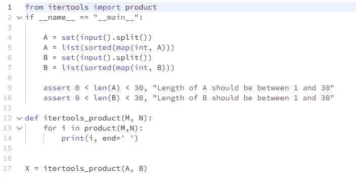
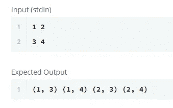

# Python 中的 itertools.product()

> 原文：<https://medium.com/analytics-vidhya/itertools-product-in-python-e63de572c796?source=collection_archive---------7----------------------->

[**笛卡尔积**](http://www.math.uvic.ca/faculty/gmacgill/guide/RF.pdf)

> ***现在，我相信 Python 比同时教学生编程和教他们 C 或 C++或 Java 要容易得多，因为语言的所有细节都要困难得多。其他脚本语言在那里也不太好用。***

**谁说的？**

吉多·范·罗苏姆先生本人。杰出的荷兰程序员，我们知道他是 Python 编程语言的作者，他是这种语言的“仁慈的终身独裁者”。

现在，今天坐在这里，见证了编程领域前所未有的繁荣和发展；到目前为止，Python 无疑是编程领域最受欢迎的宝石。与其他通用编程语言相比，显然有许多原因使这种语言成为最好的。最突出的一个原因，也是这篇文章的本质，是语言的效率。

Python 允许开发人员用更少的代码行完成最多的工作。这也是为什么它被用于制作机器学习模型的更大原因，因为它很容易被人类理解。

Python 中一个提倡高效的工具是使用 **itertools.product()** ，它计算**输入 iterables** 的**笛卡尔**乘积**。它与嵌套 for 循环的工作方式相同，但是只需要很少几行代码，因此消除了后者的重要性。例如， **product** (A，B)返回与((x，y) for x in A for y in B)相同的结果。**

好吧，所以在我给你看一个它在实践中是如何使用的例子之前，让我们先把上面这句话中的重词分解一下(给所有一开始没听懂的人；虽然，我敢肯定这将是非常少的):-

***a)ITER tools-****ITER tools 是 Python 中的一个模块，便于对迭代器进行操作，以便通过函数产生更复杂、更高效的迭代器。在迭代器代数领域，该模块被认为是内存高效和省时的。人们可以在同一个迭代器上使用 itertools，或者组合使用 ITER tools 来形成迭代器代数。* **b)笛卡尔积-** *我们在中学数学中听过这个术语，后来在工程数学中也听过。主要与数学中的集合论有关，两个集合 A 和 B 的笛卡儿积是所有有序对(a1，b1)，(a2，b2)，……(an，bn)的集合，其中 a1，a2，…..an 属于集合 A，b1，b2，b3 ……bn 属于集合 b。
c)****input iterables-****每当程序从用户处接受这样的输入时，该输入是能够一次返回一个成员的任何 Python 对象。我们所知道的著名例子有列表、元组、字符串等。或者可以通过* ***for 循环进行迭代的任何序列。***

好了，现在是时候开始练习我们一直在谈论的内容了。这是一个基本的例子，用 i **tertools.product()** 读取两行中的两个数字列表(用空格分隔)并打印笛卡尔乘积。

— — — — — — — — — — — — — — — — — — — — — — — — — — — — — —

**脚本:**

— — — — — — — — — — — — — — — — — — — — — — — — — — — — — — —

我们可以花一些时间在重要的方面(我再次肯定，你们中很少有人不知道这个想法；原因可能是我这边糟糕的编码/格式，或者你缺乏 Python 方面的经验):-

1.  **从 itertools 导入产品:**这里，从 Python 中的 itertools 模块，我们正在导入产品工具，它将帮助我们从两个 iterabless 中构建一个笛卡尔乘积，我们将把这两个 iterable 作为输入。
2.  **if _ _ name _ _ = = " _ _ main _ _ ":**只是强调了脚本文件是直接运行的，而不是导入的。这是基于 Python 文件既可以作为可重用模块使用，也可以作为独立程序使用。但这其实和文章的本质不太相关。所以我们继续吧。
3.  **第 4 行到第 7 行:**我们基本上已经将两行空格分隔的数字作为表单和集合中的输入。为什么设置？以避免任何重复。然后我们进一步把它们转换成两个排序列表 A 和 b。
4.  **第 9 行到第 10 行:**我们在这里使用了两个断言语句，这将确保两个列表 A & B 的长度都在上面指定的范围内。这张支票很主观。我申请这张支票；你可能不想这么做。完全取决于你的测试用例。
5.  **第 12 行到第 14 行:**我已经定义了一个函数 itertools_product，它以两个排序列表的形式接受两个参数(输入),每个列表中有唯一的元素(数字)。这个函数遍历笛卡尔积元组列表，并在同一行打印有序对。
6.  **第 17 行:**这是函数 itertools_product 的调用者。

— — — — — — — — — — — — — — — — — — — — — — — — — — — — — — —

**输出:**

尝试使用您自己的自定义输入。

希望，我能够用 Python 解释 itertools.product()的思想和用法。如果你这样认为，请留下一个掌声。建议和评论—非常欢迎:)